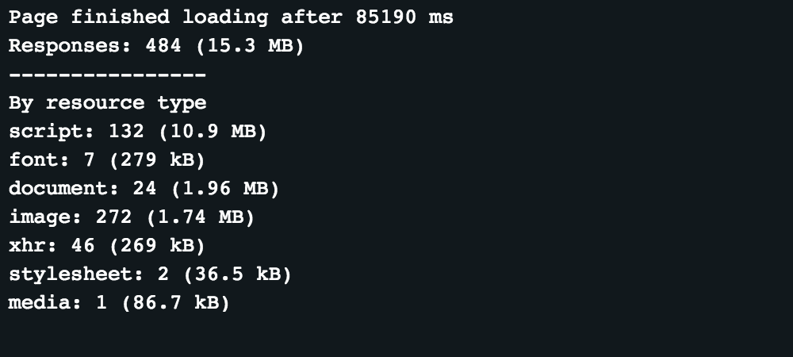
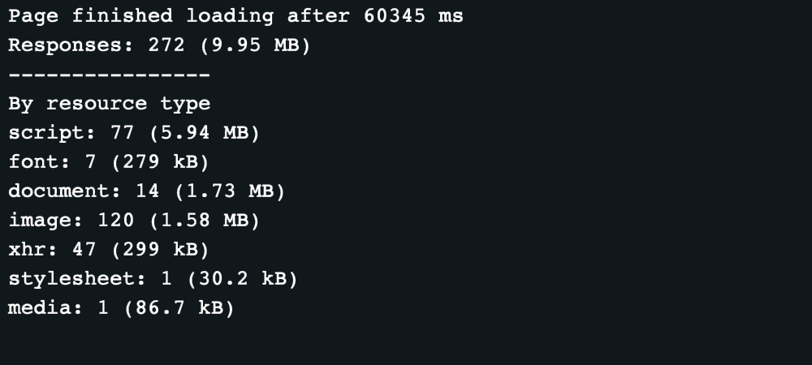

_Unfortunately, in the recent version of Puppeteer, request interception disables native cache and slows down the actor significantly. Therefore it is not recommended to follow examples shown in this article. Instead, use_ [_blockRequests_](https://sdk.apify.com/docs/api/puppeteer#puppeteerblockrequestspage-options-promise) _utility function from_ [_Apify SDK_](https://sdk.apify.com/)_. It works through different paths and doesn't slow down your process._

When using Puppeteer, often a webpage will load many resources that are not actually necessary for your use case. For example page could be loading many tracking libraries, that are completely unnecessary for most crawlers, but will cause the page to use more traffic and load slower.

For example for this web page: <https://edition.cnn.com/>
If we run an [Actor](https://www.apify.com/jaroslavhejlek/measure-downloaded-bytes) that measures extracted downloaded data from each response until the page is fully loaded, we get these results:



And [this is how the website it looks](https://api.apify.com/v2/key-value-stores/sE2s9WmvoWFZhTff7/records/debug-screen.png?disableRedirect=true).

Now if we want to optimise this to keep the webpage looking the same, but ignore unnecessary requests, then after

```JavaScript
const page = await browser.newPage();
```

we could can use this piece of code

```JavaScript
await page.setRequestInterception(true);
page.on('request', (request) => {
            if (someCondition) request.abort();
            else request.continue();
});
```

Where `someCondition` is a custom condition (not actually implemented in the code above) that checks whether a request should be aborted.

For our example we will only disable some tracking scripts and then check if everything looks the same.

Here is the code used:

```JavaScript
await page.setRequestInterception(true);
page.on('request', (request) => {
    const url = request.url();
    const filters = [
        'livefyre',
        'moatad',
        'analytics',
        'controltag',
        'chartbeat',
    ];
    const shouldAbort = filters.some((urlPart) => url.includes(urlPart));
    if (shouldAbort) request.abort();
    else request.continue();
});
```

With this code set up this is the output:



And except for different ads, [the page looks the same](https://api.apify.com/v2/key-value-stores/fP9S5c2yBGHdcrga3/records/debug-screen.png?disableRedirect=true).

From this we can see, that just by blocking a few analytics and tracking scripts the page was loaded nearly 25 seconds faster and downloaded 35% less data (approximately since the data is measured after it's decompressed).

Hopefully this helps you make your solutions faster and use less resources.
