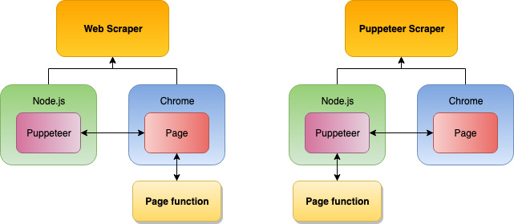

You may have read in the [Web Scraper](https://apify.com/apify/web-scraper) readme or somewhere else at Apify that [Puppeteer Scraper](https://apify.com/apify/puppeteer-scraper) is more powerful and gives you more control over the browser, enabling you to do almost anything. But what does that really mean? In this article, we will talk about the differences in more detail and show you some minimal examples to strengthen that understanding.

## What exactly is Puppeteer?

Both the Web Scraper and Puppeteer Scraper use Puppeteer to control the Chrome browser, so, what's the difference? Consider Puppeteer and Chrome as two separate programs.

Puppeteer is a JavaScript program that's used to control the browser and by controlling we mean opening tabs, closing tabs, moving the mouse, clicking buttons, typing on the keyboard, managing network activity and so on. If a website is watching for any of these events, there is no way for it to know that those actions were performed by a robot and not a human user. Chrome is just Chrome as you know it.

_There are numerous ways to detect robot browsers. But there are no ways to tell if a specific mouse click was made by a user or a robot._

Ok, so both Web Scraper and Puppeteer Scraper use Puppeteer to give commands to Chrome. Where's the difference? It's called the execution environment.

## Execution environment

It may sound fancy, but it's just a technical term for "where does my code run". When you open the DevTools and start typing JavaScript in the browser Console, it gets executed in the browser. Browser is the code's execution environment. But you can't control the browser from the inside. For that, you need a different environment. Puppeteer's environment is Node.js. If you don't know what Node.js is, don't worry about it too much. Just remember that it's the environment where Puppeteer runs.

By now you probably figured this out on your own, so this will not come as a surprise. The difference between Web Scraper and Puppeteer Scraper is where your page function gets executed. When using the Web Scraper, it's executed in the browser environment. It means that it gets access to all the browser specific features such as the `window` or `document` objects, but it cannot control the browser with Puppeteer directly. This is done automatically in the background by the scraper. Whereas in Puppeteer Scraper, the page function is executed in the Node.js environment, giving you full access to Puppeteer and all its features.


_This does not mean that you can't execute in-browser code with Puppeteer Scraper. Keep reading to learn how._

## Practical differences

Ok, cool, different environments, but how does that help you scrape stuff? Actually, quite a lot. There are things you just cannot do from within the browser, but you can easily do them with Puppeteer. We will not attempt to create an exhaustive list, but rather show you some very useful features that we use every day in our scraping.

## Evaluating in-browser code

In Web Scraper, everything runs in the browser, so there's really not much to talk about there. With Puppeteer Scraper, it's just a single function call away.

```JavaScript
const bodyHTML = await context.page.evaluate(() => {\
    console.log('This will be printed in browser console.');\
    return document.body.innerHTML;\
})
```

The `context.page.evaluate()` call executes the provided function in the browser environment and passes back the return value back to Node.js environment. There is one very important caveat though! Since we're in different environments, we cannot simply use our existing variables, such as `context` inside of the evaluated function, because they are not available there. Different environments, different variables.

_See the_ `page.evaluate()` _[documentation](https://pptr.dev/#?product=Puppeteer&show=api-pageevaluatepagefunction-args) for info on how to pass variables from Node.js to browser._

With the help of Apify SDK, we can even inject jQuery into the browser. You can use the `Pre goto function` input option to manipulate the page's environment before it loads.

```JavaScript
async function preGotoFunction({ request, page, Apify }) {\
    await Apify.utils.puppeteer.injectJQuery(page);\
}

This will make jQuery available in all pages. You can then use it in `context.page.evaluate()` calls:

const bodyText = await context.page.evaluate(() => {\
    return $('body').text();\
})
```

You can do a lot of DOM manipulation directly from Node.js / Puppeteer, but when you're planning to do a lot of sequential operations, it's often better and faster to do it with jQuery in a single `context.page.evaluate()` call than using multiple `context.page.$`, `context.page.$eval()` and other Puppeteer methods.

## Navigation to other pages (URLs)

In Web Scraper, your page function literally runs within a page so it makes sense that when this page gets destroyed, the page function throws an error. Sadly, navigation (going to a different URL) destroys pages, so whenever you click a button in Web Scraper that forces the browser to navigate somewhere else, you end up with an error. In Puppeteer Scraper, this is not an issue, because the `page` object gets updated with new data seamlessly.

Imagine that you currently have `https://example.com/page-1` open and there's a button on the page that will take you to `https://example.com/page-2`.Or that you're on `https://google.com` and you  fill in the search bar and click on the search button.

Consider the following code inside Web Scraper page function:

```JavaScript
await context.waitFor('button');\
$('button').click();
```

With a `button` that takes you to the next page or launches a Google search (which takes you to the results page), the page function will fail with a nasty error.

However, when using Puppeteer Scraper, this code:

```JavaScript
await context.page.waitFor('button');\
await Promise.all([\
    context.page.waitForNavigation(),\
    context.page.click('button'),\
]);
```

Will work as expected and after the `Promise.all()` call resolves, you will have the next page loaded and ready for scraping.

Pay special attention to the `page.waitForNavigation()` ([see docs](https://pptr.dev/#?product=Puppeteer&show=api-pagewaitfornavigationoptions)) call which is very important. It pauses your script until the navigation completes. Without it, the execution would start immediately after the mouse click. It's also important that you place it before the click itself, otherwise it creates a race condition and your script will behave unpredictably.

You can go even further and navigate programmatically by calling:

```JavaScript
await context.page.goto('https://some-new-page.com');
```

## Intercepting network activity

Some very useful scraping techniques revolve around listening to network requests and responses and even modifying them on the fly. Web Scraper's page function doesn't have access to the network, besides calling JavaScript APIs such as `fetch()`. Puppeteer Scraper, on the other hand, has full control over the browser's network activity.

With a simple call, you can listen to all the network requests that are being dispatched from the browser. For example, the following code will print all their URLs to the console.

```JavaScript
context.page.on('request', req => console.log(req.url()));
```

This can be useful in many ways, such as blocking unwanted assets or scripts from being downloaded, modifying request methods or faking responses and so on.

_Explaining how to do interception properly is out of scope of this article. See [Puppeteer docs](https://pptr.dev/#?product=Puppeteer&show=api-pagesetrequestinterceptionvalue) and the [Apify SDK helper](https://sdk.apify.com/docs/api/puppeteer#puppeteeraddinterceptrequesthandler-promise) for request interception._

## Enqueueing JavaScript links

A large number of websites use either form submissions or JavaScript redirects for navigation and displaying of data. With Web Scraper, you cannot crawl those websites, because there are no links to find and enqueue on those pages. Puppeteer Scraper enables you to automatically click all those elements that cause navigation, intercept the navigation requests and enqueue them to the request queue.

If it seems complicated, don't worry. We've abstracted all the complexity away into a simple `Clickable elements selector` input option. When left empty, none of the said clicking and intercepting happens, but once you choose a selector, Puppeteer Scraper will automatically click all the selected elements, watch for page navigations and enqueue them into the `RequestQueue`.

_The_ `Clickable elements selector` _will also work on regular non-JavaScript links, however, its significantly slower than using the plain_ `Link selector`_. Unless you know you need it, use the_ `Link selector` _for best performance._

## Word of caution

Since we're actually clicking in the page, which may or may not trigger some nasty JavaScript, anything can happen really, including the page completely breaking. There are three common scenarios though.

## Plain form submit navigations

This is easy and will work out of the box. It's typically used on older websites such as [Turkish Remax](https://www.remax.com.tr/ofis-office-franchise-girisimci-agent-arama). For a site like this you can just set the `Clickable elements selector` and you're good to go:

```JavaScript
a[onclick^=getPage]
```

## Form submit navigations with side-effects

Those are similar to the ones above with an important caveat. Once you click the first thing, it usually modifies the page in a way that causes more clicking to become impossible. We deal with those by scraping the pages one by one, using the pagination "next" button. See [Maxwell Materials](http://www.maxwellrender.com/materials/) and use the following selector:

```JavaScript
li.page-item.next a
```

## Frontend navigations

Modern websites typically won't navigate away just to fetch the next set of results. They will do it in the background and just update the displayed data. To paginate websites like that is quite easy actually and it can be done in both Web Scraper and Puppeteer Scraper. Try it on [Udemy](https://www.udemy.com/topic/javascript/) for example. Just click the next button to load the next set of courses.

```JavaScript
// Web Scraper\
$('li a span.pagination-next').click();

// Puppeteer Scraper\
await page.click('li a span.pagination-next');
```

## Using Apify SDK

[Apify SDK](https://sdk.apify.com/) is the library we used to build all of our scrapers. For power users, it is the best tool out there to scrape using JavaScript. If you're not yet ready to start writing your own actors using SDK, Puppeteer Scraper enables you to use its features without having to worry about building your own actors.

The possibilities are endless, but to show you some examples:

- Check out the [Apify.utils.puppeteer.infiniteScroll()](https://sdk.apify.com/docs/api/puppeteer#puppeteer.infiniteScroll) function that enables scraping pages with infinite scroll in one line of code.

- [Apify.utils.puppeteer.blockRequests()](https://sdk.apify.com/docs/api/puppeteer#puppeteer.blockRequests) allows you to block network requests based on URL patterns.

- [Apify.openDataset()](https://sdk.apify.com/docs/api/apify#module_Apify.openDataset) lets you work with any dataset under your account.

- Make HTTP requests with `Apify.utils.requestAsBrowser()` to fetch external resources.

And we're only scratching the surface here.

## Wrapping it up

There are many more techniques available to Puppeteer Scraper that are either too complicated to replicate in Web Scraper or downright impossible to do. For basic scraping of simple websites Web Scraper is a great tool, because it goes right to the point and uses in-browser JavaScript which is well-known to millions of people, even non-developers.

Once you start hitting some roadblocks, you may find that Puppeteer Scraper is just what you need to overcome them. And if Puppeteer Scraper still doesn't cut it, there's still Apify SDK to rule them all. We hope you found this tutorial helpful and happy scraping.
