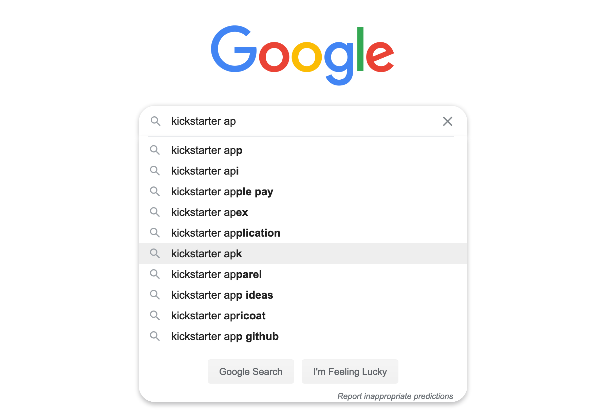

# TODO: add menuWeight metadata

#  SEO for actors

The actor details page in the [Apify Store](https://apify.com/store) provides a great way to promote your actor to users of search engines like Google. The goal is to attract all people searching for the specific problem that your actor solves, for example ["Kickstarter API"](https://www.google.com/search?q=kickstarter+api) or ["Amazon crawler"](https://www.google.com/search?q=amazon+crawler). This article provides some basic information about [search engine optimization (SEO)](https://en.wikipedia.org/wiki/Search_engine_optimization) for your actors.

**The golden rule of SEO:** create quality content that provides value and engagement to your users. [Don't over-optimize SEO](https://seo-hacker.com/over-optimization-penalty/), otherwise you risk being penalized by Google.

Think of it this way: your content, URLs, keywords, titles, links, etc. determine the kind of search queries your page is shown in. The quality of the content determines how high it ranks in those results. For example, if you over-optimize your URLs and title to rank higher in results for high-volume queries, but most people who visit your page immediately leave, Google notices, penalizes you, and your pages sinks in the results. On the other hand, if you precisely address a niche segment of users who will benefit from your actor and people who open it use your actor, then Google will love it and push it up in results. Read more about the basics of [content marketing](https://techcrunch.com/2019/04/13/how-do-startups-actually-get-their-content-marketing-to-work/).

Below are our tips for better SEO of various actor properties.

##  Name

The actor name is your actor's developer-style name, which is prefixed by your username (e.g. `jancurn/find-broken-links`). The name is used to generate a URL for your actor (e.g. https://apify.com/jancurn/find-broken-links), making it an important signal for search engines. However, the name should also be readable and clear enough, so that people using your actor can understand what it does just from the name.

##  Title

The actor title provides your actor with a human-readable name. The title is the most important real estate from SEO standpoint. It should exactly match the most likely search query that potential users of your actor will use. At the same time, it shoud give your actor a clear name for people who will use it every day. So if you’re working on an "Amazon crawler", you should use the following words in your actor's name. 

> GOOD: Amazon crawler, Google Places API, Kickstarter search
> AVOID: Crawler for Amazon, API for Google places, Search in Kickstarter

##  Description

Your actor's description should contain a concise but precise description of what your actor does, targeted for people who are deciding whether to use it or not. Go straight to the point and avoid any boilerplate text.

> GOOD: Crawls Amazon.com and extracts ...  
> AVOID: This actor crawls Amazon.com in order to extract ...

The description is used by search engines to understand what the actor is about, so it should contain some of the most popular variations and derivations of the [title](#title), including things people might search for. 

> GOOD: This Amazon bot will help, whereas the Amazon API won’t. Use the crawler...  
> AVOID: This crawler will search through results in Amazon and offers you...

If you’re not sure about similar phrases, check out the Google suggest tool in the search and it will show you some hints and tips. Of course, the description should primarily be about what the actor does, but it’s always a good idea to enrich the text with popular keywords.

##  README

The README․md file represents a complete description of your actor, intended for its users. If your actor's users are technical folks, then you can be more technical in the README. If they aren't, be less technical.

You have lots of room for SEO optimization in the README, without compromising readability for your users. Make sure the text includes other variants of what potential users of your actor might search for. A good place for these is in the captions and headlines but keywords in the body text will also help. It’s also a good idea to repeat the name of the actor several times.

> GOOD: You can use this Amazon Crawler with your code (Python, PHP, Java) to crawl Amazon without the API...
> AVOID: Follow the instructions in the Readme and if you have any comments, see the FAQ section...

An important part of SEO is internal and external linking. Don’t be shy and add links to your README leading to similar [actors](https://apify.com/store) or any interesting article in [Apify Help](https://help.apify.com/) that could help your users. If your actor is scraping a certain website, make sure to add a link to that website. If the actor uses any external libraries, make sure to link their pages.

If you’ve created other actors, it’s completely fine to pop in a promo for them at the end. It’s even better if you edit your old actors and put in a link to your new actor. We’ll take care of extra promotion on the [Apify Homepage](https://apify.com/) or [Apify Store](https://apify.com/store) - especially if you’ve done a great job of describing your actors!

> GOOD: Like my Amazon Crawler? See my Amazon Review Crawler.
> AVOID: No links.

##  Sharing is caring

Now that you’ve created a cool new actor, let others see it! Share it on your personal Twitter, Facebook, Reddit or any other social platform. Always provide a link with the actor's name. Use #hashtags on Twitter to catch attention. Provide a small “why is this good” segment when sharing inside any group discussions. We will promote your actor sooner or later, but more links means more attention from Google from the beginning.

> GOOD: Need to crawl #Amazon or #Yelp? See my Amazon crawler https://...
> AVOID: I just created something, check it out on Apify...
