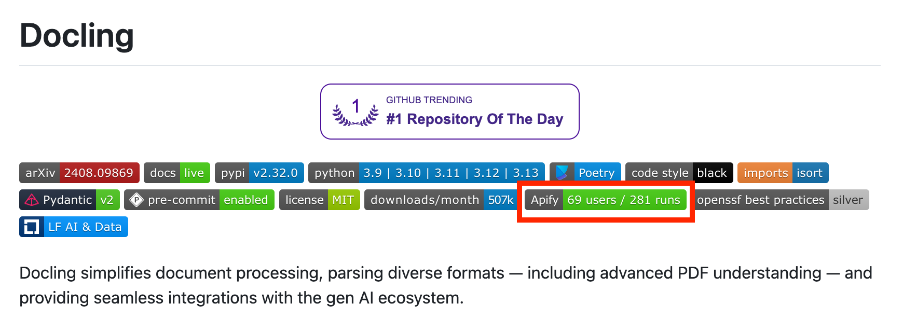

Apify is a cloud platform with a [marketplace](https://apify.com/store) of 5,000+ web scraping and automation tools called _Actors_. These tools are used for extracting data from social media, search engines, maps, e-commerce sites, travel portals, and general websites.

Most Actors are developed by a global creator community, and some are developed by Apify. We have 18k monthly active users/developers on the platform (growing 138% YoY). Last month, we paid out $170k to creators (growing 118% YoY), and in total, over the program's history, we paid out almost $2M to them.

## What are Actors

Under the hood, Actors are programs packaged as Docker images, that accept a well-defined JSON input, perform an action, and optionally produce a well-defined JSON output. This makes it easy to auto-generate user interfaces for Actors and integrate them with one another or with external systems. For example, we have user-friendly integrations with Zapier, Make, LangChain, MCP, OpenAPI, and SDKs for TypeScript/Python, CLI, etc. etc.

Actors are a new way to build reusable serverless micro-apps that are easy to develop, share, integrate, and build upon—and, importantly, monetize. While Actors are our invention, we’re in the process of making them an open standard. Learn more at [https://whitepaper.actor](https://whitepaper.actor/).

While most Actors on our marketplace are web scrapers or crawlers, there are ever more Actors for other use cases including data processing, web automation, API backend, or [AI agents](https://apify.com/store/categories/agents). In fact, any piece of software that accepts input, performs a job, and can run in Docker, can be _Actorized_ simply by adding an `.actor` directory to it with a couple of JSON files.

## Why Actorize

By publishing your service or project at [Apify Store](https://apify.com/store) your project will benefit from:

1. _Expanded reach_: Your tool instantly becomes available to Apify's user community and connects with popular automation platforms like [Make](https://www.make.com), [n8n](https://n8n.io/), and [Zapier](https://zapier.com/).
2. _Multiple monetization paths_: Choose from flexible pricing models (monthly subscriptions, pay-per-result, or pay-per-event).
3. _AI integration_: Your Actor can serve as a tool for AI agents through Apify's MCP (Model Context Protocol) server, creating new use cases and opportunities while you earn 80% of all revenues.

:::tip Open-Source Benefits

For open-source developers, Actorization adds value without extra costs:

- Host your code in the cloud for easy user trials (no local installs needed).
- Avoid managing cloud infrastructure—users cover the costs.
- Earn income through [Apify’s Open Source Fair Share program](https://apify.com/partners/open-source-fair-share) via GitHub Sponsors or direct payouts.
- Publish and monetize 10x faster than building a micro-SaaS, with Apify handling infra, billing, and access to 700,000+ monthly visitors and 70,000 signups.

:::

For example, IBM’s [Docling project](https://github.com/docling-project/docling) merged our pull request that actorized their open-source GitHub repo (24k stars) and added the Apify Actor badge to the README:

### Example Actorized projects

You can Actorize various projects ranging from open-source libraries, throughout existing SaaS services, up to MCP server:

| Name | Type | Source | Actor |
| --- | --- | --- | --- |
| Parsera | SaaS service | [https://parsera.org/](https://parsera.org/) | [https://apify.com/parsera-labs/parsera](https://apify.com/parsera-labs/parsera) |
| Monolith | Open source library | [https://github.com/Y2Z/monolith](https://github.com/Y2Z/monolith) | [https://apify.com/snshn/monolith](https://apify.com/snshn/monolith) |
| Crawl4AI | Open source library | [https://github.com/unclecode/crawl4ai](https://github.com/unclecode/crawl4ai) | [https://apify.com/janbuchar/crawl4ai](https://apify.com/janbuchar/crawl4ai) |
| Docling | Open source library | [https://github.com/docling-project/docling](https://github.com/docling-project/docling) | https://apify.com/vancura/docling/source-code |
| Playwright MCP | Open source MCP server | [https://github.com/microsoft/playwright-mcp](https://github.com/microsoft/playwright-mcp) | [https://apify.com/jiri.spilka/playwright-mcp-server](https://apify.com/jiri.spilka/playwright-mcp-server) |
| Browserbase MCP | SaaS MCP server | [https://www.browserbase.com/](https://www.browserbase.com/) | [https://apify.com/mcp-servers/browserbase-mcp-server](https://apify.com/mcp-servers/browserbase-mcp-server) |

### What projects are suitable for Actorization

Use these criteria to decide if your project is a good candidate for Actorization:

1. _Is it self-contained?_ Does the project work non-interactively, with a well-defined, preferably structured input and output format? Positive examples include various data processing utilities, web scrapers and other automation scripts. Negative examples are GUI applications or applications that run indefinitely. If you want to run HTTP APIs on Apify, you can do so using [Actor Standby](/platform/actors/development/programming-interface/standby).
2. _Can the state be stored in Apify storages?_ If the application has state that can be stored in a small number of files it can utilize [key-value store](/platform/storage/key-value-store), or if it processes records that can be stored in Apify’s [request queue](/platform/storage/request-queue). If the output consists of one or many similar JSON objects, it can utilize [dataset](/platform/storage/dataset).
3. _Can it be containerized?_ The project needs to be able to run in a Docker container. Apify currently does not support GPU workloads. External services (e.g., databases) need to be managed by developer.
4. _Can it use Apify tooling?_ Javascript/Typescript applications and Python applications can be Actorized with the help of the [Apify SDK](/sdk), which makes easy for your code to interacts with the Apify platform. Applications that can be run using just the CLI can also be Actorized using the Apify CLI by writing a simple shell script that retrieves user input using [Apify CLI](/cli/), then runs your application and sends the results back to Apify (also using the CLI). If your application is implemented differently, you can still call the [Apify API](/api/v2) directly - it’s just HTTP and pretty much every language has support for that but the implementation is less straightforward.

## Actorization guide

This guide outlines the steps to convert your application into an Apify [Actor](/platform/actors). Follow the documentation links for detailed information - this guide provides an overview rather than exhaustive instructions.

### 1. Add Actor metadata - the `.actor` folder

The Apify platform requires your Actor repository to have a `.actor` folder at the root level, which contains the metadata needed to build and run the Actor.

For existing projects, you can add the `.actor` folder using the [`apify init` CLI command](/cli/docs/reference#apify-init-actorname).

In case you're starting a new project, we strongly advise to start with a [template](https://apify.com/templates) using the [`apify create` CLI command](/cli/docs/reference#apify-create-actorname) based on your usecase

- [TypeScript template](https://apify.com/templates/ts-empty)
- [Python template](https://apify.com/templates/python-empty)
- [CLI template](https://apify.com/templates/cli-start)
- [MCP server template](https://apify.com/templates/python-mcp-server)
- … and many others, check out for comprehensive list [https://apify.com/templates](https://apify.com/templates)

    :::note Quick Start for beginners

    For a step-by-step introduction to creating your first Actor (including tech stack choices and development paths), see [Quick Start](/platform/actors/development/quick-start).

    :::

The newly created `.actor` folder contains an `actor.json` file - a manifest of the Actor. See [documentation](/platform/actors/development/actor-definition/actor-json) for more details

You must also make sure your Actor has a Dockerfile and that it installs everything needed to successfully run your application. Check out [Dockerfile documentation](/platform/actors/development/actor-definition/dockerfile) by Apify. If you don't want to use these, you are free to use any image as the base of your Actor.

When launching the Actor, the Apify platform will simply run your Docker image. This means that a) you need to configure the `ENTRYPOINT` and `CMD` directives so that it launches your application and b) you can test your image locally using Docker.

These steps are the bare minimum you need to run your code on Apify. The rest of the guide will help you flesh it out better.

### 2. Define input and output

Most Actors accept an input and produce an output. As part of Actorization, you need to define the input and output structure of your application.

For detailed information, read the docs for [input schema](/platform/actors/development/actor-definition/input-schema), [dataset schema](/platform/actors/development/actor-definition/dataset-schema), and general [storage](/platform/storage).

#### Design guidelines

1. If your application has some arguments or options, those should be part of the input defined by input schema.
1. If there is a configuration file or if your application is configured with environment variables, those should also be part of the input. Ideally, nested structures should be “unpacked”, i.e., try not to accept deeply nested structures in your input. Start with less input options and expand later.
1. If the output is a single file, you’ll probably want your Actor to output a single dataset item that contains a public URL to the output file stored in the Apify key-value store
1. If the output has a table-like structure or a series of JSON-serializable objects, you should output each row or object as a separate dataset item
1. If the output is a single key-value record, your Actor should return a single dataset item

### 3. Handle state persistence (optional)

If your application performs a number of well-defined subtasks, the [request queue](/platform/storage/request-queue) lets you pause and resume execution on job restart. This is important for long-running jobs that might be migrated between servers at some point. In addition, this allows the Apify platform to display the progress to your users in the UI.

A lightweight alternative to the request queue is simply storing the state of your application as a JSON object in the key-value store and checking for that when your Actor is starting.

Fully-fledged Actors will often combine these two approaches for maximum reliability. More on this topic you find in the [state persistence](/platform/actors/development/builds-and-runs/state-persistence) article.

### 4. Write Actorization code

Perhaps the most important part of the Actorization process is writing the code that will be executed when the Apify platform launches your Actor.

Unless you’re writing an application targeted directly on the Apify platform, this will have the form of a script that calls your code and integrates it with the Apify Storages

Apify provides SDKs for [Javascript](/sdk/js/) and [Python](/sdk/python/) plus a [Apify CLI](/cli/) allowing an easy interaction with Apify platform from command line.

Check out [programming interface](/platform/actors/development/programming-interface/) documentation article for details on interacting with the Apify platform in your Actor's code.

### 5. Deploy the Actor

Deployment to Apify platform can be done easily via `apify push` command of [Apify CLI](/cli/) and for details see [deployment](/platform/actors/development/deployment) documentation.

### 6. Publish and monetize

For details on publishing the Actor in [Apify Store](https://apify.com/store) see the [Publishing and monetization](/platform/actors/publishing). You can also follow our guide on [How to create an Actor README](/academy/actor-marketing-playbook/actor-basics/how-to-create-an-actor-readme) and [Actor marketing playbook](/academy/actor-marketing-playbook).
