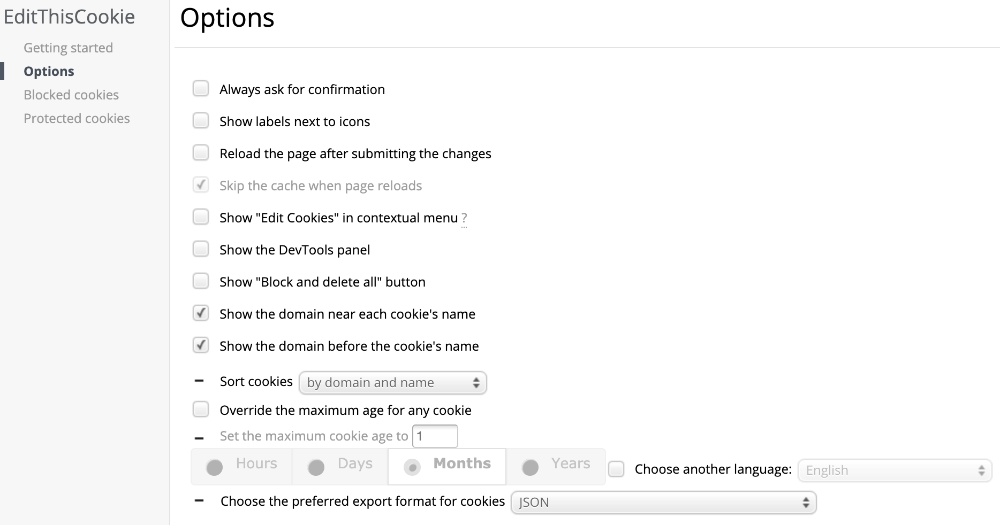

# What's EditThisCookie? {#what-is-it}

**Learn how to add, delete, and modify different cookies in your browser for testing purposes using the EditThisCookie Chrome extension.**

---

**EditThisCookie** is a Chrome extension to manage your browser's cookies. It can be added through the [Chrome Web Store](https://chrome.google.com/webstore/category/extensions). After adding it to Chrome, you'll see a button with a delicious cookie icon next to any other Chrome extensions you might have installed. Clicking on it will open a pop-up window with a list of all saved cookies associated with the currently opened page domain.

## Functionalities {#functions}

At the top of the popup, there is a row of buttons. From left to right, here is an explanation for each one:

### Delete all cookies

Clicking this button will remove all cookies associated with the current domain. For example, if you're logged into your Apify account and delete all the cookies, the website will ask you to log in again.

### Reset

A refresh button.

### Add a new cookie

Manually add a new cookie for the current domain.

### Import cookies

Allows you to add cookies in bulk. For example, if you have saved some cookies inside your crawler, or someone provided you with some cookies for the purpose of testing a certain website in your browser, they can be imported and automatically applied with this button.

### Export cookies

Copies an array of cookies associated with the current domain to the clipboard. The cookies can then be later inspected, added to your crawler, or imported by someone else using EditThisCookie.

### Search

Allows you to filter through cookies by name.

### Options

Will open a new browser tab with a bunch of EditThisCookie options. The options page allows you to tweak a few settings such as changing the export format, but you will most likely never need to change anything there.

