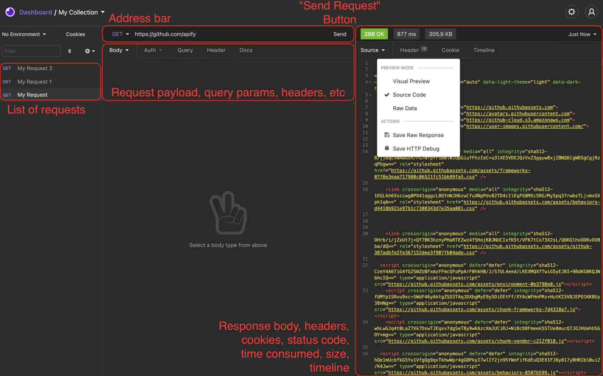
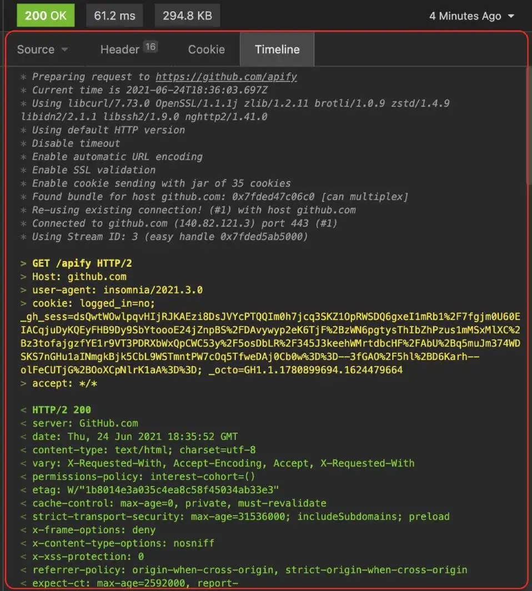
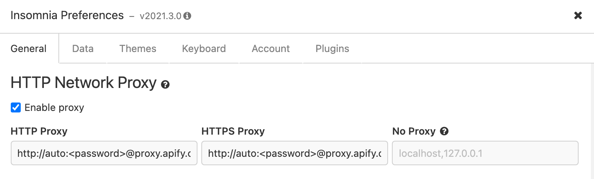
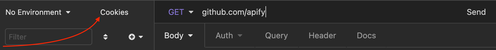
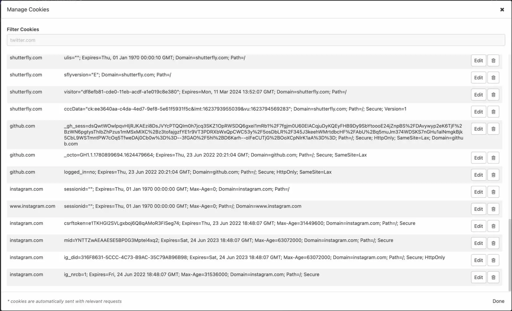

# What is Insomnia? {#what-is-insomnia}

**Learn about Insomnia, a simple yet super valuable tool for testing requests and proxies when building scalable web scrapers.**

---

Despite its name, the [Insomnia](https://insomnia.rest/download) desktop application has absolutely nothing to do with having a lack of sleep. Rather, it is a tool to build and test APIs. If you've already read about [Postman](./postman.md), you already know what Insomnia can be used for, as they both do practically the same exact things. There are some small differences between them, though. Like Postman, Insomnia allows you to send requests with specific headers and cookies, to add a request payload, etc. One difference is that Insomnia also allows you to see the whole timeline of the request.

Insomnia can be downloaded from its [official website](https://insomnia.rest/download), and its features can be read about in the [official documentation](https://docs.insomnia.rest/).

## The Insomnia interface {#insomnia-interface}

After opening the app, you'll first need to create a new request. After creating the request, you'll see an interface that looks like this:

Let's break down the main sections:

### List of requests

You can configure multiple request with a custom payload, headers, cookies, parameters, etc. They are automatically saved in the list of requests until deleted.

### Address bar

The place where you select the type of request to send (**GET**, **POST**, **PUT**, **DELETE**, etc.), specify the URI of the request, and send the request with the **Send** button.

### Request options

Here, you can add a request payload, specify authorization parameters, add query parameters, and attach headers to the request.

### Response

Where the response body is displayed after the request has been sent. Like in Postman, the request can be viewed in preview mode, pretty-printed, or in its raw form. This section also has the **Headers** and **Cookies** tabs, which respectively show the request headers and cookies.

## Request timeline {#request-timeline}

The one feature of Insomnia that separates it from Postman is the **Timeline**.

This feature allows you to see information about the request that is not present in the response body.

## Using proxies in Insomnia {#using-proxies}

In order to use a proxy, you need to specify the proxy's parameters in Insomnia's preferences. In preferences, scroll down to the **HTTP Network Proxy** section under the **General** tab and specify the full proxy URL there:

## Managing the cookies cache {#managing-cookies-cache}

Insomnia keeps the cookies for the requests you have already sent before. This might result in you receiving a difference response within your scraper from what you're receiving in Insomnia, as a necessary cookie is not present in the request sent by the scraper. To check whether or not some cookies associated with a certain request have been cached, click on the **Cookies** button at top of the list of requests:

This'll bring up the **Manage cookies** window, where all cached cookies can be viewed, edited, or deleted.

## So, Postman or Insomnia? {#postman-or-insomnia}

The application you choose to use is completely up to personal preference, and will not affect your development workflow. If viewing timelines of the requests you send is important to you, then you should go with Insomnia; however, if that doesn't matter, just choose the one that has the most intuitive interface for you.
