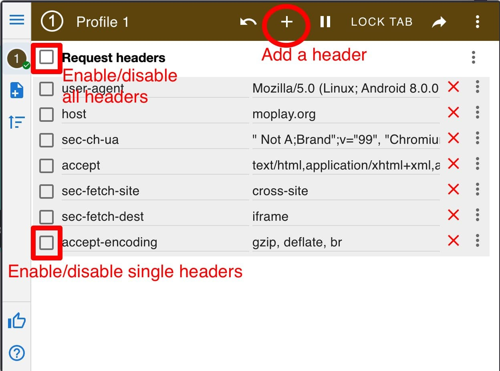

# What is ModHeader? {#what-is-modheader}

**Discover a super useful Chrome extension called ModHeader, which allows you to modify your browser's HTTP request headers.**

---

If you read about [Postman](./postman.md), you might remember that you can use it to modify request headers before sending a request. This is great, but the main problem is that Postman can only make static requests - meaning, it is unable to load JavaScript or any [dynamic content](../concepts/dynamic_pages.md).

[ModHeader](https://chrome.google.com/webstore/detail/idgpnmonknjnojddfkpgkljpfnnfcklj) is a Chrome extension which can be used to modify the HTTP headers of the requests you make with your browser. This means that, for example, if your scraper using a headless browser Puppeteer is being blocked due to an improper **User-Agent** header, you can use ModHeader to test the target website and quickly solve the issue.

## The ModHeader interface {#interface}

After you install the ModHeader extension, you should see it pinned in Chrome's task bar. When you click it, you'll see an interface like this pop up:

Here, you can add headers, remove headers, and even save multiple collections of headers that you can easily toggle between (which are called **Profiles** within the extension itself).

## Use cases {#use-cases}

When scraping dynamic websites, sometimes some specific headers are required to access certain pages. The most popularly required headers are generally `User-Agent` and `referer`. ModHeader, and other tools like it, make it easy to test requests to these websites right in your browser before writing logic for your scraper.
