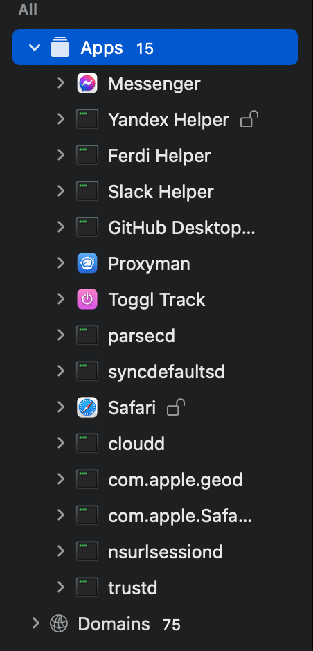
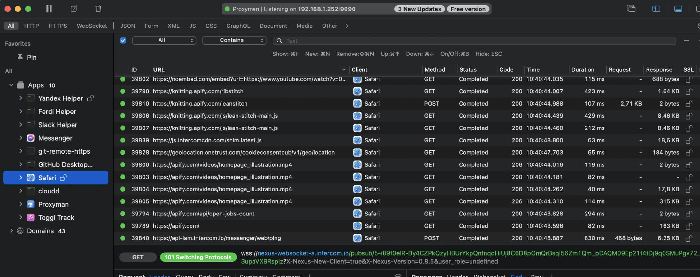
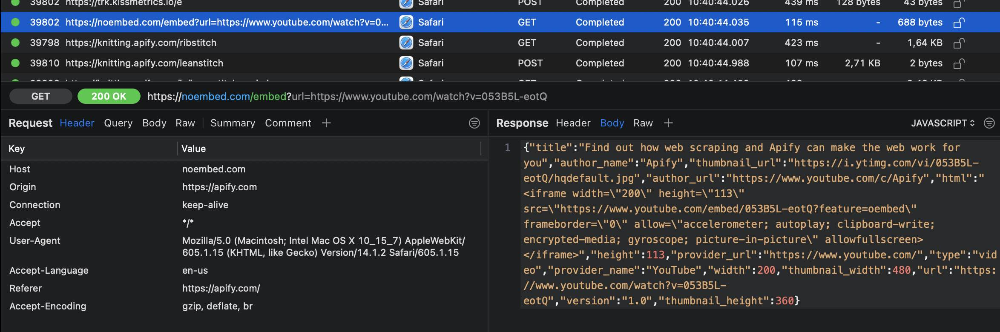
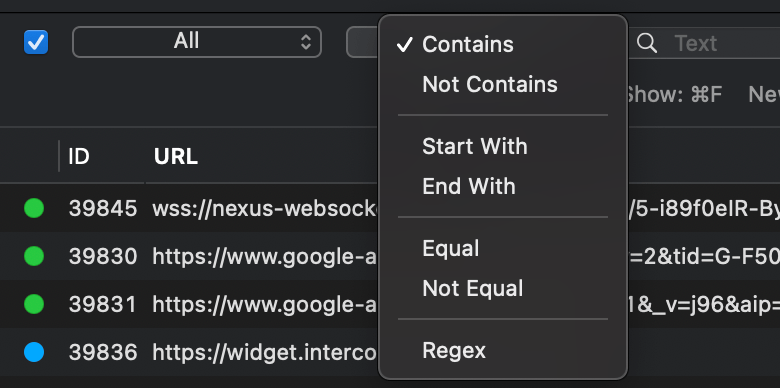

# What's Proxyman? {#what-is-proxyman}

**Learn about Proxyman, a tool for viewing all network requests that are coming through your system. Filter by response type, by a keyword, or by application.**

---

Though the name sounds very similar to [Postman](./postman.md), [**Proxyman**](https://proxyman.io/) is used for a different purpose. Rather than for manually sending and analyzing the responses of requests, Proxyman is a tool for macOS that allows you to view and analyze the HTTP/HTTPS requests that are going through your device. This is done by routing all of your requests through a proxy, which intercepts them and allows you to view data about them. Because it's just a proxy, the HTTP/HTTPS requests going through iOS devices, Android devices, and even iOS simulators can also be viewed with Proxyman.

If you've already gone through the [**Locating and learning** lesson](../../webscraping/api_scraping/general_api_scraping/locating_and_learning.md) in the **API scraping** section, you can think of Proxyman as an advanced Network Tab, where you can see requests that you sometimes can't see in regular browser DevTools.

## The basics {#the-basics}

Though the application offers a whole lot of advanced features, there are only a few main features you'll be utilizing when using Proxyman for scraper development purposes. Let's open up Proxyman and take a look at some of the basic features:

### Apps

The **Apps** tab allows you to both view all of the applications on your machine which are sending requests, as well as filter requests based on application.

### Results

Let's open up Safari and visit **apify.com**, then check back in Proxyman to see all of the requests Safari has made when visiting the website.

We can see all of the requests related to us visiting **apify.com**. Then, by clicking a request, we can see a whole lot of information about it. The most important information for you, however, will usually be the request and response **headers** and **body**.

### Filtering

Sometimes, there can be hundreds (or even thousands) of requests that appear in the list. Rather than spending your time rooting through all of them, you can use the plethora of filtering methods that Proxyman offers to find exactly what you are looking for.

## Alternatives {#alternatives}

Since Proxyman is only available for macOS, it's only appropriate to list some alternatives to it that are accessible to our Windows and Linux friends:

- [Burp Suite](https://portswigger.net/burp)
- [Charles Proxy](https://www.charlesproxy.com/documentation/installation/)
- [Fiddler](https://www.telerik.com/fiddler)
