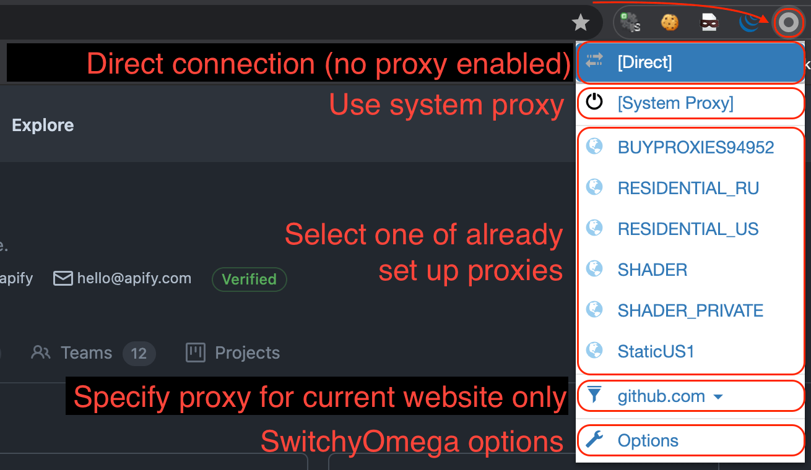
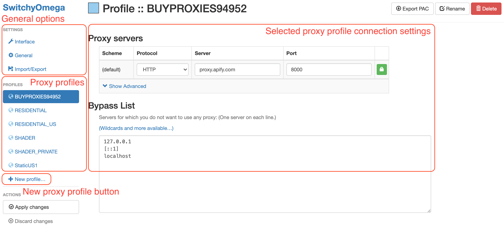
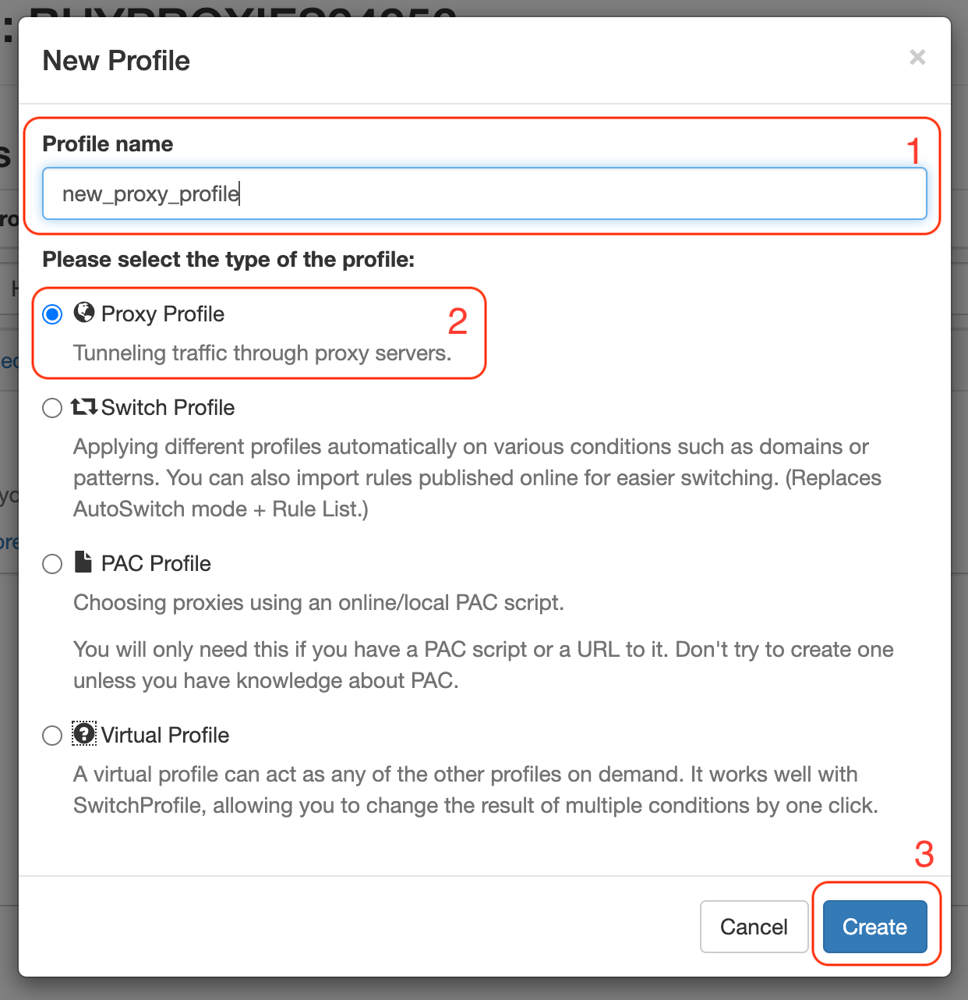
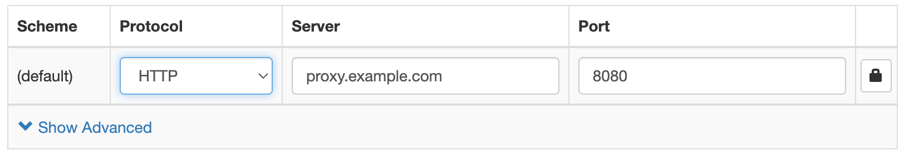
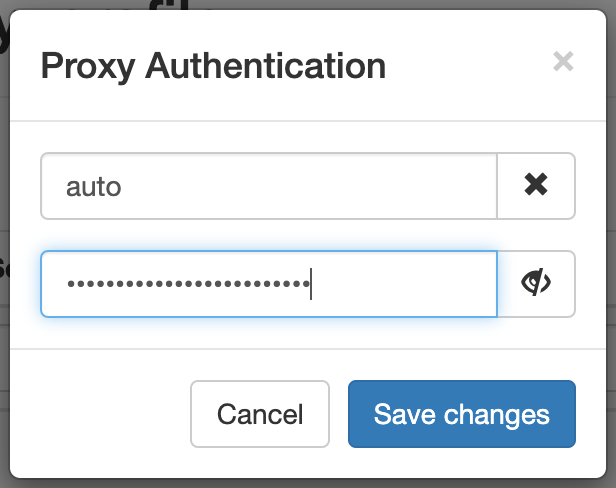
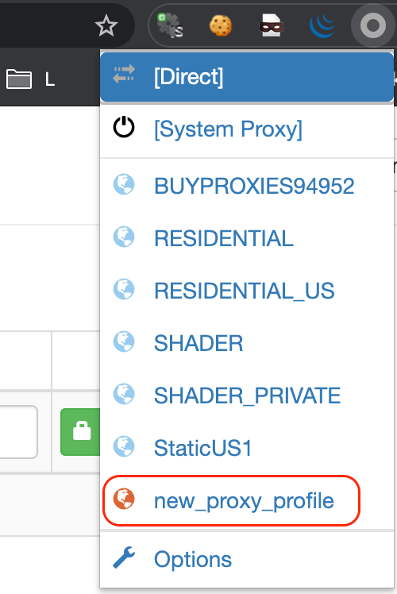

# What is SwitchyOmega? {#what-is-switchyomega}

**Discover SwitchyOmega, a Chrome extension to manage and switch between proxies, which is extremely useful when testing proxies for a scraper.**

---

SwitchyOmega is a Chrome extension for managing and switching between proxies which can be added in the [Chrome Webstore](https://chrome.google.com/webstore/detail/proxy-switchyomega/padekgcemlokbadohgkifijomclgjgif).

After adding it to Chrome, you can see the SwitchyOmega icon somewhere amongst all your other Chrome extension icons. Clicking on it will display a menu, where you can select various differnt connection profiles, as well as open the extension's options.

## Options {#options}

The options page has the following:

- General settings/interface settings (which you can keep to their default values).
- A list of proxy profiles (separate profiles can be added for different proxy groups, or for different countries for the residential proxy group, etc).
- The **New profile** button
- The main section, which shows the selected settings sub-section or selected proxy profile connection settings.

## Adding a new proxy {#adding-a-new-proxy}

After clicking on **New profile**, you'll be greeted with a **New profile** popup, where you can give the profile a name and select the type of profile you'd like to create. To add a proxy profile, select the respective option and click **Create**.

Then, you need to fill in the proxy settings:

If the proxy requires authentication, click on the lock icon and fill in the details within the popup.

Don't forget to click on **Apply changes** within the left-hand side menu under **Actions**!

## Selecting proxy profiles {#selecting-profiles}

And that's it! All of your proxy profiles will appear in the menu. When one is chosen, the page you are currently on will be reloaded using the selected proxy profile.

