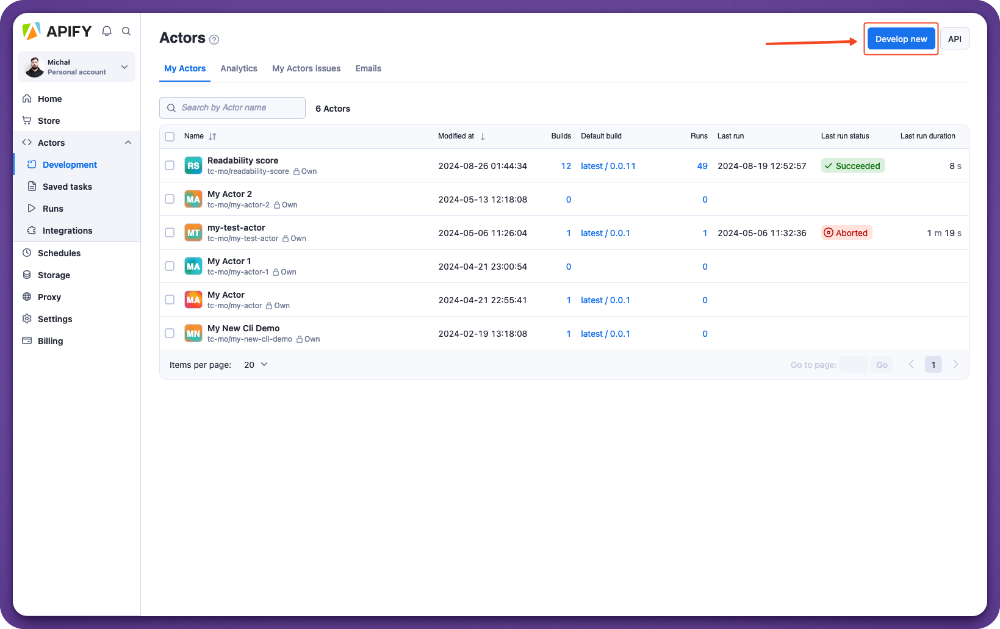

**Push local code to the platform, or create a new Actor on the console and integrate it with a Git repository to optionally automatically rebuild any new changes.**

---

Once you've **actorified** your code, there are two ways to deploy it to the Apify platform. You can either push the code directly from your local machine onto the platform, or you can create a blank Actor in the web interface, and then integrate its source code with a GitHub repository.

## With a Git repository {#with-git-repository}

Before we deploy our project onto the Apify platform, let's ensure that we've pushed the changes we made in the last 3 lessons into our remote GitHub repository.

> The benefit of using this method is that any time you push to the Git repository, the code on the platform is also updated and the Actor is automatically rebuilt. Also, you don't have to use a GitHub repository - you can use GitLab or any other service you'd like.

### Creating the Actor

Before anything can be integrated, we've gotta create a new Actor. Let's head over to our [Apify Console](https://console.apify.com?asrc=developers_portal), navigate to the **Development** subsection and click on the **Develop new** button, then select the **Empty** template.

### Changing source code location {#change-source-code}

In the **Source** tab on the new Actor's page, we'll click the dropdown menu under **Source code** and select **Git repository**. By default, this is set to **Web IDE**.

Now we'll paste the link to our GitHub repository into the **Git URL** text field and click **Save**.

### Adding the webhook to the repository {#adding-repository-webhook}

The final step is to click on **API** in the top right corner of our Actor's page:

And scroll through all of the links until we find the **Build Actor** API endpoint. Now we'll copy this endpoint's URL, head back over to our GitHub repository and navigate to **Settings > Webhooks > Add webhook**. The final thing to do is to paste the URL and save the webhook.

That's it! The Actor should now pull its source code from the repository and automatically build.

## Without a GitHub repository (using the Apify CLI) {#with-apify-cli}

> If you don't yet have the Apify CLI, learn how to install it and log in by following along with [this brief lesson](../../glossary/tools/apify_cli.md) about it.

If you're logged in to the Apify CLI, the `apify push` command can be used to push the code straight onto the Apify platform from your local machine (no GitHub repository required), where it will automatically be built for you. Prior to running this command, make sure that you have an **.actor/actor.json** file at the root of the project. If you don't already have one, you can use `apify init .` to automatically generate one for you.

One important thing to note is that you can use a `.gitignore` file to exclude files from being pushed. When you use `apify push` without a `.gitignore`, the full folder contents will be pushed, meaning that even the **storage** and **node_modules** will be pushed. These files are unnecessary to push, as they are both generated on the platform.

> The `apify push` command should only really be used for quickly pushing and testing Actors on the platform during development. If you are ready to make your Actor public, use a Git repository instead, as you will reap the benefits of using Git and others will be able to contribute to the project.

## Deployed! {#deployed}

Great! Once you've pushed your Actor to the platform, you should see it in the list of Actors under the **Actors** tab. If you used `apify push`, you'll have access to the **multifile editor** (discussed in [Creating Actors](../getting_started/creating_actors.md)).

The next step is to test your Actor and experiment with the vast amount of features the platform has to offer.

## Wrap up {#next}

That's it! In this short section, you've learned how to take your code written in any programming language and turn it into a usable Actor that can run on the Apify platform! The next step is to start looking into the [paid Actors](/platform/actors/publishing) program, which allows you to monetize your work.
