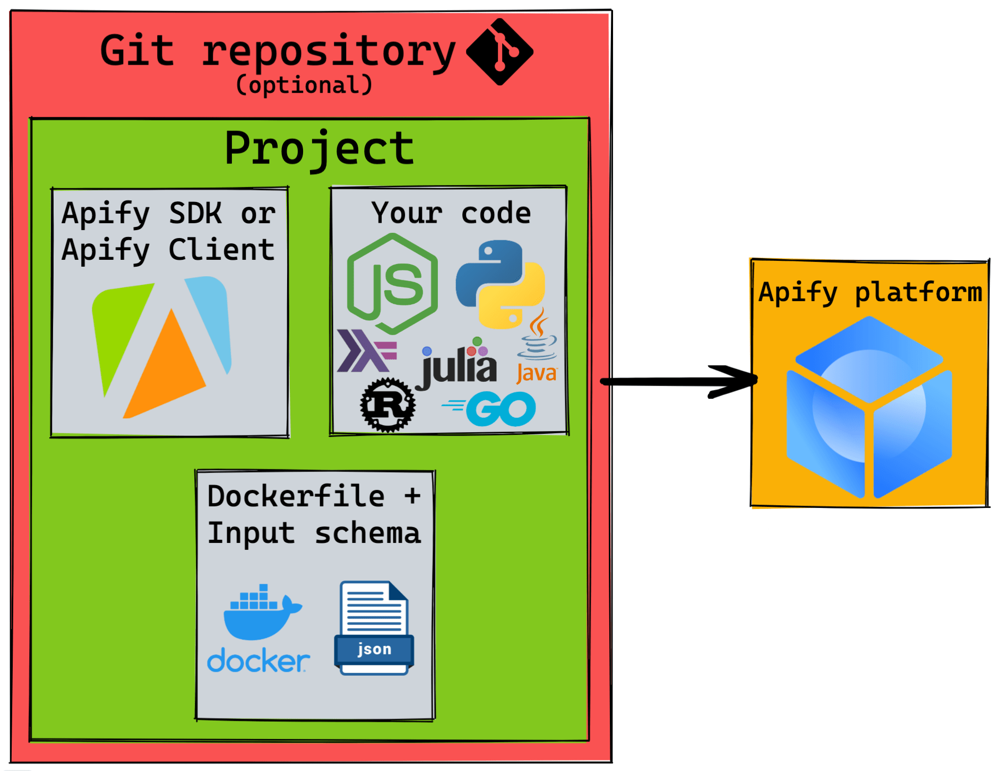

import Tabs from '@theme/Tabs';
import TabItem from '@theme/TabItem';

# Deploying your code to Apify {#deploying}

**In this course learn how to take an existing project of yours and deploy it to the Apify platform as an actor in just a few minutes!**

---

This section will discuss how to use your newfound knowledge of the Apify platform and actors from the [**Getting started**](../getting_started/index.md) section to deploy your existing project's code to the Apify platform as an actor.

Because actors are basically just chunks of code running in Docker containers, you're able to **_Actorify_** just about anything!



Actors are language agnostic, which means that the language your project is written in does not affect your ability to actorify it.


Though the majority of actors currently on the platform were written in Node.js, and despite the fact our current preferred languages are JavaScript and Python, there are a few examples of actors in other languages:

- [Actor written in Rust](https://apify.com/lukaskrivka/rust-actor-example)
- [GO actor](https://apify.com/jirimoravcik/go-actor-example)
- [Actor written with Julia](https://apify.com/jirimoravcik/julia-actor-example)

## The "actorification" workflow {#workflow}

There are four main steps to turning a piece of code into an actor:

1. Handle [accepting inputs and writing outputs](./inputs_outputs.md).
2. Create an [input schema](./input_schema.md) **(optional)**.
3. Add a [Dockerfile](./docker_file.md).
4. [Deploy](./deploying.md) to the Apify platform!

## Our example project

For this section, we'll be turning this example project into an actor:

<Tabs groupId="main">
<TabItem value="JavaScript" label="JavaScript">

```javascript
// index.js
const addAllNumbers = (...nums) => nums.reduce((total, curr) => (total += curr));

console.log(addAllNumbers(1, 2, 3, 4)) // -> 10

```
</TabItem>
<TabItem value="Python" label="Python">

```python
# index.py
def add_all_numbers (nums):
    total = 0

    for num in nums:
        total += num

    return total

print(add_all_numbers([1, 2, 3, 4])) # -> 10

```
</TabItem>
</Tabs>

> For all lessons in this section, we'll have examples for both Node.js and Python so that you can follow along in either language.

<!-- We've pushed this code to GitHub and are ready to turn it into an actor that takes any number of integers as input, adds them all up, then stores the solution as its output. -->

## Next up {#next}

[Next lesson](./inputs_outputs.md), we'll be learning how to accept input into our actor as well as deliver output.
