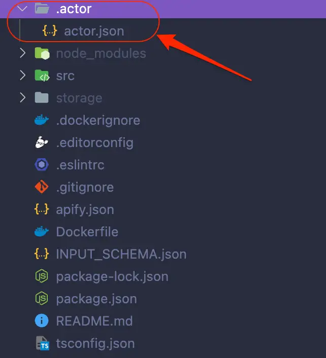
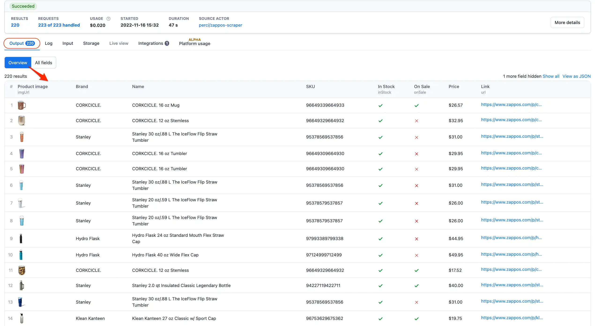

# Output schema {#output-schema}

**Learn how to generate an appealing Overview table interface to preview your actor results in real time on the Apify Platform.**

---

The Output schema generates an interface that enables users to instantly preview their actor results in real time.


In this quick tutorial, you will learn how to set up an output tab for your own actor.

## Implementation {#implementation}

Firstly, create a `.actor` folder in the root of your actor's source code. Then, create a `actor.json` file in this folder, after which you'll have .actor/actor.json.



Next, copy-paste the following template code into your `actor.json` file.

```json
{
    "actorSpecification": 1,
    "name": "___ENTER_ACTOR_NAME____",
    "title": "___ENTER_ACTOR_TITLE____",
    "version": "1.0.0",
    "storages": {
        "dataset": {
            "actorSpecification": 1,
            "views": {
                "overview": {
                    "title": "Overview",
                    "transformation": {
                        "fields": [
                            "___EXAMPLE_NUMERIC_FIELD___",
                            "___EXAMPLE_PICTURE_URL_FIELD___",
                            "___EXAMPLE_LINK_URL_FIELD___",
                            "___EXAMPLE_TEXT_FIELD___",
                            "___EXAMPLE_BOOLEAN_FIELD___"
                        ]
                    },
                    "display": {
                        "component": "table",
                        "properties": {
                            "___EXAMPLE_NUMERIC_FIELD___": {
                                "label": "ID",
                                "format": "number"
                            },
                            "___EXAMPLE_PICTURE_URL_FIELD___": {
                                "format": "image"
                            },
                            "___EXAMPLE_LINK_URL_FIELD___": {
                                "label": "Clickable link",
                                "format": "link"
                            }
                        }
                    }
                }
            }
        }
    }
}
```

To configure the output schema, simply replace the fields in the template with the relevant fields to you actor.

For reference, you can use the [Zappos Scraper source code](https://github.com/PerVillalva/zappos-scraper-actor/blob/main/.actor/actor.json) as an example of how the final implementation of the output tab should look like in a live actor.

```json
{
    "actorSpecification": 1,
    "name": "zappos-scraper",
    "title": "Zappos Scraper",
    "description": "",
    "version": "1.0.0",
    "storages": {
        "dataset": {
            "actorSpecification": 1,
            "title": "Zappos.com Dataset",
            "description": "",
            "views": {
                "products": {
                    "title": "Overview",
                    "description": "It can take about one minute until the first results are available.",
                    "transformation": {
                        "fields": [
                            "imgUrl",
                            "brand",
                            "name",
                            "SKU",
                            "inStock",
                            "onSale",
                            "price",
                            "url"
                        ]
                    },
                    "display": {
                        "component": "table",
                        "properties": {
                            "imgUrl": {
                                "label": "Product image",
                                "format": "image"
                            },
                            "url": {
                                "label": "Link",
                                "format": "link"
                            },
                            "brand": {
                                "format": "text"
                            },
                            "name": {
                                "format": "text"
                            },
                            "SKU": {
                                "format": "text"
                            },
                            "inStock": {
                                "format": "boolean"
                            },
                            "onSale": {
                                "format": "boolean"
                            },
                            "price": {
                                "format": "text"
                            }
                        }
                    }
                }
            }
        }
    }
}
```

Note that the fields specified in the output schema should match the object keys of your resulting dataset.

Also, if your desired label has the same name as the defined object key, then you don't need to specify a label name. The schema will, by default, show a capitalized version of the key and even split camel case into separate words and capitalize all of them.

So, the matching object for the Zappos Scraper shown in the example above will look something like this:

```js
const results = {
        url: request.loadedUrl,
        imgUrl: $('#stage button[data-media="image"] img[itemprop="image"]').attr('src');,
        brand: $('span[itemprop="brand"]').text().trim(),
        name: $('meta[itemprop="name"]').attr('content');,
        SKU: $('*[itemprop~="sku"]').text().trim(),
        inStock: !request.url.includes('oosRedirected=true'),
        onSale: !$('div[itemprop="offers"]').text().includes('OFF'),
        price: $('span[itemprop="price"]').text(),
    };
```

## Final result {#final-result}

Great! Now that everything is set up, it's time to run the actor and admire your actor's brand new output tab.

> Need some extra guidance? Visit the [output schema documentation](/platform/actors/development/output-schema) for more detailed information about how to implement this feature.

A few seconds after running the actor, you should see the actors results being displayed in the `Overview` table.



## Next up {#next}

In the [next lesson](./docker_file.md), we'll learn about a very important file that is required for our project to run on the Apify platform - the Dockerfile.
