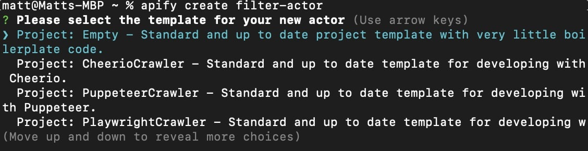
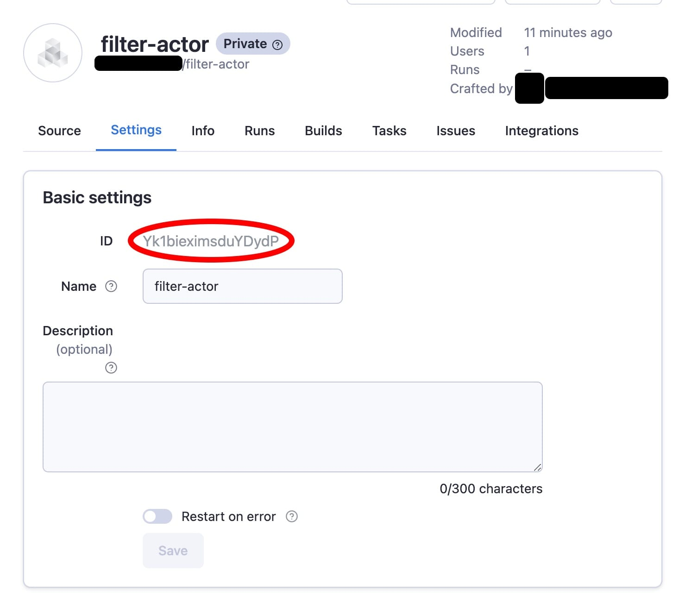
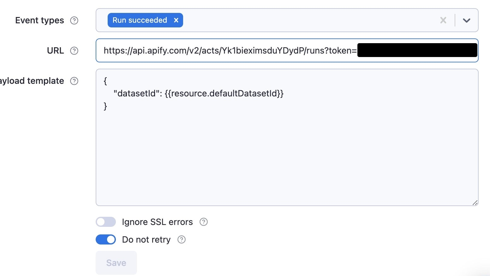
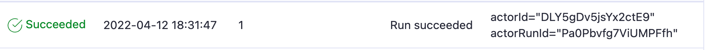
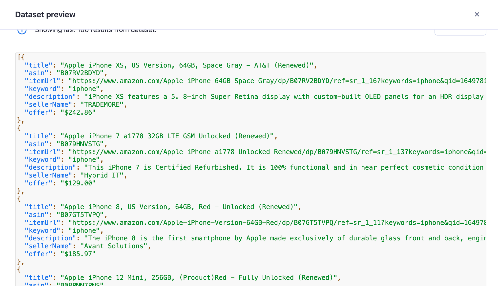

# Integrating webhooks {#integrating-webhooks}

**Learn how to integrate webhooks into your actors. Webhooks are a super powerful tool, and can be used to do almost anything!**

---

In this lesson we'll be writing a new actor and integrating it with our beloved Amazon scraping actor. First, we'll navigate to the same directory our **demo-actor** folder lives, and run `apify create filter-actor` _(once again, you can name the actor whatever you want, but for this lesson, we'll be calling the new actor **filter-actor**)_. When prompted for which type of boilerplate to start out with, select **Empty**.



Cool! Now, we're ready to get started.

## Building the new actor {#building-the-new-actor}

First of all, we should clear out any of the boilerplate code within **main.js** to get a clean slate:

```js
// main.js
import { Actor } from 'apify';

await Actor.init();

// ...

await Actor.exit();
```

We'll be passing the ID of the Amazon actor's default dataset along to the new actor, so we can expect that as an input:

```js
const { datasetId } = await Actor.getInput();
const dataset = await Actor.openDataset(datasetId);
// ...
```

Next, we'll grab hold of the dataset's items with the `dataset.getData()` function:

```js
const { items } = await dataset.getData();
```

There are a few different methods that can be used to achieve the goal output of this actor, but using the [`Array.reduce()`](https://developer.mozilla.org/en-US/docs/Web/JavaScript/Reference/Global_Objects/Array/reduce) is the most concise:

```js
const filtered = items.reduce((acc, curr) => {
    // Grab the price of the item matching our current
    // item's ASIN in the map. If it doesn't exist, set
    // "prevPrice" to null
    const prevPrice = acc?.[curr.asin] ? +acc[curr.asin].offer.slice(1) : null;

    // Grab the price of our current offer
    const price = +curr.offer.slice(1);

    // If the item doesn't yet exist in the map, add it.
    // Or, if the current offer's price is less than the
    // saved one, replace the saved one
    if (!acc[curr.asin] || prevPrice > price) acc[curr.asin] = curr;

    // Return the map
    return acc;
}, {});
```

The results should be an array, so finally, we can take the map we just created and push an array of all of its values to the actor's default dataset:

```js
await Actor.pushData(Object.values(filtered));
```

Our final code looks like this:

```js
import { Actor } from 'apify';

await Actor.init();

const { datasetId } = await Actor.getInput();
const dataset = await Actor.openDataset(datasetId);

const { items } = await dataset.getData();

const filtered = items.reduce((acc, curr) => {
    const prevPrice = acc?.[curr.asin] ? +acc[curr.asin].offer.slice(1) : null;
    const price = +curr.offer.slice(1);

    if (!acc[curr.asin] || prevPrice > price) acc[curr.asin] = curr;

    return acc;
}, {});

await Actor.pushData(Object.values(filtered));

await Actor.exit();
```

Cool! But **wait**, don't forget to configure the **INPUT_SCHEMA.json** file as well! It's not necessary to do this step, as we'll be calling the actor through Apify's API within a webhook, but it's still good to get into the habit of writing quality input schemas that describe the input values your actors are expecting.

```json
{
    "title": "Amazon Filter Actor",
    "type": "object",
    "schemaVersion": 1,
    "properties": {
        "datasetId": {
            "title": "Dataset ID",
            "type": "string",
            "description": "Enter the ID of the dataset.",
            "editor": "textfield"
        }
    },
    "required": ["datasetId"]
}
```

Now we're done, and we can push it up to the Apify platform with the `apify push` command.

## Setting up the webhook {#setting-up-the-webhook}

Since we'll be calling the actor via the [Apify API](/platform/tutorials/run-actor-and-retrieve-data-via-api#run-an-actor-or-task), we'll need to grab hold of the ID of the actor we just created and pushed to the platform. The ID is always accessible through the **Settings** page of the actor.



With this `actorId`, and our `token`, which is retrievable through **Settings > Integrations** on the Apify Console, we can construct a link which will call the actor:

```text
https://api.apify.com/v2/acts/Yk1bieximsduYDydP/runs?token=YOUR_TOKEN_HERE
```

We can also use our username and the name of the actor like this:

```text
https://api.apify.com/v2/acts/USERNAME~filter-actor/runs?token=YOUR_TOKEN_HERE
```

Whichever one you choose is totally up to preference.

Next, within the actor, we will click the **Integrations** tab and choose **Webhook**, then fill out the details to look like this:



We have chosen to run the webhook once the actor has succeeded, which means that its default dataset will surely be populated. Since the filtering actor is expecting the default dataset ID of the Amazon actor, we use the `resource` variable to grab hold of the `defaultDatasetId`.

Click **Save**, then run the Amazon **demo-actor** again.

## Making sure it worked {#checking-the-webhook}

If everything worked, then at the end of the **demo-actor**'s run, we should see this within the **Integrations** tab:



Additionally, we should be able to see that our **filter-actor** was run, and have access to its dataset:



## Quiz answers 📝 {#quiz-answers}

**Q: How do you allocate more CPU for an actor's run?**

**A:** On the platform, more memory can be allocated in the actor's input configuration, and the default allocated CPU can be changed in the actor's **Settings** tab. When running locally, you can used the **APIFY_MEMORY_MBYTES** environment variable to set allocated CPU. 4GB is equal to 1 CPU core on the Apify platform.

**Q: Within itself, can you get the exact time that an actor was started?**

**A:** Yes. The time the actor was started can be retrieved through the `startedAt` property from the `Actor.getEnv()` function, or directly from `process.env.APIFY_STARTED_AT`

**Q: What are the types of default storages connected to an actor's run?**

Every actor's run is given a default key-value store and a default dataset. The default key value store by default has the `INPUT` and `OUTPUT` keys. The actor's request queue is also stored.

**Q: Can you change the allocated memory of an actor while it's running?**

**A:** Not while it's running. You'd need to stop it and run a new one. However, there is an option to soft abort an actor, then resurrect then run with a different memory configuration.

**Q: How can you run an actor with Puppeteer on the Apify platform with headless mode set to `false`?**

**A:** This can be done by using the `actor-node-puppeteer-chrome` Docker image and making sure that `launchContext.launchOptions.headless` in `PuppeteerCrawlerOptions` is set to `false`.

## Wrap up {#wrap-up}

See that?! Integrating webhooks is a piece of cake on the Apify platform! You'll soon discover that the platform factors away a lot of complex things and allows you to focus on what's most important - developing and releasing actors.
