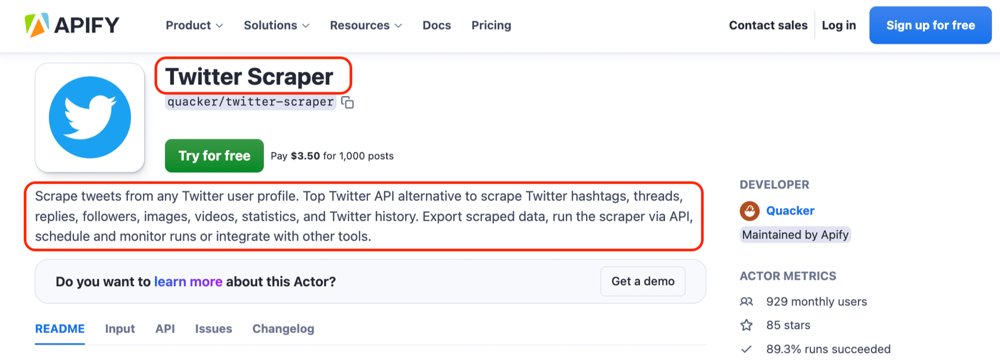
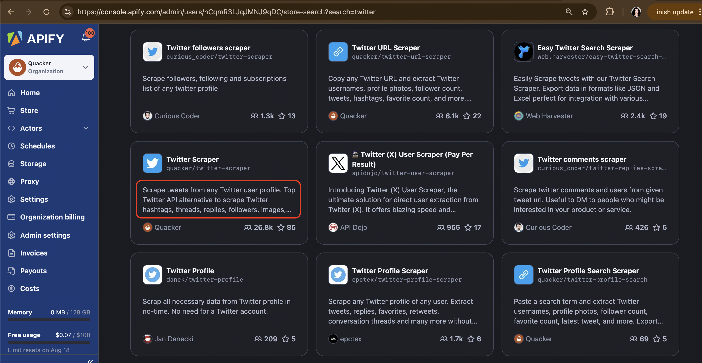
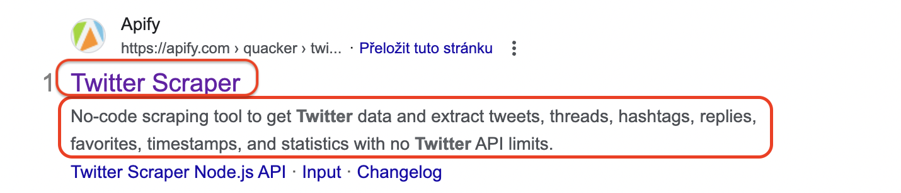
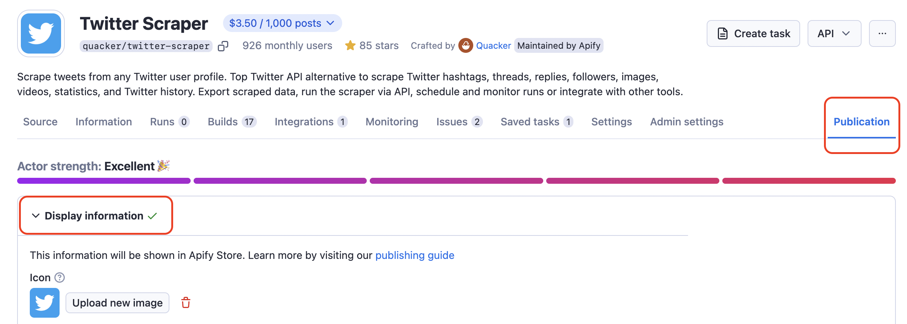
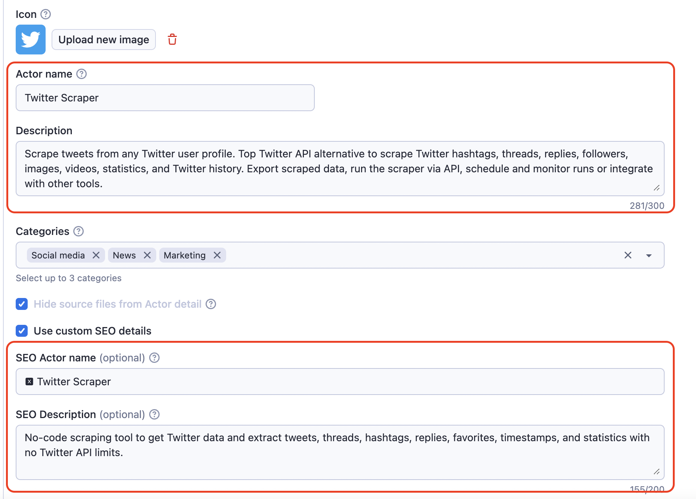
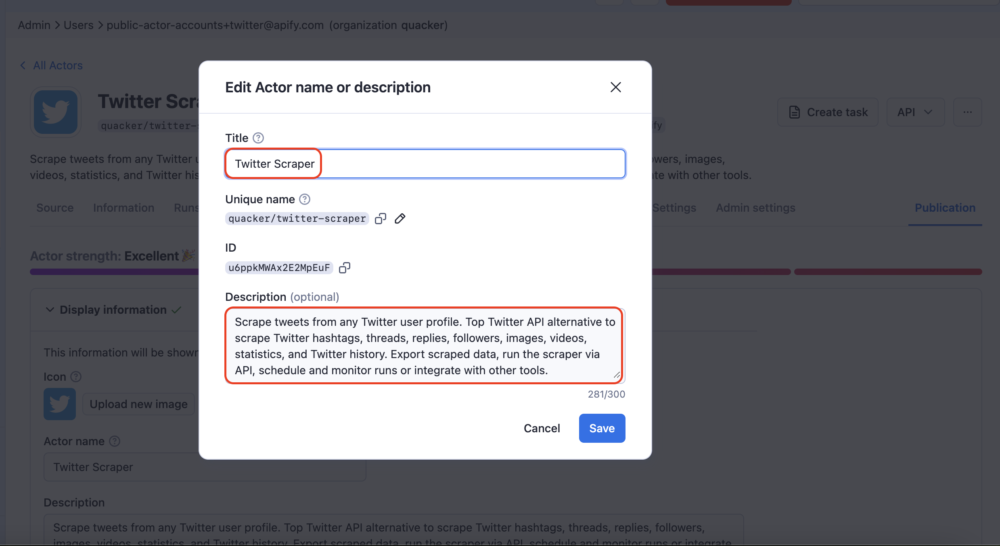

Learn about Actor description and meta description. Where to set them and best practices for both content and length.

---

## What is an Actor description

First impressions are important, especially when it comes to tools. Actor descriptions are the first connections the potential users have with your Actor. You can set two kinds of descriptions: _regular description_ (in Apify Store) and _SEO description_ (on Google search), along with their respective names: regular name and SEO name.

:::tip

You can change descriptions and names as many times as you want.

:::

## Regular description vs. SEO description

|  | Actor description & name | SEO description & name |
|---|---|---|
| Name lenght | 40-50 characters | 40-50 characters |
| Description lenght | 300 characters | 145-155 characters |
| Visibility  | Visible in the Store | Visible on Google |

### Description & Actor name

Actor description is what users see on the Actor's web page in Apify Store, along with the Actor's name and URL. When creating an Actor description, a “warm” visitor experience is prioritized (more on that later).

Actor description is also present in Apify Console and across Apify Store.

### SEO description & SEO name

Actor SEO description is a tool description visible on Google. It is shorter and SEO-optimized (keywords matter here). When creating the SEO description, a “cold” visitor experience is prioritized.

Usually the way the potential user interacts with both these descriptions goes like this: SEO first, regular description second. Is there any benefit in them being different?

### Is there any benefit in description and meta description being different

Different descriptions give you a chance to target different stages of user acquisition. And make sure the acquisition takes place.

_SEO description (and SEO name)_ is targeting a “cold” potential user who knows nothing about your tool yet and just came across it on Google search. They’re searching to solve a problem or use case. The goal of the meta description is to convince that visitor to click on your tool's page among other similar search results on Google. While it's shorter, SEO description is also the space to SEO-optimize your language to the max to attract the most matching search intent.

_Description (and name)_ is targeting a “warm” potential user who is already curious about your tool. They have clicked on the tool's page and have a few seconds to understand how complex the tool is and what it can do for them. Here you can forget SEO optimization and speak directly to the user. The regular description also has a longer character limit, which means you can expand on your Actor’s features.

Learn more about search intent here: [SEO](/academy/get-most-of-actors/promote-your-actor/seo)

## Where can Actor descriptions be set

Both descriptions can be found and edited on the very right **Publication tab →  Display information.** It has to be done separately for each Actor.

:::note

Setting the SEO description and SEO name is optional. If not set, the description will just be duplicated.

:::

Actor description specifically can also be quick-edited in this pop-up on the Actor's page in Apify Console.  Open the **Actor's page**, then click on **…** in the top right corner, and choose ✎ **Edit name or description**. Then set the URL in the **Unique name** ✎ field and click **Save**.

## Tips and recommendations on how to write descriptions

When writing a description, less is more. You only have a few seconds to capture attention and communicate what your Actor can do. To make the most of that time, follow these guidelines used by Apify (these apply to both types of descriptions):

### Use variations and experiment 🔄

- _SEO name vs. regular name_:
  - name: Airbnb Scraper
  - SEO name: Airbnb Data Scraper
- _Keywords on the web page_: 
Include variations, e.g. Airbnb API, Airbnb data, Airbnb data scraper, Airbnb rentals, Airbnb listings
  - No-code scraping tool to extract Airbnb data: host info, prices, dates, location, and reviews.
  - Scrape Airbnb listings without official Airbnb API!
- _Scraping/automation process variations_: 
Use terms, e.g. crawl, crawler, scraping tool, finder, scraper, data extraction tool, extract data, get data
  - Scrape XYZ data, scraped data, data scraper, data crawler.

### Choose how to start your sentences 📝

- _Noun-first (descriptive)_:
  - Data extraction tool to extract Airbnb data: host info, prices, dates, location, and reviews.
- _Imperative-first (motivating)_:
  - Try a free web scraping tool to extract Airbnb data: host info, prices, dates, location, and reviews.

### Keep it short and SEO-focused ✂️

- _Be concise and direct_: clearly state what your Actor does. Avoid unnecessary fluff and boilerplate text.
  - ✅ Scrapes job listings from Indeed and gathers...
  - ❌ *This Actor scrapes job listings from Indeed in order to gather...
- _Optimize for search engines_: include popular keywords related to your Actor’s functionality that users might search for.
  - ✅ This Indeed scraper helps you collect job data efficiently. Use the tool to gather...
  - ❌ This tool will search through job listings on Indeed and offers you...

### List the data your Actor works with 📝

- Data extraction tool to extract Airbnb data: host info, prices, dates, location, and reviews.
- Get hashtags, usernames, mentions, URLs, comments, images, likes, locations without the official Instagram API.

### Use keywords or the language of the target website 🗣️

- Extract data from hundreds of Airbnb home rentals in seconds.
- Extract data from chosen tik-toks. Just add a TikTok URL and get TikTok video and profile data: URLs, numbers of shares, followers, hashtags, hearts, video, and music metadata.
- Scrape Booking with this hotels scraper and get data about accommodation on Booking.com.

### Highlight your strong suits 🌟

- Ease of use, no coding, user-friendly:
  - Easy scraping tool to extract Airbnb data.
- Fast and scalable:
  - Scrape whole cities or extract data from hundreds of Airbnb rentals in seconds.
- Free (only if the trial run can cover $5 free credits):
  - Try a free scraping tool to extract Airbnb data: host info, prices, dates, location, and reviews.
  - Extract host information, locations, availability, stars, reviews, images, and host/guest details for free.
- Available platform features (various formats, API, integrations, scheduling):
  - Export scraped data in formats like HTML, JSON, and Excel.
- Additional tips:
  - Avoid ending lists with etc.
  - Consider adding relevant emojis for visual appeal.

### Break it down 🔠

Descriptions typically fit into 2-3 sentences. Don't try to jam everything into one.

Examples:

1. Scrape whole cities or extract data from hundreds of Airbnb rentals in seconds.
1. Extract host information, addresses, locations, prices, availability, stars, reviews, images, and host/guest details.
1. Export scraped data, run the scraper via API, schedule and monitor runs, or integrate with other tools.

## FAQ
<!-- markdownlint-disable MD001 -->
#### Can the Actor's meta description and description be the same

Yes, they can, as long as they have the same (shorter) length (under 150 characters). But they can also be different, there's no harm in that.

#### How different can description and meta description be

They can be vastly different and target different angles of your Actor. You can experiment by setting up different SEO descriptions for a period of time and seeing if the click-through rate rises.

#### I set a custom SEO description but Google doesn't show it

Sometimes Google picks up a part of the README as the SEO description. It's heavily dependent on the search query. Sometimes what you see on Google might look differently compared to how you set the SEO description. It's all a part of how Google customizes search results.
