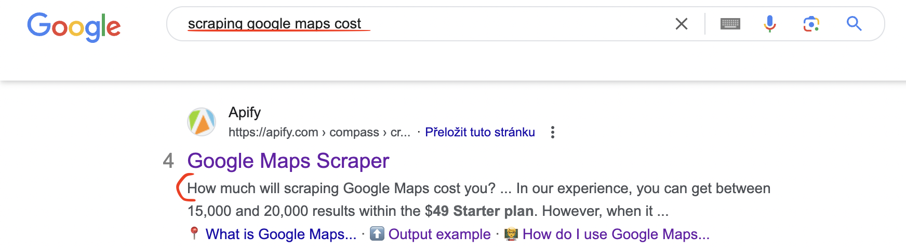

**Learn how to write a comprehensive README to help users better navigate, understand and run public Actors in Apify Store.**

---

## What's a README in the Apify sense?

At Apify, when we talk about a README, we don’t mean a guide mainly aimed at developers that explains what a project is, how to set it up, or how to contribute to it. At least, not in its traditional sense.

You could argue our notion of README is closer to this [one described on GitHub](https://docs.github.com/en/repositories/managing-your-repositorys-settings-and-features/customizing-your-repository/about-readmes):

README files typically include information on:

- What the project does
- Why the project is useful
- How users can get started with the project
- Where users can get help with your project

We mean all of this and even more. At Apify, when we talk about READMEs, we refer to the public Actor detail page on Apify Store. Specifically, its first tab. The README exists in the same form both on the web and in Console. So what is it for?

Before we dive in, a little disclaimer: you don't need your Apify README to fulfill all its purposes. Technically, you could even publish an Actor with just a single word in the README. But you'd be missing out if you did that.

Your Actor’s README has at least four functions:

1. _SEO_ - If your README is well-structured and includes important keywords — both in headings and across the text — it has a high chance of being noticed and promoted by Google. Organic search brings the most motivated type of potential users. If you win this game, you've won most of the SEO game.
2. _First impression_ - Your README is one of the first points of contact with a potential user. If you come across as convincing, clear, and reassuring it could be the factor that will make a user try your Actor for their task.
3. _Extended instruction_ - The README is also the space that explains specific complex input settings. For example, special formatting of the input, any coding-related, or extended functions. Of course, you could put that all in a blog post as well, but the README should be their first point of contact.
4. _Support_ - Your users come back to the README when they face issues. So use it as a space to let them know that's where they can find links to the tutorials if they run into issues, describe common troubleshooting techniques, share tricks, or warn you about bugs.

## README elements theory

These are the most important elements of the README. This structure is also not to be followed to a “t”. Of course, what you want to say to your potential users and how you want to promote your Actor will differ case by case. These are just the most common practices we have for our Actor READMEs. Beware that the headings are written with SEO in mind, which is why you see certain keywords repeated over and over.

Aim for sections 1–6 below and try to include at least 300 words. You can move the sections around to some extent if it makes sense, e.g. 3 might come after 6. Consider using emojis as bullet points or otherwise trying to break up the text.

### Intro and features

What is [Actor]?

- explain in two or three sentences what the Actor does and the easiest way to try it. Mention briefly what kind of data it can extract and any other tangible goal the tool can achieve. Describe the input in one sentence. Highlight the most important words in bold.

What can this [Actor] do?

- list the main features of this tool. list multiple ways of input if applicable. list platform advantages. If it's a bundle, mention the steps that the Actor will do for you, mention specific obstacles this tool is able to overcome, say upfront how many results you can get for free.

:::tip Remember the Apify platform!

Your Actor + the Apify platform. They come as a package. Don't forget to flaunt all the advantages that the platform gives to your solution.

:::

Imagine if there was a solution that is identical to yours but without the platform advantages such as monitoring, access to API, scheduling, possibility of integrations, proxy rotation. Now, if that tool suddenly gained all those advantages it would surely make a selling point out of it. This is how you should be thinking about your tool — as a solution boosted by the Apify platform. Don't ever forget that advantage.

What data can [Actor] extract?

What data can you extract from [target website]

- Create a table that represents the main datapoints that the Actor can extract. You don't have to list every single one, just list the most understandable and relatable ones.

Depending on the complexity of your Actor, you might include one or all three of these sections. It will also depend on what your Actor does. If your Actor has simple input but does a lot of steps for the user under the hood (like a bundle would), you might like to include the "What can this Actor do?" section. If your Actor extracts data, it makes sense to include a section with a table.

### Tutorial section

This could be a simple listed step-by-step section or a paragraph with a link to a tutorial on a blog.

A step-by-step section is reassuring for the user, and it can be a section optimized for Google.

How do I use [Actor] to scrape website data?

### Pricing

How much will it cost to scrape [target site]?

How much will scraping [target site] cost?

Is scraping [target site] free?

How much does it cost to extract [target site] data?

Web scraping can be very unpredictable because there are a lot of elements involved in order for the process to be successful: the complexity of the website, proxies, cookies, etc. This is why it's important to set the pricing and scraping volume expectations for your users.

You might think the part above the Actor detail page already indicates pricing. But this paragraph can still be useful. First of all, cost-related questions can show up in Google, if they are SEO optimized. Second, you can use this space to inform and reassure the user about the pricing, give more details about it, or entice them with the promise of very scalable scraping.

- If it's a consumption pricing model (only consumed CUs), you can use this space to set expectations and explain what it means to pay for Compute Units. Similarly, if it's a rental Actor, you can also use this paragraph to set expectations. Talk about the average amount of data that can be scraped per given price. Make it easy for users to imagine how much they will pay for a given dataset. This will also make it easier for them to compare your solution with others on the market price-wise and value-wise.
- If it's price per result, you can extrapolate how many results a user can get on a free plan and also entice them with a larger plan and how many thousands of results they can get with that.
- If it's a bundle that consists of a couple of Actors that are priced differently, you can use this section to talk about the difference between all the Actors involved and how that will affect the final price of a run.

In any case, on top of setting expectations and reassuring users, this paragraph can get into Google. If somebody is Googling "How much does it cost to scrape [website]", they might come across this part of your README and it will lead them from Google search directly to your Actor's detail page. So you don't want to miss that opportunity.

### Input and output examples

This is what people click on the most in the table of contents of the README. After they are done scrolling through the first part of the README, users are interested in how difficult the input it, what it looks like, and what kind of information they can expect.

**Input**: often a screenshot of the input schema. This is also a way for people to see the platform even before they create an account.

**Output**: can be shown as a screenshot if your output schema looks like something you would want to promote to users. You can also just include a JSON example containing a few objects. Even better if there's continuity between the input example and output example.

If your datasets come out too complex and you want to save your users some scrolling, you can also show multiple output examples: one for reviews, one for contact details, one for ads, etc.

### Other Actors

Don't forget to promote your other Actors. While our system for Actor recommendation works - you can see related Actors at the bottom of the README — it only works within the same category or similar name. It won't recommend a completely different Actor from the same creator. So make sure to interconnect your work by taking the initiative yourself. You can mention your other Actors in a list or as a table.

### FAQ, disclaimers, and support

The FAQ is a section where you can keep all the secondary questions that might still come up.

Here are just a few things we usually push to the FAQ section.

- disclaimers and legality
- comparison table between your Actor and similar solutions
- information about the official API and how the scraper is a stand-in for it (SEO)
- questions brought up by the users
- tips on how best to use the Actor
- troubleshooting and mentioning known bugs
- mentioning the Issues tab and highlighting that you're open for feedback and collecting feedback
- mentioning being open to creating a custom solution based on the current one and showing a way to contact you
- interlinking
- mentioning the possibility of transferring data using an API — API tab
- possibility for integrations
- use cases for the data scraped, success stories exemplifying the use of data

## Format of the README

### Markdown

The README has to be written in Markdown. The most important elements are H2 and H3 headings, links to pages, links to images, and tables. For specific formatting, you can try using basic HTML. That will also work. CSS won’t.

### HTML use

You can use HTML and Markdown interchangeably. For example, you can write the same table either way.

### Tone of the README

Apify Store has many Actors in its stock, and it's only growing. The advantage of an Actor is that an Actor can be anything, as versatile or complex as possible. From a single URL type of input to complex features that give customized control over the input parameters to the user. There are Actors that are intended for users who aren't familiar with coding and don't have any experience with it. Ideally, the README should reflect the level of skill one should need to use the Actor.

The tone of the README should make it immediately obvious who the tool is aimed at. If your tool's input includes glob patterns or looking for selectors, it should be immediately visible from the README. Before the user even tries the tool. Trying to simplify this information using simple words with ChatGPT can be misleading to the user. You will attract the wrong audience, and they will end up churning or asking you too many questions.

And vice versa. If your target audience is people with little to no coding skills, who just prefer point-and-click solutions, this should be visible from the README. Speak in regular terms, avoid code blocks or complex information at the beginning unless it's absolutely necessary. This means that, when people land on your Actor detail page, they will have their expectations set from the get-go.

### Length of a README

When working on improving a README, we regularly look at heatmaps that show us where our website visitors spend most of their time. From our experience, most first-time visitors don't scroll past the first 25% of a README. That means that the first quarter of the README is where you want to focus the most of your attention if you're trying to persuade the page visitor to try your Actor.

From the point of view of acquisition, the first few sections should make it immediately obvious what the tool is about, how hard it is to use, and who it is created for. This is why, in Apify's READMEs, you can see our first few paragraphs are built in such a way as to explain these things and reassure the visitors that anyone can use these tools.

From the point of view of retention, it doesn't mean you can't have long or complex READMEs or not care for the information beyond the 25% mark. Since the README is also intended to be used as a backup when something goes wrong or the user needs more guidance, your users will come back to it multiple times.

### Images and videos

As for using screenshots and GIFs, put them in some sort of image hosting. Your own GitHub repository would be best because you have full control over it. Name the images with SEO in mind and try to keep them compressed but good enough quality. You don't want to load an image or GIF for too long.

One trick is not only to add images but also to make them clickable. For some reason, people like clicking on images, at least they try to when we look at the heatmaps. You can lead the screenshot clicks towards a signup page, which is possible with Markdown.

If your screenshot seems too big or occupies too much space, smaller size images are possible by using HTML.

To embed a YouTube video, all you have to do is include its URL. No further formatting is needed, the thumbnail will render itself on the README page.

:::tip Try Carbon for code

If you want to add snippets of code anywhere in your README, you can use [Carbon](https://github.com/carbon-app/carbon).

:::

If you need quick Markdown guidance, check out [https://www.markdownguide.org/cheat-sheet/](https://www.markdownguide.org/cheat-sheet/)

## README and SEO

Your README is your landing page.

If there were only one thing to remember about READMEs on Apify Store, it would be this. A README on Apify Store is not just dry instructions on how to use your Actor. It has much more potential than that.

In the eyes of Google, your Actor's detail page, aka README, is a full-fledged landing page containing all the most important information to be found and understood by users.

Of course, that all only counts if your README is both well formatted and contains keywords. We'll talk about that part later on.

What makes a good README?

A good README has to be a balance between what you want your page visitors to know, your users to turn to when they run into trouble, and Google to register when it's indexing pages and considering which one deserves to be put up higher.

### Table of contents

The H1 of your page is the Actor name, so you don't have to set that up. Don't add more H1s. README headings should be H2 or H3. H2 headings will make up the table of contents on the right. So if you don't want the table to be too crowded, keep the H2s to the basics and push all the longer phrases and questions to H3s. H3s will stay hidden in the accordion in the default state until the visitor hovers their cursor over it. H4 readings can also be included, of course, but they won't show up as a part of the table of contents.

### Keyword opportunities

Do SEO research for keywords and see how they can fit organically into the text. Priority for H2s and H3s, then the regular text. Add new keyword-heavy paragraphs if you see an opportunity.

The easiest sections to include keywords in are, for example:

- API, as in Instagram API
- data, as in extract Instagram data
- Python, as in extract data in Python
- scrape, as in how to scrape X
- scraping, as in scraping X

Now, could every H2 just say exactly what it is about, without SEO? Of course. You don't have to optimize your H2s and H3s, and are free to call them simply Features, How it works, Pricing, Support, etc. or not even to have many H2s at all and keep it all as one page.

However, the H2s and H3s are what sometimes get into the Google Search results. If you're familiar with the People Also Ask section, that's the best place to match your H2s. They can also get highlighted in the Sitelinks of Google Search Results.

Any part of your README can make it onto Google pages. The intro sentence describing what your Actor is about, a video, a random question. Each one can become a good candidate for those prime Google pages. That's why it's important to structure and write your README with SEO in mind.

### Importance of including a video

If your page has a video, it has a better chance of ranking higher in Google.

## README and input schema

The README should serve as a fallback for your users if something isn't immediately obvious in the input schema. There's also only that much space in the input schema and the tooltips, so naturally, if you want to provide more details about something: input, formatting, expectations — you should put it in the README and refer to it from the relevant place in the input schema.

Learn about [How to create a great input schema](/academy/get-most-of-actors/product-optimization/how-to-create-a-great-input-schema)

## [Readme elements template](https://docs.apify.com/academy/get-most-of-actors/actor-readme#what-should-you-add-to-your-actor-readme)

1. What does (Actor name) do?
    - in 1–2 sentences describe what the Actor does and what it does not do
    - consider adding keywords like API, e.g. Instagram API
    - always have a link to the target website in this section
2. Why use (Actor name)? or Why scrape (target site)?
    - How it can be beneficial for the user
    - Business use cases
    - Link to a success story, a business use case, or a blog post.
3. How to scrape (target site)
   - Link to "How to…" blogs, if one exists (or suggest one if it doesn't)
   - Add a video tutorial or GIF from an ideal Actor run.

:::tip Embedding YouTube videos

For better user experience, Apify Console automatically renders every YouTube URL as an embedded video player. Simply add a separate line with the URL of your YouTube video.

:::

- Consider adding a short numbered tutorial, as Google will sometimes pick these up as rich snippets. Remember that this might be in search results, so you can repeat the name of the Actor and give a link, e.g.

1. Is it legal to scrape (target site)?
    - This can be used as a boilerplate text for the legal section, but you should use your own judgment and also customize it with the site name.

    > Our scrapers are ethical and do not extract any private user data, such as email addresses, gender, or location. They only extract what the user has chosen to share publicly. We therefore believe that our scrapers, when used for ethical purposes by Apify users, are safe. However, you should be aware that your results could contain personal data. Personal data is protected by the GDPR in the European Union and by other regulations around the world. You should not scrape personal data unless you have a legitimate reason to do so. If you're unsure whether your reason is legitimate, consult your lawyers. You can also read our blog post on the legality of web scraping
    >
2. Input
    - Each Actor detail page has an input tab, so you just need to refer to that. If you like, you can add a screenshot showing the user what the input fields will look like.
    - This is an example of how to refer to the input tab:

    > Twitter Scraper has the following input options. Click on the input tab for more information.
    >
3. Output
    - Mention "You can download the dataset extracted by (Actor name) in various formats such as JSON, HTML, CSV, or Excel.”
    - Add a simplified JSON dataset example, like here https://apify.com/compass/crawler-google-places#output-example
4. Tips or Advanced options section
    - Share any tips on how to best run the Actor, such as how to limit compute unit usage, get more accurate results, or improve speed.

If you want some general tips on how to make a GitHub README that stands out, check out these guides. Not everything in there will be suitable for an Apify Actor README, so you should cherry-pick what you like and use your imagination.

## Resources

[Build a Stunning README For Your GitHub Profile](https://towardsdatascience.com/build-a-stunning-readme-for-your-github-profile-9b80434fe5d7)

[How to Create a Beautiful README for Your GitHub Profile](https://yushi95.medium.com/how-to-create-a-beautiful-readme-for-your-github-profile-36957caa711c)
