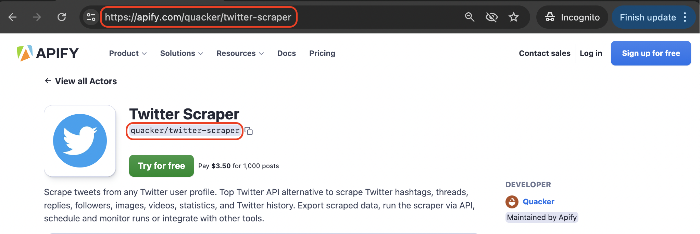
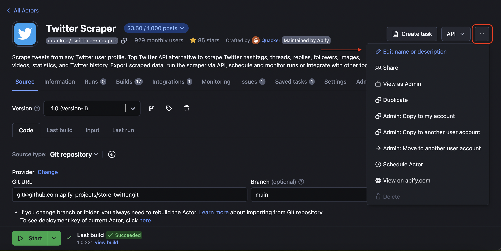
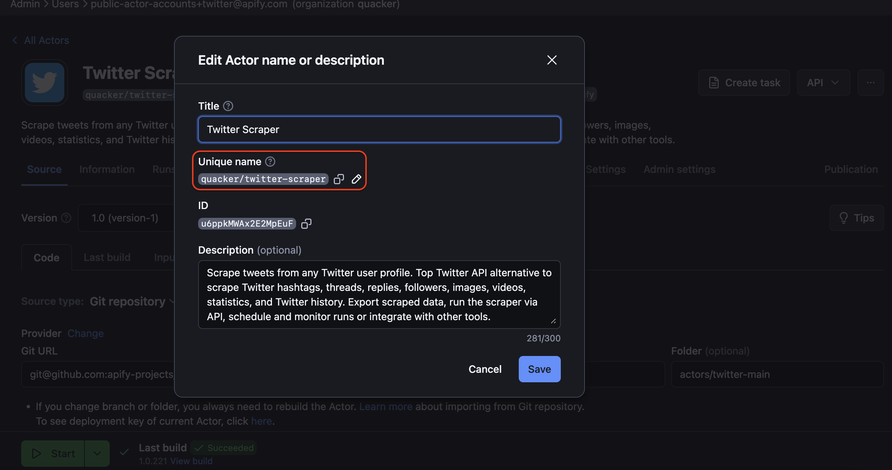

**Actor URL (or technical name, as we call it), is the page URL of the Actor shown on the web. When you're creating an Actor, you can set the URL yourself along with the Actor name. Here are best practices on how to do it well.**

---

## Why is Actor URL so important?

The Actor URL plays a crucial role in SEO. Google doesn't just read the Actor's name or README; it also analyzes the URL. The _URL is one of the first signals to Google about the content of your page_- whether it's a product listing, a tool, a blog post, a landing page for a specific offering, or something else entirely. Therefore, it's important to know how to use this shorthand to your advantage and clearly communicate to Google what your page offers.

:::tip Choose the URL carefully

This part of the manual is only applicable to new Actors. _Once set, existing Actor URLs shouldn't change_.

:::

## How to choose a URL

The right naming can propel or hinder the success of the Actor on Google Search. Just as naming your Actor is important, so is choosing its URL. The only difference is, once set, the URL is intended to be permanent (more on this [later](/academy/actor-marketing-playbook/actor-basics/importance-of-actor-url)). What's the formula for the best Actor URL?

### Brainstorming

What does your Actor do? Does it scrape, find, extract, automate, connect? Think of these when you are looking for a name. You might already have a code name in mind, but it’s essential to ensure it stands out and is distinct from similar names—both on Google and on Apify Store.

### Matching URL and name

The easiest way is to make sure the Actor name and the technical name match. As in TikTok Scraper (tiktok-scraper) or Facebook Data Extractor (facebook-data-extractor). But they can also be different.

### SEO

The name should reflect not only what Actor does (or what website it targets), but also what words people use when they search for it. This is why it's also important to do SEO research to see which keywords work best for the topic. Ideally, the URL should include a keyword that has low complexity (low competition) but high traffic (high demand).

Learn more about SEO research and the best tools for it here: [SEO](/academy/actor-marketing-playbook/promote-your-actor/seo)

### Inspiration in Apify Store

Explore Store URLs of similar Actors. But avoid naming your Actor too similarly to what already exists, because of these two reasons:

1. There’s evidence that new URLs that are similar to existing ones can have drastically different levels of success. The first URL might thrive while a similar one published later struggles to gain traction. For example, _onedev/pentagon-scraper_ was published first and has almost 100x traction than _justanotherdev/pentagon-scraper_. It will be very hard for the latter to beat the former. The reason for this is that Google operates on a "first come, first served” basis, and once it's set, it is very hard to make Google change its ways and make it pay attention to new pages with a similar name.
2. As Apify Store is growing, it's important to differentiate yourself from the competition. A different URL is just one more way to do that. If a person is doing research on Store, they will be less likely to get confused between two tools with the same name.

### Length of URL

Ideally, keep it under four words. As in, _Facebook Data Extractor_ (_facebook-data-extractor_), not (_facebook-data-meta-online-extractor-light_). If the name is long and you're trying to match it with your URL, keep only the most essential words for the URL.

### Variations

It can be a long-tail keyword with the tool type in it: scraper, finder, extractor. But you can also consider keywords that include terms like API, data, and even variations of the website name. Check out what keywords competitors outside of Apify Store are using for similar tools.

### Nouns and adjectives

One last tip on this topic is to _avoid adjectives and verbs_. Your page is about a tool, so keep it to nouns. Anything regarding what the tool does (scrape, automate, import) and what it's like (fast, light, best) can be expressed in the Actor's name, not the Actor's URL. Adding an adjective or verb like that either does nothing for SEO and might even damage the SEO chances of the page.

## Why you shouldn’t change your Actor URL

:::tip Don't change the URL

There's only one rule about Actor URL: don't change the URL. The Actor's name, however, can be changed without any problems.

:::

Once set, the page URL should not be changed. Because of those two important reasons:

- Google dislikes changes to URLs. Once your Actor has built up keyword associations and familiarity with Google, regaining that standing after a URL change can be challenging. You will have to start from scratch.
- Current integrations will break for your Actor's users. This is essential for maintaining functionality.

If you absolutely have to change the URL, you will have to communicate that fact to your users.

💡 Learn more about the easiest ways to communicate with your users: [Emails to Actor users]

## How and where to set the Actor URL

In Console. Open the **Actor's page**, then click on **…** in the top right corner, and choose ✎ **Edit name or description**. Then set the URL in the **Unique name** ✎ field and click **Save**.

## FAQ
<!-- markdownlint-disable MD001 -->
#### Can Actor URL be different from Actor name?

Yes. While they can be the same, they don’t have to be. For the best user experience, keeping them identical is recommended, but you can experiment with the Actor's name. Just avoid changing the Actor URL.

#### Can I change a very fresh Actor URL?

Yes, but act quickly. It takes Google a few days to start recognizing your page. For this reason, if you really have to, _it is best to change the Actor's name in the first few days_, before you build a steady user base and rapport with Google.

#### How long does it take Google to pick up on the new URL?

Google reindexes Apify web pages almost every day. It might take anywhere from 3-7 days for it to pick up a new URL. Or it might happen within a day.

#### Can I use the identical technical name as this other Actor?

Yes, you can. But it will most likely lower your chances of being noticed by Google.

#### Does changing my Apify account name affect the Actor URL?

Yes. If you're changing from _justanotherdev/pentagon-scraper_ to _dev/pentagon-scraper_, it counts as a new page. Essentially, the consequences are the same as after changing the technical name of the Actor.

