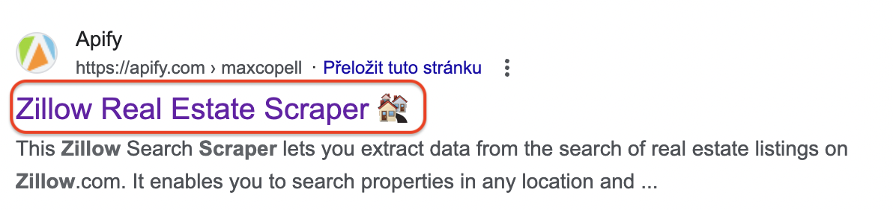

**Apify's standards for Actor naming. Learn how to choose the right name for scraping and automation Actors and how to optimize your Actor for search engines.**

---

Naming your Actor can be tricky, especially after you’ve worked hard on it. To help people find your Actor and make it stand out, we’ve set some naming guidelines. These will help your Actor rank better on Google and keep things consistent on [Apify Store](https://apify.com/store).

Ideally, you should choose a name that clearly shows what your Actor does and includes keywords people might use to search for it.

## Parts of Actor naming

Your Actor's name consists of four parts: actual name, SEO name, URL, and GitHub repository name.

- Actor name (name shown in Apify Store), e.g. _Booking Scraper_.
  - Actor SEO name (name shown on Google Search, optional), e.g. _Booking.com Hotel Data Scraper_.
  - If the SEO name is not set, the Actor name will be the default name shown on Google.
- Actor URL (technical name), e.g. _booking-scraper_.
  - More on it on [Importance of Actor URL](/academy/get-most-of-actors/actor-basics/importance-of-actor-url) page.
- GitHub repository name (best to keep it similar to the other ones, for convenience), e.g. _actor-booking-scraper_.

## Actor name

The Actor name provides a human-readable name. The name is the most important real estate from an SEO standpoint. It should exactly match the most likely search query that potential users of your Actor will use. At the same time, it should give your Actor a clear name for people who will use it every day.

:::tip

Your Actor's name should be _40-50 characters_ long. You can change your Actor name freely in Apify Console.

:::

### Actor name vs. SEO name

There's an option to step away from your Actor's name for the sake of search engine optimization — the Actor SEO name. The Actor name and Actor SEO name serve different purposes:

- _Actor name_: this is the name visible in Apify Store and Console. It should be easy for users to understand and quickly show what your Actor does. It’s about attracting users who browse the Store.

    

- _Actor SEO name_: this is the name that appears in search engine results. It should include keywords people might search for to find your Actor. It’s about improving visibility on search engines and encouraging users to click on your link.

    

For example:

- _Actor name_: YouTube Scraper
- _Actor SEO name_: YouTube data extraction tool for video analysis

Here, the SEO name uses extra keywords to help people find it through search engines, while the Actor name is simpler and easier for users to understand and find on Apify Store.

💡 When creating the SEO name, focus on using relevant keywords that potential users might search for. It should still match what your Actor does. More about SEO name and description: [Actor description and SEO description]

### Actor name vs. technical name

The Actor name and technical name (or URL) have different uses:

- _Actor name_: this is the name users see on Apify Store and Console. It’s designed to be user-friendly and should make the Actor's purpose clear to anyone browsing or searching for it.
- _Technical name_: this is a simplified, URL-friendly version used in technical contexts like API calls and scripts. This name should be concise and easily readable. Once set, it should not be changed as it can affect existing integrations and cause broken links.

For example:

- _Actor name_: Google Search Scraper
- _Technical name_: google-search-scraper

The Actor name is user-friendly and descriptive, while the technical name is a clean, URL-compatible version. Note that the technical name does not include spaces or special characters to ensure it functions properly in technical contexts.

:::important

This is important for SEO! Once set, the technical name should not be changed. Make sure you finalize this name early in development. More on why here: [Importance of Actor URL]

:::

## Best practices for naming

### Brainstorming

What does your Actor do? Does it scrape, find, extract, automate, connect, or upload? When choosing a name, ensure it stands out and is distinct from similar names both on Google and on Apify Store.

- _Use nouns and variations_: use nouns like "scraper", "extractor", “downloader”, “checker”, or "API" to describe what your Actor does. You can also include terms like API, data, or variations of the website name.
- _Include key features_: mention unique features or benefits to highlight what sets your Actor apart.
- _Check for uniqueness_: ensure your name isn’t too similar to existing Actors to avoid confusion and help with SEO.

### Match name and URL

The simplest approach is to make all names match. For example, TikTok Ads Scraper (tiktok-ads-scraper) or Facebook Data Extractor (facebook-data-extractor). However, variations are acceptable.

### Name length

Keep the name concise, ideally less than four words. For instance, Facebook Data Extractor is preferable to Facebook Meta Data Extractor Light.

### Check Apify Store for inspiration

Look at the names of similar Actors on Apify Store, but avoid naming your Actor too similarly. By choosing a unique name, you can stand out from the competition. This will also reduce confusion and help users easily distinguish your Actor.

### Keep SEO in mind

Even though you can set a different variation for SEO name specifically, consider doing a bit of research when setting the regular name as well. The name should reflect what the Actor does and the keywords people use when searching for it. If the keywords you find sound too robotic, save them for the SEO name. But if they sound like something you'd search for, it's a good candidate for a name.

You can also check the keywords competitors use for similar tools outside Apify Store.

### Occasionally experiment

You can test and refine your SEO assumptions by occasionally changing the SEO name. This allows you to track how changes to names affect search rankings and user engagement. Changing the regular name is not forbidden but still less desirable since it can confuse your existing users and also affect SEO.

## Naming examples

### Scraping Actors

✅:

- Technical name (Actor's name in the [Apify Console](https://console.apify.com/)): `${domain}-scraper`, e.g. youtube-scraper.
- Actor name: `${Domain} Scraper`, e.g. YouTube Scraper.
- Name of the GitHub repository: `actor-${domain}-scraper`, e.g. actor-youtube-scraper.

❌:

- Technical name: `the-scraper-of-${domain}`, e.g. the-scraper-of-youtube.
- Actor name: `The Scraper of ${Domain}`, e.g. The Scraper of YouTube.
- GitHub repository: `actor-the-scraper-of-${domain}`, e.g. actor-the-scraper-of-youtube.

If your Actor only caters to a specific service on a domain (and you don't plan on extending it), add the service to the Actor's name.

For example,

- Technical name: `${domain}-${service}-scraper`, e.g. google-search-scraper.
- Actor name: `${Domain} ${Service} Scraper`, e.g. [Google Search Scraper](https://apify.com/apify/google-search-scraper).
- GitHub repository: `actor-${domain}-${service}-scraper`, e.g. actor-google-search-scraper.

### Non-scraping Actors

Naming for non-scraping Actors is more liberal. Being creative and considering SEO and user experience are good places to start. Think about what your users will type into a search engine when looking for your Actor. What is your Actor's function?

Below are examples for the [Google Sheets](https://apify.com/lukaskrivka/google-sheets) Actor.

✅:

- Technical name: google-sheets.
- Actor name: Google Sheets Import & Export.
- GitHub repository: actor-google-sheets.

❌:

- Technical name: import-to-and-export-from-google-sheets.
- Actor name: Actor for Importing to and Exporting from Google Sheets.
- GitHub repository: actor-for-import-and-export-google-sheets.

:::warning Renaming your Actor

You may rename your Actor freely, except when it comes to the Actor URL. Remember to read [Importance of Actor URL](/academy/get-most-of-actors/actor-basics/importance-of-actor-url) to find out why!

:::
