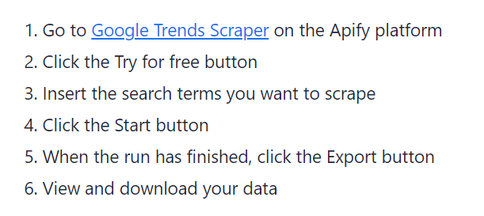

---


## Why README is important

Writing a comprehensive README is crucial for helping users understand, navigate, and run your public Actors on the Apify Store. This guide provides a structured template and best practices to ensure your README is informative, and developer-friendly.

:::note README generator Actor

🦾 **No time for writing?** Our [README Generator](https://apify.com/apify/actor-readme-generator) will create a new README out of thin air following the template below ⬇️>

:::

### What does the Actor do

In 1 to 2 sentences, describe what the Actor does. Consider adding relevant keywords like "API" or the target website's name. Always include a link to the target website in this section.

### Why use this Actor

Explain how the Actor can benefit the user, including potential business use cases. Link to any relevant success stories, use cases, or blog posts that showcase the Actor's value.

### Cost estimation

Provide an explanation of the requeired proxy types & an estimate of the platform credits needed for a specific number of results, such as _1000_. You can include a table or example calculation to illustrate the cost.

:::info How much will it cost to scrape Google Maps reviews?

Apify provides you with $5 free usage credits to use every month on the Apify Free plan and you can get up to _10,000_ reviews from this [Google Maps Reviews Scraper](https://apify.com/compass/google-maps-reviews-scraper) for those credits.

:::

### How to scrape the target website

Link to any existing "How to" blogs or tutorials related to the Actor. Consider adding a video tutorial or GIF showcasing an ideal Actor run.

:::tip Automatic YouTube URL embed

For better user experience, Apify Console automatically renders every YouTube URL as an embedded video player. Add a separate line with the URL of your YouTube video. <br/>Check the example below for reference.

```text
Watch this video for guidance:

<YOUR-VIDEO-LINK-HERE>
```

:::

You can also include a numbered tutorial, as Google sometimes displays these as rich snippets in search results.



### Legal considerations

Include a boilerplate text addressing the legality of scraping the target website. Emphasize that the Actor does not extract private user data and only collects publicly available information. Remind users to consult their legal team if they are unsure about the legitimacy of their scraping purposes.

:::warning Example boilerplate text

Our scrapers are ethical and do not extract any private user data, such as email addresses, gender, or location. They only extract what the user has chosen to share publicly. We therefore believe that our scrapers, when used for ethical purposes by Apify users, are safe. However, you should be aware that your results could contain personal data. Personal data is protected by the [GDPR](https://en.wikipedia.org/wiki/General_Data_Protection_Regulation) in the European Union and by other regulations around the world. You should not scrape personal data unless you have a legitimate reason to do so. If you're unsure whether your reason is legitimate, consult your lawyers. You can also read our blog post on the [legality of web scraping](https://blog.apify.com/is-web-scraping-legal/)

:::

### Input parameters

Refer to the Actor's input tab on the detail page. You can include a screenshot showing the input fields for better clarity.

:::info Example of input schema

Twitter Scraper has the following input options. Click on the [input tab](https://apify.com/quacker/twitter-scraper/input-schema) for more information.

:::

### Output Data

Mention that the extracted dataset can be downloaded in various formats such as `JSON`, `HTML`,or `CSV`. Provide a simplified `JSON` dataset example to illustrate the output structure, check [this Actor](https://apify.com/compass/crawler-google-places#output-example) for an example.


### Tips & advanced options

Share any tips or advanced options for running the Actor more effectively, such as limiting compute unit usage, improving accuracy, or increasing speed.

If applicable, provide information on creating a tutorial for the Actor or any other resources that users might find helpful.

If you want some general tips on how to make GitHub README that stands out, check out these guides.

- [Build a Stunning README For Your GitHub Profile](https://towardsdatascience.com/build-a-stunning-readme-for-your-github-profile-9b80434fe5d7)
- [How to Create a Beautiful README for Your GitHub Profile](https://yushi95.medium.com/how-to-create-a-beautiful-readme-for-your-github-profile-36957caa711c)

Not everything in there will be suitable for an Actor README, so you should cherry-pick what you like and use your imagination.

### Next steps

If you followed all the tips described above, your Actor README is almost good to go! In the [next lesson](./guidelines_for_writing.md) we will give you a few instructions on how you can create a tutorial for your Actor.
