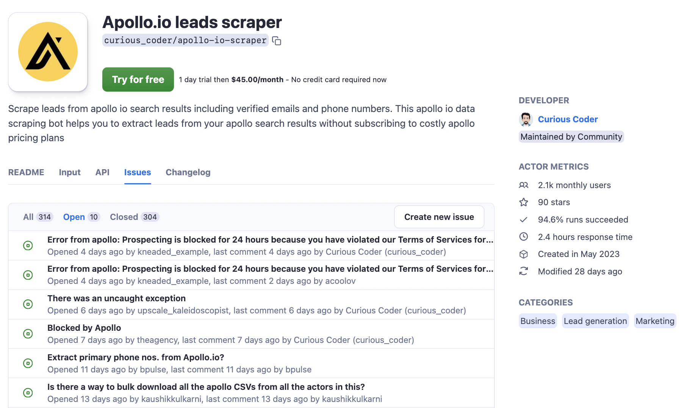

**Once you publish your Actor in Apify Store, it opens the door to new users, feedback, and… issue reports. Users can create issues and add comments after trying your Actor. But why is this space so important?**

---

## What is the Issues Tab

The Issues tab is a dedicated section on your Actor’s page where signed-in users can report problems, share feedback, ask questions, and have conversations with you. You can manage each issue thread individually, and the whole thread is visible to everyone. The tab is divided into three categories: **Open**, **Closed**, and **All**, and it shows how long each response has been there. While only signed-in users can post and reply, all visitors can see the interactions, giving your page a transparent and welcoming vibe.

:::note

🕑 On the web, your average 🕑 **Response time** is calculated and shown in your Actor Metrics. The purpose of this metric is to make it easy for potential users to see how active you are and how well-maintained the Actor is.

:::

You can view all the issues related to your Actors by going to **Actors** > [**Issues**](https://console.apify.com/actors?tab=issues) in the Apify Console. Users can get automatic updates on their reported issues or subscribe to issues they are interested in, so they stay informed about any responses. When users report an issue, they’re encouraged to share their run, which helps you get the full context and solve the problem more efficiently. Note that shared runs aren’t visible on the public Actor page.

## What is the Issues tab for

The tab is essentially just a series of conversations between you and your users. There are existing systems like GitHub for that. So why create a separate system like an Issues tab? Since the Issues tab exists both in private space (Console) and public space (Actor's page on the web), it can fulfill two different sets of purposes.

### Issues tab in Apify Console

Originally, the Issues tab was only available in the Apify Console, and its main goals were:

- Convenience: have a single space to hold the communication between you and your users.
- Unity and efficiency: make sure multiple users don't submit the same issue through multiple channels or multiple times.
- Transparency: make sure users have their issues addressed publicly and professionally. You can’t delete issues, you can only close them, so there's a clear record of what's been resolved and how.
- Quality of service and innovation: make sure the Actor gets fixed and continuously improved, and users get the quality scraping services they pay for.

### Issues tab on the web

Now that the Issues tab is public and on the web, it also serves other goals:

- Credibility: new users can check how active and reliable you are by looking at the issues and your average 🕑 **Response time** even before trying your Actor. It also levels their expectations on when to expect a response from you.
- Collaboration: developers can learn from each other’s support styles, which motivates everyone to maintain good interactions and keep up good quality work.
- SEO boost: every issue now generates its own URL, potentially driving more keyword traffic to your Actor's page

## Example of a well-managed Issues tab

Check out how the team behind the **Apollo.io leads scraper** manages their [Issues tab](https://apify.com/curious_coder/apollo-io-scraper/issues/open) for a great example of professional responses and quick problem-solving.

Note that this Actor is a rental, so users expect a high-quality service.

:::warning

Once your Actor is public, you’re required to have an Issues tab.

:::

## SEO of the Issues tab

Yes, you read that right! The public Issues tab can boost your SEO. Each issue now has its own URL, which means every report could help your Actor rank for relevant keywords.

When we made the tab public, we took inspiration from StackOverflow’s SEO strategy. Even though StackOverflow started as a Q&A forum, its strong SEO has been key to its success. Similarly, your Actor’s Issues tab can help bring in more traffic, with each question and answer potentially generating more visibility. This makes it easier for users to find solutions quickly.

## Tips for handling Actor issues

1. _Don’t stay silent_

    Respond quickly, even if it’s just a short note. Even if an issue takes weeks to resolve, keep the user in the loop. A quick update prevents frustration and shows the user (and others following it) that you’re actively working on solving the issue.

2. _Encourage search to avoid duplication_

    Save time by encouraging users to search for existing issues before submitting new ones. If a similar issue exists, they can follow that thread for updates instead of creating a new one.

3. _Encourage reporters to be specific_

    The more context, the better! Ask users to share details about their run, which helps you diagnose issues faster. If needed, remind them that runs are shared privately, so sensitive data won’t be exposed.

4. _Use screenshots and links_

    The same goes for your side. Screenshots and links to specific runs make your answers much clearer. It’s easier to walk the user through a solution if they can see what you’re referencing.

5. _Structure issue reporting_

    As you get more experienced, you’ll notice common types of issues: bugs, feature requests, questions, reports, misc. This way, you can prioritize and respond faster based on the category.

6. _Have ready answers for common categories_

    Once you recognize recurring types of issues, have pre-prepared responses. For example, if it’s a bug report, you might already have a troubleshooting guide you can link to, or if it’s a feature request, you can figure out the development timeline.

7. _Be polite and precise_

    Politeness goes a long way! Make sure your responses are respectful and straight to the point. It helps to keep things professional, even if the issue seems minor.

https://rewind.com/blog/best-practices-for-using-github-issues/
