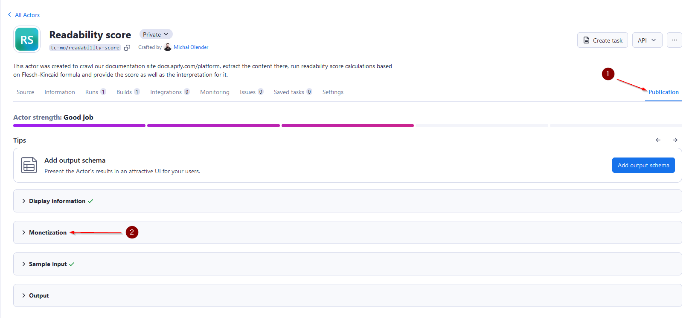
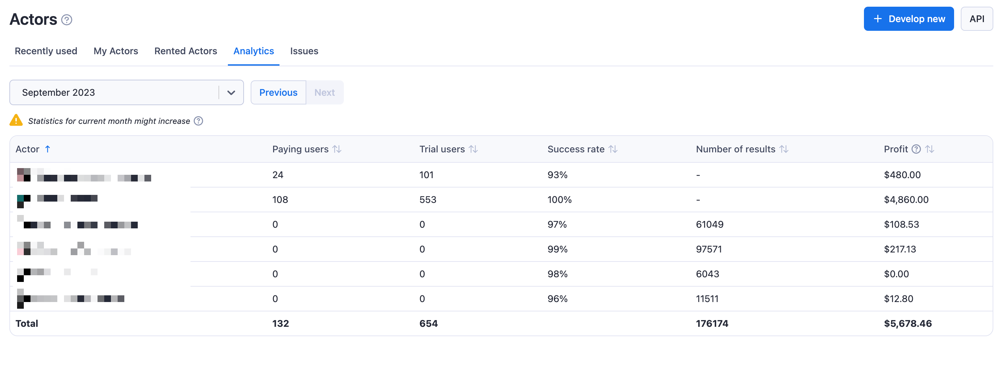

# Monetizing your Actor

**Learn how you can monetize your web scraping and automation projects by publishing Actors to users in Apify Store.**

---

When publishing your Actor on the Apify platform you have the choice to make it a **Paid Actor** and get paid by users benefiting from your tool. When making your Actor paid, you can choose from two pricing models: **rental** and **pay-per-result**.

## Rental pricing model

When you choose to make your Actor rental, you will specify the length of the free trial and a monthly rental price. Any user that wants to use your Actor will need to first activate the free trial, and once that's concluded, they will be charged the monthly rent set by you. Note that after the free trial, the user will need to have one of Apify's [paid plans](https://apify.com/pricing) to be able to pay the monthly rental and use the Actor further.

At the end of each month, we will then add up all rental fees collected in that month, and 80% of the total goes to you.

> **Example - rental pricing model**
>
> You make your Actor rental with 7 days free trial and then $30/month. During the first calendar month, three users start to use your Actor.
>
>1. first user, on Apify paid plan, starts the free trial on 15th
>2. second user, on Apify paid plan, starts the free trial on 25th
>3. third user, on Apify free plan, start the free trial on 20th
>
> The first user pays their first rent 7 days after the free trial, i.e. on 22nd. The second user only starts paying the rent next month. The third user is on Apify free plan, so after the free trial ends on 27th, they are not charged and cannot use the Actor further until they get a paid plan. Hence, your profit is computed only from the first user. They were charged $30, so 80% of this goes to you, i.e. `0.8 * 30 = $24`.

## Pay-per-result pricing model

If you make your Actor pay-per-result instead, you will set the price per 1,000 results, and users will be charged for your Actor solely based on the number of results your Actor produces. That's your _revenue_. The underlying [platform usage](https://docs.apify.com/platform/actors/running/usage-and-resources) the Actor generates, using the pay-per-result unit pricing defined below, is your _cost_. Your profit which is then paid to you is computed as 80% of the revenue minus the costs, i.e. `(0.8 * revenue) - costs = profit`. This profit is also paid out monthly.

### Pay-per-result unit pricing for cost computation

| Service                         | Unit price                 |
|---------------------------------|----------------------------|
| Compute unit                    | **$0.4** / CU              |
| Residential proxies             | **$13** / GB               |
| SERPs proxy                     | **$3** / 1,000 SERPs       |
| Data transfer - external        | **$0.20** / GB             |
| Data transfer - internal        | **$0.05** / GB             |
| Dataset - timed storage         | **$1.00** / 1,000 GB-hours |
| Dataset - reads                 | **$0.0004** / 1,000 reads  |
| Dataset - writes                | **$0.005** / 1,000 writes  |
| Key-value store - timed storage | **$1.00** / 1,000 GB-hours |
| Key-value store - reads         | **$0.005** / 1,000 reads   |
| Key-value store - writes        | **$0.05** / 1,000 writes   |
| Key-value store - lists         | **$0.05** / 1,000 lists    |
| Request queue - timed storage   | **$4.00** / 1,000 GB-hours |
| Request queue - reads           | **$0.004** / 1,000 reads   |
| Request queue - writes          | **$0.02** / 1,000 writes   |

:::note What are Gigabyte-hours?

Gigabyte-hours (GB-hours) are a unit of measurement used to quantify data storage and processing capacity over time.
To calculate GB-hours, multiply the amount of data in gigabytes by the number of hours it's stored or processed.

Suppose you host 50GB of data for 30 days. To calculate this in GB-hours:

- Convert days to hours: _30 * 24 = 720_
- Multiply data size by hours: _50 * 720 = 36,000_

This means that storing 50 GB of data for 30 days results in 36,000 GB-hours.

:::

Note that only revenue and cost for Apify customers on [paid plans](https://apify.com/pricing) are taken into consideration when computing your profit. Users on free plans are not reflected there, although you can see statistics about the potential revenue of users that are currently on free plans in Actor insights in the Apify Console.

> **Example - pay-per-result pricing model**
>
> You make your Actor pay-per-result and set price to be $1/1,000 results. During the first month, two users on Apify paid plans
use your Actor to get 50,000 and 20,000 results, costing them $50 and $20 respectively. Let's say the underlying platform usage for the first user is $5 and for the second $2. Third user, this time on Apify free plan, uses the Actor to get 5,000 results, with underlying platform usage $0.5.
>
> Your profit is computed only from the first two users, since they are on Apify paid plans. The revenue for the first user is $50 and for the second $20, i.e. total revenue is $70. The total underlying cost is $5 + $2 = $7. Since your profit is 80% of the revenue minus the cost, it would be `0.8 * 70 - 7 = $49`.

You can read more about Actors in the Store and different pricing models from the perspective of your users in our [Store documentation](https://docs.apify.com/platform/actors/running/actors-in-store).

### Best practices for pay-per-result Actors

1. Set `minMemoryMbytes` and `maxMemoryMBytes` in [`actor.json`](https://docs.apify.com/platform/actors/development/actor-definition/actor-json) in your Actor folder. If users use more memory than you counted with in your price estimations, their runs will generate more underlying platform usage and will cost you more, which might affect your profit margin.

2. Always check `ACTOR_MAX_PAID_DATASET_ITEMS` environment variable in your Actor code. Your Actor should never return more than `ACTOR_MAX_PAID_DATASET_ITEMS` results, because the user will be not charged for more and you could start generating losses. This variable is configurable by the user to limit how much the run will cost them.

3. To set your price per 1,000 results, we recommend running your Actor several times to see the average cost per 1,000 runs that is available in the Apify Console when you open run detail. Usually runs returning only 1 result are much more expensive in the underlying platform costs than runs returning many results, due to fixed costs at Actor startups. Hence, try runs with different numbers of results in your experiments to get the best idea about the average costs. Also make sure your runs never return 0 results, e.g. when scraping social network profiles without any videos, return at least the basic profile info.

## Setting up monetization

First, go to your Actor page, [**Actors → My Actors**](https://console.apify.com/actors?tab=my) and click on the Actor you want to monetize. While on your Actor page, go to the **Publication** tab on the right side of the screen into and open the **Monetization** section.

If you haven't already, you will need to fill in the billing and payment details that will be used for paying out the profits. You can do that by following the link shown on the screen. Once you have the details set up, you will be able to access details on your payouts in the [**Settings > Payouts**](https://console.apify.com/account/payouts) section.

Once you have your details set up, you can click the **Set up monetization** button that will lead you through a wizard where you will choose the monetization model and any respective fees.

## Changing monetization

You can always change the monetization settings of your Actor. Note that any changes made to an already published Actor will always take 14 days to come into effect, to give users of your Actor, many of whom might be using it in their critical business flows, time to prepare for the change. To change the monetization, use the same wizard as for the setup, found in the Monetization section of the Actor Publication tab.

Also, note that you are allowed to adjust the monetization settings of the Actor only once per month. Please refer to our [Terms & Conditions](https://apify.com/store-terms-and-conditions) for further details and guidelines.

## How you will be paid out

Payout invoices are created automatically on 14th of each month. You will be notified and can access the new payout invoice, and any historical invoices, in the [**Settings > Payouts**](https://console.apify.com/account/payouts) section in Apify Console. Once the new invoice is ready, you will need to review and approve it within a week in order for the payment to be processed. Note that if you do not approve the invoice, or let us know of any discrepancies, by the 20th of the month, the invoice will be auto-approved by the system on the 21st. If you have multiple Actors, the total profit is the sum of individual profits, and any losses and gains cancel out.

## Tracking profit and user statistics

As mentioned earlier, you can track your Payouts in the [**Settings > Payouts**](https://console.apify.com/account/payouts) section in Apify Console. Apart from that, you can see statistics on your paid Actors in [**Actor > Analytics**](https://console.apify.com/actors?tab=earnings) tab.

To dive deep into numbers for a specific Actor, you can visit the specific Actor insights page in the **Actors > Analytics** section, next to the monetization settings.

## Setting Actor prices {#setting-actor-prices}

**You choose the price and, in the case of the rental model, a free trial length of your Actor.** Apify can give you advice about the best practices of the most successful Actors, but at the end of the day, we give developers full control over the pricing strategy of their tools. You can browse Apify Store to see how similar tools are priced to give you an idea about any potential competing solutions.

## Promote your Actor

Your paid Actors’ profits are directly related to the amount of paying users you have for your tool. After publishing and monetizing your software, comes a crucial step for your Actor’s success: **attracting users**.

Getting new users can be an art in itself, but there are **two simple steps** you can take to ensure your Actor is getting the attention it deserves.

1. **SEO-optimized description and README**

    Search engine optimization (SEO) is the process of improving the quality and quantity of traffic from search engines to your Actor’s page.

    In short, SEO-optimized texts improve the likelihood that potential customers will find your Actor when searching for similar tools on the web.

    This can be a daunting task to take on your own, so we prepared an in-depth [SEO guide](./seo_and_promotion.md) to help you **fine-tune your Actor’s title, description, and Readme.**

2. **Promoting your Actor**

    Promoting your Actor on the right channels can be the deciding factor in successfully attracting users.

    While there are various ways to effectively promote your tool, it is usually best to share it on multiple channels. Here are a few suggestions of channels you can use to promote your Actor:

    - **Reddit and Quora**

    Find subreddits and Quora topics where the audience might be interested in the tool you developed, for example, the subreddit [r/webscraping](https://www.reddit.com/r/webscraping/). Here you can check an [example](https://www.quora.com/How-do-you-use-TikTok-to-market-your-business/answer/Theo-Vasilis?ch=10&oid=352266072&share=42bb7fae&srid=uFNdtn&target_type=answer) of how you can structure your posts on these social media to promote your Actor.

    - **Social Media (Twitter, Facebook, LinkedIn)**

    Don’t underestimate your own network! Your social media connections can be a valuable ally in promoting your Actor. Not only can they use your tool to enrich their own professional activities, but also support your work by helping you promote your Actor to their network.

    For inspiration, you can check Apify’s [Twitter](https://twitter.com/apify), [Facebook](https://www.facebook.com/apifytech/), and [LinkedIn](https://linkedin.com/company/apifytech) pages, and **don’t forget to tag Apify on your posts** we will retweet and share your posts to help you reach an even broader audience.

    - **YouTube**

    Videos are a powerful way to promote your Actors. Short tutorials showcasing your tool’s features and teaching users how to use them can be an effective way to boost your marketing efforts and provide value to your potential customers.

    For reference, you can check Apify’s [video tutorials](https://www.youtube.com/watch?v=uZ0LYBCjvd4&list=PLObrtcm1Kw6PmbXg8bmfJN-o2Hgx8sidf&index=1).

    - **Publish an article about your Actor**

    Writing an article about your Actor is a great way to attract public attention and gain users.

    You can share your Actor's development journey with other developers, write a tutorial about how to effectively use the tool you created, or visit [Apify Blog](https://blog.apify.com/) for more ideas about how to promote your Actors. For inspiration, you can check this [How to Scrape Google Shopping](https://blog.apify.com/how-to-scrape-google-shopping/) tutorial on our blog.

    Once your article is ready, you can check this list of relevant websites where you can publish your article: [hackernoon.com](https://hackernoon.com/), [techcrunch.com](https://techcrunch.com/), [news.ycombinator.com](https://news.ycombinator.com/), [dev.to](https://dev.to/), [producthunt.com,](https://www.producthunt.com/) [indiehackers.com](https://www.indiehackers.com/)

**Don’t overlook promoting your Actor**. This is arguably the most important step after publishing your tool. Taking advantage of all the possible channels for promotion is what often differentiates very successful Actors with dozens of paid users from Actors with few to no users at all.

Finally, don’t forget to check our [pro-tips](./seo_and_promotion.md) to take your Actor promotion efforts to the next level.
