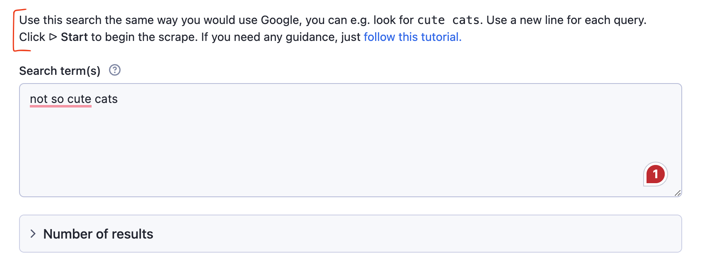
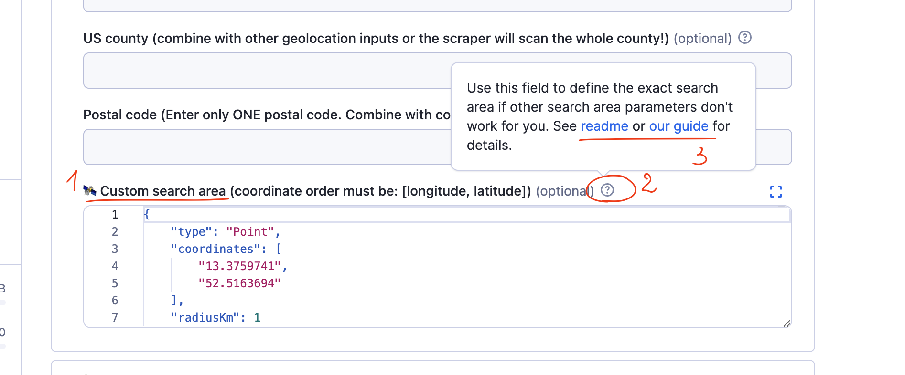
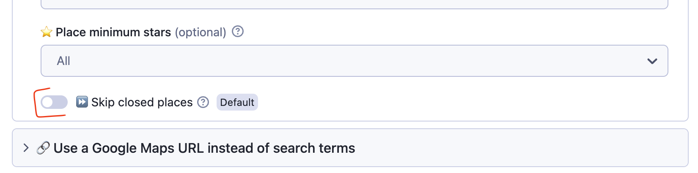
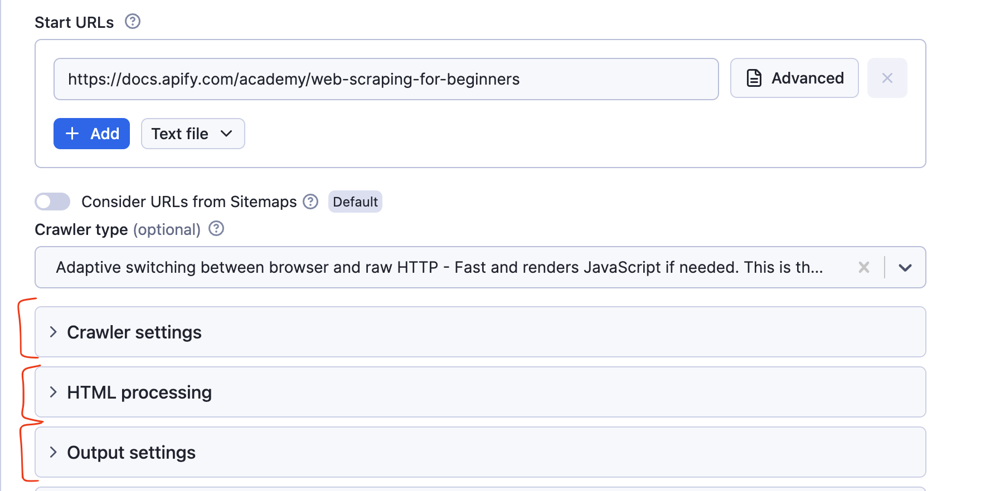
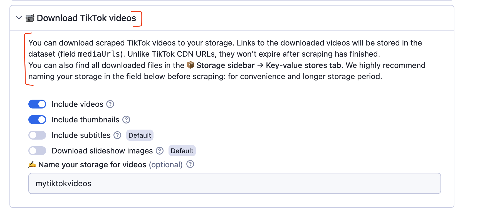
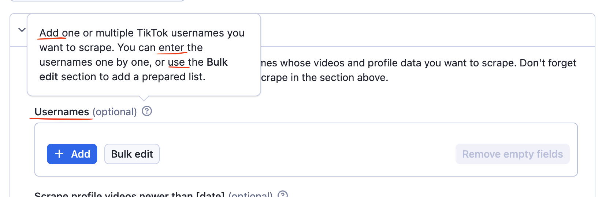
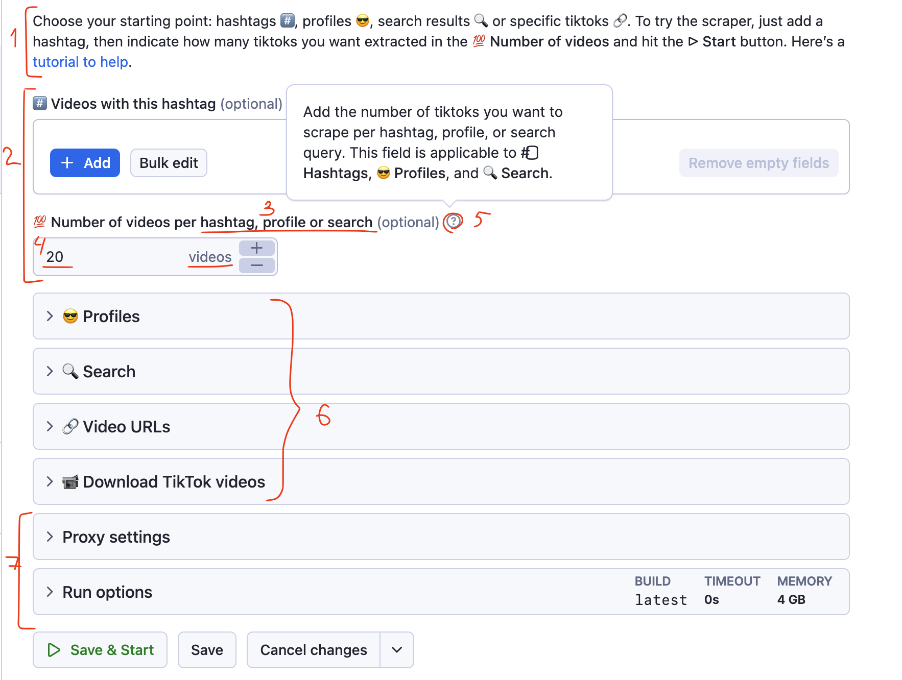
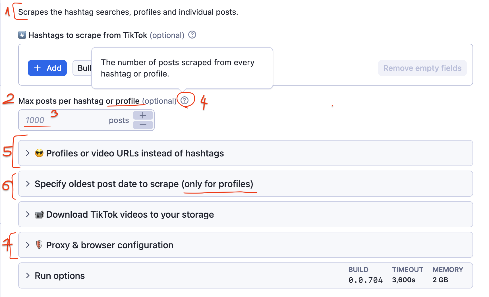

Optimizing your input schema. Learn to design and refine your input schema with best practices for a better user experience.

---

## What is an input schema?

So you've succeeded: your user has 1. found your Actor on Google, 2. explored the Actor's landing page, 3. decided to try it, and 4. created an Apify account. Now they’re on your Actor's page in Apify Console. The SEO fight is over. What’s next?

Your user is finally one-on-one with your Actor — specifically, its input schema. This is the moment when they try your Actor and decide whether to stick with it. The input schema is your representative here, and you want it to work in your favor.

Technically, the input schema is a `JSON` object with various field types supported by the Apify platform, designed to simplify the use of the Actor. Based on the input schema you define, the Apify platform automatically generates a _user interface_ for your Actor.

Of course, you can create an Actor without setting up an elaborate input schema. If your Actor is designed for users who don't need a good interface (e.g. they’ll use a JSON object and call it via API), you can skip this guide. But most users engage with Actors in Manual mode, aka the Actor interface. So, if your Actor is complex or you’re targeting regular users who need an intuitive interface, it's essential to consider their experience.

In this article, _we’ll refer to the input schema as the user interface_ of your Actor and focus exclusively on it.

:::tip Understand input schemas

To fully understand the recommendations in this blog post, you’ll first need to familiarize yourself with the [technical aspects of the input schema](https://docs.apify.com/platform/actors/development/actor-definition/input-schema). This context is essential to make good use of the insights shared here.

:::

## The importance of a good input schema

It can feel intimidating when facing the Apify platform for the first time. You only have a few seconds for a user to assess the ease of using your Actor.

If something goes wrong or is unclear with the input, an ideal user will first turn to the tooltips in the input schema. Next, they might check the README or tutorials, and finally, they’ll reach out to you through the **Issues** tab. However, many users won’t go through all these steps — they may simply get overwhelmed and abandon the tool altogether.

A well-designed input schema is all about managing user expectations, reducing cognitive load, and preventing frustration. Ideally, a good input schema, as your first line of interaction, should:

- Make the tool as easy to use as possible
- Reduce the user’s cognitive load and make them feel confident about using and paying for it
- Give users enough information and control to figure things out on their own
- Save you time on support by providing clear guidance
- Prevent incorrect or harmful tool usage, like overcharges or scraping personal information by default

### Reasons to rework an input schema

- Your Actor is complex and has many input fields
- Your Actor offers multiple ways to set up input (by URL, search, profile, etc.)
- You’re adding new features to your Actor
- Certain uses of the Actor have caveats that need to be communicated immediately
- Users frequently ask questions about specific fields

👀 Input schema can be formatted using basic HTML.

## Most important elements of the input schema

You can see the full list of elements and their technical characteristics in [Docs](https://docs.apify.com/academy/deploying-your-code/input-schema): titles, tooltips, toggles, prefills, etc. That's not what this guide is about. It's not enough to just create an input schema, you should ideally aim to place and word its elements to the user's advantage: to alleviate the user's cognitive load and make the acquaintance and usage of your tool as smooth as possible.

Unfortunately, when it comes to UX, there's only so much you can achieve armed with HTML alone. So here are the best elements to focus on, along with some best practices for using them effectively:

- **`description` at the top**
  - As the first thing users see, the description needs to provide crucial information and a sense of reassurance if things go wrong. Key points to mention: the easiest way to try the Actor, links to a guide, and any disclaimers or other similar Actors to try.

      

  - Descriptions can include multiple paragraphs. If you're adding a link, it’s best to use the `target_blank` property so your user doesn’t lose the original Actor page when clicking.
- **`title` of the field (regular bold text)**
  - This is the default way to name a field.
  - Keep it brief. The user’s flow should be 1. title → 2. tooltip → 3. link in the tooltip. Ideally, the title alone should provide enough clarity. However, avoid overloading the title with too much information. Instead, make the title as concise as possible, expand details in the tooltip, and include a link in the tooltip for full instructions.

    

- **`prefill`, the default input**
  - this is your chance to show rather than tell
    - Keep the **prefilled number** low. Set it to 0 if it's irrelevant for a default run.
    - Make the **prefilled text** example simple and easy to remember.
    - If your Actor accepts various URL formats, add a few different **prefilled URLs** to show that possibility.
    - Use the **prefilled date** format that the user is expected to follow. This way, they can learn the correct format without needing to check the tooltip.
    - There’s also a type of field that looks like a prefill but isn’t — usually a `default` field. It’s not counted as actual input but serves as a mock input to show users what to type or paste. It is gray and disappears after clicking on it. Use this to your advantage.
- **toggle**
  - The toggle is a boolean field. A boolean field represents a yes/no choice.
  - So how would you word this toggle: **Skip closed places** or **Scrape open places only**? And should the toggle be enabled or disabled by default?

    

    - You have to consider this when you're choosing how to word the toggle button and which choice to set up as the default. If you're making this more complex than it's needed (e.g. by using negation as the ‘yes’ choice), you're increasing your user's cognitive load. You also might get them to receive way less, or way more, data than they need from a default run.
    - In our example, we assume the default user wants to scrape all places but still have the option to filter out closed ones. However, they have to make that choice consciously, so we keep the toggle disabled by default. If the toggle were enabled by default, users might not notice it, leading them to think the tool isn't working properly when it returns fewer results than expected.
- **sections or `sectionCaption` (BIG bold text) and `sectionDescription`**
  - A section looks like a wrapped toggle list.

      

  - It is useful to section off non-default ways of input or extra features. If your tool is complex, don't leave all fields in the first section. Just group them by topic and section them off (see the screenshot above ⬆️)
    - You can add a description to every section. Use `sectionDescription` only if you need to provide extra information about the section (see the screenshot below ⬇️.
    - sometimes `sectionDescription` is used as a space for disclaimers so the user is informed of the risks from the outset instead of having to click on the tooltip.

    

- tooltips or `description` to the title
  - To see the tooltip's text, the user needs to click on the `?` icon.
  - This is your space to explain the title and what's going to happen in that field: any terminology, referrals to other fields of the tool, examples that don't fit the prefill, or caveats can be detailed here. Using HTML, you can add links, line breaks, code, and other regular formatting here. Use this space to add links to relevant guides, video tutorials, screenshots, issues, or readme parts if needed.
  - Wording in titles vs. tooltips. Titles are usually nouns. They have a neutral tone and simply inform on what content this field is accepting (**Usernames**).
    - Tooltips to those titles are usually verbs in the imperative that tell the user what to do (_Add, enter, use_).
    - This division is not set in stone, but the reason why the tooltip is an imperative verb is because, if the user is clicking on the tooltip, we assume they are looking for clarifications or instructions on what to do.

    

- emojis (visual component)
  - Use them to attract attention or as visual shortcuts. Use emojis consistently to invoke a user's iconic memory. The visual language should match across the whole input schema (and README) so the user can understand what section or field is referred to without reading the whole title.
    - Don't overload the schema with emojis. They attract attention, so you need to use them sparingly.

:::tip

Read more on the use of emojis: [Actors and emojis]

:::

## Example of an improved input schema

1. A well-used `description` space. The description briefly introduces possible scraping options, visual language (sections represented by emojis), the easiest way to try the tool, and a link to a tutorial in case of issues. The description isn't too long, uses different formatting, and looks reassuring.
2. The main section is introduced and visually separated from the rest. This is the space for the user to try the first run before they can discover the other options.
3. The title says right away that this field refers to multiple other fields, not only the first section.
4. `prefill` is a small number (so in case users run the tool with default settings, it doesn't take too long and isn't expensive for them) and uses the language of the target website (not results or posts, _videos_).
5. The tooltip expands with more details and refers to other sections it's applicable to using matching emojis.
6. Section names are short. Sections are grouped by content type.
7. More technical parameters lack emojis. They are formatted this way to attract less attention and visually inform the user that this section is the most optional to set.
8. Visual language is unified across the whole input schema. Emojis are used as a shortcut for the user to understand what section or field is referred to without actually reading the whole title.

### Example of a worse input schema

The version above was the improved input schema. Here's what this tool's input schema looked like before:

1. Brief and dry description, with little value for the user, easy to miss. Most likely, the user already knows this info because what this Actor does is described in the Actor SEO description, description, and README.
2. The field title is wordy and reads a bit techie: it uses terminology that's not the most accurate for the target website (_posts_) and limiting terms (_max_). The field is applicable for scraping by hashtags (field above) and by profile (section below). Easy detail to miss.
3. The prefilled number is too high. If the user runs the Actor with default settings, they might spend a lot of money, and it will take some time. Users often just leave if an Actor takes a long time to complete on the first try.
4. The tooltip simply reiterates what is said in the title. Could've been avoided if the language of the title wasn't so complex.
5. Merging two possible input types into one (profiles and URLs) can cause confusion. Verbose, reminds the user about an unrelated field (hashtags).
6. This section refers to profiles but is separate. The user had to make extra effort to scrape profiles. They have to move across 3 sections: (use Max posts from section 1, use Profiles input from section 2, use Date sorting filters from section 3).
7. The proxy and browser section invites the users to explore it even though it's not needed for a default run. It's more technical to set up and can make an impression that you need to know how to set it so the tool works.

## Best practices

1. Keep it short. Don’t rely too much on text - most users prefer to read as little as possible.
2. Use formatting to your advantage (bold, italic, underline), links, and breaks to highlight key points.
3. Use specific terminology (e.g., posts, images, tweets) from the target website instead of generic terms like "results" or "pages."
4. Group related items for clarity and ease of use.
5. Use emojis as shortcuts and visual anchors to guide attention.
6. Avoid technical jargon — keep the language simple.
7. Minimize cognitive load wherever possible.

## Signs and tools for improving input schema

- _User feedback_. If they're asking obvious things, complaining, or consistently making silly mistakes with input, take notes. Feedback from users can help you understand their experience and identify areas for improvement.
- _High churn rates_. If your users are trying your tool but quickly abandon it, this is a sign they are having difficulties with your schema.
- _Input Schema Viewer_. Write your base schema in any code editor, then copy the file and put it into [**Input Schema Viewer](https://console.apify.com/actors/UHTe5Bcb4OUEkeahZ/source).** This tool should help you visualize your Input Schema before you add it to your Actor and build it. Seeing how your edits look in Apify Console right away will make the process of editing the fields in code easier.

## Resources

- Basics of input schema: [https://docs.apify.com/academy/deploying-your-code/input-schema](https://docs.apify.com/academy/deploying-your-code/input-schema)
- Specifications of input schema: [https://docs.apify.com/platform/actors/development/actor-definition/input-schema](https://docs.apify.com/platform/actors/development/actor-definition/input-schema)
