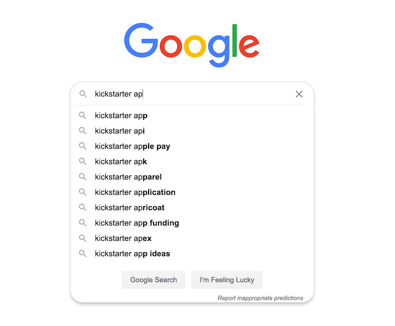

# SEO and promotion

**Optimize your actors to get more relevant visits from search engines like Google. Set search engine-friendly parameters and share your actor with the world.**

---

Work on your actors does not end when you publish it. Now, it's time to promote your creation and get it to its intended audience. The Apify domain will boost your position with search engines but it won't do all the work. Focus on crafting content according to topics and phrases people search for to give your actor that extra boost.

**The golden rule of SEO:** Create quality content that provides value and engagement to your users. [Don't over-optimize SEO](https://seo-hacker.com/over-optimization-penalty/) or you risk being penalized by Google.

Think of it this way: your content, URLs, keywords, titles, links, etc. determine the kind of search queries your page is shown in. The quality of the content determines how high it ranks in those results.

For example, if you over-optimize your URLs and title to rank higher in results for high-volume queries, but most people who visit your page immediately leave, Google notices, penalizes you, and your pages sinks in the results.

On the other hand, if you precisely address a niche segment of users who will benefit from your actor and people who open it use your actor, then Google will love it and push it up in results. Read more about the basics of [content marketing](https://techcrunch.com/2019/04/13/how-do-startups-actually-get-their-content-marketing-to-work/).

## Keywords

There are several freemium tools that make it easy to identify the right phrases and keywords:

- [wordstream.com/keywords](https://www.wordstream.com/keywords)
- [neilpatel.com/ubersuggest](https://neilpatel.com/ubersuggest/)
- [keywordtool.io](https://keywordtool.io/)

Enter the desired phrase or topic (e.g. Facebook scraper, Web scraping, Facebook API...) and set the **language** to **English**. Ideally, set the **location** to **United States**. After submitting the form, you will see a list of relevant phrases for your query with the information about **search volume** (how many people are searching for this) and **competition** (number of results).

The best combinations are those with **high search volume** and **low competition**. Try to find keywords (or topics) relevant to your actor based on these criteria.

**Use your selected keywords on all the important parts of your actor's page/content**.

- Page title.
- Meta description.
- Headings (1st and 2nd-level, ideally).
- Page body (e.g., README).
- The texts in your links.

> While crafting your content with keywords, beware of [over-optimizing or keyword stuffing](https://yoast.com/over-optimized-website/) the page. You can use synonyms or related keywords to help this. Google is smart enough to evaluate the page based on how well the whole topic is covered (not just based on keywords), but using them helps.

## Optimizing your actor details

While blog posts and promotion are important, your actor is the main product. Here's how you can make it more SEO-friendly.

### Name

The actor name is your actor's developer-style name, which is prefixed by your username (e.g. `jancurn/find-broken-links`). The name is used to generate a URL for your actor (e.g. <https://apify.com/jancurn/find-broken-links>), making it an important signal for search engines.

However, the name should also be readable and clear enough, so that people using your actor can understand what it does just from the name.

[Read more about naming you actor](./naming_your_actor.md)!.

### Title

The actor title provides a human-readable name. The title is the most important real estate from SEO standpoint. It should exactly match the most likely search query that potential users of your actor will use.

At the same time, it should give your actor a clear name for people who will use it every day. So if you’re working on an "Amazon crawler" or a "Google Places API", use the following formats for your actor's name:

> **GOOD**: Crawler for Amazon, API for Google Places, Search in Kickstarter.
>   **BETTER**: Amazon crawler, Google Places API, Kickstarter search.

### Description

Your actor's description should contain a concise but accurate description of what your actor does, targeted at people who are deciding whether to use it or not. Get straight to the point and avoid any boilerplate text.

> **GOOD**: Crawls Amazon.com and extracts ...   **AVOID**: This actor crawls Amazon.com in order to extract ...

The description is used by search engines to understand what the actor is about, so it should contain some of the most popular variations and derivations of the [title](#title), including things people might search for.

> **GOOD**: This Amazon bot will help, whereas the Amazon API won’t. Use the crawler...
>   **AVOID**: This crawler will search through results in Amazon and offers you...

If you’re not sure about similar phrases, check out the Google suggest tool in the search, and it will show you some hints and tips. Of course, the description should primarily be about what the actor does, but it’s always a good idea to enrich the text with popular keywords.

### README

The README․md file represents a complete description of your actor, intended for its users. If your actor's users are technical folks, you can be technical in the README. If they aren't, keep it simple. [See our article on writing great READMEs](https://help.apify.com/en/articles/2912548-how-to-write-great-readme-for-your-actors).

You have lots of room for SEO optimization in the README, without compromising readability for your users. Make sure the text includes other variants of what potential users of your actor might search for. A good place for these is in the captions and headlines but keywords in the body text will also help. It’s also a good idea to repeat the name of the actor several times.

> **GOOD**: You can use this Amazon Crawler with your code (Python, PHP, Java) to crawl Amazon without the API...
>   **AVOID**: Follow the instructions in the Readme and if you have any comments, see the FAQ section...

An important part of SEO is internal and external linking. Don’t be shy - add links to your README leading to similar [actors](https://apify.com/store) or any interesting article in [Apify Help](https://help.apify.com/) that could assist your users. If your actor is scraping a certain website, make sure to add a link to that website. If the actor uses any external libraries, make sure to link their pages.

If you’ve created other actors, it’s completely fine to pop in a promo for them at the end. It’s even better if you edit your old actors and put in a link to your new actor. We’ll take care of extra promotion on the [Apify homepage](https://apify.com/) or [Apify Store](https://apify.com/store) - especially if you’ve done a great job of describing your actors!

> **GOOD**: Like my <a href="#">Amazon Crawler</a>? See my <a href="#">Amazon Review Crawler</a>.
>   **AVOID**: Check out my Amazon Crawler.

## Promotion

Now that you’ve created a cool new actor, let others see it! Share it on your personal Twitter, Facebook, Reddit or any other social platform. Always provide a link with the actor's name. Use #hashtags on Twitter to catch attention. Provide a small “why is this good” segment when sharing inside any group discussions. We will promote your actor sooner or later, but more links means more attention from Google from the beginning.

### External promotion

- Try to publish an article about your actor in relevant external magazines like [hackernoon.com](https://hackernoon.com/) or [techcrunch.com](https://techcrunch.com/). Do not limit yourself to blogging platforms.
- If you publish an article in external media (magazine, blog etc.), be sure to include backlinks to your actor and the Apify website to strengthen the domain's SEO.
- It's always better to use backlinks with the [`dofollow` attribute](https://raventools.com/marketing-glossary/dofollow-link/).
- Always use the most relevant URL as the backlink's landing page. For example, when talking about Apify Store, link to the Store page ([https://apify.com/store](https://apify.com/store)), not to Apify homepage ([https://apify.com](https://apify.com)).
- Always use the most relevant keyword or phrase for the backlink's text. This can boost the landing page's SEO and help the readers know what to expect from the link.

> **GOOD**: Try the [Facebook scraper](https://apify.com/pocesar/facebook-pages-scraper) now.
>   **AVOID**: Try the Facebook scraper [here](https://apify.com/pocesar/facebook-pages-scraper).

### Social media and forums

- Use relevant and widely used hashtags (Twitter).

> **GOOD**: Need to crawl #Amazon or #Yelp? See my Amazon crawler https://...
>   **AVOID**: I just #created something, check it out on Apify...

- Post in groups or pages with relevant target groups (Facebook and LinkedIn).
- Always use the most relevant URL as the backlink's landing page.
- Use other relevant websites for promotion. For example, [news.ycombinator.com](https://news.ycombinator.com/), [producthunt.com](https://www.producthunt.com/), [indiehackers.com](https://www.indiehackers.com/), and [dev.to](https://dev.to/)
- While promoting the actor on forums like Reddit or Quora, try not to post strictly promotional answers. If you help someone with their problem, all readers will be more willing to upvote your posts or check the actor.
- If it's possible to upvote your posts, do it and get others help you.

## Next up {#next}

Congratulations! Your actor is coming together and getting ready to be shared with the world. In the [next lesson](./monetizing_your_actor.md)! we will learn how you can monetize your actor on Apify Store.
