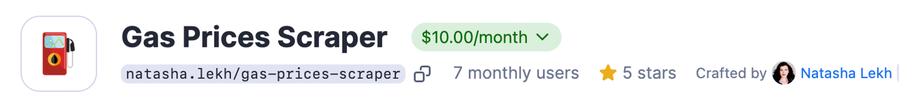
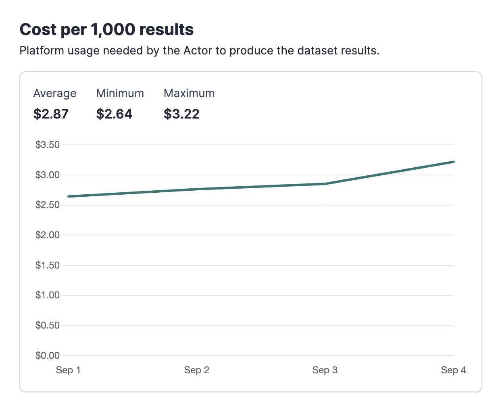

**You can turn your web scrapers into a source of income by publishing them on Apify Store. Learn how it's done and what monetization options you have.**

---

## Monetizing your Actor

Monetizing your Actor on the Apify platform involves several key steps:

1. _Development_: create and refine your Actor.
2. _Testing_: ensure your Actor works reliably.
3. _Publication & monetization_: publish your Actor and set up its monetization model.
4. _Promotion_: attract users to your Actor.

---

## Monetization models

### Rental pricing model

- _How it works_: you offer a free trial period and set a monthly fee. Users on Apify paid plans can continue using the Actor after the trial. You earn 80% of the monthly rental fees.
- _Example_: you set a 7-day free trial and $30/month rental. If 3 users start using your Actor:
  - 1st user on a paid plan pays $30 after the trial (you earn $24).
  - 2nd user starts their trial but pays next month.
  - 3rd user on a free plan finishes the trial without upgrading to a paid plan and can’t use the Actor further.

### Pay-per-result pricing model

- _How it works_: you charge users based on the number of results your Actor generates. You earn 80% of the revenue minus platform costs.
- _Cost breakdown_:
  - Compute unit: $0.4 per CU
  - Residential proxies: $13 per GB
  - SERPs proxy: $3 per 1,000 SERPs
  - Data transfer (external): $0.20 per GB
  - Dataset storage: $1 per 1,000 GB-hours
- _Example_: you set a $1 per 1,000 results price. Two users generate 50,000 and 20,000 results, paying $50 and $20, respectively. If platform costs are $5 and $2, your profit is $49.

### Pay-per-event pricing model

- _How it works_: you charge users based on specific events triggered programmatically by your Actor's code. You earn 80% of the revenue minus platform costs.
- _Event cost example_: you set the following events for your Actor:
  - `Actor start per 1 GB of memory` at 0.005$
  - `Pages scraped` at 0.002$
  - `Page opened with residential proxy` at 0.002$ - this is on top of `Pages scraped`
  - `Page opened with a browser` at 0.002$ - this is on top of `Pages scraped`
- _Example_:
  - User A:
    - Started the Actor 10 times = 0.05$
    - Scraped 1000 pages = 2.00$
    - 500 of those were scraped using residential proxy = 1.00$
    - 300 of those were scraped using browser = 0.90$
    - This comes up to 3.95$ of total revenue
  - User B:
    - Started the Actor 5 times = 0.025$
    - Scraped 500 pages = 1.00$
    - 200 of those were scraped using residential proxy = 0.40$
    - 100 of those were scraped using browser = 0.30$
    - This comes up to 1.725$ of total revenue
  - That means if platform costs are 0.395$ for user A and 0.173$ for user B your profit is 3.972$

## Setting up monetization

1. _Go to your Actor page_: navigate to the **Publication** tab and open the **Monetization** section.
2. _Fill in billing details_: set up your payment details for payouts.
3. _Choose your pricing model_: use the monetization wizard to select your model and set fees.

### Changing monetization

Adjustments to monetization settings take 14 days to take effect and can be made once per month.

### Tracking and promotion

- _Track profit_: review payout invoices and statistics in Apify Console (**Monitoring** tab).
- _Promote your Actor_: optimize your Actor’s description for SEO, share on social media, and consider creating tutorials or articles to attract users.

## Marketing tips for defining the price for your Actor

It's up to you to set the pricing, of course. It can be as high or low as you wish, you can even make your Actor free. But if you're generally aiming for a successful, popular Actor, here are a few directions:

### Do market research outside Apify Store

The easiest way to understand your tool's value is to look around. Are there similar tools on the market? What do they offer, and how much do they charge? What added value does your tool provide compared to theirs? What features can your tool borrow from theirs for the future?

Try competitor tools yourself (to assess the value and the quality they provide), check their SEO (to see how much traffic they get), and note ballpark figures. Think about what your Actor can do that competitors might be missing.

Also, remember that your Actor is a package deal with the Apify platform. So all the platform's features automatically transfer onto your Actor and its value. Scheduling, monitoring runs, ways of exporting data, proxies, and integrations can all add value to your Actor (on top of its own functionalities). Be sure to factor this into your tool's value proposition and communicate that to the potential user.

### Do research in Apify Store

Apify Store is like any other marketplace, so take a look at your competition there. Are you the first in your lane, or are there other similar tools? What makes yours stand out? Remember, your README is your first impression — communicate your tool's benefits clearly and offer something unique. Competing with other developers is great, but collaborations can drive even better results 😉

Learn more about what makes a good readme here: [How to create an Actor README](/academy/actor-marketing-playbook/actor-basics/how-to-create-an-actor-readme)

### Rental, pay-per-result (PPR), or pay-per-event (PPE)

Rental pricing is technically easier: you set the rental fee, and the user covers their CU usage. So all you have to define is how much you want to charge the users. With pay-per-result, you’ll need to include both CU usage and your margin. So you have to calculate how much the average run is going to cost for the user + define how much you want to charge them.

To figure out the average cost per run for users, just run a few test runs and look at the statistics in the Actor [**Analytics**](https://console.apify.com/actors?tab=analytics) tab.

From an average user's perspective, pay-per-result is often easier to grasp — $25 for a thousand pages, $5 for a thousand videos, $1 for a thousand images, etc. It gives users a clearer idea of what they’re paying for and allows them to estimate faster. But rental pricing has its fans, too — if your tool provides high value, users will come.

Pay-per-event (PPE) lets you define pricing for individual events. You can charge for specific events directly from your Actor by calling our PPE charging API. The most common events will most likely be Actor start, dataset item, external API calls, etc. PPE is great for users who want to optimize their costs and value transparency. PPE is also a fairer pricing model for integration and AI-driven use cases, where dataset-based pricing doesn’t make sense.

### Adapt when needed

Don’t be afraid to experiment with pricing, especially at the start. You can monitor your results in the dashboard and adjust if necessary.

Keep an eye on SEO as well. If you monitor the volume of the keywords your Actor is targeting as well as how well your Actor's page is ranking for those keywords, you can estimate the number of people who actually end up trying your tool (aka conversion rate). If your keywords are getting volume, but conversions are lower than expected, it might point to a few issues It could be due to your pricing, a verbose README, or complex input. If users are bouncing right away, it makes sense to check out your pricing and your closest competitors to see where adjustments might help.

### Summary & a basic plan

Pick a pricing model, run some tests, and calculate your preliminary costs (**Analytics** tab in Console).

Then check your costs against similar solutions in the Store and the market (try Google search or other marketplaces), and set a price that gives you some margin.

It’s also normal to adjust pricing as you get more demand. For context, most prices on Apify Store range between $1-10 per 1,000 results.

Example of useful pricing estimates from the **Analytics** tab:

:::tip Use emails!

📫 Don't forget to set an email sequence to warn and remind your users about pricing changes. Learn more about emailing your users here:  [Emails to Actor users]

:::

## Resources

- Learn about [incentives behind monetization](https://apify.com/partners/actor-developers)
- Detailed guide to [setting up monetization models](https://docs.apify.com/academy/actor-marketing-playbook/monetizing-your-actor)
- Guide to [publishing Actors](https://docs.apify.com/platform/actors/publishing)
- Watch our webinar on how to [build, publish and monetize Actors](https://www.youtube.com/watch?v=4nxStxC1BJM)
- Read a blog post from our CEO on the [reasoning behind monetizing Actors](https://blog.apify.com/make-regular-passive-income-developing-web-automation-actors-b0392278d085/)
- Learn about the [Creator plan](https://apify.com/pricing/creator-plan), which allows you to create and freely test your own Actors for $1

