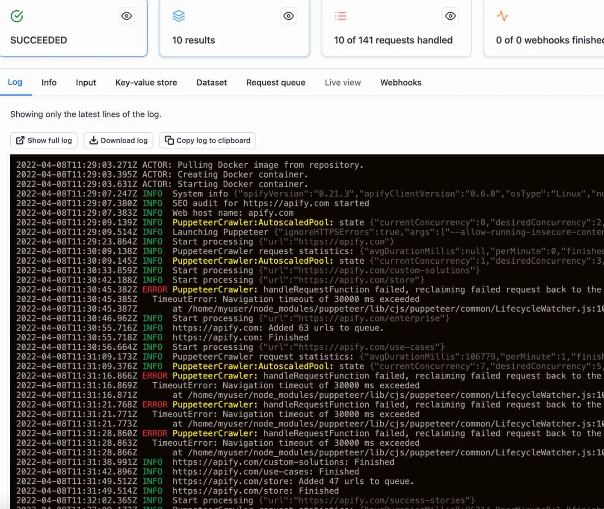
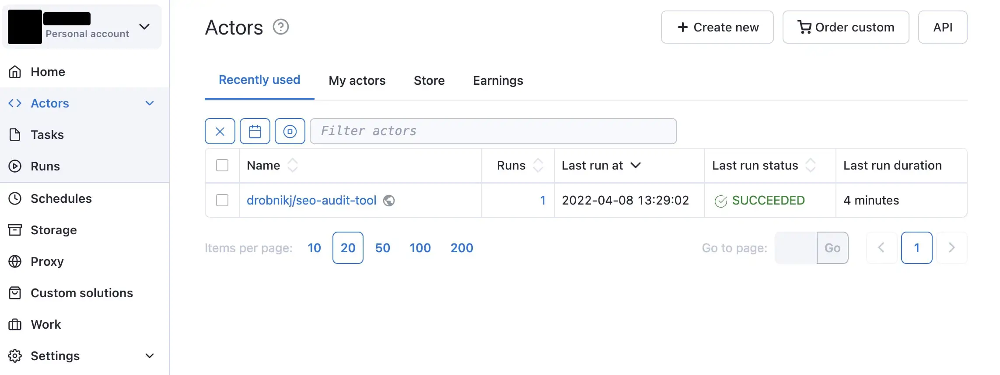

# Actors {#actors}

**What is an actor? How do we create them? Learn the basics of what actors are, how they work, and try out an actor yourself right on the Apify platform!**

---

After you've followed the **Getting started** lesson, you're almost ready to start creating some actors! But before we get into that, let's discuss what an actor is, and a bit about how they work.

## What's an actor? {#what-is-an-actor}

When you deploy your script to the Apify platform, it is then called an **actor**, which is simply a [serverless microservice](https://www.datadoghq.com/knowledge-center/serverless-architecture/serverless-microservices/#:~:text=Serverless%20microservices%20are%20cloud-based,suited%20for%20microservice-based%20architectures.) that accepts an input and produces an output. Actors can run for a few seconds, hours or even infinitely. An actor can perform anything from a simple action such as filling out a web form or sending an email, to complex operations such as crawling an entire website and removing duplicates from a large dataset.

Once an actor has been pushed to the Apify platform, they can be shared to the world through the [Apify Store](https://apify.com/store), and even monetized after going public.

> Though the majority of actors that are currently on the Apify platform are scrapers, crawlers, or automation software, actors are not limited to just scraping. They are just pieces of code running in Docker containers, which means they can be used for nearly anything.

## Actors on the Apify platform {#actors-on-platform}

For a super quick and dirty understanding of what a published actor looks like, and how it works, let's run an SEO audit of **apify.com** using the [SEO audit actor](https://apify.com/drobnikj/seo-audit-tool).

On the front page of the actor, click the green **Try for free** button. If you're logged into your Apify account which you created during the [**Getting started**](./index.md) lesson, you'll be taken to the Apify Console and greeted with a page that looks like this:

This is where we can provide input to the actor. The defaults here are just fine, so we'll just leave it as is and click the green **Start** button to run it. While the actor is running, you'll see it log some information about itself.

After the actor has completed its run (you'll know this when you see **SEO audit for apify.com finished.** in the logs), the results of the run can be viewed by clicking the **Results** tab, then subsequently the **View in another tab** option under **Export**.

## The "Actors" tab {#actors-tab}

While still on the platform, click on the tab with the **< >** icon which says **Actors**. This tab is your one-stop-shop for seeing which actors you've used recently, and which ones you've developed yourself. You will be frequently using this tab when developing and testing on the Apify platform.

Now that you know the basics of what actors are and how to use them, it's time to develop **an actor of your own**!

## Next up {#next}

Get ready, because in the [next lesson](./creating_actors.md), you'll be writing your very own actor!
