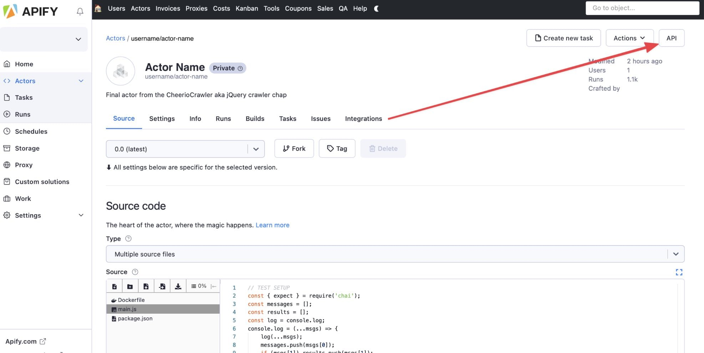
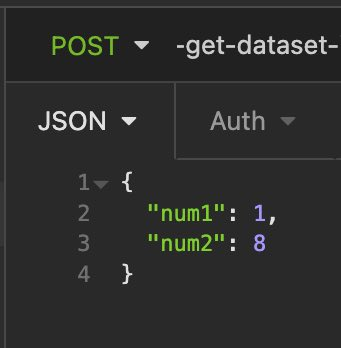
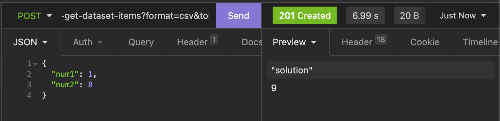

# The Apify API {#the-apify-api}

**Learn how to use the Apify API to programmatically call your actors, retrieve data stored on the platform, view actor logs, and more!**

---

[Apify's API](/api/v2#/reference) is your ticket to the Apify platform without even needing to access the [Apify Console](https://console.apify.com?asrc=developers_portal) web-interface. The API is organized around RESTful HTTP endpoints.

In this lesson, we'll be learning how to use the Apify API to call an actor and view its results. We'll be using the actor we created in the previous lesson, so if you haven't already gotten that one set up, go ahead do that before moving forward if you'd like to follow along.

## Finding your endpoint {#finding-your-endpoint}

Within one of your actors on the [Apify Console](https://console.apify.com?asrc=developers_portal) (we'll use the **adding-actor** from the previous lesson), click on the **API** button in the top right-hand corner:



You should see a long list of API endpoints that you can copy and paste elsewhere, or even test right within the **API** modal. Go ahead and copy the endpoint labeled **Run actor synchronously and get dataset items**. It should look something like this:

```text
https://api.apify.com/v2/acts/YOUR_USERNAME~adding-actor/run-sync?token=YOUR_TOKEN
```

> In this lesson, we'll only be focusing on this one endpoint, as it is the most popularly used one; however, don't let this limit your curiosity! Take a look at the other endpoints in the **API** window to learn about everything you can do to your actor programmatically.

Now, let's move over to our favorite HTTP client (in this lesson we'll use [Insomnia](../../glossary/tools/insomnia.md) in order to prepare and send the request.

## Providing input {#providing-input}

Our **adding-actor** takes in two input values (`num1` and `num2`). When using the actor on the platform, provided these fields either through the UI generated by the **INPUT_SCHEMA.json**, or directly in JSON format. When providing an input when making an API call to run an actor, the input must be provided in the **body** of the POST request as a JSON object.



## Parameters {#parameters}

Let's say we want to run our **adding-actor** via API and view its results in CSV format at the end. We'll achieve this by simply passing the **format** parameter with a value of **csv** to change the output format:

```text
https://api.apify.com/v2/acts/YOUR_USERNAME~adding-actor/run-sync-get-dataset-items?token=YOUR_TOKEN_HERE&format=csv
```

There are many more parameters which can be passed to this endpoint. You can learn about them [here](/api/v2#/reference/actors/run-actor-synchronously-and-get-dataset-items/run-actor-synchronously-with-input-and-get-dataset-items)

> Note: It is safer to put your API token in the **Authorization** header like so: `Authorization: Bearer YOUR_TOKEN`. This is very easy to configure in [Postman](../../glossary/tools/postman.md), [Insomnia](../../glossary/tools/insomnia.md), or any other modern HTTP client.

## Sending the request {#sending-the-request}

If you're not using an HTTP client, you can send the request through your terminal with this command:

```curl
curl -d '{"num1":1, "num2":8}' -H "Content-Type: application/json" -X POST "https://api.apify.com/v2/acts/YOUR_USERNAME~adding-actor/run-sync-get-dataset-items?token=YOUR_TOKEN_HERE&format=csv"
```

Here's the response we got:



And there it is! The actor was run with our inputs of **num1** and **num2**, then the dataset results were returned back to us in CSV format.

## Apify API's many features {#api-many-features}

What we've done in this lesson only scratches the surface of what the Apify API can do. Right from Insomnia, or from any HTTP client, you can [manage datasets](/api/v2#/reference/datasets/dataset/get-dataset) and [key-value stores](/api/v2#/reference/key-value-stores/key-collection/get-dataset), [add to request queues](/api/v2#/reference/request-queues/queue-collection/add-request), [update actors](/api/v2#/reference/actors/actor-object/add-request), and much more! Basically, whatever you can do on the platform's web-interface, you also do through the API.

## Next up {#next}

[Next up](./apify_client.md), we'll be learning about how to use Apify's JavaScript and Python clients to easily interact with the API right within our code.

<!-- Note: From the previous version of this lesson, some now unused but useful images still remain.

- actor-settings-id.jpg
- api-error.jpg

 -->
