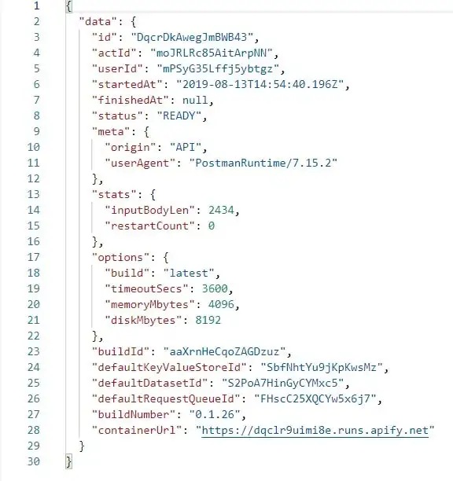
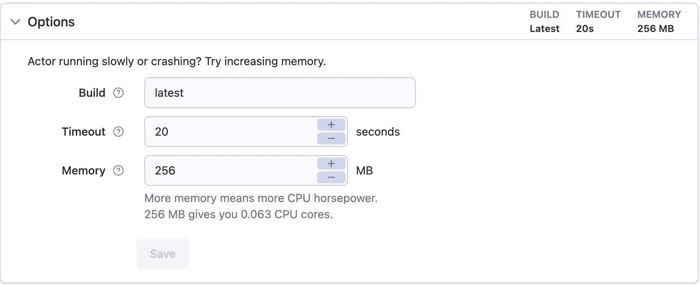

import Tabs from '@theme/Tabs';
import TabItem from '@theme/TabItem';

# Apify client {#apify-client}

**Interact with the Apify API in your code by using the apify-client package, which is available for both JavaScript and Python.**

---

Now that you've gotten your toes wet with interacting with the Apify API through raw HTTP requests, you're ready to become familiar with the **Apify client**, which is a package available for both JavaScript and Python that allows you to interact with the API in your code without  explicitly needing to make any GET or POST requests.

This lesson will provide code examples for both Node.js and Python, so regardless of the language you are using, you can follow along!

## Installing and importing {#installing-and-importing}

If you are going to use the client in Node.js, use this command within one of your projects to install the package through NPM:

```shell
npm install apify-client
```

In Python, you can install it from PyPI with this command:

```shell
pip install apify-client
```

After installing the package, let's make a file named **client** and import the Apify client like so:

<Tabs groupId="main">
<TabItem value="Node.js" label="Node.js">

```javascript
// client.js
import { ApifyClient } from 'apify-client';

```
</TabItem>
<TabItem value="Python" label="Python">

```python
# client.py
from apify_client import ApifyClient

```
</TabItem>
</Tabs>

## Running an actor {#running-an-actor}

In the last lesson, we ran the **adding-actor** and retrieved its dataset items. That's exactly what we're going to do now; however, by using the Apify client instead.

Before we can use the client though, we must create a new instance of the `ApifyClient` class and pass it our API token from the [**Integrations** page](https://console.apify.com/account?tab=integrations&asrc=developers_portal) on the Apify Console:

<Tabs groupId="main">
<TabItem value="Node.js" label="Node.js">

```javascript
const client = new ApifyClient({
    token: 'YOUR_TOKEN',
});

```
</TabItem>
<TabItem value="Python" label="Python">

```python
client = ApifyClient(token='YOUR_TOKEN')

```
</TabItem>
</Tabs>

> If you are planning on publishing your code to a public Github/Gitlab repository or anywhere else online, be sure to set your API token as en environment variable, and never hardcode it directly into your script.

Now that we've got our instance, we can point to an actor using the [`client.actor()`](/api/client/js/reference/class/ApifyClient#actor) function, then call the actor with some input with the [`.call()`](/api/client/js/reference/class/ApifyClient#actor) function - the first parameter of which is the input for the actor.

<Tabs groupId="main">
<TabItem value="Node.js" label="Node.js">

```javascript
const run = await client.actor('YOUR_USERNAME/adding-actor').call({
    num1: 4,
    num2: 2,
});

```
</TabItem>
<TabItem value="Python" label="Python">

```python
run = client.actor('YOUR_USERNAME/adding-actor').call(run_input={
    'num1': 4,
    'num2': 2
})

```
</TabItem>
</Tabs>

> Learn more about the `.call()` function [here](/api/client/js/reference/class/ApifyClient#actor).

## Downloading dataset items {#downloading-dataset-items}

Once an actor's run has completed, it will return a **run info** object that looks something like this:



The `run` variable we created in the last section points to the **run info** object of the run we created with the `.call()` function, which means that through this variable, we can access the run's `defaultDatasetId`. This ID can then be passed into the `client.dataset()` function.

<Tabs groupId="main">
<TabItem value="Node.js" label="Node.js">

```javascript
const dataset = client.dataset(run['defaultDatasetId'])

```
</TabItem>
<TabItem value="Python" label="Python">

```python
dataset = client.dataset(run['defaultDatasetId'])

```
</TabItem>
</Tabs>

Finally, we can download the items in the dataset by using the **list items** function, then log them to the console.

<Tabs groupId="main">
<TabItem value="Node.js" label="Node.js">

```javascript
const { items } = await dataset.listItems();

console.log(items);

```
</TabItem>
<TabItem value="Python" label="Python">

```python
items = dataset.list_items().items

print(items)

```
</TabItem>
</Tabs>

> Notice that in the JavaScript example, we had to convert the `items` to a [`Buffer`](https://nodejs.org/api/buffer.html), then convert the Buffer to a string and parse it. This is because `dataset.downloadItems()` returns a buffer.

The final code for running the actor and fetching its dataset items looks like this:

<Tabs groupId="main">
<TabItem value="Node.js" label="Node.js">

```javascript
// client.js
import { ApifyClient } from 'apify-client';

const client = new ApifyClient({
    token: 'YOUR_TOKEN',
});

const run = await client.actor('YOUR_USERNAME/adding-actor').call({
    num1: 4,
    num2: 2,
});

const dataset = client.dataset(run['defaultDatasetId'])

const { items } = await dataset.listItems();

console.log(items);

```
</TabItem>
<TabItem value="Python" label="Python">

```python
# client.py
from apify_client import ApifyClient

client = ApifyClient(token='YOUR_TOKEN')

actor = client.actor('YOUR_USERNAME/adding-actor').call(run_input={
    'num1': 4,
    'num2': 2
})

dataset = client.dataset(run['defaultDatasetId'])

items = dataset.list_items().items

print(items)

```
</TabItem>
</Tabs>

## Updating an actor {#updating-actor}

If you check the **Settings** tab within your **adding-actor**, you'll notice that the default memory being allocated to the actor is **2048 MB**. This is a bit overkill considering the fact that the actor is only adding two numbers together - **256 MB** would be much more reasonable. Also, we can safely say that the run should never take more than 20 seconds (even this is a generous number), and that the default of 3600 seconds is also overkill.

Let's change these two actor settings via the Apify client using the [`actor.update()`](/api/client/js/reference/class/ActorClient#update) function. This function will call the **update actor** endpoint, which can take `defaultRunOptions` as an input property. You can find the shape of the `defaultRunOptions` in the [API documentation](/api/v2#/reference/actors/actor-object/update-actor). Perfect!

First, we'll create a pointer to our actor, similar to as before (except this time, we won't be using `.call()` at the end):

<Tabs groupId="main">
<TabItem value="Node.js" label="Node.js">

```javascript
const actor = client.actor('YOUR_USERNAME/adding-actor')

```
</TabItem>
<TabItem value="Python" label="Python">

```python
actor = client.actor('YOUR_USERNAME/adding-actor')

```
</TabItem>
</Tabs>

Then, we'll just call the `.update()` method on the `actor` variable we created and pass in our new **default run options**:

<Tabs groupId="main">
<TabItem value="Node.js" label="Node.js">

```javascript
await actor.update({
    defaultRunOptions: {
        build: 'latest',
        memoryMbytes: 256,
        timeoutSecs: 20,
    },
});

```
</TabItem>
<TabItem value="Python" label="Python">

```python
actor.update(default_run_build='latest', default_run_memory_mbytes=256, default_run_timeout_secs=20)

```
</TabItem>
</Tabs>

After running the code, go back to the **Settings** page of **adding-actor**. If your default options now look like this, then it worked!:



## Overview {#overview}

There is so much more you can do with the Apify client than just running actors, updating actors, and downloading dataset items. The purpose of this lesson was just to get you comfortable using the client in your own projects, as it is the absolute best developer tool for integrating the Apify platform with an external system.

For a more in-depth understanding of the Apify API client, give these a quick lookover:

- [API client for JavaScript](https://docs.apify.com/api/client/js)
- [API client for Python](https://docs.apify.com/api/client/python)

## Next up {#next}

Now that you're familiar and a bit more comfortable with the Apify platform, you're ready to start deploying your code to Apify! In the [next section](../deploying_your_code/index.md), you'll learn how to take any project written in any programming language and turn it into an actor.
