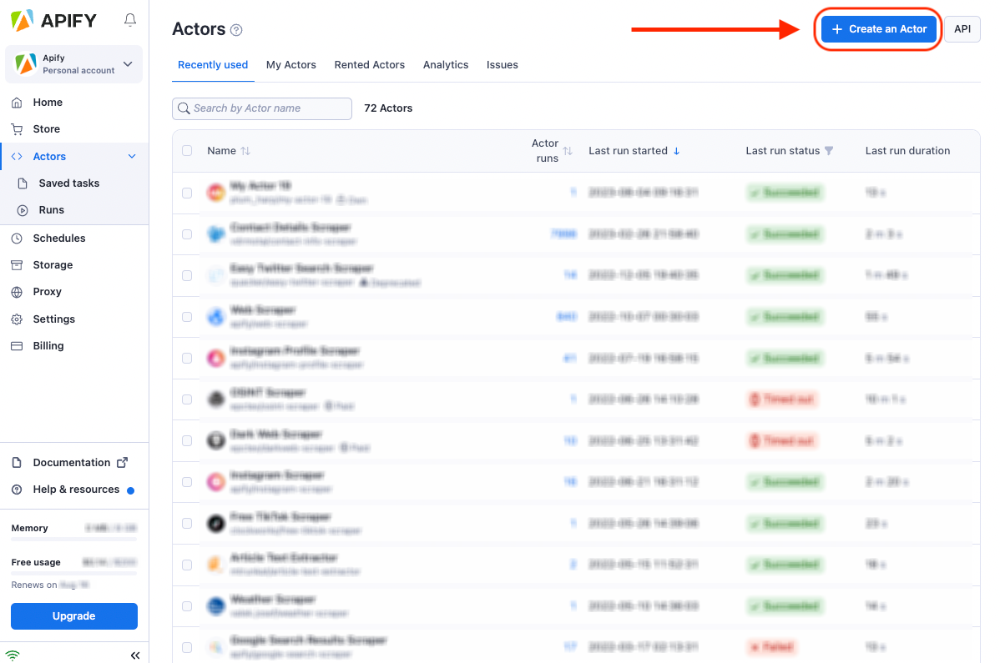
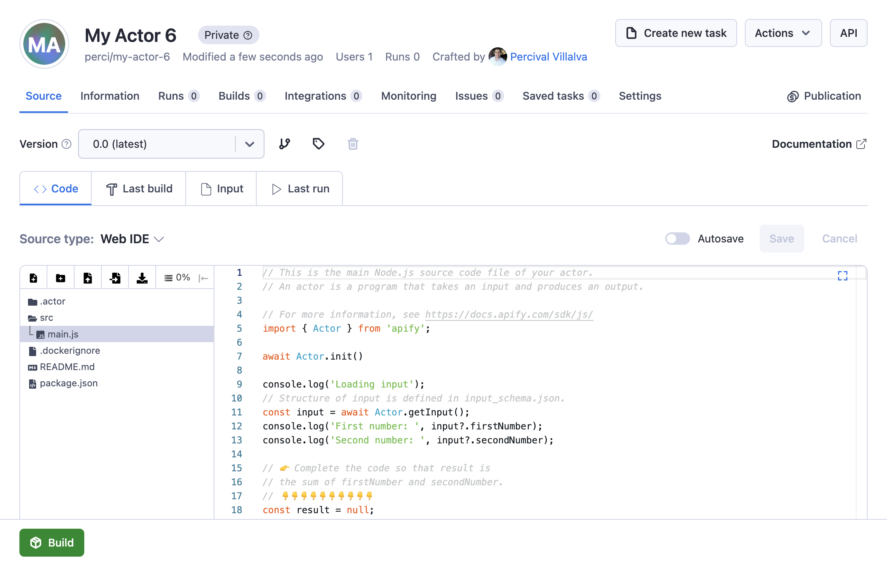
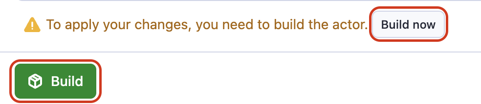
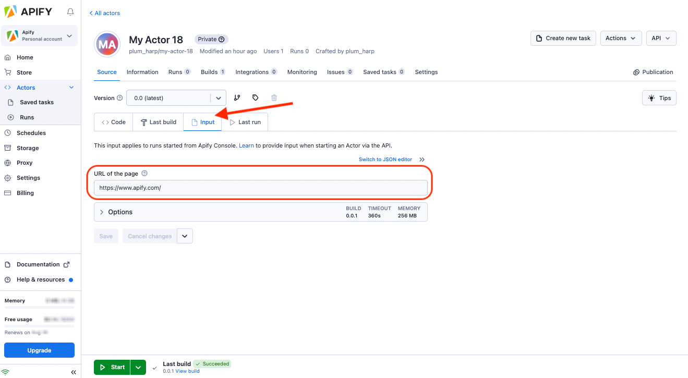
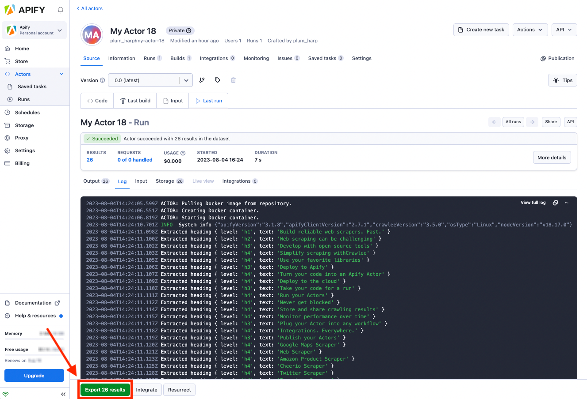

# Creating actors {#creating-actors}

**This lesson offers a hands-on experience in building and running an Actor on the Apify platform using a template. By the end of it, you will build and run your first Actor using an Actor template.**

---

There are several ways to create an Actor, but the easiest method is by selecting an Actor development template. We do not need to install any special software, and everything can be done directly on the Apify platform using an Apify account.

## Choose your template {#choose-your-template}

On the Apify Console, in the [Actors tab](https://console.apify.com?asrc=developers_portal), click on the **Create new** button in the top right-hand corner.



You will be presented with a page featuring several template options in Python, JavaScript, and TypeScript. You can select the one that best fits your specific use case. For example, let's choose the **Start with JavaScript** template and click on **Let's go**.

> Also feel free to give your Actor a custom name instead of the default one. For this lesson though, we'll keep it as **my-actor**.


## Hello World! {#hello-world}

After clicking on **Let's go**, you should be brought to a page that looks like this:



The area where you can see some code and files is called the **Web IDE**, and it is your gateway to writing Actor code directly on the Apify platform.

> It is also possible to deploy code from a GitHub repository or from your local environment, which we will be getting into in future lessons

In the **main.js** file we will find the starting template code:

```js
import { Actor } from 'apify';

await Actor.init()

console.log('Loading input');
// Structure of input is defined in input_schema.json.
const input = await Actor.getInput();
console.log('First number: ', input?.firstNumber);
console.log('Second number: ', input?.secondNumber);

// 👉 Complete the code so that result is
// the sum of firstNumber and secondNumber.
// 👇👇👇👇👇👇👇👇👇👇
const result = null;
// 👆👆👆👆👆👆👆👆👆👆

console.log('The result is: ', result);

// Structure of output is defined in .actor/actor.json
await Actor.pushData({
    firstNumber: input?.firstNumber,
    secondNumber: input?.secondNumber,
    sum: result,
});

await Actor.exit();
```

To make this simple Actor functional, let's delete the current value of `result`, and replace it with the numbers we are getting from the user's input:

```js
const result = input?.firstNumber + input?.secondNumber;
```

The final code should look like this:

```js
import { Actor } from 'apify';

await Actor.init()

console.log('Loading input');

const input = await Actor.getInput();
console.log('First number: ', input?.firstNumber);
console.log('Second number: ', input?.secondNumber);

const result = input?.firstNumber + input?.secondNumber;

console.log('The result is: ', result);

await Actor.pushData({
    firstNumber: input?.firstNumber,
    secondNumber: input?.secondNumber,
    sum: result,
});

await Actor.exit();
```

To save your changes, click on the blue **Save** button.

## Build an actor {#build-an-actor}

In order to run the actor, you've gotta build it. Luckily, that's only a button press away.



After you've clicked the **Build** button, it'll take around 5-10 seconds to complete the build. You'll know it's finished when you see a green **Start** button.


And now we are ready to run the Actor. But before we do that, let's give the Actor some input by going to the `Input` tab.



## Run an actor {#run-an-actor}

Once you have provided the Actor with some meaningful input, click **Start** and wait a few seconds... Do you see something that looks like this?:



If so, it worked! 🥳

Later on, we'll be working on some more complex actors - this was just a quick exercise to get your toes wet.

## Next up {#next}

So we've created an actor, but how can we give it more complex inputs and make it do stuff based on these inputs? This is exactly what we'll be discussing in the [next lesson](./inputs_outputs.md)'s activity.
