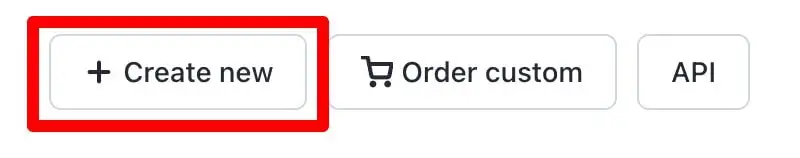
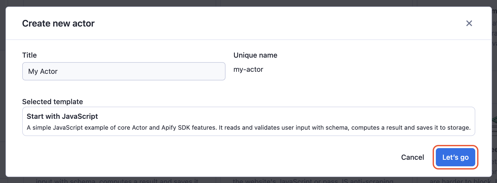
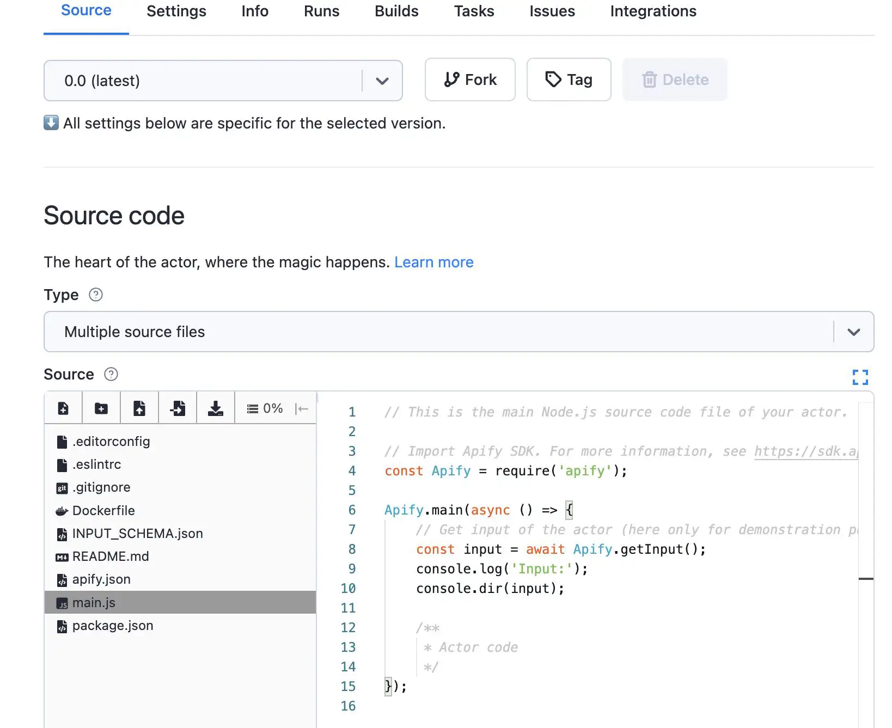
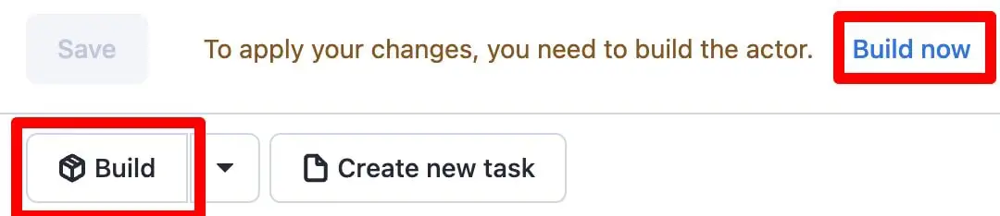
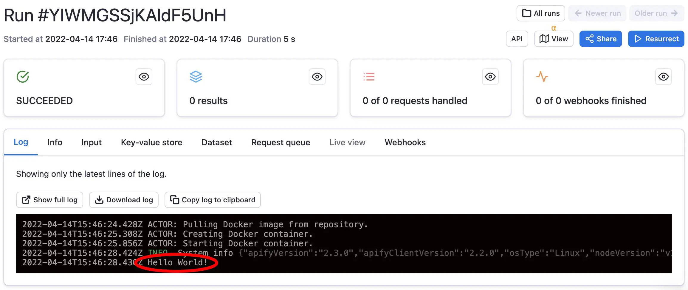

# Creating actors {#creating-actors}

**Build and run your very first actor right on the Apify platform from a template. This lesson provides a hands-on experience with building and running an actor.**

---

Creating an actor is so easy to do, we'll show you right in this lesson how to get one up and running in 5 minutes or less. There is no need to install any special software, as everything can be done right on the Apify platform with an Apify account!

## Choose your template {#choose-your-template}

On the [Apify Console](https://console.apify.com?asrc=developers_portal), click on the **Actors** tab we visited in the previous lesson. In the top right-hand corner, you should see a **Create new** button.



Click it, then choose the **Basic Node.js actor** template and click on **Use template**.

> Also feel free to give the actor a custom name instead of the default name. For this lesson though, we'll keep it as **my-actor**.



## Hello World! {#hello-world}

After clicking on **Use template**, you should be brought to a page that looks like this:



The area where you can see some code and files is called the **multifile editor**, and it is your gateway to writing actor directly on the Apify platform.

> It is also possible to deploy code to the platform from a Github repo or from your local environment, which we will be getting into in some of this course's future lessons

Go ahead and delete the three lines of code in the **main.js**  file that look like this:

```js
const input = await Actor.getInput();
console.log('Input:');
console.dir(input);
```

> Feel free to also remove all of the comments

And replace them with this:

```js
console.log('Hello World!')
```

The final code should look like this:

```js
import { Actor } from 'apify';

await Actor.init();

console.log('Hello World!')

await Actor.exit();
```

To save your changes, click on the blue **Save** button.

## Build an actor {#build-an-actor}

In order to run the actor, you've gotta build it. Luckily, that's only a button press away.



After you've clicked the **Build** button, it'll take around 5-10 seconds to complete the build. You'll know it's finished when you see a green **Start** button.


This beautiful button's presence means we can now run the actor!

## Run an actor {#run-an-actor}

Click **Start** and wait a few seconds... Do you see something that looks like this?:



If so, it worked! 🥳

Later on, we'll be working on some more complex actors - this was just a fun and quick exercise to get your toes wet.

## Next up {#next}

So we've created an actor, but how can we give it some input, then make it do stuff based on that input? This is exactly what we'll be discussing in the [next lesson](./inputs_outputs.md)'s activity.
