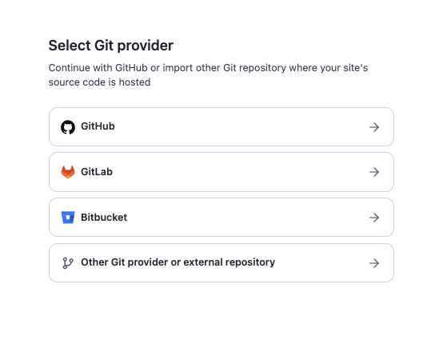

# Creating Actors {#creating-actors}

**This lesson offers hands-on experience in building and running Actors in Apify Console using a template. By the end of it, you will be able to build and run your first Actor using an Actor template.**

---

You can create an Actor in several ways. You can create one from your own source code hosted in a Git repository or in your local machine, for example. But in this tutorial, we'll focus on the easiest method: selecting an Actor code template. We don't need to install any special software, and everything can be done directly in Apify Console using an Apify account.

## Choose the source {#choose-the-source}

Once you're in Apify Console, go to [Actors](https://console.apify.com/actors?asrc=developers_portal), and click on the **Create an Actor** button in the top right-hand corner.


You'll be presented with a page featuring two ways to get started with a new Actor.

1. Creating an Actor from existing source code (using Git providers or pushing the code from your local machine using Apify CLI)
2. Creating an Actor from a code template

|                               Existing source code                                |                                  Code templates                                  |
|:---------------------------------------------------------------------------------:|:--------------------------------------------------------------------------------:|
|   |  |

## Creating Actor from existing source code {#existing-source-code}

If you already have your code hosted by a Git provider, you can use it to create an Actor by linking the repository. If you use GitHub, you can use our [GitHub integration](/platform/integrations/github) to create an Actor from your public or private repository with just a few clicks. You can also use GitLab, Bitbucket or other Git providers or external repositories.



You can also push your existing code from your local machine using [Apify CLI](/cli). This is useful when you develop your code locally and then you want to push it to the Apify Console to run the code as an Actor in the cloud. For this option, you'll need the [Apify CLI installed](/cli/docs/installation) on your machine. By clicking on the **Push your code using the Apify command-line interface (CLI)** button, you will be presented with instructions on how to push your code to the Apify Console.


## Creating Actor from code template {#code-template}

Python, JavaScript, and TypeScript have several template options that you can use.

> You can select one from the list on this page or you can browse all the templates in the template library by clicking on the **View all templates** button in the right corner.

For example, let's choose the **Start with JavaScript** template and click on the template card.


You will end up on a template detail page where you can see all the important information about the template - description, included features, used technologies, and what is the use-case of this template. More importantly, there is a code preview and also instructions for how the code works.


### Using the template in the Web IDE {#web-ide}

By clicking **Use this template** button you will create the Actor in Apify Console and you will be moved to the **Code** tab with the [Web IDE](/platform/actors/development/quick-start/web-ide) where you can see the code of the template and start editing it.

> The Web IDE is a great tool for developing your Actor directly in Apify Console without the need to install or use any other software.


### Using the template locally {#local}

If you want to use the template locally, you can again use our [Apify CLI](/cli) to download the template to your local machine.

> Creating an Actor from a template locally is a great option if you want to develop your code using your local environment and IDE and then push the final solution back to the Apify Console.

When you click on the **Use locally** button, you'll be presented with instructions on how to create an Actor from this template in your local environment.

With the Apify CLI installed, you can simply run the following commands in your terminal:

```bash
apify create my-actor -t getting_started_node
```

```bash
cd my-actor
apify run
```


## Start with scraping single page {#scraping-single-page}

This template is a great starting point for web scraping as it extracts data from a single website. It uses [Axios](https://axios-http.com/docs/intro) for downloading the page content and [Cheerio](https://cheerio.js.org/) for parsing the HTML from the content.

Let's see what's inside the **Start with JavaScript** template. The main logic of the template lives in the `src/main.js` file.

```js
// Axios - Promise based HTTP client for the browser and node.js (Read more at https://axios-http.com/docs/intro).
import { Actor } from 'apify';
import axios from 'axios';
// Cheerio - The fast, flexible & elegant library for parsing and manipulating HTML and XML (Read more at https://cheerio.js.org/).
import * as cheerio from 'cheerio';
// Apify SDK - toolkit for building Apify Actors (Read more at https://docs.apify.com/sdk/js/).

// The init() call configures the Actor for its environment. It's recommended to start every Actor with an init().
await Actor.init();

// Structure of input is defined in input_schema.json
const input = await Actor.getInput();
const { url } = input;

// Fetch the HTML content of the page.
const response = await axios.get(url);

// Parse the downloaded HTML with Cheerio to enable data extraction.
const $ = cheerio.load(response.data);

// Extract all headings from the page (tag name and text).
const headings = [];
$('h1, h2, h3, h4, h5, h6').each((i, element) => {
    const headingObject = {
        level: $(element).prop('tagName').toLowerCase(),
        text: $(element).text(),
    };
    console.log('Extracted heading', headingObject);
    headings.push(headingObject);
});

// Save headings to Dataset - a table-like storage.
await Actor.pushData(headings);

// Gracefully exit the Actor process. It's recommended to quit all Actors with an exit().
await Actor.exit();
```

The Actor takes the `url` from the input and then:

1. Sends a request to the URL.
2. Downloads the page's HTML content.
3. Extracts headings (H1 - H6) from the page.
4. Stores the extracted data.

The extracted data is stored in the [Dataset](/platform/storage/dataset) where you can preview it and download it. We'll show how to do that later in [Run the Actor](#run-the-actor) section.

> Feel free to play around with the code and add some more features to it. For example, you can extract all the links from the page or extract all the images or completely change the logic of this template. Just keep in mind that this template uses [input schema](/academy/deploying-your-code/input-schema) defined in the `.actor/input_schema.json` file and linked to the `.actor/actor.json`. If you want to change the input schema, you need to change it in those files as well. Learn more about the Actor input and output [in the next page](/academy/getting-started/inputs-outputs).

## Build the Actor 🧱 {#build-an-actor}

In order to run the Actor, you need to [build](/platform/actors/development/builds-and-runs/builds) it first. Click on the **Build** button at the bottom of the page or **Build now** button right under the code editor.


After you've clicked the **Build** button, it'll take around 5–10 seconds to complete the build. You'll know it's finished when you see a green **Start** button.


## Fill the input {#fill-input}

And now we are ready to run the Actor. But before we do that, let's give the Actor some input by going to the `Input` tab.

The input tab is where you can provide the Actor with some meaningful input. In this case, we'll be providing the Actor with a URL to scrape. For now, we'll use the prefilled value of [Apify website](https://apify.com/) (`https://apify.com/`).

You can change the website you want to extract the data from by simply changing the URL in the input field.


## Run the Actor {#run-the-actor}

Once you have provided the Actor with some URL you want to extract the data from, click **Start** button and wait a few seconds. You should see the Actor run logs in the **Last run** tab.


After the Actor finishes, you can preview or download the extracted data simply by clicking on the **Export X results** button.


And that's it! You've just created your first Actor and extracted data from a website 🎉.

## Getting stuck? Check out the tips 💡 {#get-help-with-tips}

If you ever get stuck, you can always click on the **Tips** button in the top right corner of the page. It will show you a list of tips that are relevant to the Actor development.


## Next up {#next}

We've created an Actor, but how can we give it more complex inputs and make it do stuff based on these inputs? This is exactly what we'll be discussing in the [next lesson](./inputs_outputs.md)'s activity.
