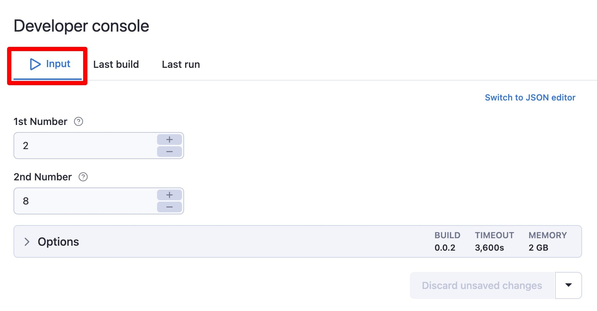
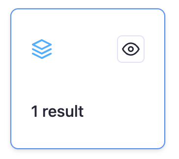
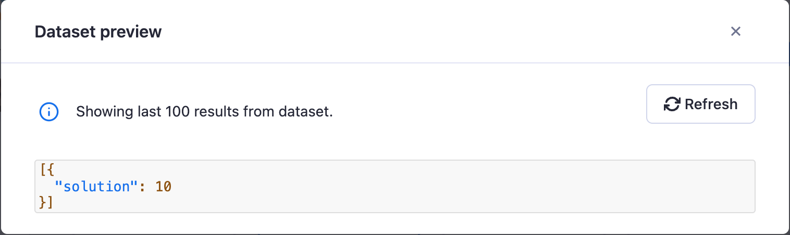

# Inputs & outputs {#inputs-outputs}

**Create an Actor from scratch which takes an input, processes that input, and then outputs a result that can be used elsewhere.**

---

Actors, as any other programs, take inputs and generate outputs. The Apify platform has a way how to specify what inputs the Actor expects, and a way to temporarily or permanently store its results.

In this lesson, we'll be demonstrating inputs and outputs by building an Actor which takes two numbers as input, adds them up, and then outputs the result.

## Accept input into an Actor {#accept-input}

Let's first create another new Actor using the same template as before. Feel free to refer to the [previous lesson](./creating_actors.md) for a refresher on how to do this.

Replace all of the code in **main.js** with this code snippet:

```js
import { Actor } from 'apify';

await Actor.init();

// Grab our numbers which were inputted
const { num1, num2 } = await Actor.getInput();

// Calculate the solution
const solution = num1 + num2;

// Push the solution to the dataset
await Actor.pushData({ solution });

await Actor.exit();
```

Then, replace everything in **INPUT_SCHEMA.json**  with this:

> This step isn't necessary, as the Actor will still be able to take input in JSON format without it; however, we are providing the content for this Actor's input schema in this lesson, as it will give the Apify platform a blueprint off of which it can generate a nice UI for your inputs, as well as validate their values.

```json
{
    "title": "Number adder",
    "type": "object",
    "schemaVersion": 1,
    "properties": {
        "num1": {
            "title": "1st Number",
            "type": "integer",
            "description": "First number.",
            "editor": "number"
        },
        "num2": {
            "title": "2nd Number",
            "type": "integer",
            "description": "Second number.",
            "editor": "number"
        }
    },
    "required": ["num1", "num2"]
}
```

> If you're interested in learning more about how the code works, and what the **INPUT_SCHEMA.json** means, read about [inputs](/sdk/js/docs/examples/accept-user-input) and [adding data to a dataset](/sdk/js/docs/examples/add-data-to-dataset) in the Apify SDK documentation, and refer to the [input schema docs](/platform/actors/development/actor-definition/input-schema#integer).

Finally, **Save** and **Build** the Actor just as you did in the previous lesson.

## Configuring an Actor with inputs {#configuring}

If you scroll down a bit, you'll find the **Developer console** located under the multifile editor. By default, after running a build, the **Last build** tab will be selected, where you can see all of the logs related to building the Actor. Inputs can be configured within the **Input** tab.



Enter any two numbers you'd like, then press **Start**. The Actor's run should be completed almost immediately.

## View Actor results {#view-results}

Since we've pushed the result into the default dataset, it, and some info about it can be viewed by clicking this box, which will take you to the results tab:



On the results tab, there are a whole lot of options for which format to view/download the data in. Keep the default of **JSON** selected, and click on **Preview**.



There's our solution! Did it work for you as well? Now, we can download the data right from the results tab to be used elsewhere, or even programmatically retrieve it by using [Apify's API](/api/v2) (we'll be discussing how to do this in the next lesson).

It's important to note that the default dataset of the Actor, which we pushed our solution to, will be retained for 7 days. If we wanted the data to be retained for an indefinite period of time, we'd have to use a named dataset. For more information about named storages vs unnamed storages, read a bit about [data retention on the Apify platform](/platform/storage#data-retention).

## Next up {#next}

In [next lesson](./apify_api.md)'s fun activity, you'll learn how to call the Actor we created in this lesson programmatically using one of Apify's most powerful tools - the Apify API.
