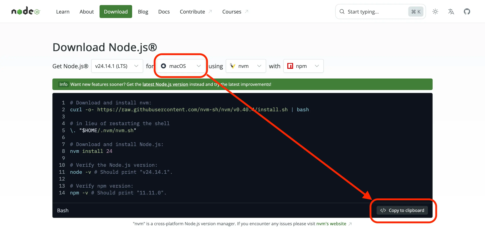

**In this lesson, we'll use ChatGPT and a few commands to create an app for tracking prices on an e-commerce website.**

---

Want to get data about prices on [this Sales page](https://warehouse-theme-metal.myshopify.com/collections/sales)? Even without knowing how to code, you can open [ChatGPT](https://chatgpt.com/), type the following, and you'll have a scraper ready:

```text
Create a scraper in JavaScript which downloads
https://warehouse-theme-metal.myshopify.com/collections/sales,
extracts all the products in Sales and saves a CSV file,
which contains:

- Product name
- Product detail page URL
- Price
```

Try it! While the code generated will most likely work out of the box, the resulting program will have a few caveats. Some are usability issues:

- _User-operated:_ We have to run the scraper ourselves. If we're tracking price trends, we'd need to remember to run it daily. And if we want alerts for big discounts, manually running the program isn't much better than just checking the site in a browser every day.
- _Manual data management:_ Tracking prices over time means figuring out how to organize the exported data ourselves. Processing the data could also be tricky since different analysis tools often require different formats.

Some are technical challenges:

- _No monitoring:_ Even if we knew how to set up a server or home installation so our scraper runs regularly, we'd have little insight into whether it ran successfully, what errors or warnings occurred, how long it took, or what resources it used.
- _Anti-scraping risks:_ If the target website detects our scraper, they can rate-limit or block us. Sure, we could run it from a coffee shop's Wi-Fi, but eventually they'd block that too, and we'd seriously annoy our barista.

<!-- TODO START rewrite this paragraph, it's really bad -->
To address all of this, we'll use [Apify](https://apify.com/), where we can deploy any program as long as it's structured as an Actor. We'll thank ourselves later if we start as an Actor from the beginning.
<!-- TODO END rewrite this paragraph, it's really bad -->

First, we'll use a few commands to set up an Actor template, and then we'll prompt ChatGPT to generate the code for scraping that Sales page.

:::info The Warehouse store

In this course, we'll scrape a real e-commerce site instead of artificial playgrounds or sandboxes. Shopify, a major e-commerce platform, has a demo store at [warehouse-theme-metal.myshopify.com](https://warehouse-theme-metal.myshopify.com/). It strikes a good balance between being realistic and stable enough for a tutorial.

:::

## Installing Node.js

With AI, we don't need to learn coding before we build a scraper. AI writes the code for us. We still need to set up our environment so we can run that code.

We'll develop our scraper in a mainstream programming language called JavaScript. To run command line programs written in JavaScript, we'll need a tool called Node.js.

Let's head to the [Download Node.js](https://nodejs.org/en/download) web page. You should see a row of configuration dropdowns and a rather large code block below, with quite a few commands. Check if the website guessed your operating system correctly, and copy the whole block to the clipboard:



Now paste it as-is to your Terminal (macOS/Linux) or Command Prompt (Windows) and let it execute using the <kbd>↵</kbd> key. Once the installation finishes, you should see versions of Node.js and npm (another related tool) printed:

```text
...
$ node -v
v24.11.1
$ npm -v
11.6.2
```

The exact version numbers are not really important. If you see the versions printed, it means we've successfully installed Node.js and npm.

## Installing Apify CLI

Now we'll install Apify CLI. It's a command-line tool that works as a remote control for the Apify platform. It also helps us structure our scraper as an Actor so it can run on the platform.

Apify CLI happens to be also made in JavaScript, so we can use the npm tool we just installed to get it on our computer:

```text
npm install -g apify-cli
```

Once the command finishes, let's try if everything went all right:

```text
apify --version
```

If it prints something like the following, we're ready to start building:

```text
apify-cli/0.0.0 (1a2b3c4) running on ... with node-0.0.0, installed via ...
```

## Creating an Actor

Now let's use the Apify CLI to help us kick off a new Actor:

```text
apify create warehouse-scraper
```

It starts a wizard where you can choose from various options. For each option, press <kbd>↵</kbd> to accept the default:

```text
✔ Choose the programming language of your new Actor: JavaScript
✔ Choose a template for your new Actor. You can check more information at https://apify.com/templates. Crawlee + Cheerio
✔ Almost done! Last step is to install dependencies. Install dependencies

...

Success: ✅ Actor 'warehouse-scraper' created successfully!

Next steps:

cd "warehouse-scraper"
apify run

💡 Tip: Use 'apify push' to deploy your Actor to the Apify platform
📖 Docs: https://docs.apify.com/platform/actors/development
🌱 Git repository initialized in 'warehouse-scraper'. You can now commit and push your Actor to Git.
```

Now that's a lot of output, but no worries, the important part is that we've successfully used a template to set up a new Actor project!

A new directory `warehouse-scraper` has been created for us, with a variety of files and directories inside. The output instructs us to go to this new project directory, so let's do it:

```text
cd "warehouse-scraper"
```

Now we can run commands which control this new project. We didn't change the template in any way though, so it won't scrape the Warehouse store for us yet.

Out of the box, the template includes a sample Actor that walks through the [crawlee.dev](https://crawlee.dev/) website and downloads all its pages. This process is called _crawling_, and the sample Actor uses a crawling tool called Crawlee, so its documentation is chosen as a sample target website. Let's see if we can run it:

```text
apify run
```

If you see a flood of output mentioning something called `CheerioCrawler`, it means the template works and we can move on to editing its files so that it does what we want.

```text
...
INFO  CheerioCrawler: Starting the crawler.
INFO  CheerioCrawler: enqueueing new URLs
INFO  CheerioCrawler: Crawlee · Build reliable crawlers. Fast. {"url":"https://crawlee.dev/"}
...
INFO  CheerioCrawler: Finished! Total 107 requests: 107 succeeded, 0 failed. {"terminal":true}
```

We're done with commands for now, but do not close the Terminal or Command Prompt window yet, as we'll soon need it again.

If you run into issues with the template wizard or the sample Actor, share this tutorial with [ChatGPT](https://chatgpt.com/), include the errors you saw, and ask for help debugging.

## Scraping products

Now we're ready to get our own scraper done. We'll open the `src` directory inside the Actor project and find a file called `main.js`.

We'll open it in a _plain text editor_. Every operating system includes one: Notepad on Windows, TextEdit on macOS, and similar tools on Linux.

:::danger Avoid rich text editors
Do not use a _rich text editor_, such as Microsoft Word. They're great for human-readable documents with rich formatting, but for code editing, use either dedicated coding editors, or the simplest tool possible.
:::

In the editor, we can see JavaScript code. Let's select all the code and copy to our clipboard. Then we'll open a _new ChatGPT conversation_ and start with a prompt like this:

```text
I'm building an Apify Actor that will run on the Apify platform.
I need to modify a sample template project so it downloads
https://warehouse-theme-metal.myshopify.com/collections/sales,
extracts all products in Sales, and returns data with
the following information for each product:

- Product name
- Product detail page URL
- Price

Before the program ends, it should log how many products it collected.
Code from main.js follows. Reply with a code block containing
a new version of that file.
```

We'll use <kbd>Shift+↵</kbd> to add a few empty lines, then paste the code from our clipboard. After submitting, the AI chat should return a large code block with a new version of `main.js`. Copy it, go back to our text editor, and replace the original `main.js` content.

:::info Code and colors
Code is plain text. Some tools color it to make it easier to read, and ChatGPT does this by default. Plain text editors usually show code in black and white, and that's completely fine.
:::

When we're done, we must not forget to _save the change_ with <kbd>Ctrl+S</kbd> or, on macOS, <kbd>Cmd+S</kbd>. Now let's see if the new code works. To run the program, let's go back to Terminal (macOS/Linux) or Command Prompt (Windows) and use Apify CLI again:

```text
apify run
```

If we are lucky, the output should be similar to this:

```text
Run: npm run start

> warehouse-scraper@0.0.1 start
> node src/main.js

INFO  System info {"apifyVersion":"3.6.0","apifyClientVersion":"2.22.2","crawleeVersion":"3.16.0","osType":"Darwin","nodeVersion":"v25.6.1"}
...
INFO  CheerioCrawler: Starting the crawler.
INFO  CheerioCrawler: Processing page: https://warehouse-theme-metal.myshopify.com/collections/sales
...
INFO  CheerioCrawler: Finished!
INFO  Total products collected: 24
```

This output says `Total products collected: 24`. The Sales page displays 24 products per page and contains 50 products in total.

Depending on whether ChatGPT decided to walk through all pages or scrape just the first one, you might get 24 or more products. For now, any sign that it scraped products is good news.

:::caution Debugging
If your program crashes instead, copy the error message, send it to your ChatGPT conversation, and ask for a fix.
:::

## Exporting to CSV

Our program likely works, but we haven't seen the data yet. Let's add a CSV export. CSV is a format most data apps can read, including Microsoft Excel, Google Sheets, and Apple Numbers. Continue your ChatGPT conversation with:

```text
Before the program ends, I want it to export all data
as "dataset.csv" in the current working directory.
```

ChatGPT should return a new code block with CSV export added. Let's replace `main.js` with that version and save our changes. Then let's run the scraper again:

```text
apify run
```

In the project directory, a new file called `dataset.csv` should emerge. We can use any of the programs mentioned earlier to check what's inside:

| productName | productUrl | price |
| --- | --- | --- |
| JBL Flip 4 Waterproof Portable Bluetooth Speaker | https://warehouse-theme-metal.myshopify.com/products/jbl-flip-4-waterproof-portable-bluetooth-speaker | Sale price$74.95 |
| Sony XBR-950G BRAVIA 4K HDR Ultra HD TV | https://warehouse-theme-metal.myshopify.com/products/sony-xbr-65x950g-65-class-64-5-diag-bravia-4k-hdr-ultra-hd-tv | Sale priceFrom $1,398.00 |
| Sony SACS9 10" Active Subwoofer | https://warehouse-theme-metal.myshopify.com/products/sony-sacs9-10-inch-active-subwoofer | Sale price$158.00 |

…and so on. Looks good!

Well, does it? If we look closely, the prices include extra text, which isn't ideal. We'll improve this in one of the next lessons. We'll also improve the workflow so we don't have to keep copying and pasting.

Despite a few flaws, we've successfully created a first working prototype of a price-watching app with no coding knowledge. And with a bit of extra command-line work, we now have something we can deploy to a platform where it can run regularly and reliably. In the next lesson, we'll do exactly that.
