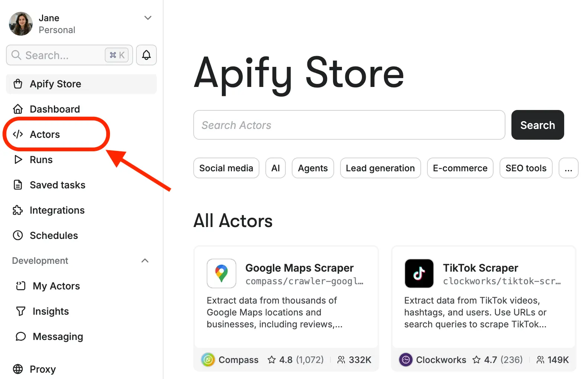
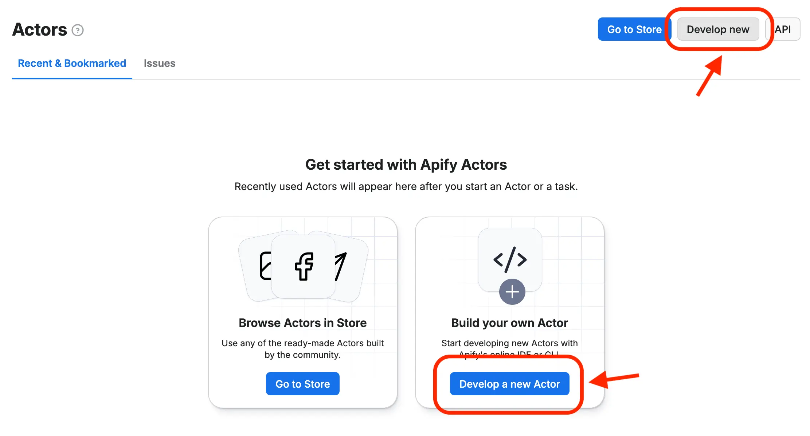
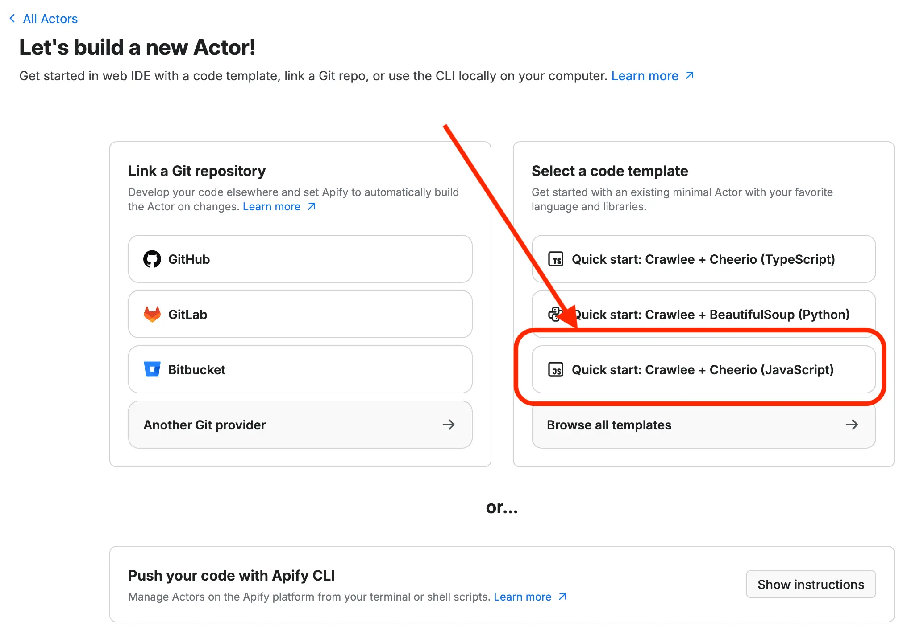
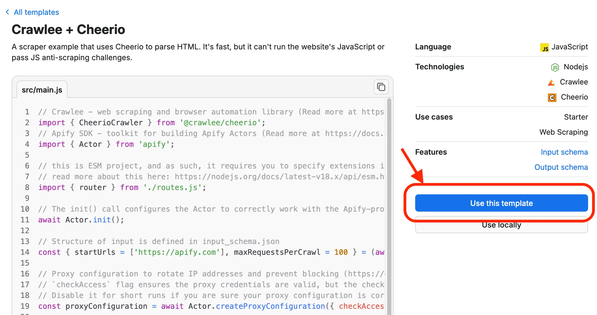
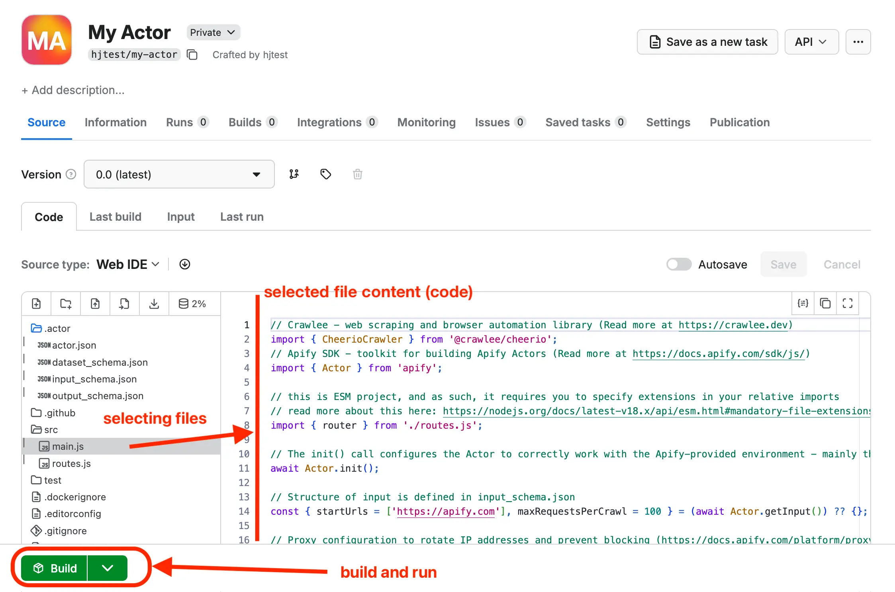
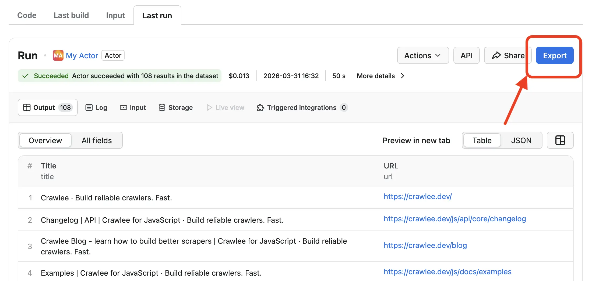
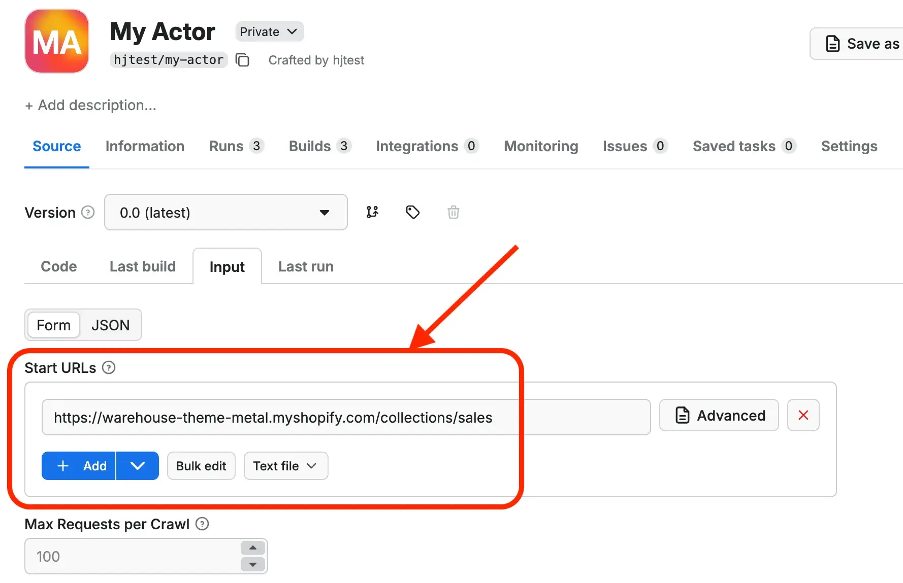
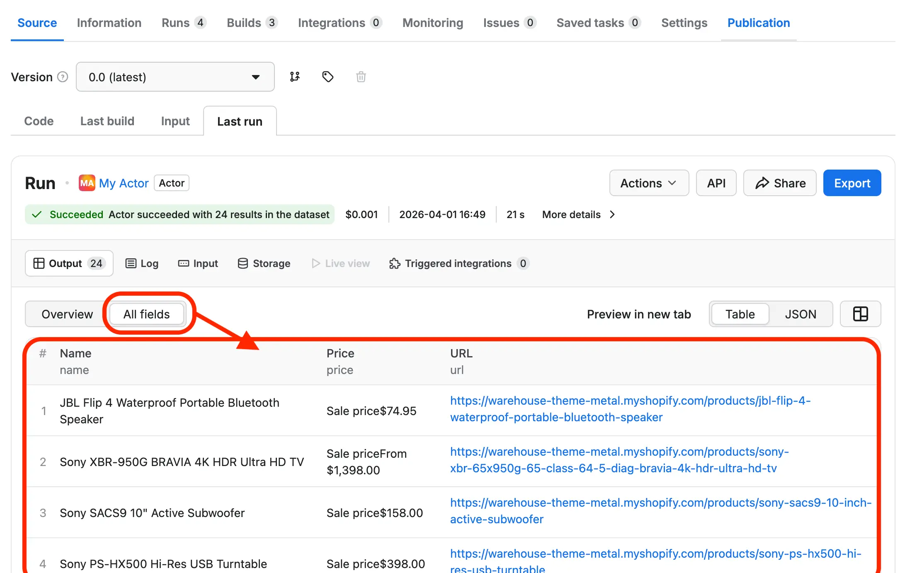

**In this lesson, we'll use ChatGPT and the Apify platform to create an app for tracking prices on an e-commerce website.**

---

Want to get data about prices on [this Sales page](https://warehouse-theme-metal.myshopify.com/collections/sales)? Even without knowing how to code, we can open [ChatGPT](https://chatgpt.com/), type the following, and we'll have a scraper ready:

```text
Create a scraper in JavaScript which downloads
https://warehouse-theme-metal.myshopify.com/collections/sales,
extracts all the products in Sales and saves a CSV file,
which contains:

- Product name
- Product detail page URL
- Price
```

Try it! While the code generated will most likely work out of the box, the resulting program will have a few caveats. Some are usability issues:

- _User-operated:_ We have to run the scraper ourselves. If we're tracking price trends, we'd need to remember to run it daily. If we want, for example, alerts for big discounts, manually running the program isn't much better than just checking the site in a browser every day.
- _Manual data management:_ Tracking prices over time means figuring out how to organize the exported data ourselves. Processing the data could also be tricky since different analysis tools often require different formats.

Some are technical challenges:

- _No monitoring:_ Even if we knew how to set up a server or home installation so our scraper runs regularly, we'd have little insight into whether it ran successfully, what errors or warnings occurred, how long it took, or what resources it used.
- _Anti-scraping risks:_ If the target website detects our scraper, they can rate-limit or block us. Sure, we could run it from a coffee shop's Wi-Fi, but eventually they'd block that too, and we'd seriously annoy our barista.

To overcome these limitations, we'll use [Apify](https://apify.com/), a platform where our scraper can run independently of our computer.

## Creating Apify account

First, let's [create a new Apify account](https://console.apify.com/sign-up). The registration will put us through a few checks to confirm we're human and our email is valid. It's annoying, but necessary to prevent abuse of the platform.

Once we have an active account, we can start working on our scraper. Using the platform's resources costs money, but worry not, everything we cover here fits within [Apify's free tier](https://apify.com/pricing).

## Creating a new Actor

Your phone runs apps, Apify runs Actors. If we want Apify to run something for us, it must be wrapped in the Actor structure. Conveniently, the platform provides ready-made templates we can use.

After login, you land on a page called **Apify Store**. Apify serves both as an infrastructure to privately deploy and run own scrapers, and as a marketplace, where anyone can offer their ready scrapers to others for rent. But let's hold off on exploring Apify Store for now. We'll go to **Actors**:



In **Actors**, we'll choose **Develop a new Actor**:



Apify supports several ways how to start a new project. We'll navigate through the screen to select the **Quick start: Crawlee + Cheerio (JavaScript)** code template:



This opens a preview of the template, where we'll confirm our choice:



And just like that, we have our first Actor! It's only a sample scraper which walks through a website and extracts page titles, but something we can already run and it'll work.

## Running sample Actor

The Actor's detail page has a plethora of tabs and settings, but for now we'll stay at **Source > Code**. That's where the **Web IDE** is.

IDE stands for _integrated development environment_. Fear not, it's just a jargon for ‘an app for editing code, somewhat comfortably’. In the Web IDE, we can browse the files the Actor is made of, and change their contents.



But right now we'll hold off changing anything yet. First let's try whether the Actor works. We'll hit the **Build** button, which tells the platform to take all the Actor files and prepare a program we can then run.

The _build_ takes approximately one minute to finish. When done, the button becomes a **Start** button. Finally, we are ready. Let's press it!

The scraper starts running and we'll have to wait another moment until the first rows start to appear in the output table.



In the end, we should end up with around 100 results which we can immediately export to several formats suitable for data analysis, including CSV, which MS Excel or Google Sheets can open.

## Modifying code with ChatGPT

Of course, we didn't want page titles, but a scraper tracking e-commerce prices. Let's prompt ChatGPT to change the code so that it scrapes the [Sales page](https://warehouse-theme-metal.myshopify.com/collections/sales).

:::info The Warehouse store

In this course, we'll scrape a real e-commerce site instead of artificial playgrounds or sandboxes. Shopify, a major e-commerce platform, has a demo store at [warehouse-theme-metal.myshopify.com](https://warehouse-theme-metal.myshopify.com/). It strikes a good balance between being realistic and stable enough for a tutorial.

:::

First let's navigate through the tabs to **Source > Input**, where we can change what the Actor takes on input. The sample scraper walks through whatever website we give to it in the **Start URLs** field. We'll change it to this URL:

```text
https://warehouse-theme-metal.myshopify.com/collections/sales
```



Now let's go back to **Source > Code**, so that we can work with the Web IDE. We'll select a file called `routes.js` (inside the `src` directory). We'll see a code similar to this one:

```js
import { createCheerioRouter } from '@crawlee/cheerio';

export const router = createCheerioRouter();

router.addDefaultHandler(async ({ enqueueLinks, request, $, log, pushData }) => {
    log.info('enqueueing new URLs');
    await enqueueLinks();

    // Extract title from the page.
    const title = $('title').text();
    log.info(`${title}`, { url: request.loadedUrl });

    // Save url and title to Dataset - a table-like storage.
    await pushData({ url: request.loadedUrl, title });
});
```

We'll select all the code and copy to our clipboard. Then we'll switch to [ChatGPT](https://chatgpt.com/), open **New chat** and start with a prompt like this:

```text
I'm building an Apify Actor that will run on the Apify platform.
I need to modify a sample template project so it downloads
https://warehouse-theme-metal.myshopify.com/collections/sales,
extracts all products in Sales, and returns data with
the following information for each product:

- Product name
- Product detail page URL
- Price

Before the program ends, it should log how many products it collected.
Code from routes.js follows. Reply with a code block containing
a new version of that file.
```

We'll use <kbd>Shift+↵</kbd> to add a few empty lines, then paste the code from our clipboard. After submitting, the AI chat should return a large code block with a new version of `routes.js`. Copy it, switch back to the Web IDE, and replace the original `routes.js` content. That's it, we are ready to roll!

## Scraping products

Now let's see if the new code works. The button we previously used for building and running conveniently became a **Save, Build & Start** button, so let's press it and see what happens. In a minute or so we should see the results appearing in the output area.



Sofar we didn't tell the platform much about the data we expect, so the **Overview** pane lists only product URLs, but if we go to **All fields**, we'll be able to see it really scraped everything we asked for:

| name | url | price |
| --- | --- | --- |
| JBL Flip 4 Waterproof Portable Bluetooth Speaker | https://warehouse-theme-metal.myshopify.com/products/jbl-flip-4-waterproof-portable-bluetooth-speaker | Sale price$74.95 |
| Sony XBR-950G BRAVIA 4K HDR Ultra HD TV | https://warehouse-theme-metal.myshopify.com/products/sony-xbr-65x950g-65-class-64-5-diag-bravia-4k-hdr-ultra-hd-tv | Sale priceFrom $1,398.00 |
| Sony SACS9 10" Active Subwoofer | https://warehouse-theme-metal.myshopify.com/products/sony-sacs9-10-inch-active-subwoofer | Sale price$158.00 |

…and so on. Looks good!

Well, does it? If we look closely, the prices include extra text, which isn't ideal. We'll improve this in one of the next lessons. We'll also improve the workflow so we don't have to keep copying and pasting code between ChatGPT and the Web IDE.

:::caution If output doesn't appear

In case the scraper doesn't produce any rows, make sure you changed its input URL and that all changes are in place.

If that doesn't help, see the **Log** (next to **Output**) where you can find technical record of the scraper's progress. You can copy the whole log, paste it to ChatGPT and let it nail down the issue.

In the worst case, just open a clear new chat with ChatGPT and try the same prompt to modify `routes.js` again to see if this time it can avoid mistakes.

:::

## Conclusion

Despite a few flaws, we've successfully created a first working prototype of a price-watching app with no coding knowledge. Thanks to Apify, it can [execute automatically on weekly basis](https://docs.apify.com/platform/schedules), we have its output [ready to download in variety of formats](https://docs.apify.com/platform/storage/dataset), we can [monitor its runs](https://docs.apify.com/platform/monitoring), and we can [work around anti-scraping measures](https://docs.apify.com/platform/proxy).

In the next lesson we'll take a look at how we can get the Actor code to our computer and use the Cursor IDE with a built-in AI agent instead of the Web IDE, so that we can develop our scraper faster and with less hops.
