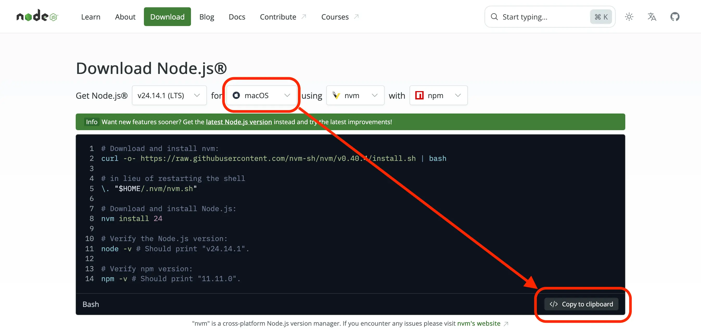
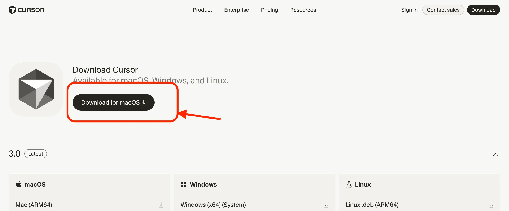
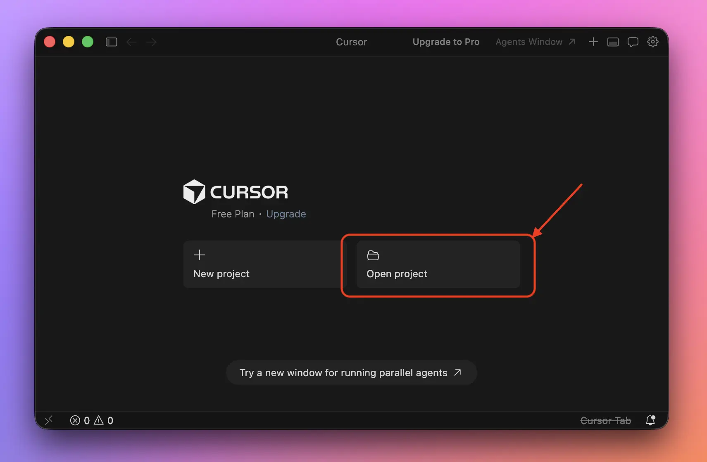
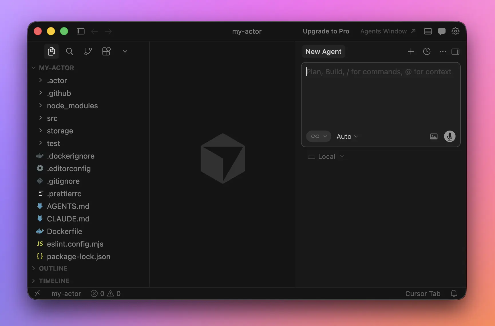
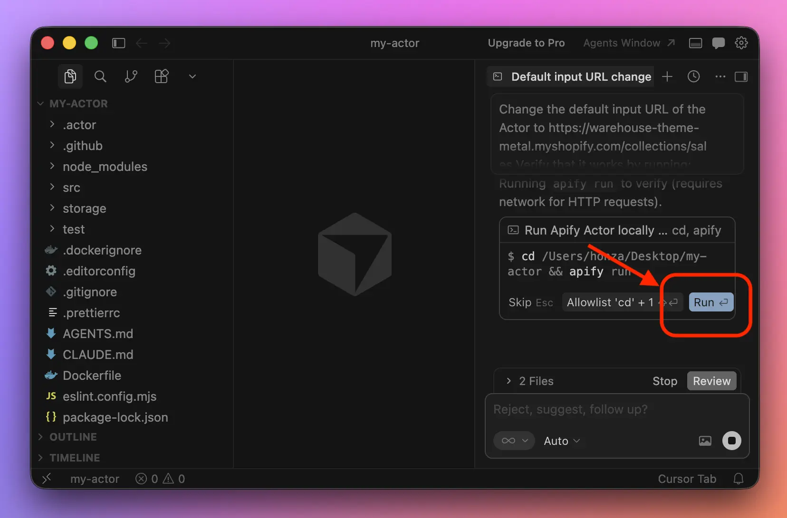
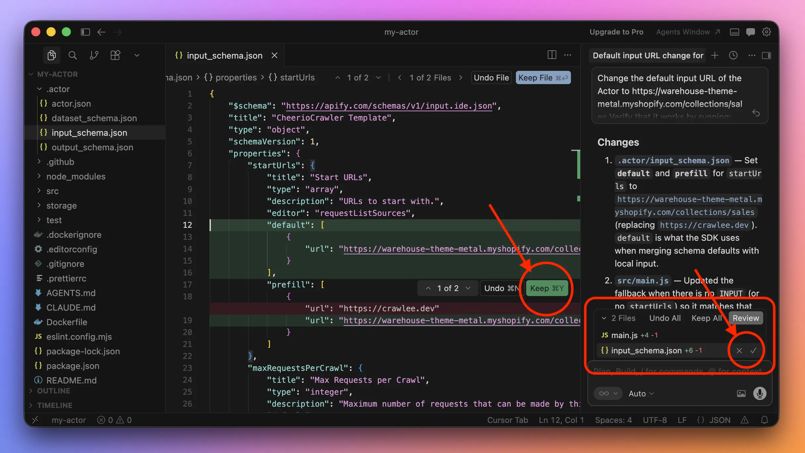
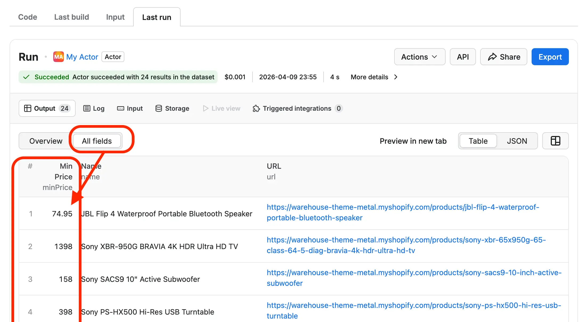

**In this lesson, we'll keep improving our app for tracking prices on an e-commerce website. We'll get its code onto our computer and use Cursor to streamline how we update our scraper.**

---

In the previous lesson, modifying our scraper involved navigating through the Web IDE, copying code, switching to ChatGPT and back, pasting new code, and so on.

That kind of grind is okay for small edits, but it's not sustainable in the long run. If we want to build something larger, or something robust that we can develop and maintain over time, we need to streamline the process.

To step up our game, we'll run a few commands and install a few tools so we can bring the tools of the trade onto our computer:

- _Local development:_ We'll have the Actor files downloaded and we'll be able to run the code locally. This makes it fast and easy to verify any changes.
- _Agentic coding:_ We'll have a locally installed IDE with a built-in AI agent that we can point at the Actor files. We'll be able to tell it what we need, and it'll change the files directly, without hand-holding.
- _Basic versioning:_ We'll be able to develop changes locally while the previous version of our code keeps running on the Apify platform undisturbed. Only once we're happy with what we have will we push the changes back, so they can replace the old version.

We're getting one tiny step closer to becoming developers, but don't worry. It's not like we'll suddenly need to read code.

## Installing Node.js

If we want to run our scraper on our own computer, whether we do it ourselves or have our AI agent do it for us, we first need to set up the environment so the code can run locally.

Previously we chose to develop our scraper in a mainstream programming language called JavaScript. To run command line programs written in JavaScript, we'll need a tool called Node.js.

Let's head to the [Download Node.js](https://nodejs.org/en/download) page. We should see a row of configuration dropdowns and a fairly large code block below it, with quite a few commands. Let's check whether the page guessed our operating system correctly, then copy the whole block to the clipboard:



Now let's paste it as-is into Terminal (macOS/Linux) or PowerShell (Windows) and run it with <kbd>↵</kbd>. Once the installation finishes, we should see the versions of Node.js and npm, another related tool, printed out:

```text
...
$ node -v
v24.11.1
$ npm -v
11.6.2
```

The exact version numbers aren't very important. If we see them printed, we've successfully installed Node.js and npm.

## Installing Apify CLI

Now we'll need the Apify CLI. It's a command-line tool that works like a remote control for the Apify platform. It also happens to be written in JavaScript, so we can use the npm tool we just installed to get it onto our computer. Let's run this command:

```text
npm install -g apify-cli
```

Once the command finishes, let's check whether everything went right:

```text
apify --version
```

If it prints something like this, we have the tool installed:

```text
apify-cli/0.0.0 (1a2b3c4) running on ... with node-0.0.0, installed via ...
```

One more thing though. Before we can do any useful work with it, we also need to login:

```text
apify login
```

Let's confirm **Through Apify Console in your default browser** with <kbd>↵</kbd>. The command line tool opens a web page in our browser, where we'll allow it as a remote control to our Apify account. When we return back to the command line, we should see the following success message:

```text
Success: You are logged in to Apify as hjtest.
```

Awesome, now we're ready to remote control Apify from the command line!

The message mentions our username, in this case `hjtest`. We'll remember it as we'll need it for our next task.

## Downloading Actor files

We now have a handy remote control, let's use it to download the Actor files. In the following command, replace `hjtest` with your own username:

```text
apify pull hjtest/my-actor
```

The following output should appear:

```text
Success: Pulled to /.../my-actor/
```

The tool created a new folder called `my-actor` and pulled all Actor files to it, so that we can work on them on our computer instead of the Web IDE. Let's run another command to move us into this new folder:

```text
cd my-actor
```

Being inside the folder will help us to run the following commands focused just on the project, not affecting any other folders on our disk.

Now we've got the code of our Actor, but we already know from the previous lesson that Actors first need to be _built_ before they can be _run_. Let's run the following command, which installs software our Actor depends on:

```text
npm install
```

The command will flood us with output about what is installed, perhaps some warnings, recommendations, etc. Unfortunately it's hard to spot through the noise if the action was successful, but it is safe to assume success if it doesn't scream red about some errors.

:::tip If it doesn't install

If the output does scream red with errors, or if later in the lesson you find out you're unable to run the Actor, copy the whole output of `npm install` and paste it to ChatGPT for help.

:::

## Running the Actor locally

Now that we have the Actor available on our computer, does it work? Let's try!

```text
apify run --input '{"startUrls": [{"url": "https://warehouse-theme-metal.myshopify.com/collections/sales"}]}'
```

Plain `apify run` isn't enough for now, because the Actor we made expects us to give it an input with a URL to scrape. Adding `--input` with the subsequent ball of special characters is technically equivalent to what we've been previously doing in Apify when changing the field on the **Input** tab.

When the run is done, we should see an output similar to this one:

```text
Info: All default local stores were purged.
Run: npm run start

> crawlee-cheerio-javascript@0.0.1 start
> node src/main.js

INFO  System info {"apifyVersion":"3.7.0","apifyClientVersion":"2.22.3","crawleeVersion":"3.16.0","osType":"Darwin","nodeVersion":"v25.9.0"}
WARN  ProxyConfiguration: The "Proxy external access" feature is not enabled for your account. Please upgrade your plan or contact support@apify.com
INFO  CheerioCrawler: Starting the crawler.
INFO  CheerioCrawler: Processing page: https://warehouse-theme-metal.myshopify.com/collections/sales
INFO  CheerioCrawler: All requests from the queue have been processed, the crawler will shut down.
INFO  CheerioCrawler: Final request statistics: {"requestsFinished":1,"requestsFailed":0,"retryHistogram":[1],"requestAvgFailedDurationMillis":null,"requestAvgFinishedDurationMillis":328,"requestsFinishedPerMinute":155,"requestsFailedPerMinute":0,"requestTotalDurationMillis":328,"requestsTotal":1,"crawlerRuntimeMillis":386}
INFO  CheerioCrawler: Finished! Total 1 requests: 1 succeeded, 0 failed. {"terminal":true}
```

Although we cannot quite see what the scraped items look like, we can spot that our scraper made a single request to https://warehouse-theme-metal.myshopify.com/collections/sales and it finished without crashing. For a start, let's call it a success!

Now we could continue messing around with files and commands, but luckily, we don't have to. We have now everything in place to let an AI agent do all we wish from now on. But do we have one? One last installation, pinky promise!

## Installing Cursor

Cursor is an IDE for browsing code, similar to Apify's Web IDE, but it's an app we install on our computer. Also, it's an IDE with a built-in AI agent, which will help us with all the coding.

:::info Why Cursor

We use Cursor in this course because it's one of the mainstream AI-first IDEs and it offers a free plan. If you're willing to pay, any IDE with an AI agent would fare the same, be it GitHub Copilot in VS Code, Claude Code, or OpenAI Codex.

:::

Using Cursor's AI features requires an account, so let's create one. In the browser, let's open the [Sign Up page](https://authenticator.cursor.sh/sign-up) and we'll create a new account in one of the standard ways. When asked to start a subscription, we'll select **Skip for now** to stay on the free plan.


Similarly, when asked to connect GitHub, we'll choose **Maybe later**. Once we're all set, let's [download the app](https://cursor.com/download) and get it installed.



When we open the app for the first time, it requires a login. We'll click **Log In**, which will send us back to the browser. By choosing **Yes, Log In** we'll confirm that the app can use our account, then get back to the app.



Let's click on **Open project** and select the folder with our Actor.

:::tip Locating the Actor folder

If you struggle to find where the Actor folder is, run `pwd` in the command line, which prints a full path to the folder you're in.

:::

When Cursor opens the Actor's project folder, we'll see something similar to the following:



We can select files, and if we do so, we can browse and modify their content. The same as in the Web IDE. But as an addition, we now have an integrated AI agent which we can prompt and it'll do to the code at hand whatever we need.

Finally, onto some agentic coding!

## Modifying code with Cursor

First, let's simplify how we can run the Actor. This will be our prompt:

```text
Change the default input URL of the Actor
to https://warehouse-theme-metal.myshopify.com/collections/sales
```

After we submit the prompt, the agent will start reading the code, planning, and working on completing the task. Before it runs commands, it'll ask us to approve them.



When done, it'll print a summary of its work and we'll be able to review all changes made.



We'll approve all changes and go to the command line to check whether the Actor now works as expected:

```text
apify run
```

We should see a scraper output like before, including the following line:

```text
INFO  CheerioCrawler: Processing page: https://warehouse-theme-metal.myshopify.com/collections/sales
```

That's our first successful change to the Actor with an AI agent! Without back-and-forth between the IDE and an AI chat like ChatGPT. Now before pushing this change back to Apify, let's do one more improvement to the scraper.

## Scraping prices

In the previous lesson, we noticed that the prices in our resulting dataset are in a rather raw shape:

| name | url | price |
| --- | --- | --- |
| JBL Flip 4 Waterproof Portable Bluetooth Speaker | https://warehouse-theme-metal.myshopify.com/products/jbl-flip-4-waterproof-portable-bluetooth-speaker | Sale price$74.95 |
| Sony XBR-950G BRAVIA 4K HDR Ultra HD TV | https://warehouse-theme-metal.myshopify.com/products/sony-xbr-65x950g-65-class-64-5-diag-bravia-4k-hdr-ultra-hd-tv | Sale priceFrom $1,398.00 |
| Sony SACS9 10" Active Subwoofer | https://warehouse-theme-metal.myshopify.com/products/sony-sacs9-10-inch-active-subwoofer | Sale price$158.00 |

Let's change that. We'll prompt the agent like this, with a clear example of what we want:

```text
Change the code so that the Actor saves prices as numbers.
Because some prices are "from", let's call the "price" field
"minPrice" instead, as in minimum price. Example follows.

Before:
Sale price$74.95
Sale priceFrom $1,398.00
Sale price$158.00

After:
74.95
1398.00
158.00
```

When the agent is done, we'll approve the changes and verify in the command line that the Actor runs locally:

```text
apify run
```

It runs, that's nice! But looking at the output, we can't really verify what exactly gets scraped! While we're at it, let's change that with another prompt:

```text
In the output of the scraper I want to see
how the items being saved look like.
```

We'll approve all changes and go to the command line again:

```text
apify run
```

Now, the output of the scraper contains the actual items being scraped and we can verify we've been successful in changing the format of the prices (they appear at the very end of each line):

```text
...
INFO  CheerioCrawler: Processing page: https://warehouse-theme-metal.myshopify.com/collections/sales
INFO  CheerioCrawler: Saving dataset item {"name":"JBL Flip 4 Waterproof Portable Bluetooth Speaker","url":"https://warehouse-theme-metal.myshopify.com/products/jbl-flip-4-waterproof-portable-bluetooth-speaker","minPrice":74.95}
INFO  CheerioCrawler: Saving dataset item {"name":"Sony XBR-950G BRAVIA 4K HDR Ultra HD TV","url":"https://warehouse-theme-metal.myshopify.com/products/sony-xbr-65x950g-65-class-64-5-diag-bravia-4k-hdr-ultra-hd-tv","minPrice":1398}
INFO  CheerioCrawler: Saving dataset item {"name":"Sony SACS9 10\" Active Subwoofer","url":"https://warehouse-theme-metal.myshopify.com/products/sony-sacs9-10-inch-active-subwoofer","minPrice":158}
INFO  CheerioCrawler: Saving dataset item {"name":"Sony PS-HX500 Hi-Res USB Turntable","url":"https://warehouse-theme-metal.myshopify.com/products/sony-ps-hx500-hi-res-usb-turntable","minPrice":398}
...
```

Now let's push the changes back to Apify, so that our scheduled scraping happening on the platform can benefit from the improvements we've made locally on our computer.

:::tip Automatically approving changes

If you'll grow tired of approvals, you can enable _auto-keep_. Go to **Cursor** → **Settings…** → **Cursor Settings** → **Agents** → **Applying Changes** and turn off **Inline Diffs**.

:::

## Pushing Actor to Apify

To replace the Actor files living on the Apify platform with the ones we have locally, we can run the following command:

```text
apify push
```

The command can take a while to finish, because it also immediately triggers a build. Once it's done, the new version of the Actor is ready to be run. The output of the command ends with these two lines:

```text
...
Actor detail https://console.apify.com/actors/EL7U7aNddXOzwEJ66
Success: Actor was deployed to Apify cloud and built there.
```

We'll follow the link to our browser and in the Apify interface, we'll click the **Start** button. Soon we should see items popping up in the **Output** section. For a full overview, let's switch to **All fields** again:



We've done it, the prices save as numbers!

:::tip Specifying output schema

If we didn't want to always click on **All fields** to see full items, we need to specify an [output schema](https://docs.apify.com/actors/development/actor-definition/output-schema) so that the platform knows what it can expect and how it should display it in the interface. With Cursor, such change is just a single prompt away:

```text
Change the output schema of the Actor
so that it represents the items being
saved the best way in the Apify interface.
```

:::

## Wrapping up

We've been installing and setting up a lot, but once we got our environment ready, we could reap the benefits of fast changes to our scraper.

With a single prompt we tackled a significant change in how our app stores the prices. And we still didn't need to know any coding.

To improve our project further, we ask the agent to perform a change, review and approve its work, then execute `apify run` in the command line to verify how it works, and finally `apify push` to upload our Actor files to Apify.

In the next lesson, we'll take a look at how we can develop our scraper by documenting how it should behave instead of prompting the AI agent feature by feature, without a track record of our intentions.
