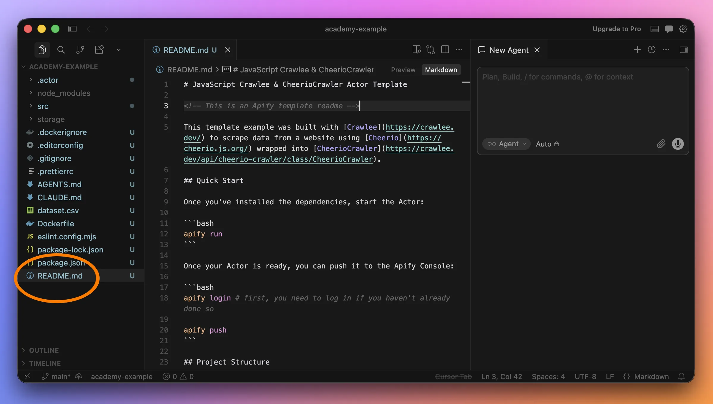
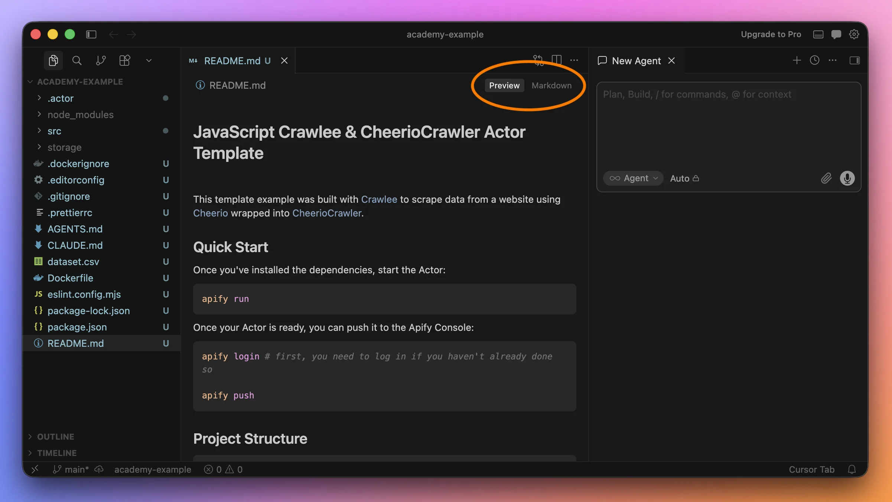
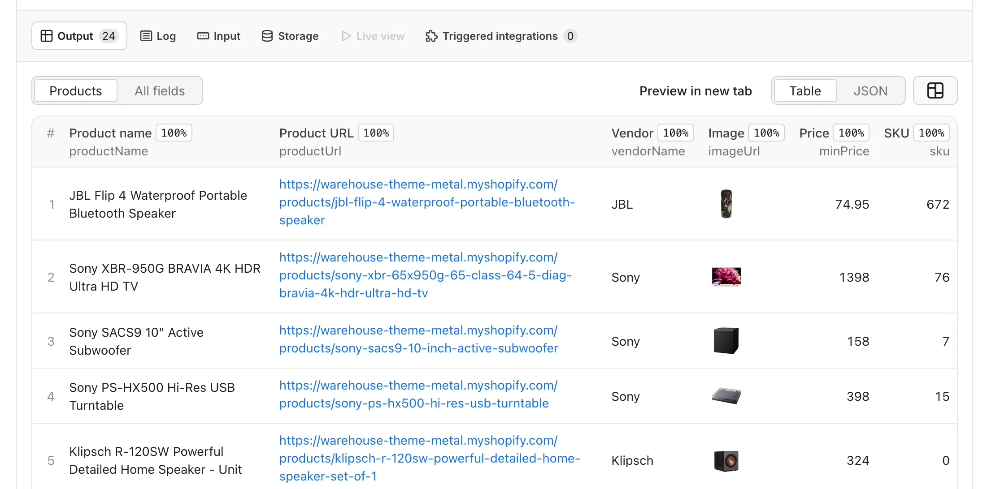

**In this lesson, we'll keep improving our app for tracking prices on an e-commerce website. We'll write documentation which isn't only useful for people to read, but also gives Cursor the context it needs.**

---

We made our lives easier with an AI agent. Improving our scraper now takes way less back-and-forth than using a regular AI chat. Still, both approaches share one downside.

Prompting a chat or agent is quick and straightforward, but it doesn't leave much trace of our intentions:

- If we want someone else to take over later, it'll be hard for them to figure out why we made certain decisions and whether behavior is intentional or accidental.
- If we get busy with other things and return after a few months, we'll basically become that "someone else" from the first bullet. After a week we remember why we process prices a certain way, but after a year it's mostly fuzzy memories.
- If we want other people to use our scraper, they'll need simple instructions for how to run it and what to expect.

Traditionally, we'd write such documentation after finishing the software. With AI, we can describe how the program should work before it's done, point the agent to that spec, and ask it to make it real.

## Starting with README

It's good practice to have a README file in every software project. It's a plain text file where project authors write down the info people usually need to understand what the project is about.

The file is just text, but people use special characters to format it. A popular convention for that is Markdown, and when a README uses it, the file is usually called `README.md`.

If we look at our files in Cursor, we'll see the Apify template already includes a `README.md`. After opening it, we should see something like this:

```md
# JavaScript Crawlee & CheerioCrawler Actor Template

<!-- This is an Apify template readme -->

This template example was built with [Crawlee](https://crawlee.dev/) to scrape data from a website using [Cheerio](https://cheerio.js.org/) wrapped into [CheerioCrawler](https://crawlee.dev/api/cheerio-crawler/class/CheerioCrawler).

## Quick Start

...
```

Many sections follow, covering how the project works, how to develop it, how to deploy it, and more.

Notice that headings start with one or more `#` characters. We also get bullet points, links, and code blocks. That's Markdown.



Cursor understands Markdown, so it improves readability by coloring the formatted parts (this is called _syntax highlighting_). The **Preview** button shows how your Markdown will look when rendered.



:::tip README and Markdown basics

The [Make a README](https://www.makeareadme.com/) website explains why people shouldn't skip adding a README to their projects. To learn Markdown basics, check out [Getting Started](https://www.markdownguide.org/getting-started/) on Markdown Guide, and keep their [Cheat Sheet](https://www.markdownguide.org/cheat-sheet/) handy.

:::

## Recreating README.md

We could edit the existing `README.md`, but for this lesson it's easier to start from scratch. We'll delete the file contents and begin with a new title and intro:

```md
# My Actor

Small app for tracking prices on an e-commerce website.
```

Now let's add a short section on how to work with the project:

```md
## Development

This is an Apify Actor that runs on Apify.

- Have Node.js and Apify CLI ready
- Run `npm install` to install dependencies
- Run `apify run` to start scraping
- Run `apify push` to upload new version of the program to Apify
```

This is enough for both humans and AI agents to quickly understand how to set up and run the project.

## Documenting current behavior

Now let's add a summary of the scraper's current behavior:

```md
## Behavior

- Downloads the Sales page: https://warehouse-theme-metal.myshopify.com/collections/sales
- The Sales page is the default input URL of the Actor.
- Extracts all products and returns this info for each one:
    - Product name
    - Product detail page URL
    - Price
- Logs each item before it's saved.
- Before it ends, it logs how many products it collected.
- The Actor output schema ensures that Apify interface shows saved items in the best way.

### Prices handling

Saves prices as numbers. Some prices are "from" values, so we name the field `minPrice`.

- `Sale price$74.95` becomes `74.95`
- `Sale priceFrom $1,398.00` becomes `1398.00`
- `Sale price$158.00` becomes `158.00`
```

Most of the text above is just our past prompts, slightly rephrased. Because we now describe behavior in the README, anyone can understand details like price handling. If a bug shows up later, our original intent is clear.

## Adding vendor name

The README documents what we already have. Now let's use it as a spec for what comes next. We'll add vendor name to the output data:

```md
- Extracts all products, and returns data with the following info for each product:
    - Product name
    - Product detail page URL
    - Price
<!-- highlight-next-line -->
    - Vendor name
```

We'll save the file with <kbd>Ctrl+S</kbd> (or <kbd>⌘+S</kbd> on macOS), then give this prompt to the AI agent:

```text
Ensure all behavior documented in README is correctly implemented.
```

We'll likely need to approve some commands, because the agent may fetch the Warehouse store page and run local dev tools.

When it's done, it'll print a summary and we'll review the changes. Then we'll approve them and run this command to check whether the Actor now scrapes vendor name too:

```text
apify run
```

In the output, we should see each item logged before it's saved, and each item should now include vendor name. It's a bit hard to spot, but in the example below, the first product has `vendorName` set to `JBL` and the second to `Sony`:

```text
INFO  Saving product {"productName":"JBL Flip 4 Waterproof Portable B
luetooth Speaker","productUrl":"https://warehouse-theme-metal.myshopi
fy.com/products/jbl-flip-4-waterproof-portable-bluetooth-speaker","ve
ndorName":"JBL","minPrice":74.95}
INFO  Saving product {"productName":"Sony XBR-950G BRAVIA 4K HDR Ultr
a HD TV","productUrl":"https://warehouse-theme-metal.myshopify.com/pr
oducts/sony-xbr-65x950g-65-class-64-5-diag-bravia-4k-hdr-ultra-hd-tv"
,"vendorName":"Sony","minPrice":1398}
...
```

Nice! We just used a docs-first approach with the AI agent!

## Adding image URL and SKU

Now let's add two more details for each product. We want the scraper to get the product image URL and the number of units in stock, also called [SKU](https://en.wikipedia.org/wiki/Stock_keeping_unit):

```md
- Extracts all products, and returns data with the following info for each product:
    - Product name
    - Product detail page URL
    - Price
    - Vendor name
<!-- highlight-next-line -->
    - Product image URL
<!-- highlight-next-line -->
    - SKU
```

For SKU, it's better to describe exactly how we want it handled, so we'll add another section to the README. We'll scroll through the Sales page, find different SKU formats, and write concrete examples of what should happen:

```md
### SKU handling

Saves SKU as a number. Examples:

- `In stock, 672 units` becomes `672`
- `Only 2 units left` becomes `2`
- `Sold out` becomes `0`
```

We'll save the file again and repeat the same prompt as before to turn our spec into implementation:

```text
Ensure all behavior documented in README is correctly implemented.
```

When it's done, let's check how the scraped items look now:

```text
apify run
```

This is the first product we see in the output:

```text
INFO  Saving product {"productName":"JBL Flip 4 Waterproof Portable B
luetooth Speaker","productUrl":"https://warehouse-theme-metal.myshopi
fy.com/products/jbl-flip-4-waterproof-portable-bluetooth-speaker","ve
ndorName":"JBL","imageUrl":"https://warehouse-theme-metal.myshopify.c
om/cdn/shop/products/13549_790__2_73a2a189-b3d5-4ec8-a4c3-b506e1beab7
0.jpg?v=1559820925&width=500","minPrice":74.95,"sku":672}
```

With a bit of effort, we can see `sku` is `672`. If we copy the `imageUrl` value into a browser, we can verify it's the right image for the JBL Bluetooth speaker. That's a bit tedious, so let's see if Apify displays it better.

## Pushing Actor to Apify

We've made quite a few changes to our Actor and tested them, so this is a good time to push a new version to Apify:

```text
apify push
```

After the command finishes, we'll navigate to the URL it gives us at the end:

```text
...
Actor detail https://console.apify.com/actors/EL7U7aNddXOzwEJ66
Success: Actor was deployed to Apify cloud and built there.
```

In the Apify interface, we'll click the **Start** button. Soon we should see items popping up in the **Output** section.

Thanks to the sentence "The Actor output schema ensures that Apify interface shows saved items in the best way," the agent improved how our Actor talks to Apify, so we don't have to switch to **All fields** anymore:



Even better, we can see images right away!

## Wrapping up

We wrote down how our scraper should behave, waved a magic wand, and those words turned into working code. But instead of letting all our decisions disappear in prompt windows, we saved them in a file as durable documentation anyone can read.

This approach still has room to grow. Scrapers assume the target page has a certain structure. But what if that structure suddenly changes? That, unfortunately, happens a lot. And what if we need to support corner cases that appear only sometimes?

In the next lesson, we'll take a look at how we can develop our scraper by saving pieces of the target website and testing our program against it.
