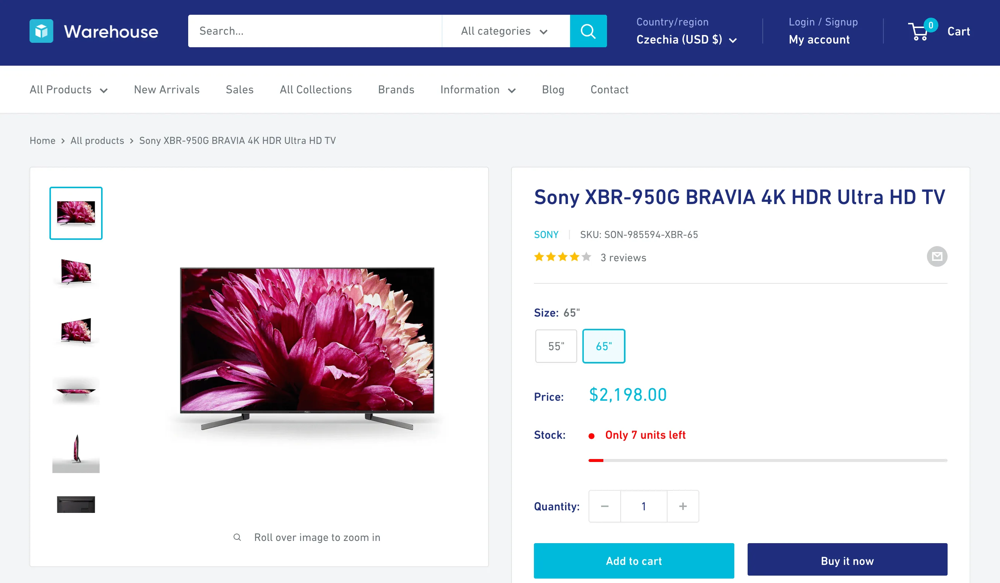

**In this lesson, we'll keep developing our app for tracking prices on an e-commerce website. We'll describe edge cases with real-world examples, and Cursor will use them not only to get things right, but also to check that nothing breaks next time we change something.**

---

The README as a source of truth for the AI agent gets us far, but it has limits:

- _Messy edge cases:_ Describing a large set of edge cases is tedious. "If this tiny detail is a certain way, process it as X, otherwise Y" for each situation is possible, but messy.
- _Bulky examples:_ Sometimes the edge case lies in the page's HTML, the text format that describes its content and structure. We'd have to say, "if you encounter exactly this HTML code, process it like this." Pasting long snippets of HTML into a README isn't great.
- _No safety net:_ After each change, we have to trust that the agent didn't break what already worked. We can prompt it to "go through the whole README and verify all the behavior," but that's slow and unreliable.
- _No reference point:_ Our scraper assumes a certain page structure, but that structure can change over time. The README says what data we want, not what the page looked like when everything still worked.

There's a better way. We can save real-world examples of the pages we scrape, along with the data we expect to get from them. A program can then load each example, process it as if it were scraping the live page, and compare the result with our expectations.

Software developers do this all the time, so each piece has a name. The saved examples are _fixtures_ or _snapshots_. The expected results are _expectations_. The setup that runs all the checks is a _test suite_.

Running these _tests_ is much faster than checking everything by hand. Both we and the AI agent can run them anytime. When the website changes, we can replace the saved example with a fresh one and let the AI agent fix the code.

## Setting up a test suite

Let's start by adding a new section to the README:

```md
## Testing

- The `tests` directory contains real-world HTML snapshots of each page type we scrape.
- Each snapshot also has a JSON file of the same name with the data we expect to get out of it.
- Run `npm test` to run all automated tests.
- Use red-green test-driven development.
```

_JSON_ is a text format for storing structured data. A JSON file can represent the same rows and fields you see in the Apify output table, but in a form that programs can read and compare. You won't need to write these files yourself. The AI agent will create them, and you'll only check whether their contents look right.

_Red-green test-driven development_, often shortened to TDD, means that whenever the AI agent modifies our project, it starts with the expectations. It runs the tests and watches them fail, which proves that they actually check something. Only then does it change the code to make them pass. This technique makes development more reliable.

Now let's send this prompt to the AI agent:

```text
Read the Testing section in README and set up a test suite
covering the behavior we already have.
```

When the AI agent gets to work, you should see it create a new directory called `tests`. It'll probably use `curl`, a command-line program for downloading files, to create an HTML snapshot of the Sales listing.

When it's done, you should see several new files inside `tests`. Most likely, `sales.html` will contain the downloaded page, `sales.json` will contain the expected data, and a test file will run the checks.

When we run `npm test`, all the tests should pass. This is an example output of the command:

```text
npm notice run node --test tests/*.test.js
✔ parseMinPrice handles sale price text (0.532625ms)
✔ parseMinPrice returns null when no price is found (0.06775ms)
✔ parseSku handles inventory text (0.129875ms)
✔ parseSku returns null for empty inventory text (0.058833ms)
✔ toAbsoluteUrl resolves protocol-relative and relative URLs (0.325541ms)
✔ extractProducts matches expected output for sales (58.530583ms)
ℹ tests 6
ℹ suites 0
ℹ pass 6
ℹ fail 0
ℹ cancelled 0
ℹ skipped 0
ℹ todo 0
ℹ duration_ms 165.677875
```

Depending on what the agent created, your output may look different, but it should follow a similar pattern. You don't need to understand every line. The important parts are `pass 6` and `fail 0`, which confirm that all tests passed.

## Handling product variants

Some prices in our data are "from" values because many items in the listing represent several product variants. Let's scrape each variant as a separate product with its actual price.

Each product in the listing links to a _product detail page_, or PDP. If we open a product URL in the browser, such as the page for the [Sony XBR-950G BRAVIA](https://warehouse-theme-metal.myshopify.com/products/sony-xbr-65x950g-65-class-64-5-diag-bravia-4k-hdr-ultra-hd-tv), we can see its vendor name, [SKU](https://en.wikipedia.org/wiki/Stock_keeping_unit), reviews, images, variants, stock availability, description, and more.



Before we tell the AI agent to handle variants, let's check what we're dealing with. This will help us choose the right design and cover all possible situations.

## Identifying and handling edge cases

When we [browse the Sales page](https://warehouse-theme-metal.myshopify.com/collections/sales), we can see several situations to cover:

- A product with one price and no variants: [Sony SACS9 10" Active Subwoofer](https://warehouse-theme-metal.myshopify.com/products/sony-sacs9-10-inch-active-subwoofer)
- A product with several variants, each with a different price: [Sony XBR-950G BRAVIA 4K HDR Ultra HD TV](https://warehouse-theme-metal.myshopify.com/products/sony-xbr-65x950g-65-class-64-5-diag-bravia-4k-hdr-ultra-hd-tv)
- A product with several variants, all with the same price: [JBL Flip 4 Waterproof Portable Bluetooth Speaker](https://warehouse-theme-metal.myshopify.com/products/jbl-flip-4-waterproof-portable-bluetooth-speaker?variant=17549970440243)
- Variants that represent colors, like the JBL speaker, or sizes, like the Sony TV.

Let's save each variant as a separate product with its own price and one extra field for the variant name, such as `Green` or `55"`. We'll add a new section to the README right after _Prices handling_:

```md
### Variants handling

Downloads product detail pages. Instead of saving each listing item as a single product, it saves each variant as an individual product. Variants have these extra properties:

- Variant name
- Exact variant price as `price`

Minimum price from the listing stays as `minPrice`. Products without variants have empty variant name and `price` equal to `minPrice`.
```

Let's save the README and prepare a prompt for the AI agent. We'll tell it which pages to use as fixtures for each edge case.

It's best to focus each fixture on a single situation. Our findings give us five snapshots, although some will contain the same HTML:

```text
Read the new Variants handling section and change
the project accordingly. Use red-green TDD. Fixtures:

one-price-no-variants.html
https://warehouse-theme-metal.myshopify.com/products/sony-sacs9-10-inch-active-subwoofer

variants-different-prices.html
https://warehouse-theme-metal.myshopify.com/products/sony-xbr-65x950g-65-class-64-5-diag-bravia-4k-hdr-ultra-hd-tv

variants-same-price.html
https://warehouse-theme-metal.myshopify.com/products/jbl-flip-4-waterproof-portable-bluetooth-speaker?variant=17549970440243

variants-colors.html
https://warehouse-theme-metal.myshopify.com/products/jbl-flip-4-waterproof-portable-bluetooth-speaker?variant=17549970440243

variants-sizes.html
https://warehouse-theme-metal.myshopify.com/products/sony-xbr-65x950g-65-class-64-5-diag-bravia-4k-hdr-ultra-hd-tv
```

After several `curl` calls and much crunching, we should see the new files in the `tests` directory, together with their JSON expectations. We can open them and eyeball whether they look correct.

For example, `variants-colors.json` should contain seven products. Their colors should match those on the JBL speaker page. Similarly, `variants-different-prices.json` should contain the correct price for each variant, while `one-price-no-variants.json` should contain just one product.

If everything looks right and `npm test` passes, we can be pretty sure that our scraper handles variants according to our spec. And we haven't even run it against the live website yet. Let's do that now for one final check:

```text
apify run
```

In the output, we should see products with variant names and exact prices, like this:

```text
INFO  Saving product {"productName":"Sony XB-950B1 Extra Bass Wireless Headphones with App Control","productUrl":"https://warehouse-theme-metal.myshopify.com/products/sony-xb950-extra-bass-wireless-headphones-with-app-control","vendorName":"Sony","imageUrl":"https://warehouse-theme-metal.myshopify.com/cdn/shop/products/13261_147__1_2e3211f9-de49-4919-9e67-006800a5c5a0.jpg?v=1559727794","minPrice":128,"variantName":"Red","price":178,"sku":14}
```

With a bit of effort, we can spot that `minPrice` is `128`, `price` is `178`, and `variantName` is `Red`.

## Wrapping up

If the target website introduces new edge cases, all we have to do is identify them and ask the AI agent to add snapshots and expectations for them.

If the website changes significantly and our scraper stops returning results or starts crashing, we'll tell the AI agent to update the snapshots and adjust the code.

Whenever we change the project, we can now make sure we haven't broken existing behavior without checking every case by hand or putting extra stress on the target website.

With an AI agent, docs, and tests, scraper development becomes easier, more reliable, and ready for further improvements.

If you build a stable scraper like this, it would be a shame to keep it to yourself. In the next lesson, we'll publish our scraper to Apify Store so that other people can use it and pay us for developing and maintaining it.
