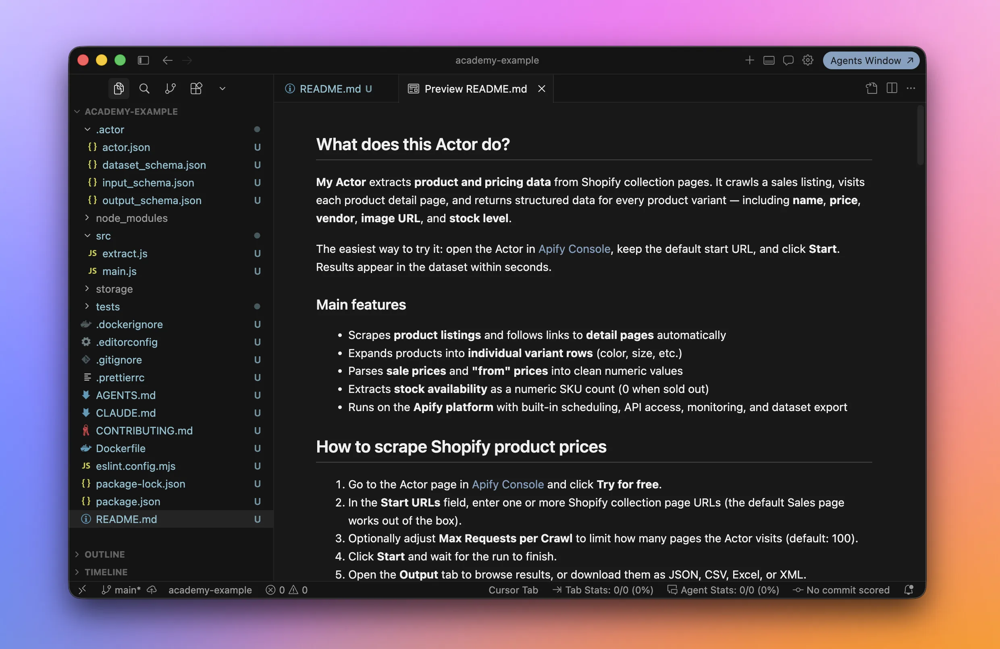
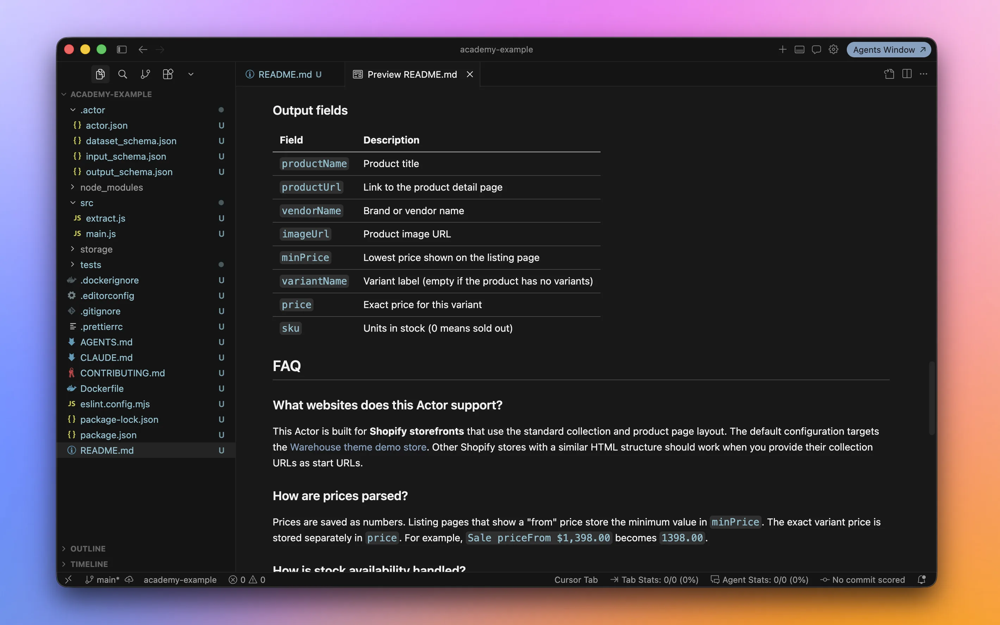
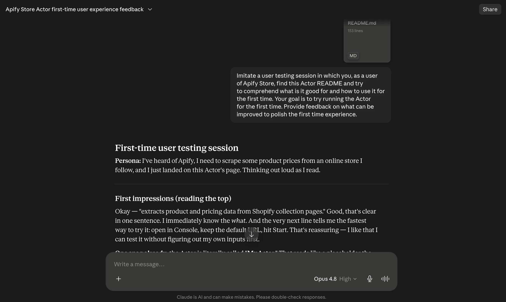
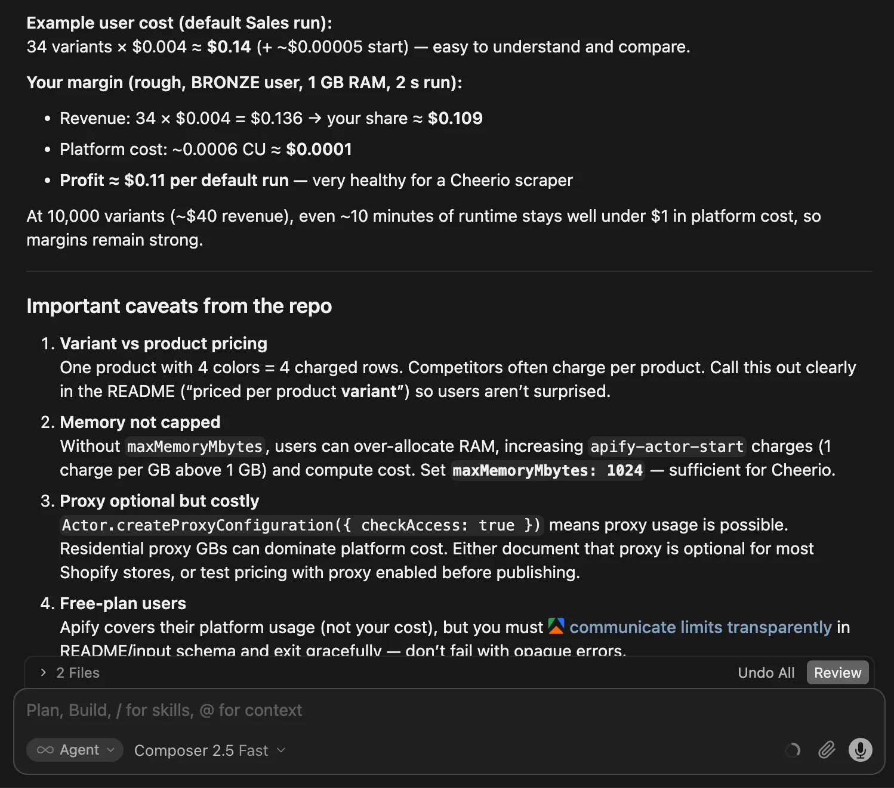

**In this lesson, we'll prepare our app for tracking prices on an e-commerce website for other people to use. We'll use Cursor to inspect and polish its first-run experience and documentation, prepare its Apify Store listing, and make a plan for keeping it reliable.**

---

Our scraper works, and its behavior is backed by documentation and tests. However, we've built it only for ourselves. If we wanted other people to use it, they'd run into several problems:

- _Wrong kind of README:_ It tells its developers how the code should behave, not users how to get useful data.
- _Rough first run:_ It can be the case that the scraper inputs are not designed, documented, or properly tested with a first-time user in mind.
- _Empty storefront:_ The Actor has no convincing name, description, presentation, or clear pricing.
- _No maintenance strategy:_ There will be failed runs, user questions, or changes to the target website. We need to be prepared.

Before publishing our Actor to the Apify Store we'll rework the README, make sure first-time users know what to do, prepare the Store listing, and decide how to keep the scraper working after launch.

:::info Publishing and monetization guide

This lesson works as an intro, but it only scratches the surface. It's enough for a start, but if you really want your Actor to be successful on Apify Store, check out the [Publishing and monetization](/actors/publishing) and [Apify Store basics](/academy/actor-marketing-playbook/store-basics/how-store-works) guides.

:::

## Turning the README into a landing page

Right now, the README explains how to develop the project, how it works, and why we made certain design decisions. That's useful information, but not for most users of Actors.

They want to know what data the Actor provides, what inputs it takes, and what its output looks like. When they need to understand the scraper's limitations, they might care about some technical details, but as long as the scraper delivers data they need, they'll be perfectly happy without them.

Let's move the current README to a different file, such as `CONTRIBUTING.md`, and create a new `README.md` that serves as the Actor's landing page. Ask the AI agent to draft it:

```text
Move the current README content to CONTRIBUTING.md.
Then read https://docs.apify.com/actors/publishing/actor-readme
and draft a new README focused on users.
```

After a short wait, we'll have a new README ready. Cursor has a built-in Markdown preview, so let's make it easier to read. Open the [command palette](https://docs.cursor.com/advanced/keyboard-shortcuts) with <kbd>⌘+⇧+P</kbd> on macOS or <kbd>Ctrl+Shift+P</kbd> on Windows and Linux. Type "mark pre", select **Markdown: Open Preview**, and press <kbd>↵</kbd>. You should see a preview of how the document would look on Apify Store, GitHub, or another service.



Each AI agent run is different, but the result will probably include sections similar to these:

- What does this Actor do?
- How to scrape Shopify product prices
- How much does it cost?
- Input and output
- FAQ

Cursor can read the contributing docs, inspect the code, and follow the [guide to writing a good Actor README](/actors/publishing/actor-readme) we gave it. That gives it enough context to draft a useful document. It can also anticipate questions and answers like the following:

- What websites does this Actor support?
- How are prices parsed?
- How is stock availability handled?
- Can I schedule regular price checks?
- Something went wrong - what should I check?



Read the whole README and make sure everything is accurate and sounds like you. It will set users' expectations, and it's you who is responsible for every promise it makes, not the AI agent.

This new README will eventually become the page that sells your Actor, so keep prompting the AI agent to improve it. And most importantly, ask it to rename the Actor to something catchier than "My Actor"!

## Making the first run easy

Now let's make sure people can understand the Actor and get through their first run without getting stuck. We'll run a small experiment.

If you have a friend who's at least a tiny little bit tech-savvy, ask for 30 minutes of their time and let them try your Actor. Ideally, choose someone who doesn't know what you've been working on.

It might sound a bit silly, but it really isn't! This is called _user testing_.

Run `apify push`, give your friend the README, and open the Actor in Apify Console. Then let them take control of the computer with a single goal: run the Actor for the first time. Watch over their shoulder and take notes, but don't help. Within 30 minutes, you'll almost certainly uncover a few loose ends:

- Does the README explain the quickest way to get useful results?
- Are the input field names clear, with helpful tooltips where needed?
- Are the default and prefilled values safe, inexpensive, and quick to run while still showing the Actor's value?
- Does the sample output make it obvious what useful data the Actor provides?
- Is the output consistent, with predictable fields and formats?
- When the Actor fails, does it provide a useful, actionable error message?

If you can't find such a friend, you can try the experiment yourself and pretend you're seeing the Actor for the first time, but it won't match a genuine second pair of eyes.

A better alternative is to ask an AI chat or agent other than the one that wrote the README. Use this prompt as a starting point:

```text
Imitate a user testing session. You are an Apify Store user
who has just found this Actor and its README. Work out what
the Actor does, what it's useful for, and how to run it for
the first time. Then suggest improvements that would make
the first-run experience clearer and smoother.
```

For example, here's what a response from Claude, Anthropic's AI chat, might look like:



:::info Apify Store test

Once you publish your Actor, Apify Store itself will join the feedback party. Apify [automatically tests public Actors](/actors/publishing/test) every day using each Actor's prefilled input. The run must succeed and produce a non-empty output within 5 minutes. If it fails, the Actor gets flagged.

:::

## Preparing the Store listing

As mentioned, our Actor needs a good name. But what makes a name good? The [Name your Actor](/academy/actor-marketing-playbook/actor-basics/name-your-actor) guide has plenty of advice. Let's give it to the AI agent and brainstorm together:

```text
Read the Actor naming guide:
https://docs.apify.com/academy/actor-marketing-playbook/actor-basics/name-your-actor
Then inspect this repository and suggest 20 suitable names for this Actor.
Put the strongest ideas first and briefly explain why they work.
```

The AI agent can inspect what the Actor does and might even check for name collisions with existing Actors on Apify Store. Don't expect all 20 suggestions to be brilliant, but they should get your own ideas flowing: Shopify Collection Scraper, Shopify Variant Scraper, Shopify Product Price Scraper...

We can use the same approach for other parts of the Store listing, such as the [technical name](/academy/actor-marketing-playbook/actor-basics/importance-of-actor-url) and [description](/academy/actor-marketing-playbook/actor-basics/actor-description).

If you plan to charge for the Actor, ask the AI agent to help you think through pricing as well:

```text
Read the Actor monetization and pricing guide:
https://docs.apify.com/actors/publishing/monetize
Then inspect this repository and recommend the most suitable
pricing model for this Actor. Explain your reasoning and flag
anything we should fix before publishing.
```

The result will also help us uncover caveats or missing pieces in the repository that we should attend to before publishing:



This is all good fuel for thinking about how to name, describe, and monetize your scraper. But you're still in the driver's seat, and you're responsible for the Actor, so consider every suggestion carefully.

Give the AI agent too much free rein, and the result might look like generic AI slop that people won't trust. Make sure the final listing still sounds like the human you.

## Keeping your Actor reliable

Every scraper needs maintenance. One day, the target website changes. Another day, a random network hiccup knocks the scraper over. It's not a question of _if_ something will happen, but _when_. That's simply part of running a scraper.

On Apify Store, users will also [ask questions or report issues](/academy/actor-marketing-playbook/interact-with-users/issues-tab), and you'll need time to help them.

The best strategy is to plan ahead. Set aside a few hours each week for your scraper. Some weeks, you'll spend that time fixing unexpected failures. In others, you'll answer questions from users.

Set up [scheduled automated tests](/actors/development/automated-tests) to catch problems before users notice them, or at least early enough for you to fix them quickly.

When something breaks, the AI agent can come to the rescue again. Give it as much context as possible:

- The complete error from the failed run,
- the page where the scraper failed,
- the input that triggered the problem.

Ask the agent to add a test for every bug it fixes. These are called _regression tests_, and they prevent the same bugs from sneaking back in later.

:::info Actor quality score

Apify calculates an [Actor quality score](/actors/publishing/quality-score) that provides useful feedback on your scraper's reliability, ease of use, pricing transparency, trustworthiness, and consistency.

:::

## Reaching your first users

A useful, reliable Actor can still sit quietly on Apify Store while nobody notices it. You don't need a grand launch campaign, but you do need to help the first few users find it.

- Describe the problem your Actor solves in the words your users would use, not in technical terms. Use that language naturally in the Actor's name, Store listing, README headings, and FAQ. This helps people, search engines, and AI tools understand when the Actor is useful.
- [Record a short demo](/academy/actor-marketing-playbook/promote-your-actor/video-tutorials) that follows one run from input to useful results. It doesn't have to be fancy or polished. Even a rough screencast with some free background music will do. It probably won't rack up huge numbers on YouTube, but you can add it to your README and share it wherever your users hang out.
- Pick one or two places where people already discuss the problem your Actor solves. Answer questions, show how the Actor helps, and listen to the feedback. That's more useful than dropping the same promotional post everywhere.

Marketing can go much further than this, but that's a course of its own. When you're ready for more, continue with the [marketing checklist](/academy/actor-marketing-playbook/promote-your-actor/checklist) and the guide to [making your Actor easier to find through search](/academy/actor-marketing-playbook/promote-your-actor/seo).

## Wrapping up

Five lessons ago, we started with an Actor template and an AI chat. Since then, we've watched a scraper take shape, move into an AI agent workflow, gain docs and tests, and get polished for Apify Store. All without writing or understanding code. Wild!

We also explored how to keep the project from falling apart as the prompts pile up, and how AI can help with the groundwork before publishing.

All that's missing now is your next idea. Turn it into real, working software, share it with others, and perhaps even make some money along the way. It isn't passive income (what is?), but it can be a fun way to earn a few cents (pesos, rupees, yen…) without leaving your room. Good luck, and have fun!

When you bump into the limits of what AI can do for you, deepen your web scraping knowledge with our beginner coding courses: [Web scraping basics with JavaScript](/academy/scraping-basics-javascript) or [Web scraping basics with Python](/academy/scraping-basics-python).
