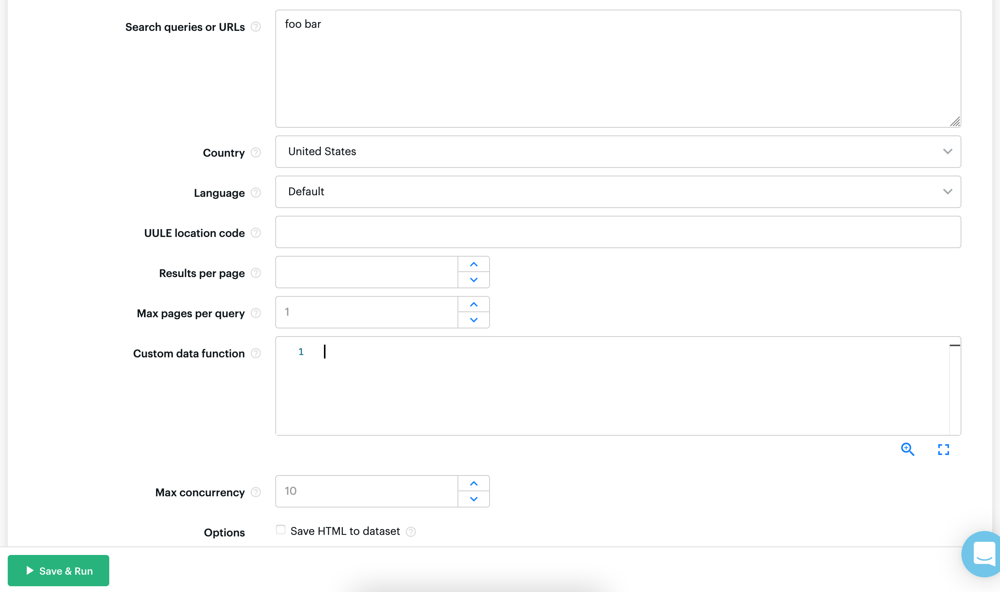

So you need to regularly grab SERP data about your target keywords? Apify provides a free SERP API that includes organic search, ads, people also ask, etc. Free Apify accounts come with 30 days of proxy trial and $5 of credit. To get started, head over to the [Google Search Results Scraper](https://apify.com/apify/google-search-scraper) page and click the `Try me` button. You'll be taken to a page where you can enter the search query, region, language and other settings.

Hit `Save & Run` and you'll have the downloaded data as soon as the query finishes. To have it run at regular frequency, you can set up the task to run on an [automatic schedule](https://docs.apify.com/schedules#setting-up-a-new-schedule).

To run from the API, send a [synchronous POST request](</api/v2#/reference/actor-tasks/run-task-synchronously-and-get-dataset-items/run-task-synchronously-and-get-dataset-items-(post)>) to an endpoint such as `https://api.apify.com/v2/acts/TASK_NAME_OR_ID/runs?token=YOUR_TOKEN`. Include any required input in a JSON object in the request's body.

Keep in mind that, as Google search uses a non-deterministic algorithm, output results may vary even if the input settings are exactly the same.
