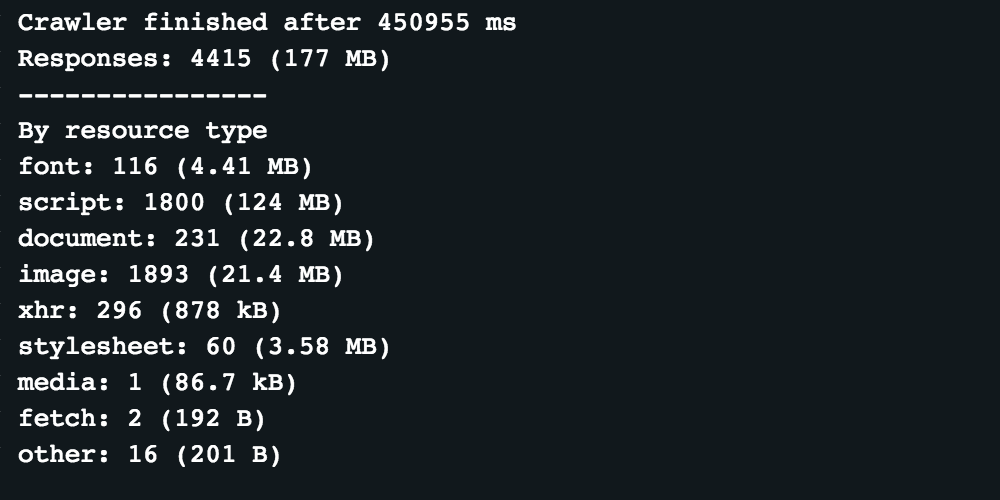

import Example from '!!raw-loader!roa-loader!./caching_responses_in_puppeteer.js';

# How to optimize Puppeteer by caching responses {#caching-responses-in-puppeteer}

**Learn why it is important for performance to cache responses in memory when intercepting requests in Puppeteer and how to implement it in your code.**

---

> In the latest version of Puppeteer, the request-interception function inconveniently disables the native cache and significantly slows down the crawler. Therefore, it's not recommended to follow the examples shown in this article unless you have a very specific use-case where the default browser cache is not enough (e.g. cashing over multiple scraper runs)

When running crawlers that go through a single website, each open page has to load all resources again. The problem is that each resource needs to be downloaded through the network, which can be slow and/or unstable (especially when proxies are used).

For this reason, in this article, we will take a look at how to use memory to cache responses in Puppeteer (only those that contain header **cache-control** with **max-age** above **0**).

In this example, we will use a scraper which goes through top stories on the CNN website and takes a screenshot of each opened page. The scraper is very slow right now because it waits till all network requests are finished and because the posts contain videos. If the scraper runs with disabled caching, these statistics will show at the end of the run:



As you can see, we used 177MB of traffic for 10 posts (that is how many posts are in the top-stories column) and 1 main page.

From the screenshot above, it's clear that most of the traffic is coming from script files (124MB) and documents (22.8MB). For this kind of situation, it's always good to check if the content of the page is cache-able. You can do that using Chromes Developer tools.

## Understanding and reproducing the issue

If we go to the CNN website, open up the tools and go to the **Network** tab, we will find an option to disable caching.


Once caching is disabled, we can take a look at how much data is transferred when we open the page. This is visible at the bottom of the developer tools.


If we uncheck the disable-cache checkbox and refresh the page, we will see how much data we can save by caching responses.


By comparison, the data transfer appears to be reduced by 88%!

## Solving the problem by creating an in-memory cache

We can now emulate this and cache responses in Puppeteer. All we have to do is to check, when the response is received, whether it contains the **cache-control** header, and whether it's set with a **max-age** higher than **0**. If so, then we'll save the headers, URL, and body of the response to memory, and on the next request check if the requested URL is already stored in the cache.

The code will look like this:

```js
// On top of your code
const cache = {};

// The code below should go between newPage function and goto function

await page.setRequestInterception(true);

page.on('request', async (request) => {
    const url = request.url();
    if (cache[url] && cache[url].expires > Date.now()) {
        await request.respond(cache[url]);
        return;
    }
    request.continue();
});

page.on('response', async (response) => {
    const url = response.url();
    const headers = response.headers();
    const cacheControl = headers['cache-control'] || '';
    const maxAgeMatch = cacheControl.match(/max-age=(\d+)/);
    const maxAge = maxAgeMatch && maxAgeMatch.length > 1 ? parseInt(maxAgeMatch[1], 10) : 0;
    if (maxAge) {
        if (cache[url] && cache[url].expires > Date.now()) return;

        let buffer;
        try {
            buffer = await response.buffer();
        } catch (error) {
            // some responses do not contain buffer and do not need to be catched
            return;
        }

        cache[url] = {
            status: response.status(),
            headers: response.headers(),
            body: buffer,
            expires: Date.now() + (maxAge * 1000),
        };
    }
});
```

> If the code above looks completely foreign to you, we recommending going through our free [Puppeteer/Playwright course](../../webscraping/puppeteer_playwright/index.md).

After implementing this code, we can run the scraper again.


Looking at the statistics, caching responses in Puppeteer brought the traffic down from 177MB to 13.4MB, which is a reduction of data transfer by 92%. The related screenshots can be found [here](https://my.apify.com/storage/key-value/iWQ3mQE2XsLA2eErL).

It did not speed up the crawler, but that is only because the crawler is set to wait until the network is nearly idle, and CNN has a lot of tracking and analytics scripts that keep the network busy.

## Implementation in Crawlee

Since most of you are likely using [Crawlee](https://crawlee.dev), here is what response caching would look like using `PuppeteerCrawler`:

<RunnableCodeBlock className="language-js" type="puppeteer">
    {Example}
</RunnableCodeBlock>
