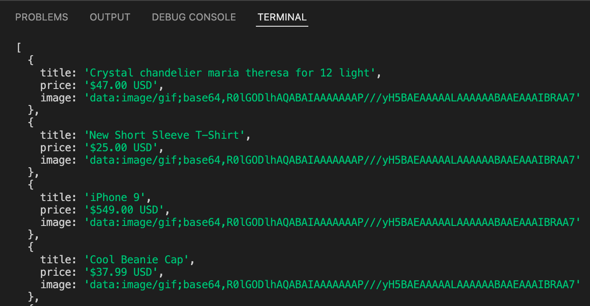
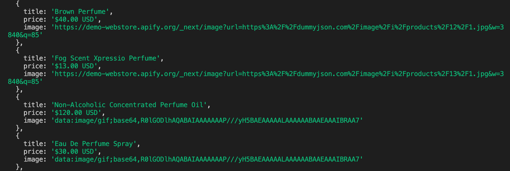

# How to scrape from dynamic pages {#dealing-with-dynamic-pages}

**Learn about dynamic pages and dynamic content. How can we find out if a page is dynamic? How do we programmatically scrape dynamic content?**

---

<!-- In the last few lessons, we learned about Crawlee, which is a powerful library for writing reliable and efficient scrapers. We recommend reading up on those last two lessons in order to install the `crawlee` package and familiarize yourself with it before moving forward with this lesson. -->

In this lesson, we'll be discussing dynamic content and how to scrape it while utilizing Crawlee.

## A quick experiment {#quick-experiment}

From our adored and beloved [Fakestore](https://demo-webstore.apify.org/), we have been tasked to scrape each product's title, price, and image from the [new arrivals](https://demo-webstore.apify.org/search/new-arrivals) page. Easy enough! We did something very similar in the previous modules.


First, create a file called **dynamic.js** and copy-paste the following boiler plate code into it:

```js
import { CheerioCrawler } from 'crawlee';

const crawler = new CheerioCrawler({
    requestHandler: async ({ $, request }) => {
        // We'll put our logic here in a minute
    },
});

await crawler.addRequests([{ url: 'https://demo-webstore.apify.org/search/new-arrivals' }]);

await crawler.run();
```

If you're in a brand new project, don't forget to initialize your project, then install the necessary dependencies:

```shell
# this command will initialize your project
# and install the "crawlee" and "cheerio" packages
npm init -y && npm i crawlee
```

Now, let's write some data extraction code to extract each product's data. This should look familiar if you went through the [Data Collection](../../webscraping/web_scraping_for_beginners/data_extraction/index.md) lessons:

```js
import { CheerioCrawler } from 'crawlee';

const BASE_URL = 'https://demo-webstore.apify.org';

const crawler = new CheerioCrawler({
    requestHandler: async ({ $, request }) => {
        const products = $('a[href*="/product/"]');

        const results = [...products].map((product) => {
            const elem = $(product);

            const title = elem.find('h3').text();
            const price = elem.find('div[class*="price"]').text();
            const image = elem.find('img[src]').attr('src');

            return {
                title,
                price,
                image: new URL(image, BASE_URL).href,
            };
        });

        console.log(results);
    },
});

await crawler.run([{ url: 'https://demo-webstore.apify.org/search/new-arrivals' }]);
```

> Here, we are using the [`Array.prototype.map()`](https://developer.mozilla.org/en-US/docs/Web/JavaScript/Reference/Global_Objects/Array/map) function to loop through all of the product elements and save them into an array we call `results` all at the same time.

After running it, you might say, "Great! It works!" **But wait...** What are those results being logged to console?



Every single image seems to have the same exact "URL," but they are most definitely not the image URLs we are looking for. This is strange, because in the browser, we were getting URLs that looked like this:

```text
https://demo-webstore.apify.org/_next/image?url=https%3A%2F%2Fm.media-amazon.com%2Fimages%2FI%2F81ywGFOb0eL._AC_UL1500_.jpg&w=3840&q=85
```

The reason this is happening is because CheerioCrawler makes static HTTP requests, so it only manages to capture the content from the `DOMContentLoaded` event. Any elements or attributes generated dynamically thereafter using JavaScript (and usually XHR/Fetch requests) are not part of the downloaded HTML, and therefore are not accessible through the `$` object.

So, what's the solution? We need to use something that is able to allow the page to follow through with the entire load process - a headless browser.

## Scraping dynamic content {#scraping-dynamic-content}

Let's change a few lines of our code to switch the crawler type from CheerioCrawler to PuppeteerCrawler, which will run a headless browser, allowing the `load` and `networkidle` events to fire:

> Also, don't forget to run `npm i puppeteer` in order to install the `puppeteer` package!

```js
import { PuppeteerCrawler } from 'crawlee';

const BASE_URL = 'https://demo-webstore.apify.org';

// Switch CheerioCrawler to PuppeteerCrawler
const crawler = new PuppeteerCrawler({
    // Replace "$" with "page"
    requestHandler: async ({ parseWithCheerio, request }) => {
        // Create the $ Cheerio object based on the page's content
        const $ = await parseWithCheerio();

        const products = $('a[href*="/product/"]');

        const results = [...products].map((product) => {
            const elem = $(product);

            const title = elem.find('h3').text();
            const price = elem.find('div[class*="price"]').text();
            const image = elem.find('img[src]').attr('src');

            return {
                title,
                price,
                image: new URL(image, BASE_URL).href,
            };
        });

        console.log(results);
    },
});

await crawler.run([{ url: 'https://demo-webstore.apify.org/search/new-arrivals' }]);
```

After running this one, we can see that our results look different from before. We're getting the image links!



Well... Not quite. It seems that the only images which we got the full links to were the ones that were being displayed within the view of the browser. This means that the images are lazy-loaded. **Lazy-loading** is a common technique used across the web to improve performance. Lazy-loaded items allow the user to load content incrementally, as they perform some action. In most cases, including our current one, this action is scrolling.

So, we've gotta scroll down the page to load these images. Luckily, because we're using Crawlee, we don't have to write the logic that will achieve that, because a utility function specifically for Puppeteer called [`infiniteScroll`](https://crawlee.dev/api/puppeteer-crawler/namespace/puppeteerUtils#infiniteScroll) already exists right in the library, and can be accessed through `utils.puppeteer`. Let's add it to our code now:

```js
import { PuppeteerCrawler, utils, Dataset } from 'crawlee';
import cheerio from 'cheerio';

const BASE_URL = 'https://demo-webstore.apify.org';

const crawler = new PuppeteerCrawler({
    requestHandler: async ({ parseWithCheerio, infiniteScroll }) => {
        // Add the utility function
        await infiniteScroll();

        const $ = await parseWithCheerio();

        const products = $('a[href*="/product/"]');

        const results = [...products].map((product) => {
            const elem = $(product);

            const title = elem.find('h3').text();
            const price = elem.find('div[class*="price"]').text();
            const image = elem.find('img[src]').attr('src');

            return {
                title,
                price,
                image: new URL(image, BASE_URL).href,
            };
        });

        // Push our results to the dataset
        await Dataset.pushData(results);
    },
});

await crawler.run([{ url: 'https://demo-webstore.apify.org/search/new-arrivals' }]);
```

Let's run this and check our dataset results...

```json
{
  "title": "women's shoes",
  "price": "$40.00 USD",
  "image": "https://demo-webstore.apify.org/_next/image?url=https%3A%2F%2Fdummyjson.com%2Fimage%2Fi%2Fproducts%2F46%2F1.webp&w=3840&q=85"
}
```

Each product looks like this, and each image is a valid link that can be visited. These are the results we were after.

## Small Recap {#small-recap}

Making static HTTP requests only downloads the HTML content from the `DOMContentLoaded` event. We must use a browser to allow dynamic code to load, or find different means altogether of scraping the data (see [API Scraping](../../webscraping/api_scraping/index.md))
