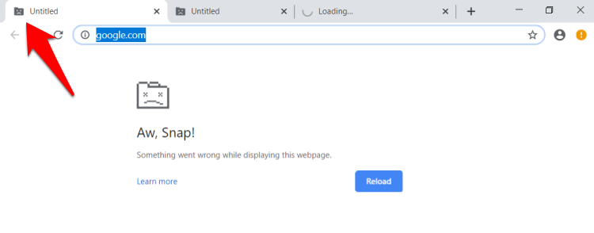

# How to fix 'Target closed' error in Puppeteer and Playwright

**Learn about common causes for the 'Target closed' error in browser automation and what you can do to fix it.**

---

The `Target closed` error happens when you try to access the `page` object (or some of its parent objects like the `browser`), but the underlying browser tab has already been closed. The exact error message can appear in several variants, such as `Target page, context or browser has been closed`, but none of them are very helpful for debugging. To debug it, attach logs in multiple places or use the headful mode.

## Out of memory



A modern browser creates a separate process for each tab. That means each tab lives with a separate memory space. If you have a lot of tabs open, you might run out of memory. The browser cannot simply close your old tabs to free extra memory so it will usually kill your current memory hungry tab.

### Memory solution

If you use [Crawlee](https://crawlee.dev/), your concurrency automatically scales up and down to fit in the allocated memory. You can change the allocated memory using the environment variable or the [Configuration](https://crawlee.dev/docs/guides/configuration) class. But very hungry pages can still occasionally cause sudden memory spikes, and you might have to limit the [maxConcurrency](https://crawlee.dev/docs/guides/scaling-crawlers#minconcurrency-and-maxconcurrency) of the crawler. This problem is very rare, though.

Without Crawlee, you will need to predict the maximum concurrency the particular use case can handle or just increase the allocated memory.

## Page closed prematurely

If you close the page before executing all code that tries to access the page, you will get the 'Target closed' error. The most common cause is that your crawler doesn't properly wait for all actions and instead closes the page earlier than it should. Usually, this is caused by forgotten `await` keyword (floating promise), using event handlers like `page.on` or having wrongly ordered crawling loop.

### Page closed solution

[Add logs to your code](https://docs.apify.com/academy/node-js/analyzing-pages-and-fixing-errors) to see exactly at which point the crash occurs. See if you can spot one of the above mentioned problems. Adding missing `await` is simple but if your code runs in an event handler, you will need to wrap it in try/catch block and ensure that you give it enough time to execute before you close the main crawling handler.

If you use Crawlee and utilize [preNavigationHooks](https://crawlee.dev/api/playwright-crawler/interface/PlaywrightCrawlerOptions#preNavigationHooks) to execute event handlers like `page.on` asynchronously be aware that this can cause the above mentioned problem that the [requestHandler](https://crawlee.dev/api/playwright-crawler/interface/PlaywrightCrawlerOptions#requestHandler) already finishes before we access the `page` in the event handler. You can solve this issue by making sure the `requestHandler` waits for all promises from the `preNavigationHooks`. This can be achieved by passing the promises to the `context` which is accessible to both functions and awaiting them before the scraping code starts.

```js
const crawler = new PlaywrightCrawler({
    // ...other options
    preNavigationHooks: [
        async ({ page, context }) => {
            // Some action that takes time, we don't await here
            // Try/catch all non awaited code because it can cause unhandled rejection which crashes the whole process
            const responsePromise = page.waitForResponse('https://example.com/resource').catch((e) => e);
            // Attach the promise to the context which is accessible to requestHandler
            context.responsePromise = responsePromise;
        },
    ],
    requestHandler: async ({ request, page, context }) => {
        // We first wait for the response before doing anything else
        const response = await context.responsePromise;
        // Check if it errored out, otherwise proceed with parsing it
        if (typeof response === 'string' || response instanceof Error) {
            throw new Error(`Failed to load resource from response`, { cause: response });
        }
        // Now process the response and continue with the code synchronously
    },
});
```

If you are still unsure what causes your particular error, check with the community and Apify team on [Discord](https://discord.com/invite/jyEM2PRvMU).
