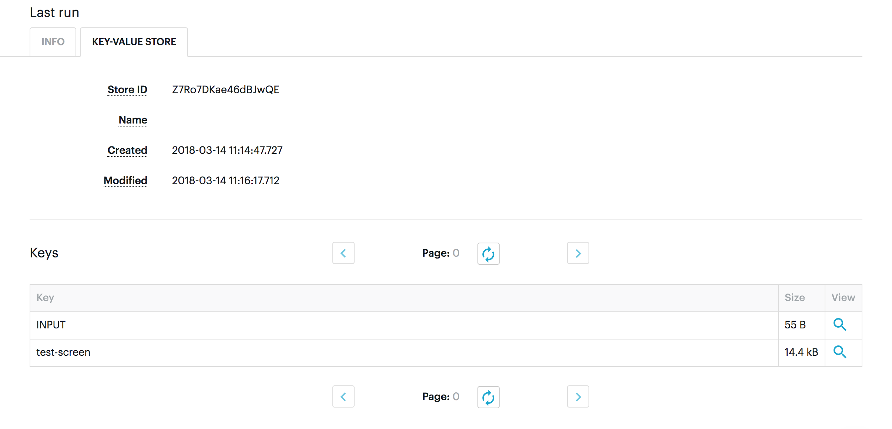

A good way to debug your puppeteer crawler in Apify Actors is to save a screenshot of a browser window to the Apify key-value store. You can do that using this function:

```js
/**
* Store screen from puppeteer page to Apify key-value store
* @param page - Instance of puppeteer Page class https://github.com/GoogleChrome/puppeteer/blob/master/docs/api.md#class-page
* @param [key] - Function stores your screen in Apify key-value store under this key
* @return {Promise<void>}
*/
const saveScreen = async (page, key = 'debug-screen') => {
    const screenshotBuffer = await page.screenshot({ fullPage: true });
    await Apify.setValue(key, screenshotBuffer, { contentType: 'image/png' });
};
```

This function takes the parameters page (an instance of a puppeteer page) and key (your screen is stored under this key function in the Apify key-value store).

Because this is so common use-case Apify SDK has a utility function called [saveSnapshot](/sdk/js/docs/api/puppeteer#puppeteersavesnapshot) that does exactly this and a little bit more:

- You can choose the quality of your screenshots (high-quality images take more size)

- You can also save the HTML of the page

A simple example in an Apify Actor:

```js
import { Actor } from 'apify';
import { puppeteerUtils, launchPuppeteer } from 'crawlee';

Actor.main(async () => {
    const input = await Actor.getValue('INPUT');

    console.log('Launching Puppeteer...');
    const browser = await launchPuppeteer();

    const page = await browser.newPage();
    await page.goto(input.url);

    await puppeteerUtils.saveSnapshot(page, { key: 'test-screen' });

    console.log('Closing Puppeteer...');
    await browser.close();

    console.log('Done.');
});
```

After you call the function, your screen appears in the KEY-VALUE STORE tab in the Actor console. You can click on the row with your saved screen and it'll open it in a new window.



If you have any questions, feel free to contact us in chat.

Happy coding!
