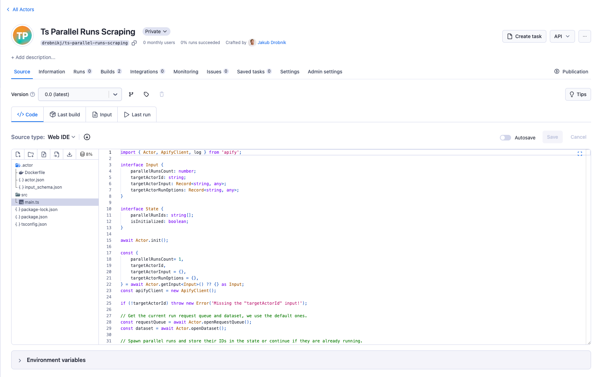
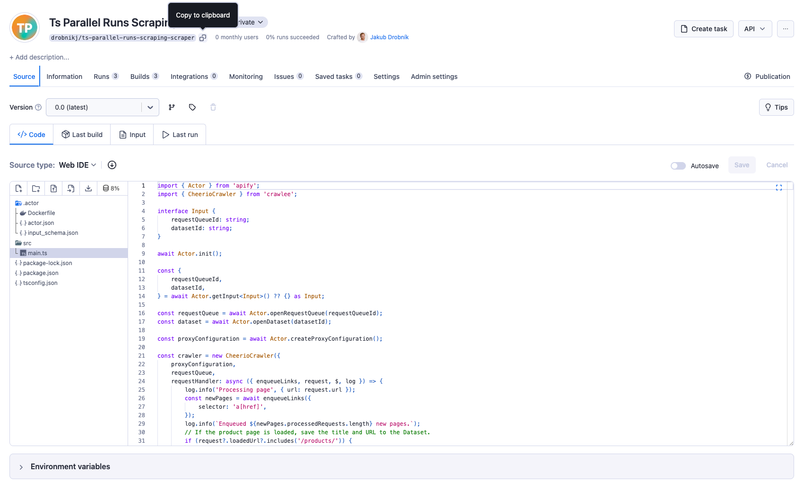
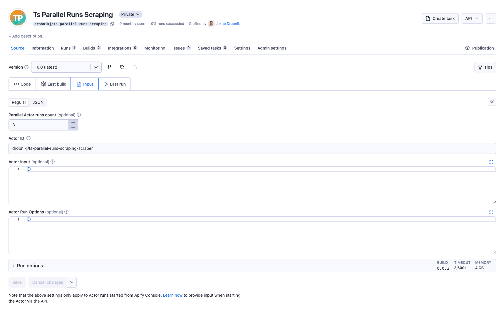
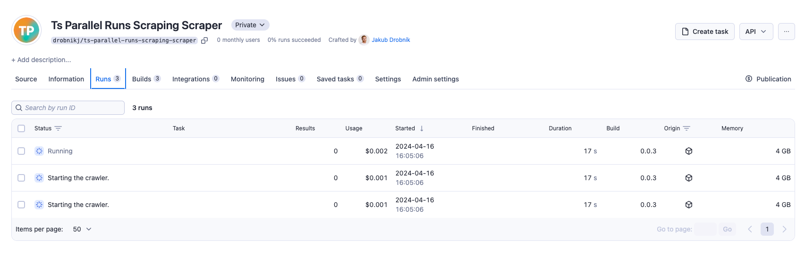

# Scraping website from multiple Actor runs

**Learn how to run multiple instances of an Actor to scrape a website faster. This tutorial will guide you through the process of setting up your scraper.**

---

import Tabs from '@theme/Tabs';
import TabItem from '@theme/TabItem';
import CodeBlock from '@theme/CodeBlock';
import MasterActorMainTs from '!!raw-loader!../../../../examples/ts-parallel-runs-scraping-master/src/main.ts';
import MasterActorInputSchemaJson from '!!raw-loader!../../../../examples/ts-parallel-runs-scraping-master/.actor/input_schema.json';
import ScraperActorMainTs from '!!raw-loader!../../../../examples/ts-parallel-runs-scraping-scraper/src/main.ts';
import ScraperActorInputSchemaJson from '!!raw-loader!../../../../examples/ts-parallel-runs-scraping-scraper/.actor/input_schema.json';

Imagine a large website that you need to scrape. You have a scraper that works well, but scraping the whole website is slow.
You can speed up the scraping process by running multiple instances of the scraper in parallel.
This tutorial will guide you through setting up your scraper to run multiple instances in parallel.

> In a rush? You can check [full code example](https://github.com/apify/apify-docs/tree/master/examples/ts-parallel-runs-scraping-master) right away.

## Managing Multiple Scraper Runs

To manage multiple instances of the scraper, we need to build a Master Actor to oversee the process. This Master Actor will initiate several scraper runs and manage their operations.
It will set up a request queue and a dataset that the other Actor runs will utilize to crawl the website and store results. In this tutorial, we set up the Master Actor and the scraper Actor.

## Master Actor Configuration

The Master Actor orchestrates the parallel execution of scraper Actor runs.
It runs multiple instances of the scraper Actor and passes the request queue and dataset to them.
For the Actor's base structure, we use Apify CLI and create a new Actor with the following command and use the [Empty TypeScript Actor template](https://apify.com/templates/ts-empty).

```bash
apify create master-actor
````

> If you don't have Apify CLI installed, you can find the installation instructions [here](https://docs.apify.com/cli).

### Input Configuration

Let's start by defining the Input Schema for the Master Actor.
The input for the Actor will specify configurations needed to initiate and manage multiple scraper Actors in parallel.
Here’s the breakdown of the necessary input:

<Tabs groupId="main">
<TabItem value="input_schema.json" label="input_schema.json">

<CodeBlock language="json">{MasterActorInputSchemaJson}</CodeBlock>

</TabItem>
<TabItem value="main.ts" label="main.ts">

```typescript
import { Actor, ApifyClient, log } from 'apify';

interface Input {
    parallelRunsCount: number;
    targetActorId: string;
    targetActorInput: Record<string, any>;
    targetActorRunOptions: Record<string, any>;
}

await Actor.init();

const {
    parallelRunsCount= 1,
    targetActorId,
    targetActorInput = {},
    targetActorRunOptions = {},
} = await Actor.getInput<Input>() ?? {} as Input;
const apifyClient = new ApifyClient();

if (!targetActorId) throw new Error('Missing the "targetActorId" input!');
```

</TabItem>
</Tabs>

### Reusing dataset and request queue

The Master Actor will reuse its default dataset and request queue. The dataset stores the results of the scraping process, and the request queue is used as shared storage for processing requests.

```typescript
import { Actor } from 'apify';

const requestQueue = await Actor.openRequestQueue();
const dataset = await Actor.openDataset();
```


### State

The Master Actor will maintain the state of the scraping runs to track progress and manage continuity. It will record the state of Actor runs, initializing this tracking with the first run.
This persistent state ensures that, in migration or restart (resurrection) cases, the Actor can resume the same runs without losing progress.

```typescript
import { Actor, ApifyClient, log } from 'apify';

const apifyClient = new ApifyClient();
const state = await Actor.useState<State>('actor-state', { parallelRunIds: [], isInitialized: false });

if (state.isInitialized) {
    for (const runId of state.parallelRunIds) {
        const runClient = apifyClient.run(runId);
        const run = await runClient.get();

        // This should happen if the run was deleted or the state was incorectly saved.
        if (!run) throw new Error(`The run ${runId} from state does not exists.`);

        if (run.status === 'RUNNING') {
            log.info('Parallel run is already running.', { runId });
        } else {
            log.info(`Parallel run was in state ${run.status}, resurrecting.`, { runId });
            await runClient.resurrect(targetActorRunOptions);
        }
    }
} else {
    for (let i = 0; i < parallelRunsCount; i++) {
        const run = await Actor.start(targetActorId, {
            ...targetActorInput,
            datasetId: dataset.id,
            requestQueueId: requestQueue.id,
        }, targetActorRunOptions);
        log.info(`Started parallel run with ID: ${run.id}`, { runId: run.id });
        state.parallelRunIds.push(run.id);
    }
    state.isInitialized = true;
}
```

Once Actor is initialized, it launches parallel scraper runs and waits for them to complete using `Promise.all()`.
Additionally, by registering for abort events, the Actor can terminate all parallel runs if the Coordinator Actor is stopped.

<Tabs groupId="main">
<TabItem value="main.ts" label="main.ts">
<CodeBlock language="typescript">{MasterActorMainTs}</CodeBlock>
</TabItem>
<TabItem value="input_schema.json" label="input_schema.json">
<CodeBlock language="json">{MasterActorInputSchemaJson}</CodeBlock>
</TabItem>
</Tabs>

### Pushing to Apify

Once you have the Master Actor ready, you can push it to Apify using the following command from the root directory of the Actor project:

```bash
apify push
```

> If you are pushing the Actor for the first time, you will need to [login to your Apify account](https://docs.apify.com/cli/docs/reference#apify-login).

By running this command, you will be prompted to provide the Actor ID, which you can find in the Apify Console under the Actors tab.



## Scraper Actor Configuration

The Scraper Actor performs website scraping. It operates using the request queue and dataset provided by the Master Actor.
You will need to integrate your chosen scraper logic into this framework. The only thing you need to do is utilize the request queue and dataset initialized by the Master Actor.

```typescript
import { Actor } from 'apify';

interface Input {
    requestQueueId: string;
    datasetId: string;
}

const {
    requestQueueId,
    datasetId,
} = await Actor.getInput<Input>() ?? {} as Input;

const requestQueue = await Actor.openRequestQueue(requestQueueId);
const dataset = await Actor.openDataset(datasetId);
```

Once you initialized the request queue and dataset, you can start scraping the website.
In this example, we will use the CheerioCrawler to scrape [the example of ecommerce website](https://warehouse-theme-metal.myshopify.com/).
You can create your scraper from the [Crawlee + Cheerio TypeScript Actor template](https://apify.com/templates/ts-crawlee-cheerio).

<Tabs groupId="main">
<TabItem value="main.ts" label="main.ts">
<CodeBlock language="typescript">{ScraperActorMainTs}</CodeBlock>
</TabItem>
<TabItem value="input_schema.json" label="input_schema.json">
<CodeBlock language="json">{ScraperActorInputSchemaJson}</CodeBlock>
</TabItem>
</Tabs>

> You can check [full code example](https://github.com/apify/apify-docs/tree/master/examples/ts-parallel-runs-scraping-scraper).

You need to push the Scraper Actor to Apify using the following command from the root directory of the Actor project:

```bash
apify push
```

After pushing the Scraper Actor to Apify, you must get the Actor ID from the Apify Console.



## Run orchestration in Apify Console

Once you have the Master Actor and Scraper Actor pushed to Apify, you can run the Master Actor in the Apify Console.
You can set the input for the Master Actor to specify the number of parallel runs and the target Actor ID, input, and run options.
After you hit the Run button, the Master Actor will start the parallel runs of the Scraper Actor.



After starting the Master Actor, you will see the parallel runs initiated in the Apify Console.



## Summary

In this tutorial, you learned how to run multiple instances of an Actor to scrape a website faster. You created a Master Actor to manage the parallel execution of the Scraper Actor runs.
The Master Actor initialized the Scraper Actor runs and managed their state. The Scraper Actor utilized the request queue and dataset provided by the Master Actor to scrape the website.
You could speed up the scraping process by running multiple instances of the Scraper Actor in parallel.

The code in this tutorial is for learning purposes and does not cover all specific edge cases. You can modify it to suit your exact requirements and use cases.
