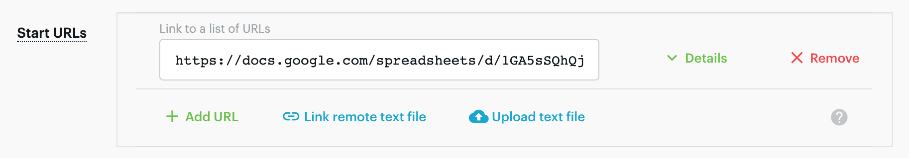
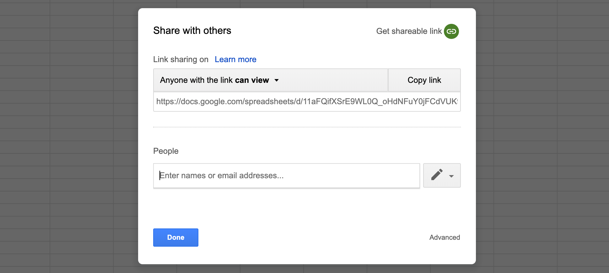

You can export URLs from [Google Sheets](https://www.google.com/sheets/about/) such as [this one](https://docs.google.com/spreadsheets/d/1-2mUcRAiBbCTVA5KcpFdEYWflLMLp9DDU3iJutvES4w) directly into an [Actor](/platform/actors)'s Start URLs field.

1. Make sure the spreadsheet has one sheet and a simple structure to help the Actor find the URLs.

2. Add the `/gviz/tq?tqx=out:csv` query parameter to the Google Sheet URL base, right after the long document identifier part. For example, <https://docs.google.com/spreadsheets/d/1-2mUcRAiBbCTVA5KcpFdEYWflLMLp9DDU3iJutvES4w/gviz/tq?tqx=out:csv>. This automatically exports the spreadsheet to CSV format.

3. In the Actor's input, click Link remote text file and paste the URL there:

IMPORTANT: Make sure anyone with the link can view the document. Otherwise, the Actor will not be able to access it.

