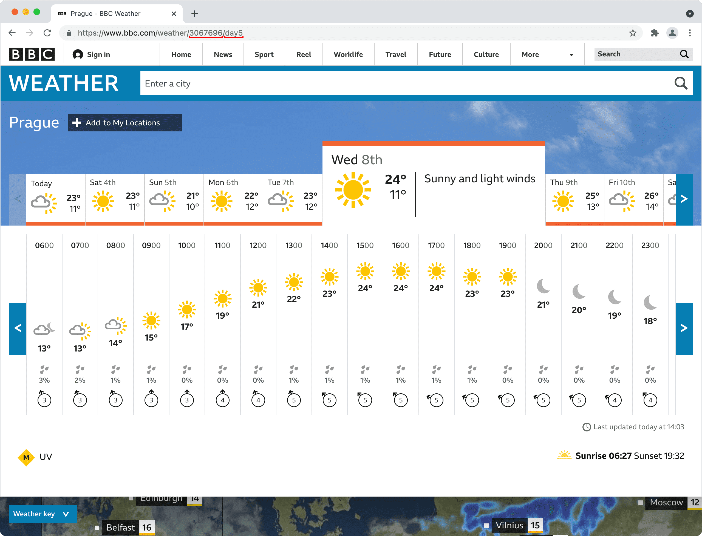
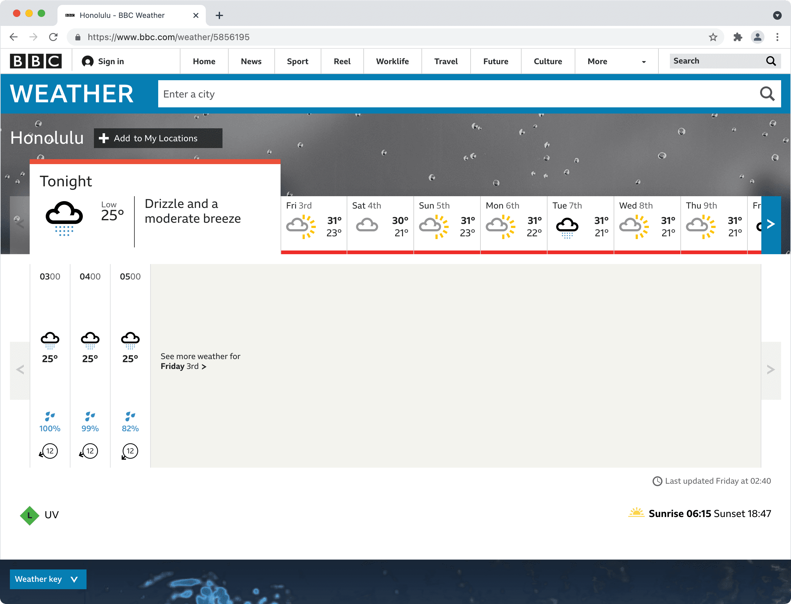
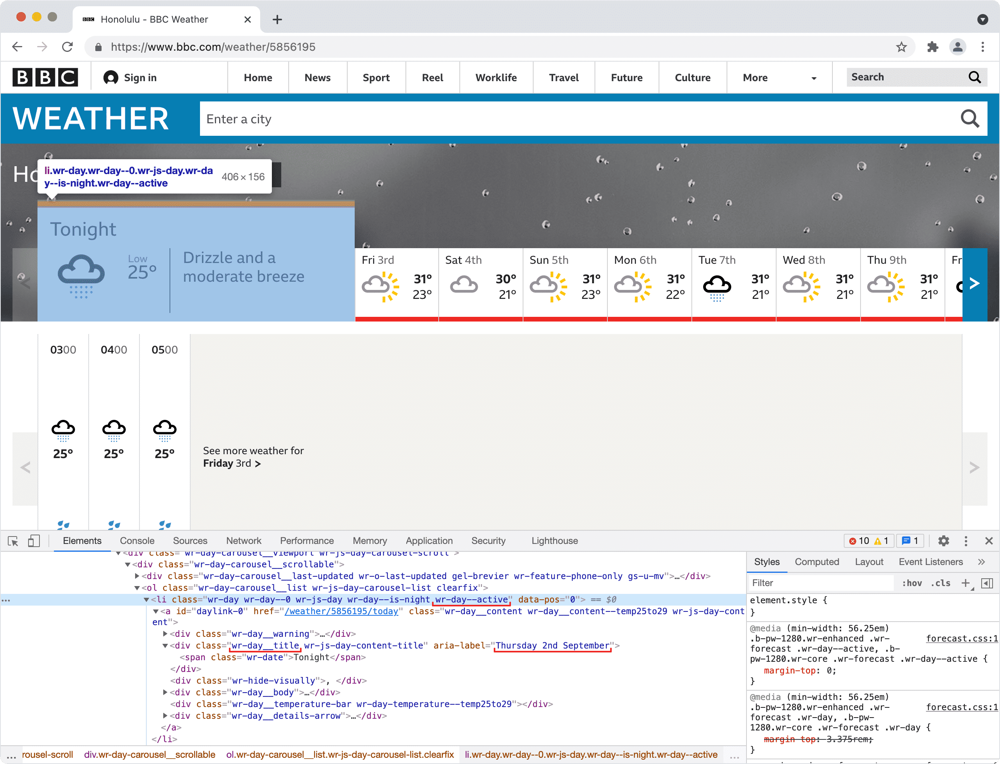
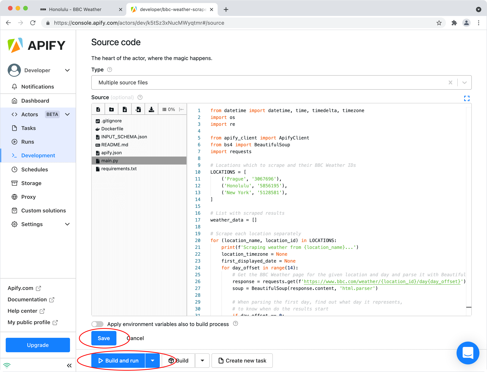
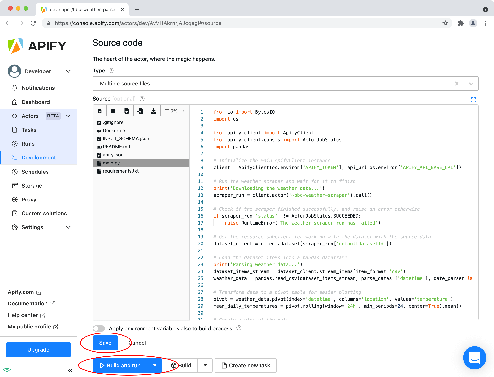
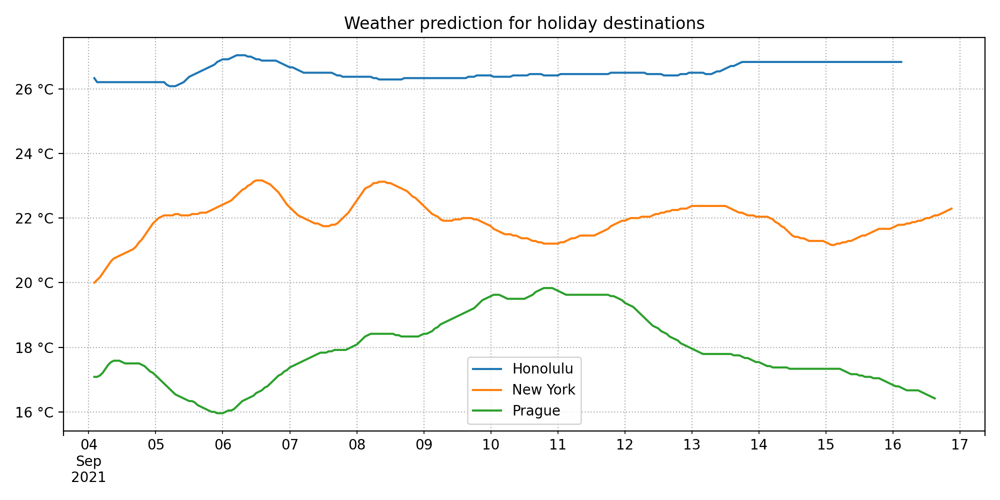

# How to scrape data in Python using Beautiful Soup

**Learn how to create a Python Actor and use Python libraries to scrape, process and visualize data extracted from the web.**

---

Web scraping is not limited to the JavaScript world. The Python ecosystem contains some pretty powerful scraping tools as well. One of those is [Beautiful Soup](https://www.crummy.com/software/BeautifulSoup/), a library for parsing HTML and easy navigation or modification of a DOM tree.

This tutorial shows you how to write a Python [Actor](../../platform/getting_started/actors.md) for scraping the weather forecast from [BBC Weather](https://www.bbc.com/weather) and process the scraped data using [Pandas](https://pandas.pydata.org/).

> In a rush? Skip this tutorial and get the [full code example](https://github.com/apify/apify-docs/tree/master/examples/python-data-scraper/).

## Exploring the BBC Weather page

BBC Weather offers you the weather forecast for the upcoming 14 days for a large selection of places around the world. Let's say we want to decide on our next holiday destination. We're choosing between Prague, New York, and Honolulu, and we will pick the destination based on which one has the best weather. To do that, we will scrape the weather forecast for each of our options, and then compare the results.

### Understanding the URL format

First, we need to look around the BBC Weather page and understand how the weather data is being retrieved and presented. If we open the [BBC Weather](https://www.bbc.com/weather) page and search for Prague, we can see that it opened a page with a URL ending in a seven-digit number, which we can assume is the ID of the displayed location BBC Weather uses internally. Opening a different location changes only that number in the URL, confirming our assumptions.

The page shows the weather forecast for the upcoming 14 days. If we hover over the days in the displayed carousel, we can see that the link for each day leads to a URL ending with `/day{X}`, with `{X}` representing how many days in the future the specific day is.

Combining this information gives us the full format for the URL of a page for a given location and day: `https://www.bbc.com/weather/{LOCATION_ID}/day{DAY_OFFSET}`.



### Determining the forecast's starting date

Looking more closely at the BBC Weather page, we can see that it shows the forecast for each day from 6:00 AM to 5:00 AM the next day. But what happens when we view a location where the current time is between midnight and 5 AM? Trying that, we can see that, in the day represented by **Tonight**, there are only a few slots for the hours between midnight and 5 AM displayed. This means that the first displayed day can either represent the current date at the location, or the day before the current date. To find out which of these two it is, we will first have to determine the current date and time at the location, and then possibly adjust it by one day based on whether the date matches the first displayed day.



To determine the current date and time at the displayed location, we will need to know the location's timezone. Fortunately, the timezone and its offset to GMT are displayed near the bottom of the page.


### Understanding the element structure

To extract data from the page, we need to figure out where exactly in the internal page structure it is stored.

If we right-click on the day title in the top carousel (**Today** or **Tonight**) and select **Inspect** in the popup menu, we can open the Chrome DevTools Inspector with the clicked element highlighted. We can see that the element with the currently displayed day in the top carousel has the class `wr-day--active`, and that the element with the day's title has the class `wr-day__title` and the accessibility label attribute `aria-label` contains the actual date of that day, not just **Today** or **Tonight**. Additionally, the timezone information is in an element with the class `wr-c-footer-timezone__item`. You can see two elements with the same class, so we will need to pick the second one when parsing the page.

Exploring the document tree further, we can see that the element containing all the displayed hours has the class `wr-time-slot-container__slots`. The elements with the forecast for a given hour have the class `wr-time-slot`. In each time slot, the element containing the slot's hour has the class `wr-time-slot-primary__hours` and the element containing the slot's predicted temperature in degrees Celsius has the class `wr-value--temperature--c`.



## Scraping the data from the page

Now that we understand the element structure of the page and know where to find all the data we need, we can start writing the scraper.

### Setting up the Actor

First, we need to create a new Actor. To do this, go to [Apify Console](https://console.apify.com/), open the [Actors section](https://console.apify.com/actors), click on the **Develop new** button in the top right, and select the **Example: Hello world in Python** Actor template.

In the page that opens, you can see your newly created Actor. In the **Settings** tab, you can give it a name (e.g. `bbc-weather-scraper`) and further customize its settings. We'll skip customizing the settings for now, the defaults should be fine. In the **Source** tab, you can see the files that are at the heart of the Actor. Although there are several of them, just two are important for us now, `main.py` and `requirements.txt`.

First we'll start with the `requirements.txt` file. Its purpose is to list all the third-party packages that your Actor will use. We will be using the `requests` package for downloading the BBC Weather pages, and the `beautifulsoup4` package for parsing and processing the downloaded pages. We don't particularly care about the specific versions of these packages, so we just list them in the file:

```py
# Add your dependencies here.
# See https://pip.pypa.io/en/latest/cli/pip_install/#requirements-file-format
# for how to format them

beautifulsoup4
requests
```

### Writing the code

Finally, we can get to writing the main logic for the Actor, which will live in the `main.py` file. Let's delete everything currently in it and start from an empty file.

First, we need to import all the packages we will use in the code:

```py
from datetime import datetime, time, timedelta, timezone
import os
import re

from apify_client import ApifyClient
from bs4 import BeautifulSoup
import requests
```

Next, let's set up the locations we want to scrape in a constant for easier reference and, optionally, modification.

```py
# Locations which to scrape and their BBC Weather IDs
LOCATIONS = [
    ('Prague', '3067696'),
    ('Honolulu', '5856195'),
    ('New York', '5128581'),
]
```

#### Extracting the data

We'll be scraping each location separately. For each location, we need to know in which timezone it resides and what is the first displayed date in the weather forecast for that location. We will scrape each of the 14 forecast days one by one. For each day, we will first download its forecast page using the `requests` library, and then parse the downloaded HTML using the `BeautifulSoup` parser:

```py
# List with scraped results
weather_data = []

# Scrape each location separately
for (location_name, location_id) in LOCATIONS:
    print(f'Scraping weather from {location_name}...')
    location_timezone = None
    first_displayed_date = None
    for day_offset in range(14):
        # Get the BBC Weather page for the given location and day and parse it with BeautifulSoup
        response = requests.get(f'https://www.bbc.com/weather/{location_id}/day{day_offset}')
        soup = BeautifulSoup(response.content, 'html.parser')
```

When scraping a location, we need to know in which timezone it lies, and what date the first displayed day of the forecast represents. We can find that out at the beginning, when scraping the first day of the forecast for that location.

To get the necessary data, we will need to find the elements in which it is contained. Let's use the `soup.find(...)` and `soup.findAll(...)` methods, which find elements matching some specified conditions in the parsed HTML.

First, we extract the timezone from the second element with class `wr-c-footer-timezone__item`. The timezone information is described there with a full sentence, but we're only interested in the numerical representation of the timezone offset, so we parse it out using a regular expression. With the timezone offset parsed, we can construct a `timezone` object and from that get the current datetime at the location.

Afterwards, we can figure out which date is represented by the first displayed day. We find the element with the class `wr-day--active` containing the header for the currently displayed day. Inside it, we find the element with the title of that day, which has the class `wr-day__title`. This element has the accessibility label containing the actual date of the day in its `aria-label` attribute, but it contains only the day and month and not the year, so we can't use it directly. Instead, to get the full date of the first displayed day, we compare the day from the accessibility label and the day from the current datetime at the location. If they match, we know the first displayed date is the current date at the location. If they don't, we know the first displayed date is the day before the current date at the location.

```py
        # When parsing the first day, find out what day it represents,
        # to know when do the results start
        if day_offset == 0:
            # Get the timezone offset written in the page footer and parse it
            tz_description = soup.find_all(class_='wr-c-footer-timezone__item')[1].text
            tz_offset_match = re.search(r'([+-]\d\d)(\d\d)', tz_description)
            tz_offset_hours = int(tz_offset_match.group(1))
            tz_offset_minutes = int(tz_offset_match.group(2))

            # Get the current date and time at the scraped location
            timezone_offset = timedelta(hours=tz_offset_hours, minutes=tz_offset_minutes)
            location_timezone = timezone(timezone_offset)

            location_current_datetime = datetime.now(tz=location_timezone)

            # The times displayed for each day are from 6:00 AM that day to 5:00 AM the next day,
            # so "today" on BBC Weather might actually mean "yesterday" in actual datetime.
            # We have to parse the accessibility label containing the actual date on the header for the first day
            # and compare it with the current date at the location, then adjust the date accordingly
            day_carousel_item = soup.find(class_='wr-day--active')
            day_carousel_title = day_carousel_item.find(class_='wr-day__title')['aria-label']
            website_first_displayed_item_day = int(re.search(r'\d{1,2}', day_carousel_title).group(0))

            if location_current_datetime.day == website_first_displayed_item_day:
                first_displayed_date = location_current_datetime.date()
            else:
                first_displayed_date = location_current_datetime.date() - timedelta(days=1)
```

Now that we've figured out the date of the first displayed day, we can extract the predicted weather from each hour of each forecast day. The forecast for the displayed day is in the element with class `wr-time-slot-container__slots`, and that element contains time slots for each predicted hour represented by elements with the class `wr-time-slot`. In each time slot, the element with the class `wr-time-slot-primary__hours` contains the hour of the time slot. The element with the class `wr-value--temperature--c` contains the temperature in degrees Celsius.

To get the datetime of each slot, we need to combine the date of the first displayed day, the hour displayed in the slot, and the timezone of the currently processed location. Since the page shows the forecast for each day from 6 AM to 5 AM the next day, we need to add one day to the slots from midnight to 5 AM to get the correct datetime.

Finally, we can put all the extracted information together and push them to the array holding the resulting data.

```py
        # Go through the elements for each displayed time slot of the displayed day
        slot_container = soup.find(class_='wr-time-slot-container__slots')
        for slot in slot_container.find_all(class_='wr-time-slot'):
            # Find out the date and time of the displayed element from the day offset and the displayed hour.
            # The times displayed for each day are from 6:00 AM that day to 5:00 AM the next day,
            # so anything between midnight and 6 AM actually represents the next day
            slot_hour = int(slot.find(class_='wr-time-slot-primary__hours').text)
            slot_datetime = datetime.combine(first_displayed_date, time(hour=slot_hour), tzinfo=location_timezone)
            slot_datetime += timedelta(days=day_offset)
            if slot_hour < 6:
                slot_datetime += timedelta(days=1)

            # Parse the temperature from the right element
            slot_temperature = int(slot.find(class_='wr-value--temperature--c').text[:-1])

            # Add the parsed data to the result list
            weather_data.append({
                'datetime': slot_datetime,
                'location': location_name,
                'temperature': slot_temperature,
            })
```

#### Storing the data

As the last step, we need to store the scraped data in a dataset on the Apify platform, so that we can access it later. We do that through the [Apify API Client for Python](/api/client/python), which greatly simplifies working with the Apify platform and allows you to use its functions without having to call the Apify API directly.

First, we initialize an `ApifyClient` instance. All the necessary arguments are automatically provided to the Actor process as environment variables accessible in Python through the `os.environ` mapping. We will save the data into the default dataset belonging to the Actor run, so we create a sub-client for working with that dataset, and push the data into it using its `.push_items(...)` method.

```py
# Initialize the main ApifyClient instance
client = ApifyClient(os.environ['APIFY_TOKEN'], api_url=os.environ['APIFY_API_BASE_URL'])

# Get the resource subclient for working with the default dataset of the Actor run
default_dataset_client = client.dataset(os.environ['APIFY_DEFAULT_DATASET_ID'])

# Finally, push all the results into the dataset
default_dataset_client.push_items(weather_data)

print(f'Results have been saved to the dataset with ID {os.environ["APIFY_DEFAULT_DATASET_ID"]}')
```

### Running the Actor

And that's it! Now you can save the changes in the editor, and then click **Build and run** at the bottom of the page. The Actor will get built, the built Actor image will get saved for future reuse, and then it will be executed. You can follow the progress of the Actor build and the Actor run in the **Last build** and **Last run** tabs, respectively, in the developer console in the Actor source view. Once the Actor finishes running, you can view the scraped data in the **Dataset** tab in the Actor run view.



## How to process data in Python using Pandas

Earlier in this tutorial, we learned how to scrape data from the web in Python using the [Beautiful Soup](https://www.crummy.com/software/BeautifulSoup/) library. The Python ecosystem's strengths lie mainly in data processing, though, so in this tutorial we will learn how to process the data stored in an Apify dataset using the [Pandas](https://pandas.pydata.org/) library, and how to visualize it using [Matplotlib](https://matplotlib.org/).

> In a rush? Skip this tutorial and [get the full code example](https://github.com/apify/apify-docs/tree/master/examples/python-data-parser/).

## Processing previously scraped data

In the previous tutorial, we set out to select our next holiday destination based on the forecast of the upcoming weather there. We have written an Actor that scrapes the BBC Weather forecast for the upcoming two weeks for three destinations: Prague, New York, and Honolulu. It then saves the scraped data to a [dataset](/platform/storage/dataset) on the Apify platform.

Now, we need to process the scraped data and make a simple visualization that will help us decide which location has the best weather, and will therefore become our next holiday destination.

### Setting up the Actor {#setting-up-the-actor}

First, we need to create another Actor. You can do it the same way as before - go to the [Apify Console](https://console.apify.com/), open the [Actors section](https://console.apify.com/actors), click on the **Create new** button in the top right, and select the **Example: Hello world in Python** Actor template.

In the page that opens, you can see your newly created Actor. In the **Settings** tab, you can give it a name (e.g. `bbc-weather-parser`) and further customize its settings. We'll skip customizing the settings for now, the defaults should be fine. In the **Source** tab, you can see the files that are at the heart of the Actor. Although there are several of them, just two are important for us now, `main.py` and `requirements.txt`.

First, we'll start with the `requirements.txt` file. Its purpose is to list all the third-party packages that your Actor will use. We will be using the `pandas` package for parsing the downloaded weather data, and the `matplotlib` package for visualizing it. We don't particularly care about the specific versions of these packages, so we just list them in the file:

```py
# Add your dependencies here.
# See https://pip.pypa.io/en/latest/cli/pip_install/#requirements-file-format
# for how to format them

matplotlib
pandas
```

The Actor's main logic will live in the `main.py` file. Let's delete everything currently in it and start from an empty file.

Next, we'll import all the packages we will use in the code:

```py
from io import BytesIO
import os

from apify_client import ApifyClient
from apify_client.consts import ActorJobStatus
import pandas
```

### Scraping the data

Next, we need to run the weather scraping Actor and access its results. We do that through the [Apify API Client for Python](/api/client/python), which greatly simplifies working with the Apify platform and allows you to use its functions without having to call the Apify API directly.

First, we initialize an `ApifyClient` instance. All the necessary arguments are automatically provided to the Actor process as environment variables accessible in Python through the `os.environ` mapping. We need to run the Actor from the previous tutorial, which we have named `bbc-weather-scraper`, and wait for it to finish. We create a sub-client for working with that Actor and run the Actor through it. We then check whether the Actor run has succeeded. If so, we create a client for working with its default dataset.

```py
# Initialize the main ApifyClient instance
client = ApifyClient(os.environ['APIFY_TOKEN'], api_url=os.environ['APIFY_API_BASE_URL'])

# Run the weather scraper and wait for it to finish
print('Downloading the weather data...')
scraper_run = client.actor('~bbc-weather-scraper').call()

# Check if the scraper finished successfully, otherwise raise an error
if scraper_run['status'] != ActorJobStatus.SUCCEEDED:
    raise RuntimeError('The weather scraper run has failed')

# Get the resource sub-client for working with the dataset with the source data
dataset_client = client.dataset(scraper_run['defaultDatasetId'])
```

### Processing the data

Now, we need to load the data from the dataset to a Pandas dataframe. Pandas supports reading data from a CSV file stream, so we just create a stream with the dataset items in the right format and supply it to `pandas.read_csv()`.

```py
# Load the dataset items into a pandas dataframe
print('Parsing weather data...')
dataset_items_stream = dataset_client.stream_items(item_format='csv')
weather_data = pandas.read_csv(dataset_items_stream, parse_dates=['datetime'], date_parser=lambda val: pandas.to_datetime(val, utc=True))
```

Once we have the data loaded, we can process it. Each data row comes as three fields: `datetime`, `location` and `temperature`. We would like to transform the data so that we have the datetimes in one column, and the temperatures for each location at that datetime in separate columns, one for each location. To achieve this, we use the `.pivot()` method on the dataframe. Since the temperature varies considerably between day and night, and we would like to get an overview of the temperature trends over a longer period of time, we calculate a rolling average of the temperatures with a 24-hour window.

```py
# Transform data to a pivot table for easier plotting
pivot = weather_data.pivot(index='datetime', columns='location', values='temperature')
mean_daily_temperatures = pivot.rolling(window='24h', min_periods=24, center=True).mean()
```

### Visualizing the data

With the data processed, we can then make a plot of the results. For that, we use the `.plot()` method of the dataframe, which creates a figure with the plot, using the Matplotlib library internally. We set the right titles and labels to the plot, and apply some additional formatting to achieve a nicer result.

```py
# Create a plot of the data
print('Plotting the data...')
axes = mean_daily_temperatures.plot(figsize=(10, 5))
axes.set_title('Weather prediction for holiday destinations')
axes.set_xlabel(None)
axes.yaxis.set_major_formatter(lambda val, _: f'{int(val)} °C')
axes.grid(which='both', linestyle='dotted')
axes.legend(loc='best')
axes.figure.tight_layout()
```

As the last step, we need to save the plot to a record in a [key-value store](/platform/storage/key-value-store) on the Apify platform, so that we can access it later. We save the rendered figure with the plot to an in-memory buffer, and then save the contents of that buffer to the default key-value store of the Actor run through its resource subclient.

```py
# Get the resource sub-client for working with the default key-value store of the run
key_value_store_client = client.key_value_store(os.environ['APIFY_DEFAULT_KEY_VALUE_STORE_ID'])

# Save the resulting plot to the key-value store through an in-memory buffer
print('Saving plot to key-value store...')
with BytesIO() as buf:
    axes.figure.savefig(buf, format='png', dpi=200, facecolor='w')
    buf.seek(0)
    key_value_store_client.set_record('prediction.png', buf, 'image/png')

print(f'Result is available at {os.environ["APIFY_API_PUBLIC_BASE_URL"]}'
      + f'/v2/key-value-stores/{os.environ["APIFY_DEFAULT_KEY_VALUE_STORE_ID"]}/records/prediction.png')
```

And that's it! Now you can save the changes in the editor, and then click **Build and run** at the bottom of the page. The Actor will get built, the built Actor image will get saved for future re-use, and then it will be executed. You can follow the progress of the Actor build and the Actor run in the **Last build** and **Last run** tabs, respectively, in the developer console in the Actor source view. Once the Actor finishes running, it will output the URL where you can access the plot we created in its log.



Looking at the results, Honolulu seems like the right choice now, don't you think? 🙂



