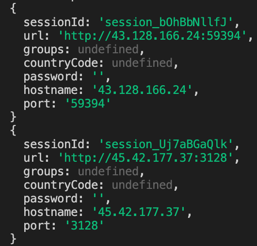

# Using proxies {#using-proxies}

**Learn how to use and automagically rotate proxies in your scrapers by using Crawlee, and a bit about how to easily obtain pools of proxies.**

---

In the [**Web scraping for beginners**](../../web_scraping_for_beginners/crawling/pro_scraping.md) course, we learned about the power of Crawlee, and how it can streamline the development process of web crawlers. You've already seen how powerful the `crawlee` package is; however, what you've been exposed to thus far is only the tip of the iceberg.

Because proxies are so widely used in the scraping world, Crawlee as been equipped with features which make it easy to implement them in an effective way. One of the main functionalities that comes baked into Crawlee is proxy rotation, which is when each request is sent through a different proxy from a proxy pool.

## Implementing proxies in a scraper {#implementing-proxies}

Let's borrow some scraper code from the end of the [pro-scraping](../../web_scraping_for_beginners/crawling/pro_scraping.md) lesson in our **Web Scraping for Beginners** course and paste it into a new file called **proxies.js**. This code enqueues all of the product links on [demo-webstore.apify.org](https://demo-webstore.apify.org)'s on-sale page, then makes a request to each product page and scrapes data about each one:

```js
// crawlee.js
import { CheerioCrawler, Dataset } from 'crawlee';

const crawler = new CheerioCrawler({
    requestHandler: async ({ $, request, enqueueLinks }) => {
        if (request.label === 'START') {
            await enqueueLinks({
                selector: 'a[href*="/product/"]'
            });

            // When on the START page, we don't want to
            // extract any data after we extract the links.
            return;
        }

        // We copied and pasted the extraction code
        // from the previous lesson
        const title = $('h3').text().trim();
        const price = $('h3 + div').text().trim();
        const description = $('div[class*="Text_body"]').text().trim();

        // Instead of saving the data to a variable,
        // we immediately save everything to a file.
        await Dataset.pushData({
            title,
            description,
            price,
        });
    },
});

await crawler.addRequests([{
    url: 'https://demo-webstore.apify.org/search/on-sale',
    // By labeling the Request, we can very easily
    // identify it later in the requestHandler.
    label: 'START',
}]);

await crawler.run();
```

In order to implement a proxy pool, we will first need some proxies. We'll quickly use the free [proxy scraper](https://apify.com/mstephen190/proxy-scraper) on the Apify platform to get our hands on some quality proxies. Next, we'll need to set up a [`ProxyConfiguration`](https://crawlee.dev/api/core/class/ProxyConfiguration) and configure it with our custom proxies, like so:

```js
import { ProxyConfiguration } from 'crawlee';

const proxyConfiguration = new ProxyConfiguration({
    proxyUrls: ['http://45.42.177.37:3128', 'http://43.128.166.24:59394', 'http://51.79.49.178:3128'],
});
```

Awesome, so there's our proxy pool! Usually, a proxy pool is much larger than this; however, a three proxie pool is total fine for tutorial purposes. Finally, we can pass the `proxyConfiguration` into our crawler's options:

```js
const crawler = new CheerioCrawler({
    proxyConfiguration,
    requestHandler: async ({ $, request, enqueueLinks }) => {
        if (request.label === 'START') {
            await enqueueLinks({
                selector: 'a[href*="/product/"]',
            });
            return;
        }

        const title = $('h3').text().trim();
        const price = $('h3 + div').text().trim();
        const description = $('div[class*="Text_body"]').text().trim();

        await Dataset.pushData({
            title,
            description,
            price,
        });
    },
});
```

> Note that if you run this code, it may not work, as the proxies could potentially be down/non-operating at the time you are going through this course.

That's it! The crawler will now automatically rotate through the proxies we provided in the `proxyUrls` option.

## A bit about debugging proxies {#debugging-proxies}

At the time of writing, our above scraper utilizing our custom proxy pool is working just fine. But how can we check that the scraper is for sure using the proxies we provided it, and more importantly, how can we debug proxies within our scraper? Luckily, within the same `context` object we've been destructuring `$` and `request` out of, there is a `proxyInfo` key as well. `proxyInfo` is an object which includes useful data about the proxy which was used to make the request.

```js
const crawler = new CheerioCrawler({
    proxyConfiguration,
    // Destructure "proxyInfo" from the "context" object
    handlePageFunction: async ({ $, request, proxyInfo }) => {
        // Log its value
        console.log(proxyInfo)
        // ...
        // ...
    },
});
```

After modifying your code to log `proxyInfo` to the console and running the scraper, you're going to see some logs which look like this:



These logs confirm that our proxies are being used and rotated successfully by Crawlee, and can also be used to debug slow or broken proxies.

## Higher level proxy scraping {#higher-level-proxy-scraping}

Though we will discuss it more in-depth in future courses, it is still important to mention that Crawlee has integrated support for the Apify SDK, which supports [Apify Proxy](https://apify.com/proxy) - a service that provides access to pools of both residential and datacenter IP addresses. A `proxyConfiguration` using Apify Proxy might look something like this:

```js
import { Actor } from 'apify';

const proxyConfiguration = await  Actor.createProxyConfiguration({
    countryCode: 'US'
});
```

Notice that we didn't provide it a list of proxy URLs. This is because the `SHADER` group already serves as our proxy pool (courtesy of Apify Proxy).

## Next up {#next}

[Next up](./generating_fingerprints.md), we'll be checking out how to use two NPM packages to generate and inject [browser fingerprints](../techniques/fingerprinting.md).
