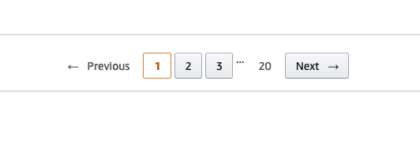

# Handling pagination {#handling-pagination}

**Learn about the three most popular API pagination techniques and how to handle each of them when scraping an API with pagination.**

---

When scraping large APIs, you'll quickly realize that most APIs limit the number of results it responds back with. For some APIs, the max number of results is 5, while for others it's 2000. Either way, they all have something in common - pagination.

If you've never dealt with it before, trying to scrape thousands to hundreds of thousands of items from an API with pagination can be a bit challenging. In this lesson, we'll be discussing a few of the different types of pagination, as well as how to work with them.

## Page-number pagination {#page-number}

The most common and rudimentary forms of pagination have page numbers. Imagine paginating through a typical e-commerce website.



This implementation makes it fairly straightforward to programmatically paginate through an API, as it pretty much entails incrementing up or down in order to receive the next set of items. The page number is usually provided right in the parameters of the request URL; however, some APIs require it to be provided in the request body instead.

## Offset pagination {#offset-pagination}

The second most popular pagination technique used is based on using a **limit** parameter along with an **offset** parameter. The **limit** says how many records should be returned in a single request, while the **offset** parameter says how many records should be skipped.

For example, let's say that we have this dataset and an API route to retrieve its items:

```js
const myAwesomeDataset = [1, 2, 3, 4, 5, 6, 7, 8, 9, 10, 11, 12, 13, 14, 15];
```

If we were to make a request with the **limit** set to **5** and the **offset** parameter also set to **5**, the API would skip over the first five items and return `[6, 7, 8, 9, 10]`.

## Cursor pagination {#cursor-pagination}

Sometimes pagination uses **cursor** instead of **offset**. Cursor is a marker of an item in the dataset. It can be a date, number, or a more or less random string of letters and numbers. Request with a **cursor** parameter will result in an API response containing items which follow after the item which the cursor points to.

One of the most painful things about scraping APIs with cursor pagination is that you can't skip to, for example, the 5th page. You have to paginate through each page one by one.

> Note: SoundCloud [migrated](https://developers.soundcloud.com/blog/pagination-updates-on-our-api/) over to using cursor-based pagination; however, they did not change the parameter name from **offset** to **cursor**. Always be on the lookout for this type of stuff!

## Using "next page" {#using-next-page}

In a minute, we're going to create a mini-project which will scrape the first 100 of Tiësto's tracks by keeping a **limit** of 20 and paginating through until we've scraped 100 items.

Luckily for us, SoundCloud's API (and many others) provides a **next_href** property in each response, which means we don't have to directly deal with setting the **offset** (cursor) parameter:

```json
//...
{
    "next_href": "https://api-v2.soundcloud.com/users/141707/tracks?offset=2020-03-13T00%3A00%3A00.000Z%2Ctracks%2C00774168919&limit=20&representation=https%3A%2F%2Fapi-v2.soundcloud.com%2Fusers%2F141707%2Ftracks%3Flimit%3D20",
    "query_urn": null
}
```

This URL can take various different forms, and can be given different names; however, they all generally do the same thing - bring you to the next page of results.

## Mini project {#mini-project}

First, create a new folder called **pagination-tutorial** and run this command inside of it:

```shell
# initialize the project and install the puppeteer
# and got-scraping packages
npm init -y && npm i puppeteer got-scraping
```

Now, make a new file called **scrapeClientId**, copying the **client_id** scraping code from the previous lesson and making a slight modification:

```js
// scrapeClientId.js
import puppeteer from 'puppeteer';

// export the function to be used in a different file
export const scrapeClientId = async () => {
    const browser = await puppeteer.launch({ headless: true });
    const page = await browser.newPage();

    let clientId = null;

    page.on('response', async (res) => {
        const id = new URL(res.url()).searchParams.get('client_id') ?? null;
        if (id) clientId = id;
    });

    await page.goto('https://soundcloud.com/tiesto/tracks');
    await page.waitForSelector('.profileHeader__link');
    await browser.close();

    // return the client_id
    return clientId;
};
```

Now, in a new file called **index.js** we'll write the skeleton for our pagination and item-scraping code:

```js
// index.js
// we will need gotScraping to make HTTP requests
import { gotScraping } from 'got-scraping';
import { scrapeClientId } from './scrapeClientId';

const scrape100Items = async () => {
    // the initial request URL
    const nextHref = 'https://api-v2.soundcloud.com/users/141707/tracks?limit=20&offset=0';

    // create an array for all of our scraped items to live
    const items = [];

    // scrape the client ID with the script from the
    // previous lesson
    const clientId = await scrapeClientId();

    // More code will go here
};
```

Let's now take a step back and think about the condition on which we should continue paginating:

1. If the API responds with a **next_href** set to **null**, that means that there are no more pages, and that we have scraped all of the possible items and we should stop paginating.
2. If our items list has 100 records or more, we should stop paginating. Otherwise, we should continue until 100+ items has been reached.

With a full understanding of this condition, we can translate it into code:

```js
const scrape100Items = async () => {
    // ...previous code
    // continue making requests until either we've reached 100+ items
    while (items.flat().length < 100) {
        // if the "next_href" wasn't present in the last call, there
        // are no more pages. return what we have and stop paginating.
        if (!nextHref) return items.flat();

        // continue paginating
    }
};
```

All that's left to do now is flesh out this `while` loop with pagination logic and finally return the **items** array once the loop has finished.

> Note that it's better to add requests to a requests queue rather than processing them in memory. The crawlers offered by [Crawlee](https://crawlee.dev/docs/) provide this functionality out of the box.

```js
// index.js
import { gotScraping } from 'got-scraping';
import { scrapeClientId } from './scrapeClientId';

const scrape100Items = async () => {
    let nextHref = 'https://api-v2.soundcloud.com/users/141707/tracks?limit=20&offset=0';
    const items = [];

    const clientId = await scrapeClientId();

    while (items.flat().length < 100) {
        if (!nextHref) return items.flat();

        // set the "client_id" URL parameter of the
        // nextHref URL
        const nextURL = new URL(nextHref);
        nextURL.searchParams.set('client_id', clientId);

        // make the paginated request and push its results
        // into the in-memory "items" array
        const res = await gotScraping(nextURL);
        const json = JSON.parse(res.body);
        items.push(json.collection);

        // queue the next link for the next loop iteration
        nextHref = json.next_href;
    }

    // return an array of all our scraped items
    // once the loop has finished
    return items.flat();
};

// test run
(async () => {
    // run the function
    const data = await scrape100Items();

    // log the length of the items array
    console.log(data.length);
})();
```

> We are using the [`.flat()`](https://developer.mozilla.org/en-US/docs/Web/JavaScript/Reference/Global_Objects/Array/flat) method when returning the **items** array to turn our array of arrays into a single array of items.

Here's what the output of this code looks like:

```text
105
```

## Final note {#final-note}

Sometimes, APIs have limited pagination. That means that they limit the total number of results that can appear for a set of pages, or that they limit the pages to a certain number. To learn how to handle these cases, take a look at [this short article](/academy/advanced-web-scraping/scraping-paginated-sites).

## Next up {#next}

[//]: # (In this lesson, you learned about how to use API parameters and properties returned in an API response to paginate through results. [Next up]&#40;link api_scraping/general_api_scraping/using_api_filters.md&#41;, you'll gain a solid understanding of using API filtering parameters.)

This is the last lesson in the API scraping tutorial for now, but be on the lookout for more lessons soon to come! Thus far, you've learned how to:

1. Locate API endpoints
2. Understand located API endpoints and their parameters
3. Parse and modify cookies
4. Modify/set headers
5. Farm API tokens using Puppeteer
6. Use paginated APIs
<!-- 7. Utilize API filters to narrow down results -->

If you'd still like to read more about API scraping, check out the [**GraphQL scraping**](../graphql_scraping/index.md) course! GraphQL is the king of API scraping.
