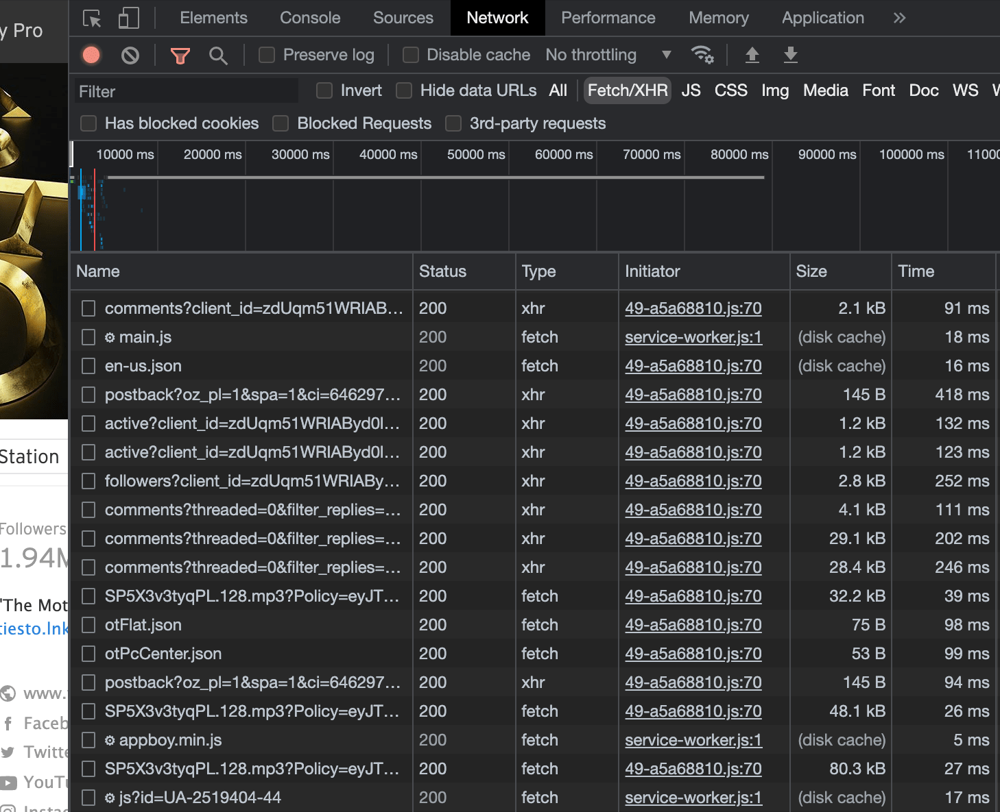
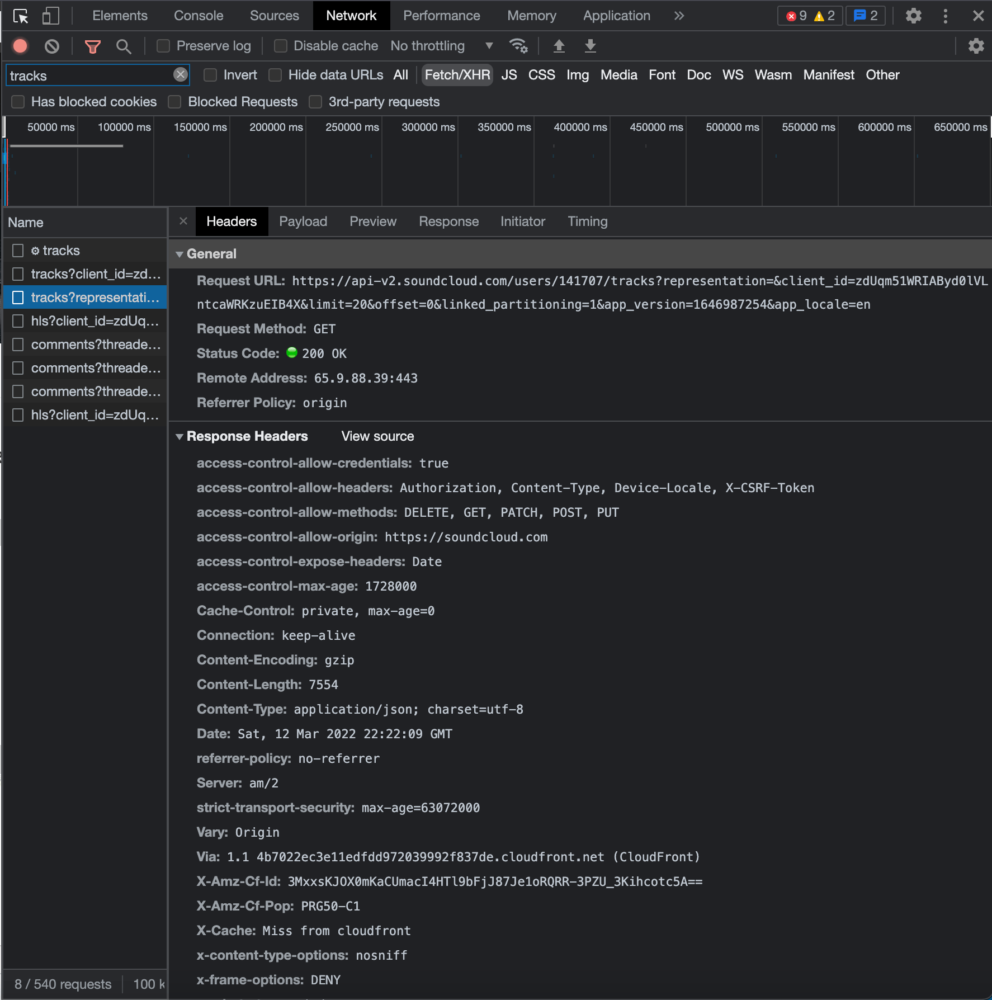
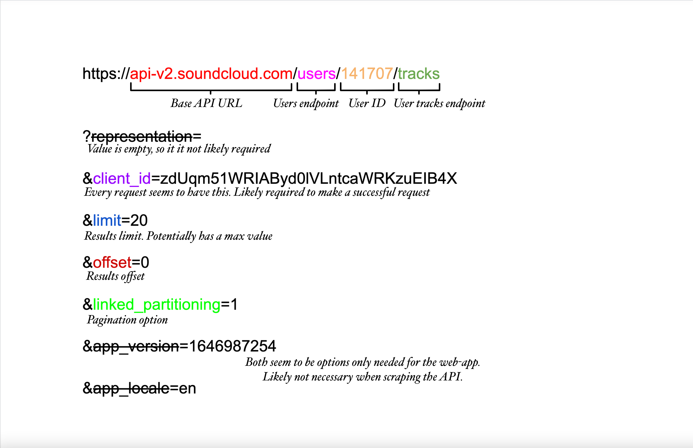

# Locating API endpoints {#locating-endpoints}

**Learn how to effectively locate a website's API endpoints, and learn how to use them to get the data you want faster and more reliably.**

---

In order to retrieve a website's API endpoints, as well as other data about them, the **Network** tab within Chrome's (or another browser's) DevTools can be used. This tab allows you to see all of the various network requests being made, and even allows you to filter them based on request type, response type, or by a keyword.

On our target page, we'll open up the Network tab, and filter by request type of `Fetch/XHR`, as opposed to the default of `All`. Next, we'll do some action on the page which causes the request for the target data to be sent, which will enable us to view the request in DevTools. The types of actions that need to be done can vary depending on the website, the type of page, and the type of data being returned. Sometimes, reloading the page is enough, while other times, a button must be clicked, or the page must be scrolled. For our example use case, reloading the page is sufficient.

_Here's what we can see in the Network tab after reloading the page:_



Let's say that our target data is a full list of Tiësto's uploaded songs on SoundCloud. We can use the **Filter** option to search for the keyword `tracks`, and see if any endpoints have been hit that include that word. Multiple results may still be in the list when using this feature, so it is important to carefully examine the payloads and responses of each request in order to ensure that the correct one is found.

> To find what we're looking for, we must wisely choose what piece of data (in this case a keyword) we filter by. Think of something that is most likely to be part of the endpoint (in this case a string `tracks`).

After a little bit of digging through the different response values of each request in our filtered list within the Network tab, we can discover this endpoint, which returns a JSON list including 20 of Tiësto's latest tracks:



## Learning the API {#learning-the-api}

The majority of APIs, especially for popular sites that serve up large amounts of data, are configurable through different parameters, query options, or payload values. A lot of times, an endpoint discovered through the Network tab will reveal at least a few of these options.

Here's what our target endpoint's URL looks like coming directly from the Network tab:

```text
https://api-v2.soundcloud.com/users/141707/tracks?representation=&client_id=zdUqm51WRIAByd0lVLntcaWRKzuEIB4X&limit=20&offset=0&linked_partitioning=1&app_version=1646987254&app_locale=en
```

Since our request doesn't have any body/payload, we need to analyze the URL. We can break this URL down into chunks that help us understand what each value does.



Understanding an API's various configurations helps with creating a game-plan on how to best scrape it, as many of the parameters can be utilized for pagination, or data-filtering. Additionally, these values can be mapped to a scraper's configuration options, which overall makes the scraper more versatile.

Let's say we want to receive all of the user's tracks in one request. Based on our observations of the endpoint's different parameters, we can modify the URL and utilize the `limit` option to return more than twenty songs. The `limit` option is extremely common with most APIs, and allows the person making the request to literally limit the maximum number of results to be returned in the request:

```text
https://api-v2.soundcloud.com/users/141707/tracks?client_id=zdUqm51WRIAByd0lVLntcaWRKzuEIB4X&limit=99999
```

By using the ridiculously large number of `99999`, we ensure that all of the user's tracks will be captured in this single request. Luckily, with SoundCloud's API, there is no cap to the `limit` parameter; however, most other APIs will have a limit to ensure that hundreds of thousands of results aren't retrieved at one time. For this use-case, setting a massive results limit is not much of a risk, as most users don't have a track-count over 500 anyways, but receiving too many results at once can result in overflow errors.

## Next up {#next}

[Next lesson](./cookies_headers_tokens.md) will be all about cookies, headers, and tokens, and how they're relevant when scraping an API.
