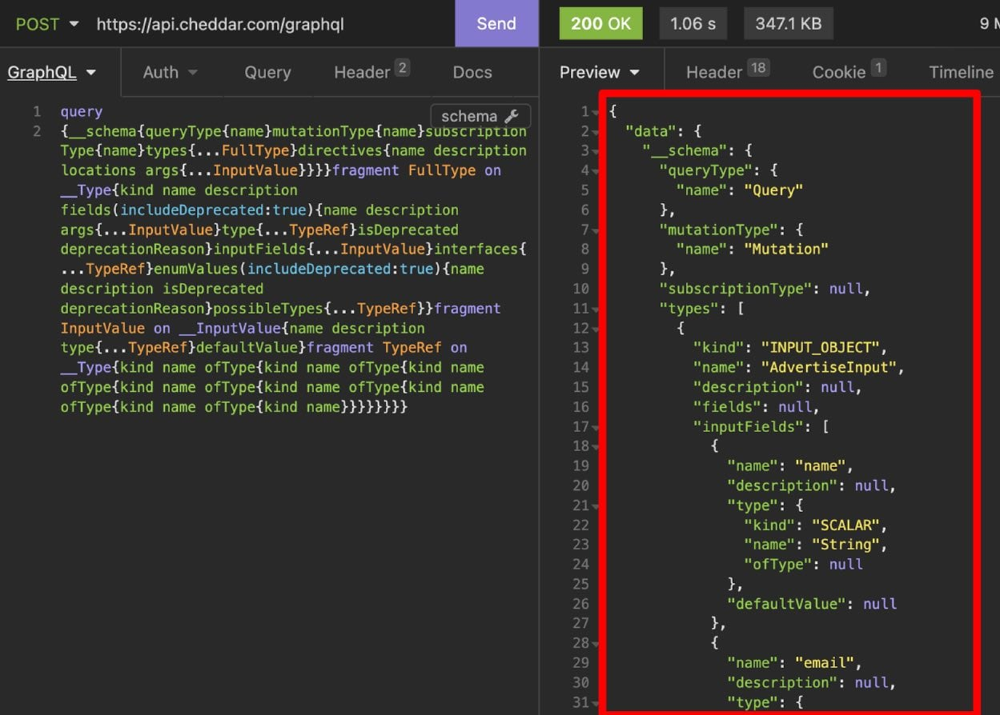
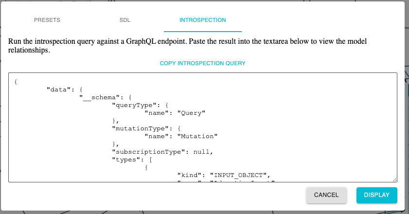
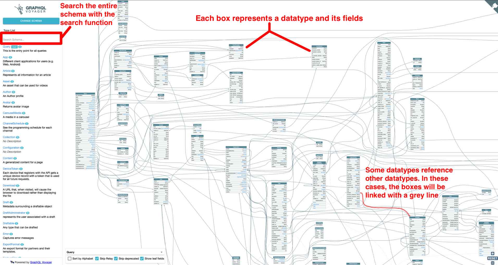
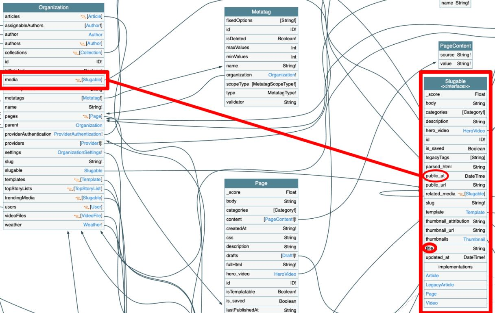
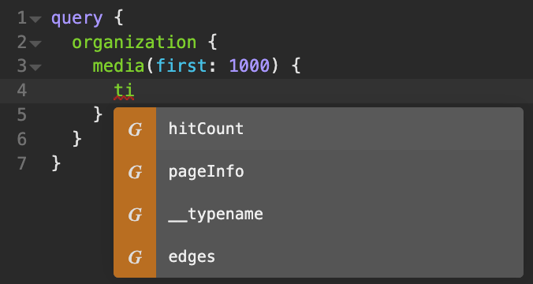
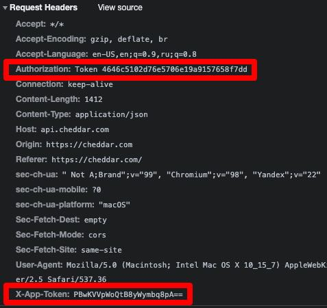
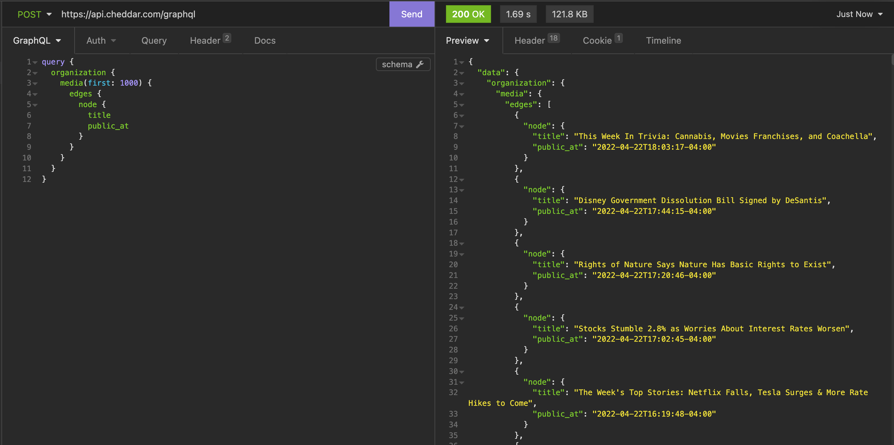
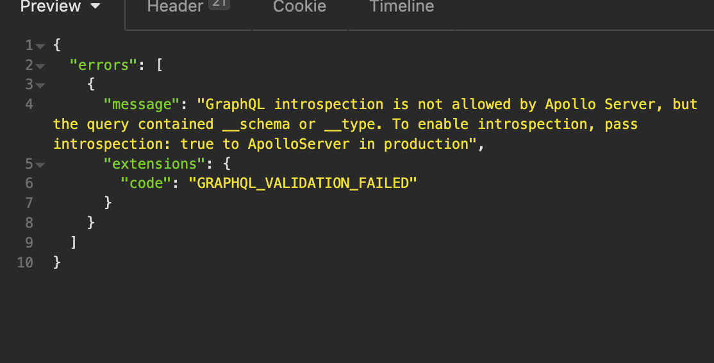

# Introspection {#introspection}

**Understand what introspection is, and how it can help you understand a GraphQL API to take advantage of the features it has to offer before writing any code.**

---

[Introspection](https://graphql.org/learn/introspection/) is when you make a query to the target GraphQL API requesting information about its schema. When done properly, this can provide a whole lot of information about the API and the different **queries** and **mutations** it supports.

Just like when working with regular RESTful APIs in the [**General API scraping**](../general_api_scraping/locating_and_learning.md) section, it's important to learn a bit about the different available features of the GraphQL API (or at least of the query/mutation) you are scraping before actually writing any code.

Not only does becoming comfortable with and understanding the ins and outs of using the API make the development process easier, but it can also sometimes expose features which will return data you'd otherwise be scraping from a different location.

## Making the query {#making-the-query}

! Cheddar website was changed and the below example no longer works there. Nonetheless, the general approach is still viable on some websites even though introspection is disabled on most.

In order to perform introspection on our [target website](https://cheddar.com), we need to make a request to their GraphQL API with this introspection query using [Insomnia](../../../glossary/tools/insomnia.md) or another HTTP client that supports GraphQL:

> To make a GraphQL query in Insomnia, make sure you've set the HTTP method to **POST** and the request body type to **GraphQL Query**.

```graphql
query {
  __schema {
    queryType {
      name
    }
    mutationType {
      name
    }
    subscriptionType {
      name
    }
    types {
      ...FullType
    }
    directives {
      name
      description
      locations
      args {
        ...InputValue
      }
    }
  }
}
fragment FullType on __Type {
  kind
  name
  description
  fields(includeDeprecated: true) {
    name
    description
    args {
      ...InputValue
    }
    type {
      ...TypeRef
    }
    isDeprecated
    deprecationReason
  }
  inputFields {
    ...InputValue
  }
  interfaces {
    ...TypeRef
  }
  enumValues(includeDeprecated: true) {
    name
    description
    isDeprecated
    deprecationReason
  }
  possibleTypes {
    ...TypeRef
  }
}
fragment InputValue on __InputValue {
  name
  description
  type {
    ...TypeRef
  }
  defaultValue
}
fragment TypeRef on __Type {
  kind
  name
  ofType {
    kind
    name
    ofType {
      kind
      name
      ofType {
        kind
        name
        ofType {
          kind
          name
          ofType {
            kind
            name
            ofType {
              kind
              name
              ofType {
                kind
                name
              }
            }
          }
        }
      }
    }
  }
}
```

Here's what we got back from the request:



The response body of our introspection query contains a whole lot of useful information about the API, such as the data types defined within it, as well the queries and mutations available for retrieving/changing the data.

## Understanding the response {#understanding-the-response}

An introspection query's response body size will vary depending on how big the target API is. In our case, what we got back is a 27 thousand line JSON response 🤯 If you thought to yourself, "Wow, that's a whole lot to sift through! I don't want to look through that!", you are absolutely right. Luckily for us, there is a fantastic online tool called [GraphQL Voyager](https://graphql-kit.com/graphql-voyager/) (no install required) which can take this massive JSON response and turn it into a digestable visualization of the API.

Let's copy the response to our clipboard by clicking inside of the response body and pressing **CMD** + **A**, then subsequently **CMD** + **C**. Now, we'll head over to [GraphQL Voyager](https://graphql-kit.com/graphql-voyager/) and click on **Change Schema**. In the modal, we'll click on the **Introspection** tab and paste our data into the text area.



Finally, we can click on **Display** and immediately be shown a visualization of the API:



Now that we have this visualization to work off of, it will be much easier to build a query of our own.

## Building a query {#building-a-query}

In future lessons, we'll be building more complex queries using **dynamic variables** and advanced features such as **fragments**; however, for now let's get our feet wet by using the data we have from GraphQL Voyager to build a simple query.

Right now, our goal is to fetch the 1000 most recent articles on [Cheddar](https://cheddar.com). From each article, we'd like to fetch the **title** and the **publish date**. After a bit of digging through the schema, we've come across the **media** field within the **organization** type, which has both **title** and **public_at** fields - seems to check out!



Cool. Now we know we need to access **media** through the **organization** query. The **media** field also takes in some arguments, of which we will be using the **first** parameter set to **1000**. Let's start writing our query in Insomnia!



While writing our query, we've hit a slight roadblock - the **media** type doesn't seem to be accepting a **title** field; however, we are being suggested an **edges** field. This signifies that Cheddar is using [cursor-based relay pagination](https://relay.dev/graphql/connections.htm#relay-style-cursor-pagination), and that what is returned from media is actually a **Connection** type with multiple properties. The **edges** property contains the list of results we're after, and each result lies within a **Node** type accessible within **edges** as **node**. With this knowledge, we can finish writing our query:

```graphql
query {
    organization {
        media(first: 1000) {
            edges {
                node {
                    title
                    public_at
                }
            }
        }
    }
}
```

## Sending the query {#sending-the-query}

Let's send it!


Oh, okay. That didn't work. But **why**?

Rest assured, nothing is wrong with our query. We are most likely missing an authorization token/parameter. Let's check back on the Cheddar website within our browser to see what types of headers are being sent with the requests there:



The **Authorization** and **X-App-Token** headers seem to be our culprits. Of course these values are dynamic, but for testing purposes we can copy them right from the **Network** tab and use them for our request in Insomnia.



Cool, it worked! Now we know that if we want to scrape this API, we'll likely have to scrape these authorization headers as well in order to not get blocked.

> For more information about cookies, headers, and tokens, refer back to [this lesson](../general_api_scraping/cookies_headers_tokens.md) from the previous section of the **API scraping** course.

## Introspection disabled? {#introspection-disabled}

If the target website is smart, they will have introspection disabled. One of the most widely used GraphQL development tools is [ApolloServer](https://www.apollographql.com/docs/apollo-server/), which automatically disables introspection, so these cases are actually quite common.



In these cases, it is still possible to get some information about the API when using [Insomnia](../../../glossary/tools/insomnia.md) or [Postman](../../../glossary/tools/postman.md), due to the autocomplete that they provide. If we remember from the [Building a query](#building-a-query) section of this lesson, we were able to receive autocomplete suggestions when we entered a non-existent field into the query. Though this is not as great as seeing an entire visualization of the API in GraphQL Voyager, it can still be quite helpful.

## Next up {#next}

[Next lesson](./custom_queries.md)'s code-along project will walk you through how to construct a custom GraphQL query for scraping purposes, how to accept input into it, and how to retrieve and output the data.
