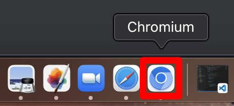

import Tabs from '@theme/Tabs';
import TabItem from '@theme/TabItem';

# Browser {#browser}

**Understand what the Browser object is in Puppeteer/Playwright, how to create one, and a bit about how to interact with one.**

---

In order to automate a browser in Playwright or Puppeteer, we need to open one up programmatically. Playwright supports Chromium, Firefox, and Webkit (Safari), while Puppeteer only supports Chromium based browsers. For ease of understanding, we've chosen to use Chromium in the Playwright examples to keep things working on the same plane.

Let's start by using the `launch()` function in the **index.js** file we created in the intro to this course:

<Tabs groupId="main">
<TabItem value="Playwright" label="Playwright">

```javascript
import { chromium } from 'playwright';

await chromium.launch();

console.log('launched!');

```

</TabItem>
<TabItem value="Puppeteer" label="Puppeteer">

```javascript
import puppeteer from 'puppeteer';

await puppeteer.launch();

console.log('launched!');

```

</TabItem>
</Tabs>

When we run this code with the command `node index.js`, a browser will open up; however, we won't actually see anything. This is because the default mode of a browser after `launch()`ing it is **headless**, meaning that it has no visible UI.

> If you run this code right now, it will hang. Use **control^** + **C** to force quit the program.

## Launch options {#launch-options}

In order to see what's actually happening, we can pass an **options** object ([Puppeteer](https://pptr.dev/#?product=Puppeteer&version=v13.7.0&show=api-puppeteerlaunchoptions), [Playwright](https://playwright.dev/docs/api/class-browsertype#browser-type-launch)) with **headless** set to **false**.

<Tabs groupId="main">
<TabItem value="Playwright" label="Playwright">

```javascript
import { chromium } from 'playwright';

await chromium.launch({ headless: false });
await browser.newPage();

```

</TabItem>
<TabItem value="Puppeteer" label="Puppeteer">

```javascript
import puppeteer from 'puppeteer';

const browser = await puppeteer.launch({ headless: false });
await browser.newPage();
```

</TabItem>
</Tabs>

Now we'll actually see a browser open up.



There are a whole lot more options that we can pass into the `launch()` function, which we'll be getting into a little bit later on.

## Browser methods {#browser-methods}

The `launch()` function also returns an object representation of the browser that we can use to interact with the browser right from our code. This **Browser** object ([Puppeteer](https://pptr.dev/#?product=Puppeteer&version=v13.7.0&show=api-class-browser), [Playwright](https://playwright.dev/docs/api/class-browser)) has many functions which make it easy to do this. One of these functions is `close()`. Until now, we've been using **control^** + **C** to force quit the process, but with this function, we'll no longer have to do that.

<Tabs groupId="main">
<TabItem value="Playwright" label="Playwright">

```javascript
import { chromium } from 'playwright';

const browser = await chromium.launch({ headless: false });
await browser.newPage();

// code will be here in the future

await browser.close();

```

</TabItem>
<TabItem value="Puppeteer" label="Puppeteer">

```javascript
import puppeteer from 'puppeteer';

const browser = await puppeteer.launch({ headless: false });
await browser.newPage();

// code will be here in the future

await browser.close();

```

</TabItem>
</Tabs>

<!-- In a few lessons from now, we'll be discussing the `browser.contexts()` (Playwright)/`browser.browserContexts()` (Puppeteer) functions and how to create **browser contexts** with another function on the **Browser** object. -->

## Next up {#next}

Now that we can open a browser, let's move onto the [next lesson](./page/index.md) where we will learn how to create pages and visit websites programmatically.

<!-- Talk about browser context later, it doesn't make sense to show it until we're actually creating pages -->

<!-- ## Browser context {#browser-context}

**BrowserContext** objects ([Playwright](https://pptr.dev/#?product=Puppeteer&version=v13.7.0&show=api-class-browsercontext), [Playwright](https://playwright.dev/docs/api/class-browsercontext)) allow us to create and manage multiple browser sessions. -->
