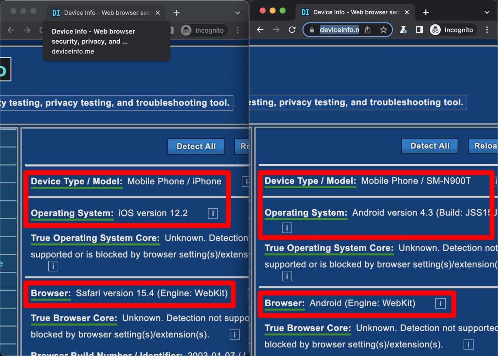

import Tabs from '@theme/Tabs';
import TabItem from '@theme/TabItem';

# Creating multiple browser contexts {#creating-browser-contexts}

**Learn what a browser context is, how to create one, how to emulate devices, and how to use browser contexts to automate multiple sessions at one time.**

---

A [**BrowserContext**](https://playwright.dev/docs/api/class-browsercontext) is an isolated incognito session within a **Browser** instance. This means that contexts can have different device/screen size configurations, different language and color scheme settings, etc. It is useful to use multiple browser instances when dealing with automating logging into multiple accounts simultaneously (therefore requiring multiple sessions), or in any cases where multiple sessions are required.

When we create a **Browser** object by using the `launch()` function, a single [browser context](https://playwright.dev/docs/browser-contexts) is automatically created. In order to create more, we use the [`browser.newContext()`](https://playwright.dev/docs/api/class-browser#browser-new-context) function in Playwright, and [`browser.createIncognitoBrowserContext`](https://pptr.dev/#?product=Puppeteer&version=v14.1.0&show=api-browsercreateincognitobrowsercontextoptions) in Puppeteer.


<Tabs groupId="main">
<TabItem value="Playwright" label="Playwright">

```js
const myNewContext = await browser.newContext();
```

</TabItem>
<TabItem value="Puppeteer" label="Puppeteer">

```js
const myNewContext = await browser.createIncognitoBrowserContext();
```

</TabItem>
</Tabs>

## Persistent vs non-persistent browser contexts {#persistent-vs-non-persistent}

In both examples above, we are creating a new **non-persistent** browser context, which means that once it closes, all of its cookies, cache, etc. will be lost. For some cases, that's okay, but in most situations, the performance hit from this is too large. This is why we have **persistent** browser contexts. Persistent browser contexts open up a bit slower and they store all their cache, cookies, session storage, and local storage in a file on disk.

In Puppeteer, the **default** browser context is the persistent one, while in Playwright we have to use [`BrowserType.launchPersistentContext()`](https://playwright.dev/docs/api/class-browsertype#browser-type-launch-persistent-context) instead of `BrowserType.launch()` in order for the default context to be persistent.

<Tabs groupId="main">
<TabItem value="Playwright" label="Playwright">

```js
import { chromium } from 'playwright';

// Here, we launch a persistent browser context. The first
// argument is the location to store the data.
const browser = await chromium.launchPersistentContext('./persistent-context', { headless: false });

const page = await browser.newPage();

await browser.close();
```

</TabItem>
<TabItem value="Puppeteer" label="Puppeteer">

```js
import puppeteer from 'puppeteer';

const browser = await puppeteer.launch({ headless: false });

// This page will be under the default context, which is persistent.
// Cache, cookies, etc. will be stored on disk and persisted
const page = await browser.newPage();

await browser.close();
```

</TabItem>
</Tabs>

## Using browser contexts {#using-browser-contexts}

In both Playwright and Puppeteer, various devices (iPhones, iPads, Androids, etc.) can be emulated by using [`playwright.devices`](https://playwright.dev/docs/api/class-playwright#playwright-devices) or [`puppeteer.devices`](https://pptr.dev/#?product=Puppeteer&version=v14.1.0&show=api-puppeteerdevices). We'll be using this to create two different browser contexts, one emulating an iPhone, and one emulating an Android device:

<Tabs groupId="main">
<TabItem value="Playwright" label="Playwright">

```js
import { chromium, devices } from 'playwright';

// Launch the browser
const browser = await chromium.launch({ headless: false });

const iPhone = devices['iPhone 11 Pro'];
// Create a new context for our iPhone emulation
const iPhoneContext = await browser.newContext({ ...iPhone });
// Open a page on the newly created iPhone context
const iPhonePage = await iPhoneContext.newPage();

const android = devices['Galaxy Note 3'];
// Create a new context for our Android emulation
const androidContext = await browser.newContext({ ...android });
// Open a page on the newly created Android context
const androidPage = await androidContext.newPage();

// The code in the next step will go here

await browser.close();
```

</TabItem>
<TabItem value="Puppeteer" label="Puppeteer">

```js
import puppeteer from 'puppeteer';

// Launch the browser
const browser = await puppeteer.launch({ headless: false });

const iPhone = puppeteer.devices['iPhone 11 Pro'];
// Create a new context for our iPhone emulation
const iPhoneContext = await browser.createIncognitoBrowserContext();
// Open a page on the newly created iPhone context
const iPhonePage = await iPhoneContext.newPage();
// Emulate the device
await iPhonePage.emulate(iPhone);

const android = puppeteer.devices['Galaxy Note 3'];
// Create a new context for our Android emulation
const androidContext = await browser.createIncognitoBrowserContext();
// Open a page on the newly created Android context
const androidPage = await androidContext.newPage();
// Emulate the device
await androidPage.emulate(android);

// The code in the next step will go here

await browser.close();
```

</TabItem>
</Tabs>

Then, we'll make both `iPhonePage` and `androidPage` visit [deviceinfo.me](https://www.deviceinfo.me/), which is a website that displays the type of device you have, the operating system you're using, and more device and location-specific information.

```js
// Go to deviceinfo.me on both at the same time
await Promise.all([iPhonePage.goto('https://www.deviceinfo.me/'), androidPage.goto('https://www.deviceinfo.me/')]);

// Wait for 10 seconds on both before shutting down
await Promise.all([iPhonePage.waitForTimeout(10000), androidPage.waitForTimeout(10000)]);
```

Let's go ahead and run our code and analyze the data on each **deviceinfo.me** page. Here's what we see:



We see that **deviceinfo.me** detects both contexts as using different devices, despite the fact they're visiting the same page at the same time. This shows firsthand that different browser contexts can have totally different configurations, as they all have separate sessions.

## Accessing browser contexts {#accessing-browser-contexts}

When working with multiple browser contexts, it can be difficult to keep track of all of them and making changes becomes a repetitive job. This is why the **Browser** instance returned from the `launch()` function also has a `contexts()` function (`browserContexts()` in Puppeteer). This function returns an array of all the contexts that are currently attached to the browser.

Let's go ahead and use this function to loop through all of our browser contexts and make them log **Site visited** to the console whenever the website is visited:

<Tabs groupId="main">
<TabItem value="Playwright" label="Playwright">

```js
for (const context of browser.contexts()) {
    // In Playwright, lots of events are supported in the "on" function of
    // a BrowserContext instance
    context.on('request', (req) => req.url() === 'https://www.deviceinfo.me/' && console.log('Site visited'));
}
```

</TabItem>
<TabItem value="Puppeteer" label="Puppeteer">

```js
for (const context of browser.browserContexts()) {
    // In Puppeteer, only three events are supported in the "on" function
    // of a BrowserContext instance
    context.on('targetchanged', () => console.log('Site visited'));
}
```

</TabItem>
</Tabs>

After adding this above our `page.goto`s and running the code once again, we see this logged to the console:

```text
Site visited
Site visited
```

Cool! We've modified both our `iPhoneContext` and `androidContext`, as well as our default context, to log the message.

> Note that the Puppeteer code and Playwright code are slightly different in the examples above. The Playwright code will log **Site visited** any time the specific URL is visited, while the Puppeteer code will log any time the target URL is changed to anything.

Finally, in Puppeteer, you can use the `browser.defaultBrowserContext()` function to grab hold of the default context at any point.

## Wrap up

Thus far in this course, you've learned how to launch a browser, open a page, run scripts on a page, extract data from a page, intercept requests made on the page, use proxies, and use multiple browser contexts. Stay tuned for new lessons!
